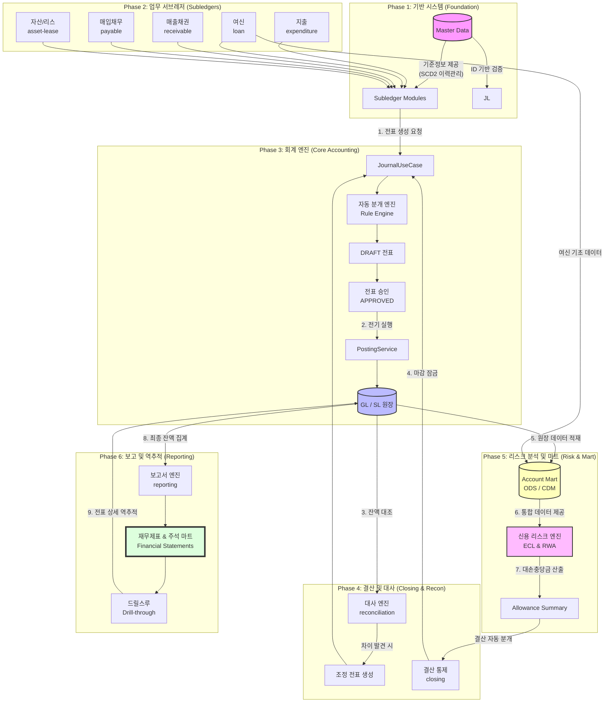

# 🏦 차세대 재무 시스템 (Modern Financial System)

> **"금융 데이터의 정합성과 확장성을 극대화한 MSA 기반 엔터프라이즈 재무/리스크 시스템"**

이 저장소는 기존의 거대한 모놀리식 회계 시스템을 **도메인 주도 설계(DDD) 및 헥사고날 아키텍처(Hexagonal Architecture)** 기반의 마이크로서비스(MSA)로 전환하여 구축한 차세대 플랫폼입니다. 
데이터 발생부터 전표 생성, 결산, 그리고 신용 리스크 산출(IFRS 9)에 이르는 전 과정을 End-to-End로 지원합니다.

---

## 🌟 핵심 기능 및 비즈니스 파이프라인

본 시스템은 아래와 같은 6단계의 거대한 통합 비즈니스 흐름을 갖추고 있습니다.



---

## 📦 프로젝트 모듈 (디렉토리) 구조 및 역할

본 시스템은 철저한 도메인 주도 설계(DDD)를 바탕으로, 각 기능별로 완전히 분리된 마이크로서비스 모듈로 구성되어 있습니다.

### ⚙️ 기반 모듈 (Foundation)
* **`app/`**: 전체 Spring Boot 애플리케이션의 실행 진입점(Main)이자 전체 환경 설정(`application.yml`)을 담당합니다.
* **`contracts/`**: 도메인 모듈 간 직접적인 엔티티 참조를 막기 위한 공통 인터페이스(Port)와 DTO(Data Transfer Object)가 정의된 통신 규약 모듈입니다.
* **`shared-kernel/` & `risk-common/`**: 여러 서비스가 공유하는 핵심 공통 로직(식별자, 예외 처리, 메타데이터 등)을 담고 있는 최소한의 뼈대입니다.
* **`master-data/`**: 계정과목, 부서, 거래처, 환율 등 시스템 전반에서 사용되는 기준 정보를 SCD2(이력 관리) 방식으로 관리하고 제공합니다.
* **`governance/`**: 시스템 내 역할(Role) 및 권한 관리, 데이터 마스킹, 결재/승인 프로세스, 그리고 전사 감사 로그(Audit)를 기록합니다.

### 💰 업무 서브레저 (Subledgers)
* **`loan/`**: [여신] 대출 실행부터 약정 이자 계산, 그리고 IFRS 9에 따른 이연대출부대손익(EIR)의 상각 스케줄을 관리합니다.
* **`deposit/`**: [수신] 고객 예금 계좌 개설, 입출금 처리, 이자 지급 등을 담당합니다.
* **`receivable/` & `payable/`**: [AR/AP] 서비스 매출/수금 내역을 관리하고(AR), 지출 결의를 통한 미지급금 및 지급 실행(AP)을 처리합니다.
* **`expenditure-resolution/`**: 현업 부서의 지출 품의/결의 프로세스 및 예산 통제를 관리합니다.
* **`asset-lease/`**: 고정자산의 취득 및 감가상각을 관리하고, IFRS 16 기준에 따라 리스 자산/부채를 인식하고 상각합니다.

### ⚖️ 회계 엔진 및 결산 (Core Accounting)
* **`journal-ledger/`**: 서브레저에서 발생한 이벤트를 바탕으로 회계 룰 엔진을 돌려 전표를 생성하고, 총계정원장(GL) 및 보조원장(SL)을 생성합니다.
* **`closing/`**: 월말/연말 결산 마감(Closing Lock) 통제, 외화평가(FX), 대손충당금(ECL) 분개 등 결산 전용 프로세스를 수행합니다.
* **`reconciliation/`**: 내부 원장(Target)과 외부 데이터(은행/PG사 등, Source) 간의 금액과 거래 내역을 대사하고, 차이(Variance) 발생 시 조정 전표를 생성합니다.
* **`tax/`**: 부가가치세 매입/매출, 원천세 신고 등 세무 관련 회계 데이터를 집계합니다.

### 📊 리스크 분석 및 보고 (Risk & Reporting)
* **`account-mart/`**: 분산된 원장 및 거래 데이터를 긁어와(ETL), 데이터 품질(DQ)을 검증하고 리스크 분석용 통합 데이터 모델(CDM)로 제공하는 ODS/Mart 시스템입니다.
* **`ecl/`**: 마트 데이터를 기반으로 IFRS 9 및 국제 금융 규제에 따른 신용등급(PD), 부도시손실률(LGD), 부도시노출액(EAD)을 결합하여 기대신용손실(ECL)과 RWA를 산출합니다.
* **`reporting/`**: 최종 확정된 원장 데이터를 기반으로 대차대조표(BS), 손익계산서(PL) 등 재무제표와 주석 마트(Disclosure Note Mart)를 생성하며, 원천 전표로의 역추적(Drill-through) API를 제공합니다.

### 🌐 프론트엔드 및 인프라 (Frontend & Infra)
* **`frontend/`**: Next.js 기반으로 구축된 도메인 특화 대시보드 화면 및 사용자 인터페이스 모듈입니다.
* **`gateway/`, `discovery/`, `config-server/`, `auth/`**: 요청 라우팅(Gateway), 서비스 위치 식별(Eureka), 설정 중앙화(Config), JWT 보안 토큰 발급(Auth) 등 MSA를 지탱하는 핵심 인프라 마이크로서비스들입니다.

---

## 🏗️ 시스템 아키텍처

저희 시스템은 수많은 금융 데이터를 끊김 없이 처리하기 위해 철저한 마이크로서비스(MSA) 기반으로 설계되었습니다.

```mermaid
flowchart TD
    subgraph "External Clients"
        UI[Frontend App / Browser]
    end

    subgraph "API Gateway Layer"
        GW[API Gateway\n(Port: 8080)]
        CB[Resilience4j\n(Circuit Breaker)]
        GW -.-> CB
    end

    subgraph "Service Discovery & Config"
        EUREKA((Eureka Server\nPort: 8761))
        CONFIG[Config Server\nPort: 8888]
    end

    subgraph "Backend Microservices"
        MS1[Master Data Service]
        MS2[Journal Ledger Service]
        MS3[Closing & Reporting]
        MS4[Finance Subledgers]
    end

    subgraph "Data & Messaging"
        DB[(PostgreSQL)]
        KAFKA[[Apache Kafka\nMessage Broker]]
        REDIS[(Redis\nCache & Lock)]
    end

    subgraph "Observability (모니터링 & 로깅)"
        ZIPKIN[Zipkin\nTrace ID]
        ELK{{ELK Stack\nElasticsearch, Logstash, Kibana}}
        PROM[Prometheus & Grafana]
    end

    UI -->|HTTPS Request| GW
    
    GW -.->|Routing| MS1
    GW -.->|Routing| MS2
    GW -.->|Routing| MS3
    GW -.->|Routing| MS4
    
    MS1 <-->|Register & Fetch| EUREKA
    MS2 <-->|Register & Fetch| EUREKA
    MS3 <-->|Register & Fetch| EUREKA
    MS4 <-->|Register & Fetch| EUREKA
    
    CONFIG -.->|Push Properties| MS1
    CONFIG -.->|Push Properties| MS2
    CONFIG -.->|Push Properties| MS3
    CONFIG -.->|Push Properties| MS4

    MS1 --> DB
    MS2 --> DB
    MS3 --> DB
    MS4 --> DB
    
    MS1 -.-> KAFKA
    MS2 -.-> KAFKA
    
    MS1 -.-> REDIS
    MS2 -.-> REDIS

    MS1 -.->|Logs & Metrics| ELK
    MS2 -.->|Traces| ZIPKIN
    MS3 -.->|Metrics| PROM
    
    style EUREKA fill:#ff9,stroke:#333,stroke-width:2px
    style GW fill:#bbf,stroke:#333,stroke-width:2px
    style KAFKA fill:#dfd,stroke:#333,stroke-width:2px
```

### 기술 스택 (Tech Stack)

**1. Frontend (사용자 인터페이스)**
* **Next.js 15 (App Router):** SSR/CSR 하이브리드 렌더링으로 초기 로딩 속도를 최적화하고, 대용량 재무 데이터 조회 시 뛰어난 라우팅 성능을 제공합니다.
* **React Query:** 서버 상태 관리 및 캐싱, 낙관적 업데이트를 통해 수많은 재무 대시보드와 마트 데이터의 실시간 동기화를 지원합니다.
* **Zustand:** 가볍고 직관적인 클라이언트 전역 상태 관리 도구로, 전역 테마 및 사용자 세션을 빠르고 안정적으로 관리합니다.
* **Tailwind CSS (Glassmorphism UI):** Utility-first CSS를 통해 개발 생산성을 극대화하며, 기존 금융 시스템의 딱딱함을 탈피한 프리미엄 글래스모피즘(Glassmorphism) 디자인을 구현했습니다.

**2. Backend (코어 비즈니스 로직)**
* **Spring Boot 3.4 (Java 21):** Java 21의 Virtual Threads 등 최신 생태계를 활용하여 고성능 동시성 처리와 엔터프라이즈급 애플리케이션 안정성을 보장합니다.
* **Spring Data JPA & QueryDSL:** 복잡한 재무/회계 도메인 모델을 객체 지향적으로 매핑(ORM)하고, 대사(Recon) 및 마트 집계를 위한 타입 세이프(Type-safe)한 동적 쿼리를 작성합니다.
* **Spring Batch:** 대용량 원장 데이터 이관, ECL(기대신용손실) 산출, 결산 평가 등 야간 정산(EOB)의 핵심인 대용량 청크(Chunk) 기반 파이프라인을 구축합니다.

**3. Architecture (아키텍처 및 설계 원칙)**
* **MSA (Microservices Architecture):** 원장(Ledger), 대출(Loan), 리스크(Risk) 등 도메인별로 서비스를 물리적으로 분리하여, 단일 장애점(SPOF)을 제거하고 독립적 확장 및 배포가 가능하게 합니다.
* **Hexagonal Architecture:** 비즈니스 로직(Domain)을 인프라스트럭처(Web, DB)로부터 완벽히 격리(Port/Adapter 패턴)하여, 핵심 금융 로직의 테스트 용이성과 유지보수성을 극대화합니다.
* **Domain-Driven Design (DDD):** 매우 복잡한 회계/리스크 비즈니스를 유비쿼터스 언어(Ubiquitous Language)로 모델링하여, 기획자(현업)와 개발자 간의 간극을 최소화합니다.

**4. Infrastructure (데이터 및 메시징, 관제)**
* **PostgreSQL / H2:** ACID 트랜잭션이 필수적인 금융 원장과 마스터 데이터의 메인 영구 저장소로 활용합니다 (H2는 인메모리 테스트 및 로컬 배치용).
* **Redis:** 분산 락(Distributed Lock)을 구현하여 전표 중복 발행 등의 동시성 이슈를 원천 차단하고, 고속 캐싱 처리를 돕습니다.
* **Apache Kafka:** 마이크로서비스 간 비동기 이벤트 스트리밍(예: 전표 승인 알림, 마트 적재 완료 이벤트)을 통해 서비스 간 결합도를 최소화합니다.
* **ELK Stack (Elasticsearch, Logstash, Kibana):** 수십 개의 분산된 컨테이너에서 발생하는 로그를 중앙 집중식으로 수집하고, 실시간 에러 트래킹을 수행합니다.
* **Prometheus & Grafana:** 시스템 리소스 및 비즈니스 메트릭(API 응답시간, 배치 처리 건수 등)을 실시간 대시보드로 관제합니다.

**5. Deployment (배포 및 오케스트레이션)**
* **Docker & Docker Compose:** 모든 마이크로서비스와 인프라 자원을 컨테이너화하여 '로컬-테스트-운영' 환경의 100% 일치성을 보장하며, 복잡한 시스템을 명령어 한 줄로 손쉽게 구동합니다.

---

## 🚀 빠른 시작 (Getting Started)

모든 개별 MSA 모듈 및 인프라스트럭처에 대해 독립적으로 실행 가능한 `Dockerfile`과 `docker-compose.yml`이 구성되어 있습니다.

### 인프라 및 기반 시스템 구동
```bash
# Gateway, Eureka, Config-server 등 핵심 기반 구동
./start-infra.bat (또는 개별 docker-compose up -d)
```

### 애플리케이션 빌드 및 구동
*(참고: 애플리케이션 모듈의 경우 컨테이너를 올리기 전 `./gradlew build` 등을 통해 `.jar` 파일이 `build/libs/`에 존재해야 정상적으로 `Dockerfile` 빌드가 완료됩니다.)*

```bash
# 전체 모듈 빌드
./gradlew build -x test

# 예시: master-data 모듈 구동
cd master-data
docker-compose up -d

# 로그 확인
docker-compose logs -f
```

---

## 📚 상세 문서 가이드 (Documentation)

시스템의 세부 아키텍처 및 도메인 지식은 `docs/` 폴더 내에 마크다운과 Mermaid 차트로 상세하게 작성되어 있습니다. **새로 합류하신 분들은 아래 순서대로 문서를 확인해 주세요.**

1. 🏛️ **[통합 아키텍처 명세서 (ARCHITECTURE.md)](docs/ARCHITECTURE.md)**: 전체 시스템의 구조, 모듈 간 의존성 원칙, 데이터 정합성(라인리지, SCD2) 가이드
2. 🖥️ **[프론트엔드 설계서 (frontend-architecture.md)](docs/frontend-architecture.md)**: Next.js 기반 UI 설계, 상태 관리, 라우팅 및 폴더 구조
3. ⚙️ **[인프라스트럭처 가이드 (infrastructure-guide.md)](docs/infrastructure-guide.md)**: 도커, Kafka, 모니터링 등 각 MSA 인프라 요소의 역할 및 실행 방법
4. 🗄️ **[문서 허브 (README.md)](docs/README.md)**: 그 외 개발 룰, 정책, 과거 의사결정 히스토리 모음

각 도메인 모듈 폴더(예: `ecl`, `account-mart`, `journal-ledger` 등) 안에도 해당 도메인에 특화된 `README.md`와 `schema.sql`이 존재합니다. 코드를 수정하기 전에 반드시 해당 모듈의 문서를 참조하십시오.