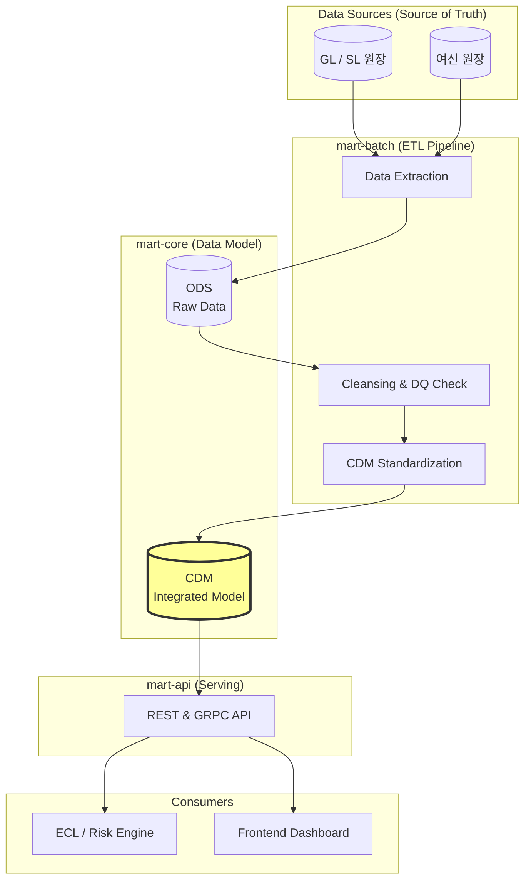

# 📊 Risk Data Mart Service (V2.0)

> **Architect's Vision**: "전사 리스크 산출의 '진실의 원천(Source of Truth)'으로서, 파편화된 원천 데이터를 정제하여 표준화된 리스크 통합 모델(CDM)로 제공합니다."

## 👥 담당 역할 (Roles)
- **[백엔드 개발자]**: 대용량 ETL 파이프라인(Spring Batch) 설계, Hexagonal Architecture 기반의 데이터 접근 계층 보호, 서비스 디스커버리 연동.
- **[리스크 모델러]**: 통합 리스크 데이터 모델(CDM) 설계, 데이터 품질(DQ) 검증 규칙 수립, 시장 데이터(Yield Curve 등) 보간 로직 설계.

---

## 🏗️ 서비스 아키텍처 및 모듈 구성

본 서비스는 **Hexagonal Architecture(Port/Adapter 분리)** 원칙을 준수하여, 데이터 소스(ODS)의 변화가 리스크 통합 모델에 직접적인 영향을 주지 않도록 설계되었습니다.



*   **`mart-api` [고객 응대 창구]**: 정제된 리스크 데이터 및 시장 데이터를 외부(엔진, 프론트엔드)에 제공하는 창구입니다.
*   **`mart-batch` [대용량 데이터 공장 라인]**: 원천 시스템(ODS)의 데이터를 읽어와서 리스크 표준 규격(CDM)으로 변환하고 적재하는 ETL 공장입니다.
*   **`mart-core` [수식 계산기 및 핵심 장부 관리]**: 리스크 통합 데이터 모델과 데이터 품질 검증 로직이 집약된 핵심 모듈입니다. 모든 수치 데이터는 정밀도 유지를 위해 `BigDecimal`로 관리됩니다.

---

## 💡 [초보자를 위한 개념 설명]
**"Data Mart는 리스크 시스템의 '식재료 창고'이자 '품질 검사소'입니다."**

1.  **Batch (공장 라인)**: 산더미 같은 은행 원장 데이터(흙이 묻은 채소)를 컨베이어 벨트에 올려서, 깨끗하게 씻고 리스크 엔진이 먹기 좋게 자르는(표준화) 과정입니다.
2.  **Core (계산기 & 장부)**: 채소가 싱싱한지(데이터 품질) 검사하고, 어떤 종류의 채소(데이터 모델)인지 분류하여 장부에 기록하는 곳입니다.
3.  **API (응대 창구)**: 요리사(리스크 엔진)가 "신선한 대출 데이터 100개 주세요!"라고 요청하면, 창구에서 정제된 데이터를 신속하게 전달합니다.

---

## 🏗️ 최신 아키텍처 및 확장 기능 (V2.0)
*   **루트 Gradle 편입**: 현재 저장소에서는 `:account-mart:mart-core`, `:account-mart:mart-api`, `:account-mart:mart-batch` 경로로 빌드합니다.
*   **대손충당금 입력 마트 전환 준비**: CDM 포지션 생성, ODS/GL 대사, DQ 경로를 유지하되 ECL 입력 스냅샷 마트로 축소하는 설계를 진행 중입니다.
*   **현재 통합 상태**: `risk-common` 호환 모듈을 통해 기존 `com.risk.common` 타입을 복구했고, batch/API stale 패키지 좌표를 현재 포트/도메인 구조로 정리했습니다.
*   **미래전망 시나리오 (IFRS 9)**: GDP, 실업률 등 거시경제 변수를 관리하여 미래 손실을 예측하는 기반을 마련했습니다.
*   **룩스루(Look-through) 대응**: 펀드나 신탁 등 복합 상품의 기초자산(Stock, Bond 등)을 상세히 관리하여 정확한 위험가중치를 산출합니다.
*   **전이행렬(Transition Matrix)**: 신용등급 간의 이동 확률을 관리하여 Lifetime PD 산출 로직을 지원합니다.
*   **등급 마스터 DB 관리**: `cr_grade_master`에서 등급명, 점수 구간, 기본 PD를 관리하여 KAP 등급 체계를 코드 재배포 없이 조정할 수 있습니다.
*   **테스트 자동화 데이터**: `db/data-mart-test-full.sql`을 통해 실제 비즈니스 시나리오 기반의 테스트 환경을 즉시 구축할 수 있습니다.

---

## 🚀 컨테이너 빌드 및 실행 단계별 설명

### 1단계: 프로젝트 빌드 (JAR 생성)
멀티 모듈 구조이므로 루트 디렉토리에서 마운트된 전체 모듈을 빌드하거나 특정 모듈만 빌드합니다.
```powershell
./gradlew :account-mart:mart-core:compileJava :account-mart:mart-api:compileJava :account-mart:mart-batch:compileJava
```

### 2단계: 데이터베이스 초기화 및 테스트 데이터 삽입
```powershell
# 1. 스키마 생성 (Core & Advanced)
psql -f account-mart/db/schema-mart.sql
psql -f account-mart/db/schema-risk-advanced.sql

# 2. 테스트 데이터셋 삽입 (종합 시나리오)
psql -f account-mart/db/data-mart-test-full.sql
```

### 3단계: 컨테이너 실행
```powershell
docker-compose up -d risk-data-mart-api risk-data-mart-batch
```

---

## 📂 주요 모듈 및 디렉토리 구조
*   `mart-core`: 데이터 마트의 핵심 엔티티 및 비즈니스 로직.
*   `mart-api`: 외부(프론트엔드 등)에 데이터를 제공하는 창구.
*   `mart-batch`: 대용량 데이터 정제 및 적재(ETL)를 담당하는 밤의 일꾼.
*   `db/`: **[중요]** 최신 리스크 물리 모델 및 테스트 쿼리 보관소.

## 🛠️ 상태 확인 방법
*   **헬스 체크**: `http://localhost:8085/actuator/health` 접속 후 `{"status":"UP"}` 확인.
*   **데이터 확인**: 게이트웨이를 통해 `/api/v1/market-data/...` 경로로 데이터가 잘 조회되는지 테스트합니다.
