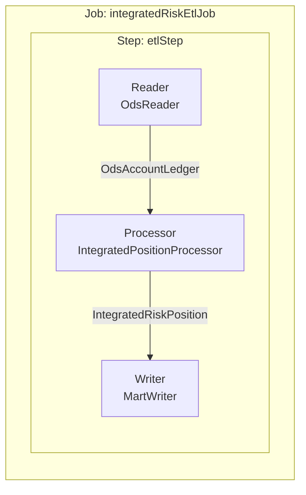

# 👨‍🍳 초보자용 Spring Batch & ETL 배움 가이드

이 가이드는 `risk-data-mart-service`에서 사용하는 **Spring Batch**를 아주 쉽게 설명합니다.

---

## 🏗️ 1. ETL이란 무엇인가요 
금융 리스크 관리를 위해서는 여러 시스템(은행 계정계, 시장 데이터 등)에 흩어진 데이터를 한곳으로 모으고 결산 대손 엔진이 읽기 좋게 다듬어야 합니다. 

이 과정을 **ETL**이라고 부르며, 요리 과정에 비유할 수 있습니다:
1.  **Extract (추출)**: 냉장고(원천 시스템)에서 식재료를 꺼냅니다.
2.  **Transform (변환)**: 재료를 씻고 껍질을 벗겨 요리하기 좋게 다듬습니다. (리스크 포맷으로 변환)
3.  **Load (적재)**: 완성된 재료를 냄비(데이터 마트)에 넣습니다.

---

## ⚙️ 2. Spring Batch의 핵심 구성 요소
Spring Batch는 "한꺼번에 많은 데이터를 순차적으로 처리"하는 데 특화된 도구입니다.

### 🍱 덩어리(Chunk) 처리 방식
배추 1만 포기를 한꺼번에 김장하면 힘들겠죠  100포기씩(Chunk) 나눠서 소금에 절이고 통에 담는 것이 훨씬 안전합니다. Spring Batch도 이 방식을 사용합니다.

1.  **Job (김장 프로젝트)**: 전체적인 '김장'이라는 큰 업무 단위입니다.
2.  **Step (김장 단계)**: '배추 절이기', '양념 버무리기' 등 세부 단계입니다.
3.  **Reader (재료 꺼내기)**: 데이터를 한 건씩 읽어옵니다.
4.  **Processor (재료 손질)**: 읽은 데이터를 필요한 형태로 가공하거나 버립니다.
5.  **Writer (저장하기)**: 가공된 데이터를 덩어리(Chunk) 단위로 DB에 저장합니다.

---

## 💻 3. `IntegratedRiskEtlJob` 구조도
현재 구현된 시뮬레이션 코드의 흐름입니다.

### 왜 이렇게 하나요  (Spring Batch의 장점)
-   **안정성**: 1만 건 중 9,000건째에서 서버가 꺼져도, 어디까지 했는지 기억(Meta-data)해서 나머지만 다시 할 수 있습니다.
-   **성능**: 대량 데이터를 한 건씩 저장하는 게 아니라, 100건씩 모아서 한 번에 저장하므로 훨씬 빠릅니다.
-   **추적**: 어떤 작업이 언제 시작해서 언제 끝났는지, 몇 건이나 실패했는지 기록이 남습니다.

---

## 🚀 4. 실습 포인트 (Simulation)
1. `DataPopulator.java`: 앱이 뜰 때 500건의 가짜 원천 데이터(ODS)를 만들어줍니다. (냉장고 채우기)
2. `BatchConfig.java`: 100건씩 묶어서 통합 마트로 변환하여 저장합니다. (김장하기)

> [!TIP]
> 배치가 실행된 이력은 데이터베이스의 `batch_job_instance`, `batch_job_execution` 테이블에서 실시간으로 확인할 수 있습니다.
