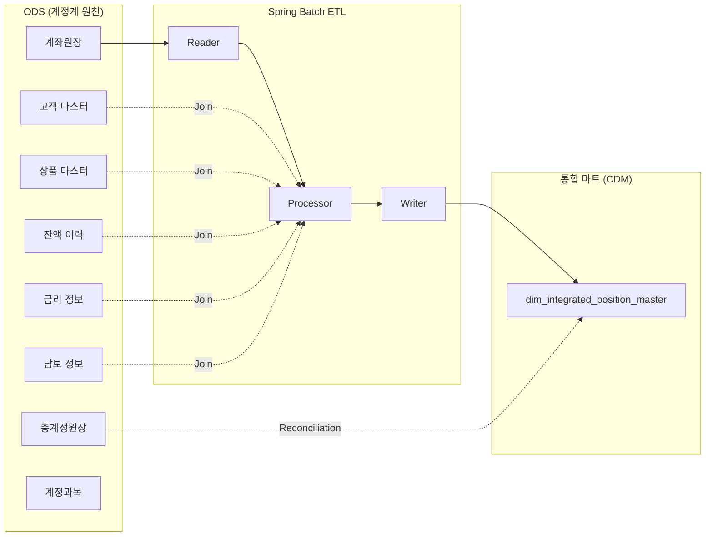

# 🔄 ODS → 통합 마트 ETL 인터페이스 명세서

이 문서는 계정계(Core Banking)에서 리스크 시스템으로 유입되는 **원천 데이터(ODS)**의 전체 목록과, 각 데이터가 금리리스크(IRR) / 신용리스크(CR) 엔진에서 **어떻게 활용**되는지를 정리합니다.

---

## 1. ODS 원천 데이터 전체 목록 및 활용 매핑

### 📌 한눈에 보는 원천-엔진 매핑표

| # | ODS 테이블 | 설명 | IRR 활용 | CR 활용 |
|---|:---|:---|:---:|:---:|
| 1 | `ods_account_mst` | 계정과목 기본 | ✅ 자산/부채 구분 | ✅ 난내/난외 구분 |
| 2 | `ods_product_mst` | 상품 마스터 | ✅ 금리유형, 지급주기 | ✅ CCF, 난외 판별 |
| 3 | `ods_customer_mst` | 고객/차주 기본 | ✅ 핵심예금(RETAIL/CORP) | ✅ PD매핑, 산업 집중도 |
| 4 | `ods_acc_ledger` | 계좌원장 ⭐ | ✅ IrPosition 생성 | ✅ CreditExposure 생성 |
| 5 | `ods_balance_hist` | 잔액 이력 | ✅ 1년 평균/최저/변동성 | ✅ 잔액 추이 모니터링 |
| 6 | `ods_rate_info` | 금리 정보 | ✅ VaR, Duration, BPV | ⚠️ 이자 반영 가능 |
| 7 | `ods_collateral_mst` | 담보 정보 | ❌ | ✅ CRM, EAD* 산출 |
| 8 | `ods_general_ledger` | 총계정원장 | ✅ 정합성 검증 | ✅ 정합성 검증 |

> **⭐ `ods_acc_ledger`가 핵심**: 모든 리스크 산출의 기본 단위입니다. **계좌 하나 = 익스포저 하나**

---

## 2. 각 ODS → 리스크 엔진 필드 매핑 상세

### 2-1. 계좌원장 → 금리 포지션 (IrPosition)

| ODS 필드 | → | IrPosition 필드 | 설명 |
|:---|:---:|:---|:---|
| `acc_no` | → | `position_code` | 포지션 식별자 |
| `prod_cd` | → | `position_type` | BOND, LOAN, DEPOSIT... |
| `currency` | → | `currency` | 통화 코드 |
| `outstd_amt` | → | `notional_amount` | 원금 금액 |
| `maturity_dt` | → | `maturity_date` | 만기일자 |

### 2-2. 계좌원장 → 신용 익스포저 (CreditExposure)

| ODS 필드 | → | CreditExposure 필드 | 설명 |
|:---|:---:|:---|:---|
| `acc_no` | → | `exposure_code` | 익스포저 식별자 |
| `cust_id` | → | `counterparty_id` | 거래상대방 |
| `outstd_amt` | → | `outstanding_amount` | 미상환 잔액 |
| `limit_amt - outstd_amt` | → | `undrawn_amount` | 미사용 약정 |
| `maturity_dt` | → | `maturity_date` | 만기일자 |

### 2-3. 금리 정보 → IRR 엔진 필수 입력

| ODS 필드 | → | 산출 용도 | 설명 |
|:---|:---:|:---|:---|
| `rate_type` | → | Gap 분석 | FIXED/FLOATING 구분 → 재조정 시점 결정 |
| `applied_rate` | → | VaR / Duration | 시장금리 충격 시 가치 변동액 산출 |
| `coupon_rate` | → | BPV (DV01) | 1bp 변동 시 가치 변화액 |
| `next_reset_dt` | → | Gap Bucket 배분 | 변동금리 재조정 구간 결정 |

### 2-4. 담보 정보 → CR 엔진 필수 입력

| ODS 필드 | → | 산출 용도 | 설명 |
|:---|:---:|:---|:---|
| `coll_amt` | → | CRM 공제 | 담보 감정 평가액 |
| `pledge_rate` | → | 인정 가액 산출 | LTV 등 담보 인정 비율 |
| `recognized_amt` | → | EAD* = EAD - CRM | 규제 EAD에서 차감 |
| `coll_type` | → | Haircut 결정 | 부동산/예금/증권별 차등 적용 |

---

## 3. ETL 프로세스 흐름도

---

## 💡 초보자를 위한 금융 Tip
- **난내(On-Balance)**: 재무제표(B/S)에 잡히는 자산/부채. 예: 대출금, 예금.
- **난외(Off-Balance)**: 재무제표에 안 잡히지만 위험이 있는 것. 예: 미사용 신용카드 한도, 지급보증.
- **CCF(신용전환율)**: 난외 항목이 실제로 부도 시 얼마나 쓸지 예측하는 비율. 예: 카드 한도 1억, CCF 20% → 부도 시 2천만 원 사용 예상.
