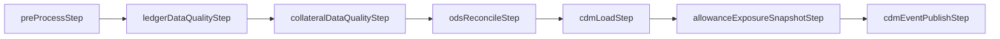

# Allowance Mart Batch Architecture

`integratedPositionEtlJob`은 IFRS 9 대손충당금 입력 snapshot을 만드는 기준일 배치입니다.



## 설계 기준

- Job/Step은 오케스트레이션만 담당합니다.
- 원장 검증, 담보 상세 DQ, 대사, snapshot 생성 규칙은 `mart-core`에 둡니다.
- `collateralDataQualityStep`은 Spring Batch row와 기준일을 core 유즈케이스에 전달하고, 부동산/아파트 상세 조회와 LGD 선행 입력 판단은 `mart-core`가 담당합니다.
- 기준일 파라미터는 필수이며, 같은 기준일 재실행 시 기존 산출물을 정리한 뒤 다시 생성합니다.

## 실행 Job

| Job | 목적 |
| --- | --- |
| `integratedPositionEtlJob` | 전체 ETL 표준 경로 |
| `preProcessJob` | 전처리만 재실행 |
| `ledgerDqJob` | 원장 DQ만 재실행 |
| `collateralDqJob` | 담보 평가액과 아파트 상세 DQ만 재실행 |
| `odsReconcileJob` | DQ 후 ODS-GL 대사 재실행 |
| `cdmLoadJob` | CDM 포지션 적재 재실행 |
| `allowanceExposureSnapshotJob` | ECL 입력 snapshot 재생성 |
| `cdmEventPublishJob` | downstream 이벤트 발행 |

## 로컬 실행

```powershell
./gradlew :account-mart:mart-batch:bootRun --args="--spring.profiles.active=demo --spring.batch.job.name=integratedPositionEtlJob baseDate=2026-04-30" --console=plain
```

Kafka가 없는 로컬 환경에서는 필요에 따라 아래 옵션을 같이 넣습니다.

```text
--mart.batch.cdm-event.enabled=false
```

## 재실행 안전성 체크

1. `baseDate`가 원하는 회계 기준일인지 확인합니다.
2. 전처리 Step이 같은 기준일의 중간 산출물을 정리하는지 확인합니다.
3. DQ skip 건수가 허용 범위인지 확인합니다.
4. 담보 DQ에서 `ods_coll_mst` 평가액 오류와 `ods_apart_coll_detail` 상세 누락/오류가 분리되어 기록되는지 확인합니다.
5. ODS-GL 대사 결과를 확인합니다.
6. snapshot 건수와 잔액 합계를 ECL 실행 전 확인합니다.