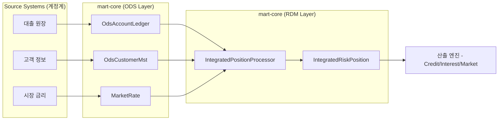

# [초보자용] 리스크 데이터 마트(RDM) 및 mart-core 가이드 💡

이 문서는 리스크 시스템에 처음 합류한 개발자를 위해 `mart-core` 모듈의 역할과 데이터 흐름을 쉽게 설명합니다.

## 1. 리스크 데이터 마트(RDM)란 무엇인가요?

은행의 각 업무 시스템(예: 대출 시스템, 예금 시스템, 외환 시스템)은 각자의 목적에 맞게 데이터를 관리합니다. 하지만 **리스크 관리**를 하려면 이 파편화된 데이터를 하나로 모으고, 리스크만의 특별한 정보(고객 등급, 담보 가치 등)를 입혀야 합니다.

*   **ODS (Operational Data Store):** 원천 시스템에서 넘어온 '날것'의 데이터 (원장 데이터)
*   **RDM (Risk Data Mart):** 리스크 산출을 위해 가공되고 통합된 '완제품' 데이터

> [!TIP]
> **쉽게 비유하자면?**
> - ODS는 마트에서 파는 '밀키트 재료(고기, 야채, 소스)'입니다.
> - RDM은 이 재료들을 손질하고 조리하여 바로 먹을 수 있게 만든 '밀키트 본품'입니다.
> - 산출 엔진(Credit/Market/Interest)은 이 밀키트를 가지고 '요리(정식 리포트)'를 만듭니다.

## 2. mart-core의 역할

`mart-core`는 이 밀키트를 만드는 **조립 공장** 역할을 합니다.

1.  **데이터 통합:** 여러 ODS 테이블(계좌, 고객, 상품, 담보 등)을 결합합니다.
2.  **데이터 보강:** 시장 데이터(환율, 금리)를 적용하여 가치를 환산합니다.
3.  **리스크 분류:** 규제 요건(국제 금융 규제, IFRS 9)에 따라 데이터를 그룹핑합니다 (예: 연체일에 따른 Stage 분류).
4.  **품질 검증(DQ):** 잘못된 데이터가 산출 엔진으로 흘러가지 않도록 거름종이 역할을 합니다.

## 3. 핵심 엔티티 및 클래스 설명

### 🏗️ IntegratedRiskPosition (통합 리스크 포지션)
- **위치:** `com.risk.common.entity` (공통 모듈)
- **설명:** 모든 리스크 산출의 '표준 입력 데이터'입니다. 대출이든 예금이든 모두 이 규격에 맞춰서 변환됩니다.

### ⚙️ IntegratedPositionProcessor
- **위치:** `com.risk.mart.core.domain.mart.processor`
- **설명:** ODS 데이터를 받아 `IntegratedRiskPosition`으로 변환하는 핵심 로직이 담긴 곳입니다.

### 📊 YieldCurve (수익률 곡선)
- **위치:** `com.risk.mart.core.domain.marketdata.entity`
- **설명:** 미래 시점별 금리 수준을 나타냅니다. 금리 리스크 평가 시 현재 가치를 계산(할인)하는 데 필수적입니다.

## 4. 데이터 흐름도

## 5. 주니어 개발자가 주의할 점
- **BigDecimal 사용:** 금액 계산 시 절대 `Double`을 쓰지 마세요. 소수점 오차가 모이면 규제 위반이 될 수 있습니다.
- **기준일(Base Date) 확인:** 모든 리스크 데이터는 '어느 날짜 기준'인지가 가장 중요합니다.
- **로그 확인:** 데이터 가공 중 스킵된 데이터가 없는지 항상 로그를 모니터링하세요.
