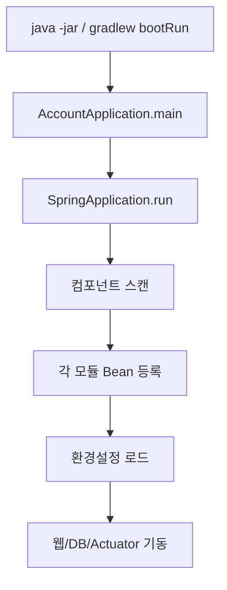
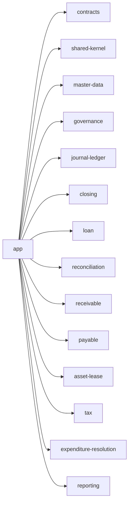
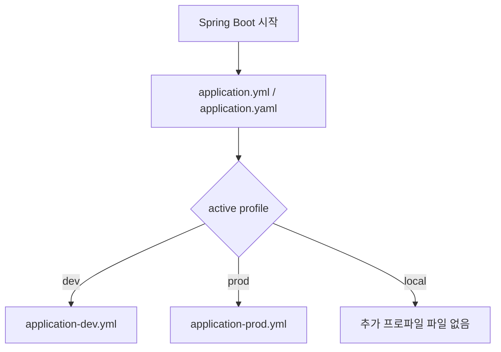
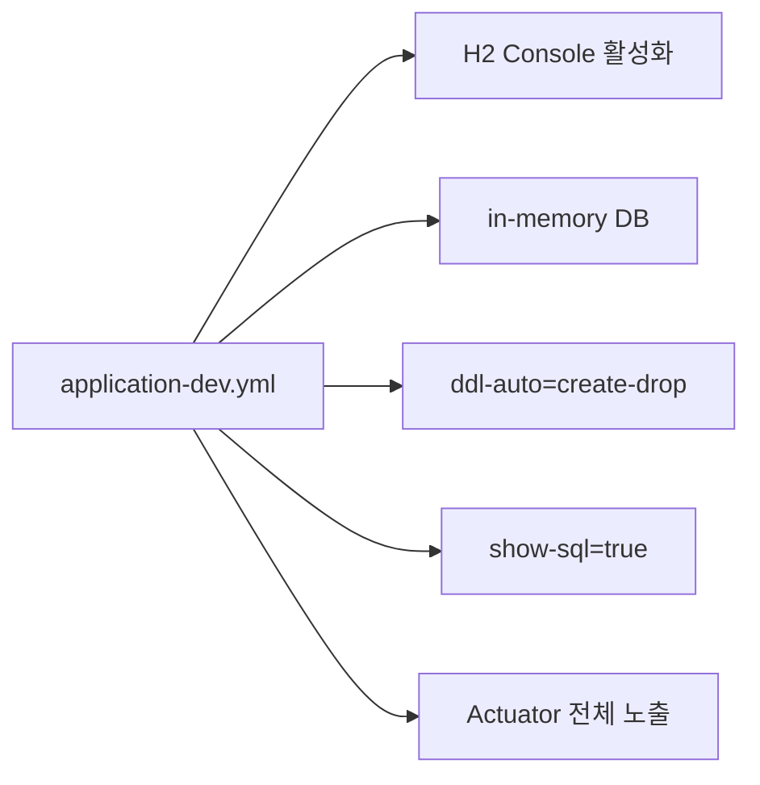
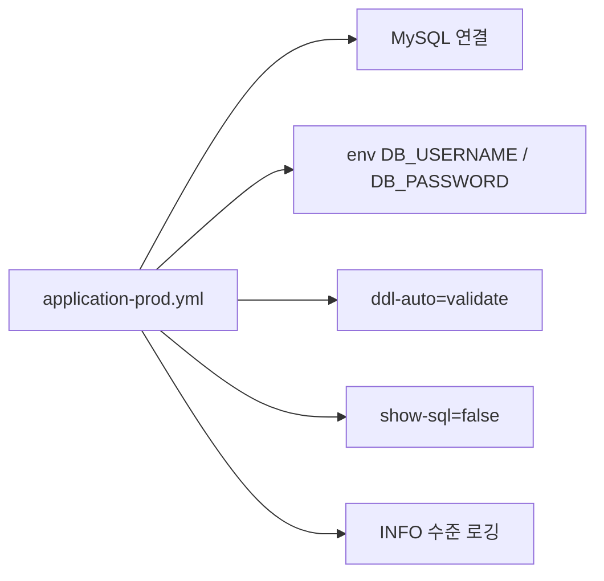

# App Process Flow

## 1. 전체 부팅 흐름

설명:
- `app`은 직접 기능을 처리하지 않고 각 하위 모듈을 하나의 런타임으로 엮습니다.
- `@SpringBootApplication` 하나로 전체 패키지를 스캔합니다.

## 2. 모듈 조립 흐름

설명:
- 실제 업무 모듈은 `app/build.gradle`에 의존성으로 모두 연결되어 있습니다.
- `app`이 빠지면 각 모듈은 라이브러리로는 존재하지만 통합 실행은 되지 않습니다.

## 3. 설정 파일 로드 흐름

설명:
- 기본 설정은 `application.yml`에서 읽습니다.
- `application-dev.yml`은 개발용 H2 메모리 DB를 켭니다.
- `application-prod.yml`은 MySQL 예시 설정과 `ddl-auto: validate`를 사용합니다.
- 현재 기본 프로파일 값은 `local`인데, 해당 프로파일 전용 파일은 없습니다.

## 4. 개발 환경 흐름

설명:
- 개발 프로파일에서는 매 실행마다 스키마를 새로 만들고 내립니다.
- SQL 로그와 바인딩 로그도 자세히 나옵니다.

## 5. 운영 환경 흐름

설명:
- 운영 프로파일은 스키마를 자동 생성하지 않고 검증만 합니다.
- 민감정보는 환경변수로 주입하는 구조입니다.

## 6. 현재 구현상 주의점

- `application.yml` 기본 프로파일과 실제 파일 구성이 맞지 않습니다.
- `application.yaml`은 `spring.application.name`만 가지고 있어 설정 중복 관리 포인트가 생깁니다.
- `prod` 프로파일은 예시 MySQL 설정이라 실제 운영값으로 바로 쓰기 어렵습니다.
