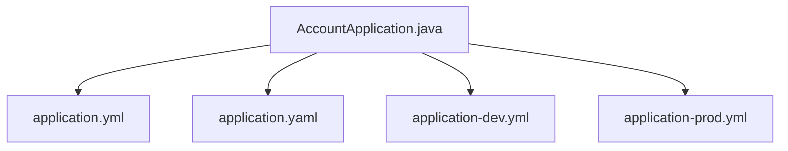

# App Schema

## 1. 코드 구조

## 2. 엔트리포인트

### `AccountApplication`

역할:
- `@SpringBootApplication`
- `main()`에서 `SpringApplication.run(...)` 실행

의미:
- 전체 회계 시스템의 단일 부팅 진입점입니다.

## 3. 설정 파일

### `application.yml`

주요 설정:
- `spring.application.name=account`
- `spring.profiles.active=local`
- `spring.jpa.hibernate.ddl-auto=update`
- `spring.jpa.open-in-view=false`
- `management.endpoints.web.exposure.include=health,info,metrics,prometheus`
- `server.port=8080`

의미:
- 기본 공통 설정과 기본 프로파일 값을 담습니다.

### `application.yaml`

주요 설정:
- `spring.application.name=account`

의미:
- 현재는 최소 설정만 가진 중복 베이스 파일입니다.

### `application-dev.yml`

주요 설정:
- H2 console 활성화
- `jdbc:h2:mem:accountdb;MODE=Oracle...`
- `ddl-auto=create-drop`
- `show-sql=true`
- Actuator 전체 노출
- 디버그/트레이스 로깅

의미:
- 로컬 개발과 테스트성 실행에 적합한 개발 프로파일입니다.

### `application-prod.yml`

주요 설정:
- `on-profile: prod`
- MySQL datasource
- `username=${DB_USERNAME}`
- `password=${DB_PASSWORD}`
- `ddl-auto=validate`
- `show-sql=false`
- `INFO` 로그 수준

의미:
- 운영용 예시 프로파일입니다.

## 4. 의존 모듈 집합

`app`이 포함하는 주요 모듈:
- `contracts`
- `shared-kernel`
- `master-data`
- `governance`
- `journal-ledger`
- `closing`
- `loan`
- `reconciliation`
- `receivable`
- `payable`
- `asset-lease`
- `tax`
- `expenditure-resolution`
- `reporting`

## 5. 읽을 때 중요한 점

- `app`은 DB 테이블을 만들지 않는 대신 전체 런타임 설정의 중심입니다.
- 문제 발생 시 업무 모듈 코드뿐 아니라 `app` 설정과 프로파일도 같이 봐야 합니다.
