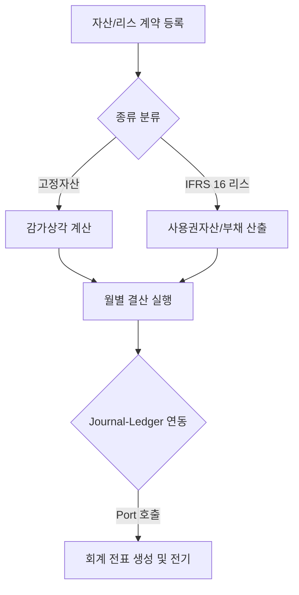
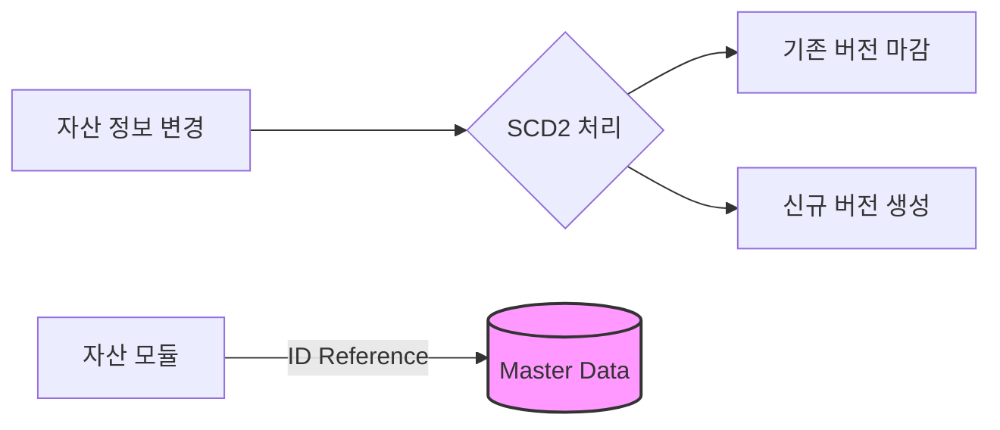
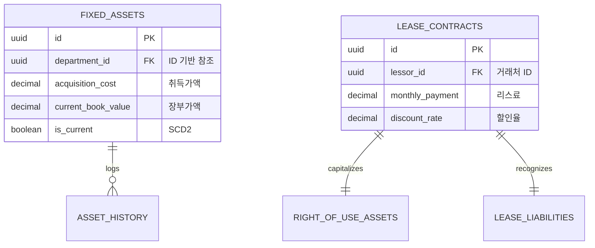

# 🏢 Asset Lease Service (자산 및 리스 관리)

`asset-lease` 모듈은 회사의 고정자산(건물, 기계, 비품 등)의 생애주기와 IFRS 16 국제회계기준에 따른 리스 계약을 통합 관리하는 모듈입니다.

상세 문서는 [asset-lease/docs/README.md](./docs/README.md)에서 순서대로 읽을 수 있습니다. 기존 문서 인덱스는 삭제하지 않고 `asset-lease/docs/archive`에 보존했습니다.

---

## 1. 🐣 초보자를 위한 개념 설명 (Beginner Guide)

**고정자산 (Fixed Asset)은 '비싼 컴퓨터를 사서 몇 년 동안 나눠서 비용 처리하는 것'입니다.**
- 회사가 500만 원짜리 서버를 샀다고 칩시다. 이 500만 원을 산 날 한 번에 다 비용으로 털어버리면, 그 달은 엄청난 적자가 납니다.
- 그래서 5년 동안 쓸 거니까 "매년 100만 원씩만 썼다고 치자"라고 나누는 것이 **감가상각(Depreciation)**입니다.

**리스 (Lease)는 '사무실이나 복사기를 장기 렌탈할 때, 내 자산처럼 장부에 올리는 것'입니다.**
- 옛날에는 매달 렌탈료 낼 때마다 그냥 '비용'으로 처리했습니다.
- 이제는(IFRS 16 규정) 3년 동안 총 낼 돈을 다 더해서 **부채(앞으로 갚을 돈)**로 잡고, 동시에 3년 동안 쓸 권리를 **자산(사용권자산)**으로 잡아둡니다. 그래서 매달 돈을 낼 때 이자 갚는 것과 원금 갚는 것으로 쪼개서 복잡하게 회계 처리를 합니다.

---

## 2. 🔄 프로세스 흐름 (Process Flow)

### 📌 전체 업무 흐름 및 전표 연동
자산 취득부터 월별 상각, 그리고 최종 전표 기표까지의 흐름입니다.



### 📌 SCD2 및 ID 기반 참조 아키텍처
자산의 조건 변경 시 과거 이력을 보존하며, 타 모듈과는 ID(String/UUID) 값으로만 통신합니다.



---

## 3. 📊 데이터 모델 (Schema)

고정자산과 리스 계약의 핵심 테이블 구조입니다.



---

## 4. 로컬 실행 및 연동 방법

`asset-lease`는 `org.springframework.boot` 플러그인을 사용하는 단독 실행 가능 모듈입니다. 로컬에서는 Config Server와 Eureka를 끄고 실행하는 구성을 사용합니다.

**PowerShell 테스트 명령:**

```powershell
.\gradlew :asset-lease:test --console=plain --max-workers=1 --no-daemon
```

**PowerShell API 실행 명령:**

```powershell
.\gradlew :asset-lease:bootRun --args="--server.port=8083 --spring.cloud.config.enabled=false --spring.cloud.discovery.enabled=false --eureka.client.enabled=false --spring.batch.job.enabled=false --spring.batch.jdbc.initialize-schema=always --spring.jpa.hibernate.ddl-auto=create-drop" --console=plain
```

**IntelliJ 실행 순서:**
1. 루트 프로젝트를 Gradle 프로젝트로 엽니다.
2. Project SDK와 Gradle JVM을 JDK 17로 맞춥니다.
3. 상단 Run Configuration에서 `Asset Lease API bootRun` 또는 `Asset Lease Tests`를 선택합니다.
4. 자산 등록/상각/처분 API를 호출하려면 Kafka 이벤트 발행 경로도 함께 고려합니다.

**연동 주의사항:**
- 감가상각 및 리스 전표 생성은 현재 직접 `JournalPostingPort` 호출이 아니라 `AssetEventPort`의 `transaction-events` 이벤트와 리스 지급결의 포트를 통해 후속 처리됩니다.
- 부서나 거래처 정보는 엔티티 직접 참조 대신 코드 기반으로 저장합니다.
- 고정자산 등록, 감가상각, 처분, 부서 변경 요청은 실제 사용자 또는 배치 실행자 ID를 서비스에 전달하며 자산 이력과 이벤트 감사 정보에 같은 actor를 기록합니다.
- 리스료 지급결의는 `LeasePaymentResolutionPort` 구현이 필요하며, 단독 실행에서 구현이 없으면 fallback 어댑터가 예외를 던집니다.

## 5. 문서 읽기 순서

- [docs/beginner-guide.md](./docs/beginner-guide.md): 고정자산, 감가상각, 사용권자산, 리스부채 개념.
- [docs/process-flow.md](./docs/process-flow.md): API, 서비스, Batch, 이벤트, 지급결의 포트 흐름.
- [docs/schema.md](./docs/schema.md): 테이블, 상태, migration 주의사항.
- [docs/local-run.md](./docs/local-run.md): IntelliJ와 Gradle 로컬 실행 방법.
