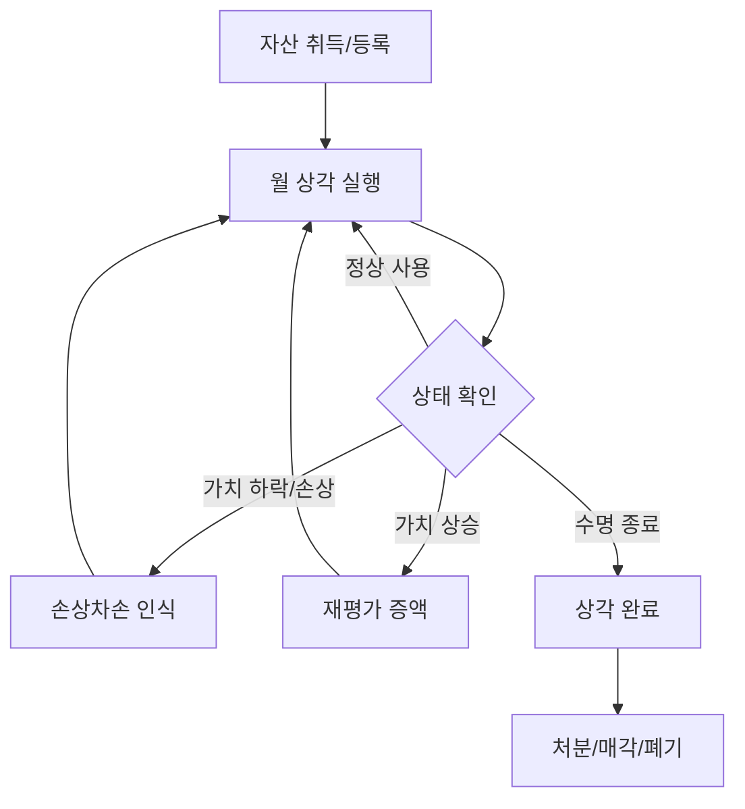
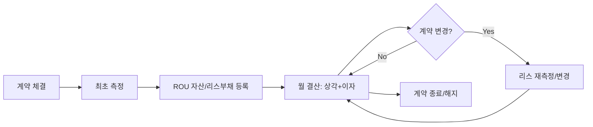

# 🏢 자산 및 리스 회계 비즈니스 프로세스 가이드

본 문서는 고정자산과 IFRS 16 리스 회계의 전체 생애주기(Life Cycle) 프로세스와 시스템 흐름을 정의합니다.

## 1. 고정자산 관리 프로세스 (Fixed Asset Life Cycle)

### 🧺 초보자를 위한 개념 설명
> **감가상각이란?**
> 자동차나 기계 같은 자산은 시간이 지날수록 가치가 떨어집니다. 이 "가치가 떨어지는 비용"을 한 번에 장부에 적지 않고, 자산을 사용하는 기간(내용연수) 동안 나누어서 비용으로 처리하는 것을 말합니다.

### 🛤️ 프로세스 흐름도

### 💎 고도화 포인트
- **재평가 모형:** 공정가치 변동을 장부에 반영하여 자산 가치를 최신화합니다.
- **손상차손:** 자산의 회수가능가액이 장부금액에 못 미칠 경우 비정기적 비용을 즉시 인식합니다.

---

## 2. 리스 회계 (IFRS 16) 프로세스

### 🧺 초보자를 위한 개념 설명
> **사용권자산(ROU Asset)이란?**
> 과거에는 월세(리스료)만 비용으로 냈지만, IFRS 16 규정에 따르면 "내가 빌린 물건을 사용할 권리"도 하나의 자산으로 봅니다. 그래서 빌린 기간 동안의 총 월세를 현재 가치로 계산해서 자산으로 잡고, 매달 조금씩 상각합니다.

### 🛤️ 프로세스 흐름도

### 💎 고도화 포인트
- **리스 재측정:** 소비자물가지수 연동이나 계약 기간 연장 시 리스부채를 다시 계산하여 ROU 자산을 업데이트합니다.
- **리스 부채 이자 산출:** 유효이자율법을 적용하여 매달 원금 상환액과 이자 비용을 정밀하게 분리합니다.

## 3. 시스템 연동 흐름
1. **마스터 데이터:** 거래처, 부서, 계정과목 정보 연동.
2. **원장 관리:** 자산/리스 원장과 총계정원장(GL) 간의 실시간/배치 전표 전송.
3. **결산 통제:** 마감 전 자산 실사 결과와의 대조(Reconciliation).

---
**Last Updated:** 2026-04-23 by [기획/팀장]
