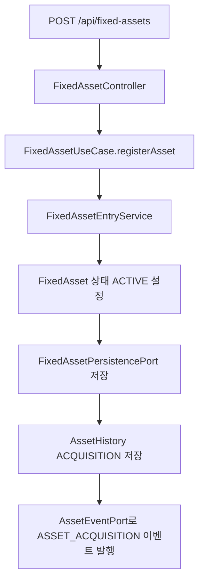
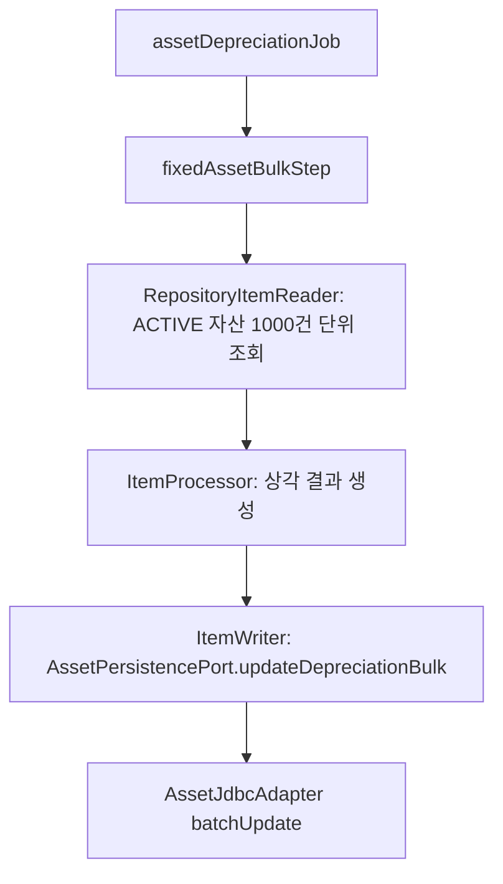
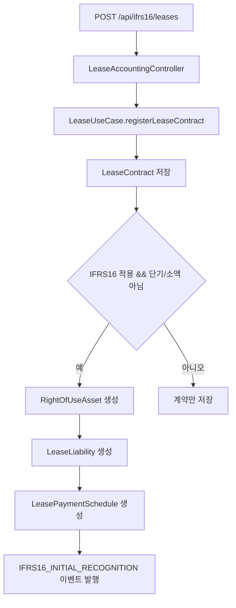

# asset-lease process flow

## API 입구

| 컨트롤러 | 메서드 | 경로 | 역할 |
| --- | --- | --- | --- |
| `FixedAssetController` | `POST` | `/api/fixed-assets` | 고정자산을 등록하고 취득 이력과 자산 이벤트를 남긴다. |
| `FixedAssetController` | `POST` | `/api/fixed-assets/depreciate/{processDate}` | 기준일로 활성 자산의 월상각을 처리한다. |
| `FixedAssetController` | `POST` | `/api/fixed-assets/dispose` | 자산을 처분 상태로 바꾸고 처분 이벤트를 남긴다. |
| `FixedAssetController` | `GET` | `/api/fixed-assets?status=ACTIVE` | 상태별 자산 목록을 조회한다. |
| `FixedAssetController` | `GET` | `/api/fixed-assets/{id}` | 자산 단건을 조회한다. |
| `LeaseAccountingController` | `POST` | `/api/ifrs16/leases` | 리스 계약을 등록하고 IFRS 16 대상이면 최초 인식을 수행한다. |
| `LeaseAccountingController` | `GET` | `/api/ifrs16/leases` | 활성 리스 계약 목록을 조회한다. |
| `LeaseAccountingController` | `GET` | `/api/ifrs16/leases/{id}` | 리스 계약 단건을 조회한다. |
| `LeaseAccountingController` | `POST` | `/api/ifrs16/leases/process-monthly/{processDate}` | 리스 월별 회계처리를 실행한다. |
| `LeaseAccountingController` | `POST` | `/api/ifrs16/leases/remeasure` | 리스료, 종료일, 할인율 변경을 반영한다. |

고정자산 변경 API는 `X-User-ID` 헤더가 필요하다. 이 값은 `AssetHistory.auditUser`와 Kafka 이벤트의 `actor`에 기록된다. 리스 API는 아직 같은 실행자 감사가 없어서 코드에 `@todo`로 표시했다.

## 고정자산 등록 흐름



핵심 정합성 포인트:

- 요청 DTO는 자산코드, 계정코드, 취득일, 취득원가, 내용연수, 상각방법, 잔존가치, 부서코드를 검증한다.
- 이력은 최초 취득, 월상각, 처분, 부서 이동 시 남는다.
- 이벤트는 `transaction-events` 토픽으로 발행된다.

## 월상각 흐름

```mermaid
flowchart TD
    A[POST /api/fixed-assets/depreciate/{processDate}] --> B[ACTIVE 자산 조회]
    B --> C[FixedAsset.depreciate]
    C --> D{상각액 > 0}
    D -->|예| E[자산 저장]
    E --> F[AssetHistory DEPRECIATION 저장]
    F --> G[ASSET_DEPRECIATION 이벤트 발행]
    D -->|아니오| H[변경 없음]
```

단건 API 경로는 서비스가 자산 목록을 순회한다. 대량 운영은 `AssetDepreciationBatchConfig`의 `assetDepreciationJob`을 사용해야 한다.

## 대량 감가상각 Batch 흐름



현재 Batch Config는 `DepreciationPipeline`을 주입하지만 processor에서 `FixedAsset.depreciate`를 직접 호출하고 날짜도 `LocalDate.now().minusMonths(1)`로 결정한다. 이 부분은 Batch 모듈이 순수 오케스트레이터 역할에 집중하도록 `@todo`로 남겼다.

## IFRS 16 리스 등록 흐름



## 리스 월별 처리와 지급결의

월별 회계처리는 해당 월의 스케줄을 찾아 사용권자산을 상각하고 리스부채를 원금 상환액만큼 줄인다. 별도의 `processMonthlyLeasePayment(paymentDate)` 유즈케이스는 지급일이 맞는 계약을 찾아 `LeasePaymentResolutionPort`로 지급결의를 만든다.

IFRS 16 자본화 리스는 지급결의 차변을 이자비용 `93100`과 리스부채 `25100`으로 분리하고, 대변은 미지급금 `21100`을 사용한다. 단기/소액 리스나 스케줄이 없는 경우에는 비용 계정과 미지급금의 단순 지급결의 경로를 유지한다.

## 외부 연동

- Kafka: `AssetEventPort`가 `transaction-events` 토픽으로 자산/리스 이벤트를 발행한다.
- Expenditure Resolution: `LeasePaymentResolutionPort`로 리스료 지급결의를 생성한다.
- Journal Ledger: 현재 직접 `JournalPostingPort` 호출은 없고, 이벤트 또는 지급결의 후속 흐름을 통해 전표화하는 구조다.
- Source Document: `AssetSourceDocumentProvider`가 `FIXED_ASSET`, `IFRS16_LEASE` 원천 문서를 제공한다.
