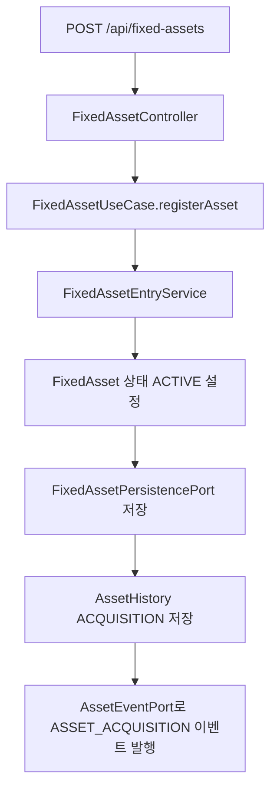
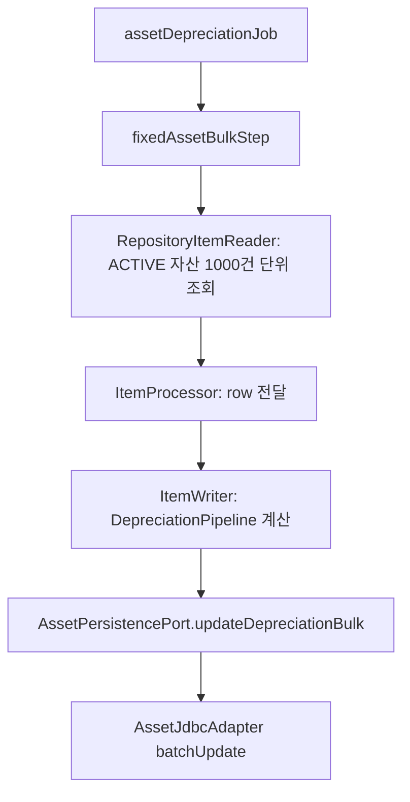
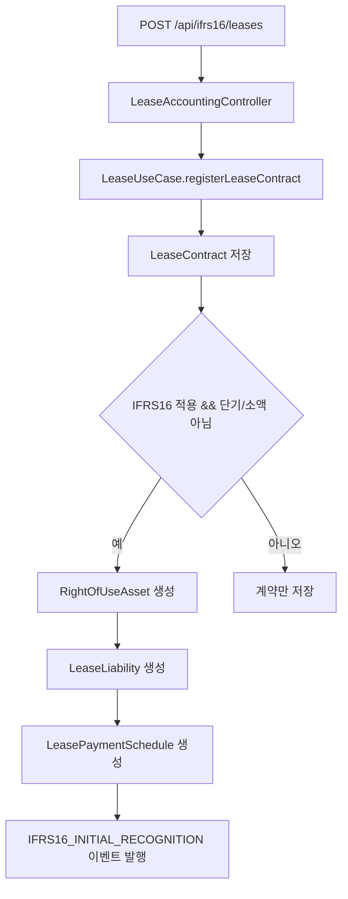

# asset-lease process flow

## API 입구

| 컨트롤러 | 메서드 | 경로 | 역할 |
| --- | --- | --- | --- |
| `FixedAssetController` | `POST` | `/api/fixed-assets` | 고정자산을 등록하고 취득 이력과 자산 이벤트를 남긴다. |
| `FixedAssetController` | `POST` | `/api/fixed-assets/depreciate/{processDate}` | 기준일로 활성 자산의 월상각을 처리한다. |
| `FixedAssetController` | `POST` | `/api/fixed-assets/dispose` | 자산을 처분 상태로 바꾸고 처분 이벤트를 남긴다. |
| `FixedAssetController` | `GET` | `/api/fixed-assets?status=ACTIVE` | 상태별 자산 목록을 조회한다. |
| `FixedAssetController` | `GET` | `/api/fixed-assets/{id}` | 자산 단건을 조회한다. |
| `LeaseAccountingController` | `POST` | `/api/ifrs16/leases` | 리스 계약을 등록하고 IFRS 16 대상이면 최초 인식을 수행한다. |
| `LeaseAccountingController` | `GET` | `/api/ifrs16/leases` | 활성 리스 계약 목록을 조회한다. |
| `LeaseAccountingController` | `GET` | `/api/ifrs16/leases/{id}` | 리스 계약 단건을 조회한다. |
| `LeaseAccountingController` | `POST` | `/api/ifrs16/leases/process-monthly/{processDate}` | 실행자 헤더를 받아 리스 월별 회계처리를 실행한다. |
| `LeaseAccountingController` | `POST` | `/api/ifrs16/leases/remeasure` | 기준일 이후 리스료·종료일·할인율 변경을 부채·사용권자산·상환표에 반영한다. |

고정자산 변경 API와 리스 등록/월별 처리/재측정 API는 `X-User-ID` 헤더가 필요하다. 고정자산은 `AssetHistory.auditUser`와 Kafka 이벤트에, 리스는 IFRS 16 최초 인식/월별 처리/재측정 이벤트의 `actor`에 기록된다.

## 고정자산 등록 흐름



핵심 정합성 포인트:

- 요청 DTO는 자산코드, 계정코드, 취득일, 취득원가, 내용연수, 상각방법, 잔존가치, 부서코드를 검증한다.
- 이력은 최초 취득, 월상각, 처분, 부서 이동 시 남는다.
- 이벤트는 `transaction-events` 토픽으로 발행된다.

## 월상각 흐름

```mermaid
flowchart TD
    A[POST /api/fixed-assets/depreciate/{processDate}] --> B[ACTIVE 자산 조회]
    B --> C[FixedAsset.depreciate]
    C --> D{상각액 > 0}
    D -->|예| E[자산 저장]
    E --> F[AssetHistory DEPRECIATION 저장]
    F --> G[ASSET_DEPRECIATION 이벤트 발행]
    D -->|아니오| H[변경 없음]
```

단건 API 경로는 서비스가 자산 목록을 순회한다. 대량 운영은 `AssetDepreciationBatchConfig`의 `assetDepreciationJob`을 사용해야 한다.

## 대량 감가상각 Batch 흐름



Batch Config는 `targetDate=YYYY-MM-DD` JobParameter를 필수로 받아 chunk를 `DepreciationPipeline`에 넘긴다. Batch 모듈은 Reader/Processor/Writer 흐름만 조립하고, 상각 계산과 0원 상각 제외 판단은 core pipeline이 맡는다. core pipeline은 `FixedAsset.calculateDepreciation()`으로 결과 값 객체만 만들며 엔티티를 변경하지 않는다. 실제 DB 반영은 `AssetJdbcAdapter`의 JDBC bulk update가 한 번만 수행한다.

## IFRS 16 리스 등록 흐름



## 리스 월별 처리와 지급결의

### 리스 재측정

`remeasurementDate`는 아직 처리하지 않은 첫 지급 회차의 날짜다. 서비스는 이전에 지급 예정이었던 회차가 `PAID`인지(과거 단축으로 취소된 회차는 `CANCELLED` 유지), 기준일 이후에 이미 `PAID`인 회차가 없는지 확인한다. 미처리 과거 회차나 계약 기간 밖 기준일은 거절한다. 같은 기준일 재시도는 기존 회차를 재사용해 미래 회차를 중복 생성하지 않는다.

유효한 요청은 새 월 리스료·할인율·종료일로 **남은 회차만** 현재가치(PV)를 다시 계산한다. 새 PV와 현재 리스부채의 차액을 부채 및 사용권자산 장부가액에 반영하고, 남은 기간의 월 상각 기준액을 다시 정한다. 이미 `PAID`인 회차와 최초 인식가액·누적 상각액은 과거 기록으로 보존한다. 이후 `SCHEDULED` 회차의 지급액·이자·원금·잔여 부채를 다시 쓰고, 단축으로 사라진 회차는 `CANCELLED`, 연장으로 생긴 회차는 새 행으로 저장한다. 이 변경은 서비스의 DB 트랜잭션 안에서 수행된다.

`IFRS16_REMEASUREMENT` 이벤트에는 기준일(`accountingDate`, `remeasureDate`), 부채 조정액(`adjustmentAmount`), 조정 전후 부채 금액을 담는다. 다음 월별 회계 이벤트는 변경된 `SCHEDULED` 회차의 이자·원금·지급액을 사용한다. Kafka 발행과 DB commit은 현재 원자적으로 묶이지 않는다. 이벤트 전달 실패·중복과 외부 전표 반영은 별도 운영 검증 대상이다.

예를 들어 2026년 1~12월에 매월 1,200.00, 연 6%인 계약의 1~5월 회차를 처리한 뒤 6월 1일 회차부터 월 2,400.00으로 바꾸면, 5월 말 부채 8,234.48을 남은 7회 지급의 PV 16,468.98로 재측정한다. 조정액은 +8,234.50이고 `PAID` 5건은 유지된다. 새 6월 회차는 지급액 2,400.00, 이자 82.34, 원금 2,317.66이다. 사용권자산의 기존 장부가액 8,133.27은 16,367.77로 조정되고 남은 7회 상각액을 다시 정한다. 마지막 회차에는 센트 반올림으로 남은 장부가액을 모두 상각한다. `./gradlew :asset-lease:core:test --offline --no-daemon --console=plain --max-workers=2`로 이 흐름과 H2 롤백 회귀를 확인할 수 있다.

재측정과 월별 처리 모두 같은 계약 행을 잠그고 부채·스케줄을 읽어 동시 변경을 직렬화한다. 마지막 상환 회차는 남은 현금흐름 PV에 맞춰 센트 반올림을 회차별 이자·원금에 배분하여 고정 리스료를 유지하고 부채 잔액을 0으로 끝낸다. 사용권자산 조정액이 현재 장부가액보다 더 큰 음수라면 현재 구현은 해당 요청을 거절한다.

월별 회계처리는 해당 월의 스케줄을 찾아 사용권자산을 상각하고 리스부채를 원금 상환액만큼 줄인다. 이전 `SCHEDULED` 회차가 남아 있으면 기간을 건너뛴 상각을 막기 위해 처리하지 않고 오류를 반환한다. 별도의 `processMonthlyLeasePayment(paymentDate)` 유즈케이스는 지급일이 맞는 계약을 찾아 `LeasePaymentResolutionPort`로 지급결의를 만든다.

IFRS 16 자본화 리스는 지급결의 차변을 이자비용과 리스부채로 분리하고, 대변은 미지급금을 사용한다. 월별 회계가 먼저 실행되어 회차가 `PAID`가 되었어도 같은 회차의 이자·원금 금액으로 지급결의를 만든다. 계정 코드는 `LeaseAccountMappingPort`를 통해 설정 기반으로 조회한다. 기본값은 이자비용 `93100`, 리스부채 `25100`, 미지급금 `21100`이다. 단축된 종료월 이후에는 지급결의를 만들지 않으며, 종료월 안의 지급일이 실제 종료일보다 늦더라도 그 달의 스케줄은 처리한다. 단기/소액 리스나 계약 기간 안에서 스케줄이 없는 경우에는 비용 계정과 미지급금의 단순 지급결의 경로를 유지한다.

## 외부 연동

- Kafka: `AssetEventPort`가 `transaction-events` 토픽으로 자산/리스 이벤트를 발행한다.
- Expenditure Resolution: `LeasePaymentResolutionPort`로 리스료 지급결의를 생성한다.
- Journal Ledger: 현재 직접 `JournalPostingPort` 호출은 없고, 이벤트 또는 지급결의 후속 흐름을 통해 전표화하는 구조다.
- Source Document: `AssetSourceDocumentProvider`가 `FIXED_ASSET`, `IFRS16_LEASE` 원천 문서를 제공한다.
