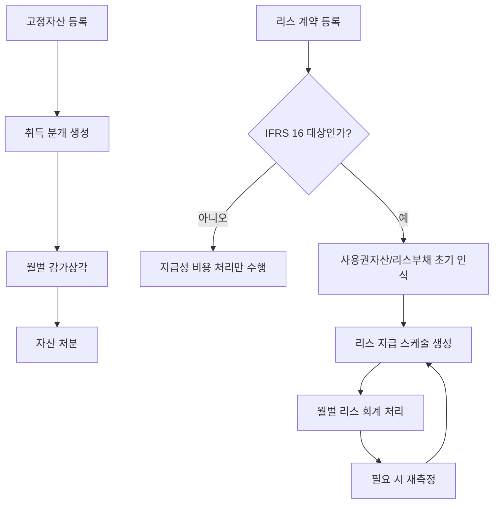
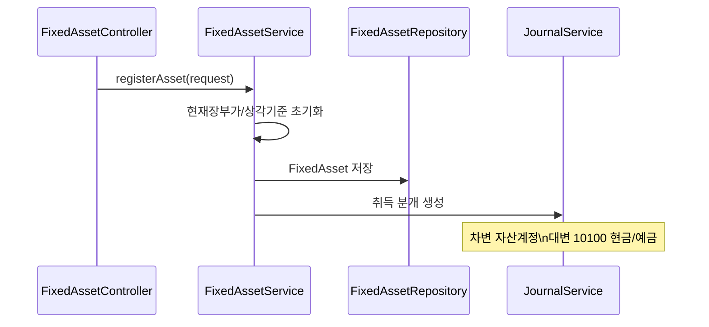
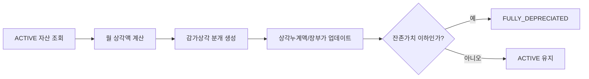
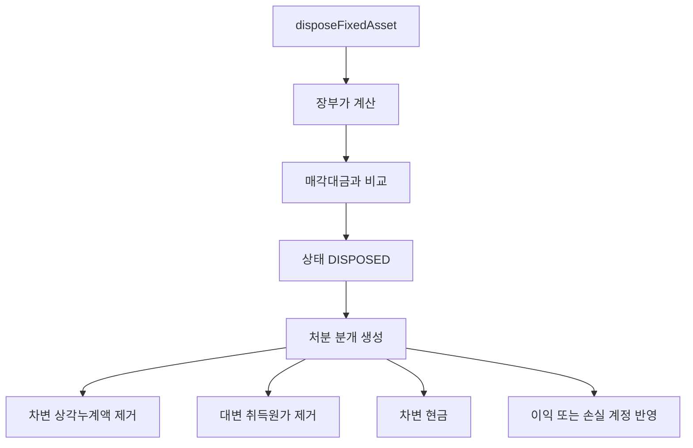
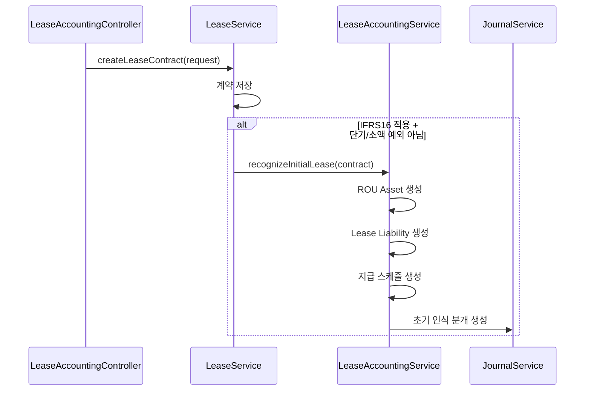
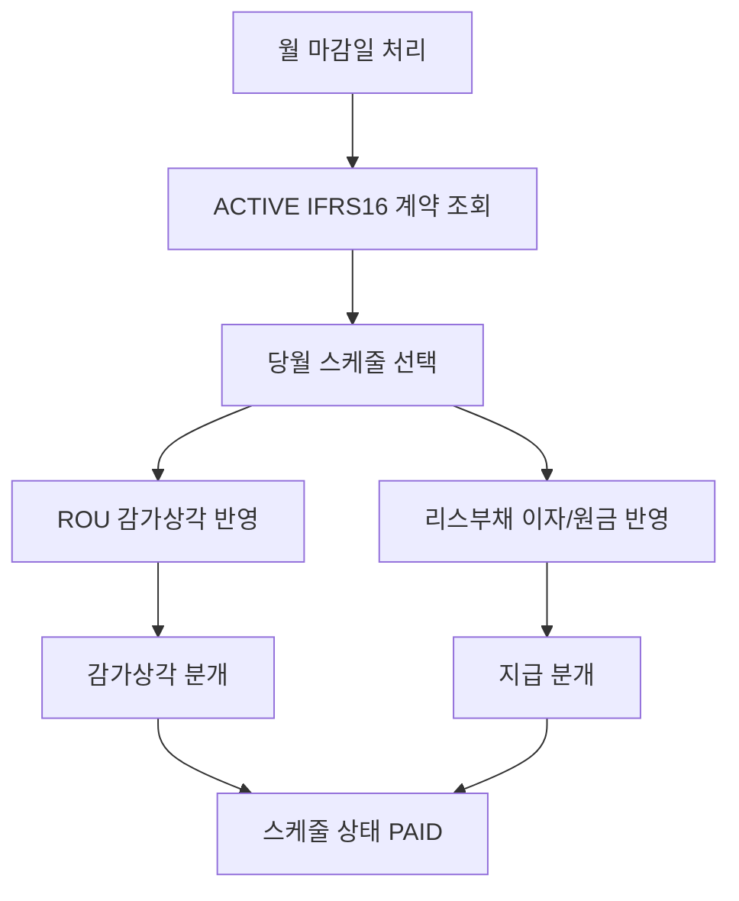

# Asset-Lease Process Flow

## 1. 전체 흐름

## 2. 고정자산 취득 흐름

설명:
- 자산코드, 취득가액, 내용연수, 감가상각방법, 자산계정, 상각누계액계정, 감가상각비 계정을 넣어 자산을 등록합니다.
- 등록 직후 취득 분개를 만듭니다.

## 3. 월별 감가상각 흐름

설명:
- `STRAIGHT_LINE`은 자산에 계산된 기간 상각액을 사용합니다.
- `DECLINING`은 서비스에서 장부가 기준으로 계산합니다.
- 감가상각 분개는 생성 후 승인 요청과 승인까지 바로 수행합니다.

## 4. 자산 처분 흐름

설명:
- 장부가와 매각대금을 비교해 처분이익 또는 처분손실을 계산합니다.
- 현재 구현은 분개 생성 후 승인 요청과 승인까지 즉시 수행합니다.

## 5. IFRS 16 초기 인식

설명:
- IFRS 16 대상이고 단기리스/소액리스 예외가 아니면 자동으로 초기 인식이 수행됩니다.
- 초기 인식 분개는 시작일 전날 기준으로 작성됩니다.

## 6. IFRS 16 월별 처리

분개 구조:
- 감가상각 분개
  - 차변 `51500` 감가상각비
  - 대변 `12399` 감가상각누계액
- 지급 분개
  - 차변 `93100` 이자비용
  - 차변 `25100` 리스부채
  - 대변 `10100` 현금/예금
- `LeasePaymentResolutionPort` 연계 시에도 상환 스케줄의 `interestPortion`과 `principalPortion`을 별도 차변 라인으로 전달한다.

## 7. IFRS 16 재측정

설명:
- 재측정 시 과거 스케줄은 유지하고, 기준일 이후 미래 스케줄만 삭제 후 다시 만듭니다.
- 조정액이 0이면 분개를 만들지 않습니다.

## 8. 현재 구현상 주의점

- 고정자산과 리스가 한 모듈에 같이 있어 경계가 넓습니다.
- 일부 분개는 `create -> requestApproval -> approve`까지 한 서비스에서 끝납니다.
- IFRS 16 계정코드가 하드코딩되어 있어 계정체계 변경에 취약합니다.
- 리스 비용지출 연계는 계약의 `paymentDay`와 배치 날짜가 일치할 때만 생성됩니다.
