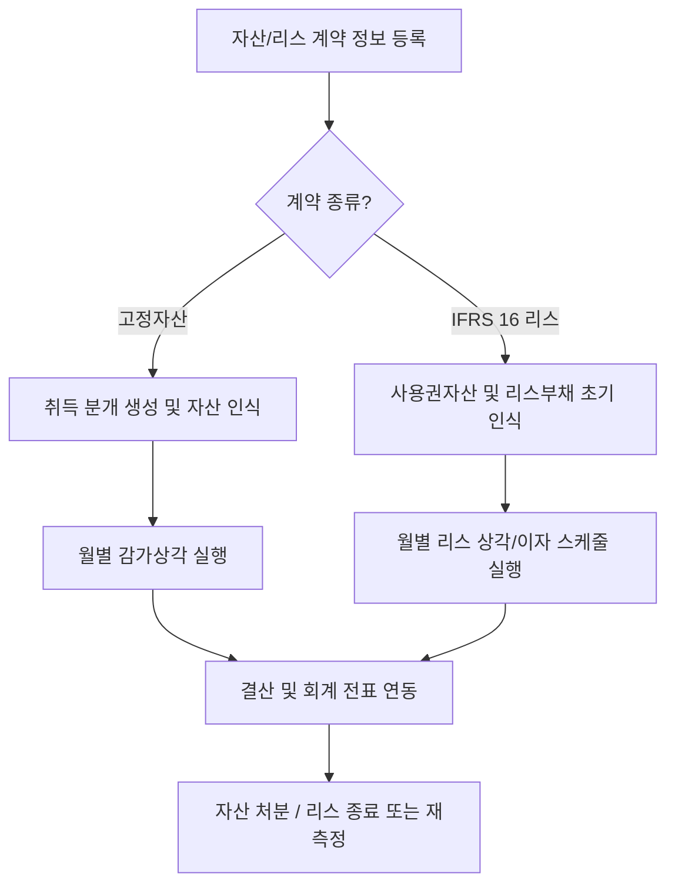
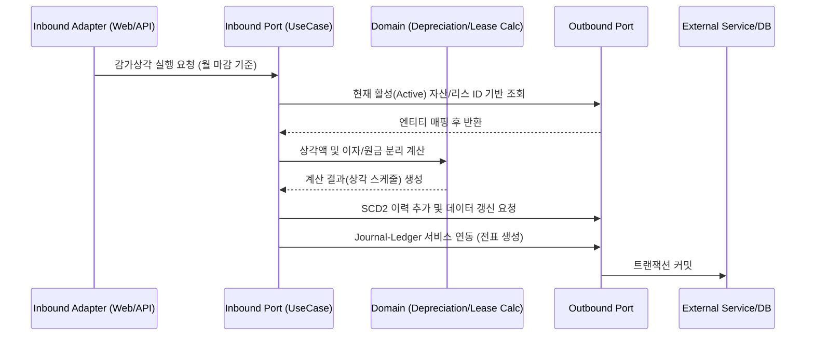

# Asset-Lease Process Flow

## 1. 전체 업무 흐름

## 2. 헥사고날 아키텍처에 따른 트랜잭션 흐름

## 3. 핵심 아키텍처 요소

### 3.1 ID 기반 참조 처리 (ID-based references)
- 외부 시스템(조직도, 거래처 마스터)에 의존하는 항목들은 부서 코드(문자)가 아닌 `department_id`(UUID 등)로 저장됩니다. 시스템 간 결합도를 낮추고 데이터 불일치를 방지합니다.

### 3.2 상태와 금액 변화의 이력 관리 (SCD2)
- 내용연수가 연장되거나 리스 조건(임대료, 할인율)이 재측정(Remeasurement)되는 경우 기존 정보는 과거 데이터(`is_current = false`)로 마감되고, 새로운 조건의 데이터가 새 버전으로 쌓이게 되어 자산 변동의 투명한 추적과 감사가 가능해집니다.

### 3.3 분산 시스템 연계 (Ports and Adapters)
- 감가상각 및 리스 분개는 본 모듈 내에서 확정되는 것이 아니라 `JournalServicePort`라는 Outbound 인터페이스를 통해 회계 코어(Journal-Ledger) 모듈로 전달됩니다. 어댑터(Adapter)를 교체하면 시스템 연계 방식을 Kafka 메시징이나 gRPC로 유연하게 바꿀 수 있습니다.

### 3.4 Multi-stage Docker 빌드 및 배포
- CI/CD 파이프라인에서 앱은 다단계 도커 파일(`Dockerfile`)을 기반으로 빌드됩니다. 첫 번째 스테이지(builder)에서 의존성 패키지를 다운받고 앱을 조립하며, 두 번째 스테이지(runtime)에서는 순수하게 실행에 필요한 JRE와 빌드된 JAR 파일만 복사하여 경량화된 컨테이너를 구동합니다.