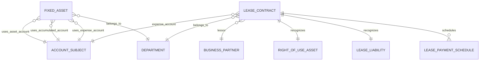

# Asset-Lease Schema

## 1. 엔티티 맵

## 2. 고정자산 영역

### `fixed_assets`

주요 컬럼:
- `id`
- `asset_code`
- `asset_name`
- `account_code`
- `accumulated_account_code`
- `expense_account_code`
- `acquisition_date`
- `acquisition_cost`
- `useful_life`
- `depreciation_method`
- `residual_value`
- `accumulated_depreciation`
- `current_book_value`
- `depreciation_amount_per_period`
- `last_depreciation_date`
- `dept_code`
- `status`
- `created_at`

의미:
- 취득가액, 잔존가치, 장부가, 누적상각액을 갖는 자산 마스터입니다.

상태 예시:
- `ACTIVE`
- `FULLY_DEPRECIATED`
- `DISPOSED`

## 3. IFRS 16 리스 영역

### `lease_contracts`

주요 컬럼:
- `id`
- `contract_no`
- `contract_name`
- `customer_code`
- `start_date`
- `end_date`
- `monthly_payment`
- `payment_day`
- `dept_code`
- `account_code`
- `ifrs16_applicable`
- `short_term_lease`
- `low_value_lease`
- `discount_rate`
- `initial_right_of_use_asset_value`
- `initial_lease_liability_value`
- `status`
- `created_at`

의미:
- 리스 계약 기본정보와 IFRS 16 적용 여부를 저장합니다.

### `right_of_use_assets`

주요 컬럼:
- `id`
- `lease_contract_id`
- `asset_name`
- `recognition_date`
- `initial_value`
- `current_book_value`
- `accumulated_depreciation`
- `depreciation_amount_per_period`
- `status`
- `created_at`

의미:
- 리스 계약으로 인식된 사용권자산입니다.

### `lease_liabilities`

주요 컬럼:
- `id`
- `lease_contract_id`
- `recognition_date`
- `initial_value`
- `current_value`
- `accumulated_interest_expense`
- `status`
- `created_at`

의미:
- 리스 계약에서 발생한 리스부채 잔액을 저장합니다.

### `lease_payment_schedules`

주요 컬럼:
- `id`
- `lease_contract_id`
- `payment_date`
- `scheduled_payment_amount`
- `actual_payment_amount`
- `interest_portion`
- `principal_portion`
- `remaining_lease_liability`
- `status`
- `created_at`

의미:
- 월별 지급금액을 이자 부분과 원금 부분으로 나눈 상환 스케줄입니다.

상태 예시:
- `SCHEDULED`
- `PAID`
- `CANCELLED`
- `ADJUSTED`

## 4. 소스문서 연계

`AssetSourceDocumentProvider`는 아래 유형을 지원합니다.

- `FIXED_ASSET` -> `FixedAsset`
- `IFRS16_LEASE` -> `LeaseContract`

즉, 분개 드릴다운이나 계보 추적에서 자산과 리스 모두 이 모듈이 원문서를 제공합니다.

## 5. 관계를 읽을 때 중요한 점

- `LeaseContract`와 `RightOfUseAsset`, `LeaseLiability`는 사실상 1:1입니다.
- `LeasePaymentSchedule`은 계약별 N건이 생성됩니다.
- 고정자산 영역과 IFRS 16 영역은 같은 모듈이지만 데이터 모델은 분리되어 있습니다.
