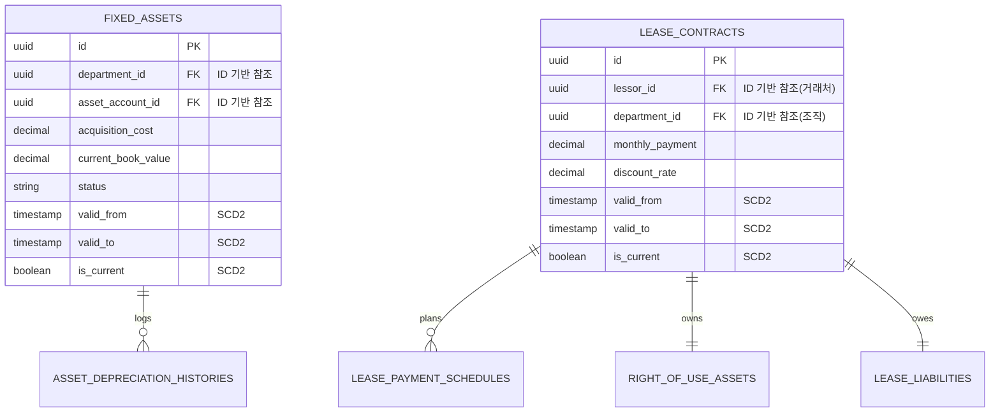

# Asset-Lease Schema

## 1. 헥사고날 및 데이터 모델 (SCD2, ID 기반 중심)

## 2. 주요 설계 포인트

### 2.1 헥사고날 관점의 모델 격리
- 여기에 정의된 DB 스키마는 헥사고날 아키텍처의 맨 끝단인 데이터베이스(영속성) 영역의 구조입니다.
- JPA Entity는 이 테이블들과 1:1로 매핑되지만, 핵심 비즈니스 로직(상각비 계산, 리스 이자 계산 등)은 이 JPA Entity를 모른 채 순수한 Java 도메인 객체 상태에서 수학적인 계산을 수행합니다.

### 2.2 완벽한 ID 기반 참조 (ID-based references)
- 과거에 쓰이던 `dept_code`, `account_code` 등 가변적인 문자열 코드는 완전히 배제되었습니다.
- 대신 `department_id`, `lessor_id` 등 고유한 ID(PK 기반) 식별자로 관계를 맺습니다. 이를 통해 거래처 이름이나 조직 개편으로 코드가 바뀌더라도 이 모듈의 데이터는 정합성을 잃지 않습니다.

### 2.3 SCD2 (Slowly Changing Dimensions) 자산 이력 보존
- `FIXED_ASSETS` 및 `LEASE_CONTRACTS`의 핵심 금액이나 조건(내용연수, 리스 이자율 등)이 변경(Remeasurement)될 경우:
  1. 기존 로우의 `valid_to`를 현재 시간으로 닫고 `is_current`를 `false`로 만듭니다.
  2. 새로운 조건을 반영한 로우를 `valid_from` 현재시간, `is_current` = `true`로 생성합니다.
- 이 설계를 통해 '작년 12월 31일 기준 자산 장부가'나 '작년 6월 당시 리스 계약 조건'을 완벽하게 재구성할 수 있습니다.

### 2.4 결합 없는 연계 구조
- 이 테이블들은 분개(Journal Entry)의 상세 내역을 직접 소유하지 않고 연관된 ID만 가지고 있거나, 반대로 원장 모듈에서 소스 문서로서 여기의 `id`를 참조해 갑니다. 이는 MSA(마이크로서비스 아키텍처)의 데이터 독립성을 철저하게 지키는 설계입니다.