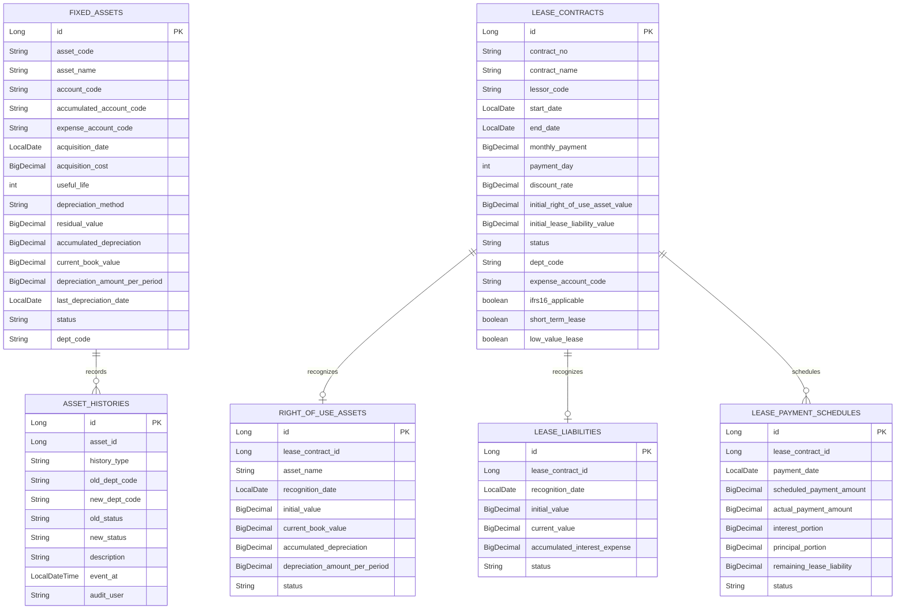

# asset-lease schema

## 핵심 ERD

## 주요 상태

| 모델 | 상태 | 의미 |
| --- | --- | --- |
| `FixedAsset` | `ACTIVE` | 상각 대상 자산 |
| `FixedAsset` | `FULLY_DEPRECIATED` | 장부가액이 잔존가치까지 내려간 자산 |
| `FixedAsset` | `DISPOSED` | 처분 완료 자산 |
| `LeaseContract` | `ACTIVE` | 유효한 리스 계약 |
| `LeaseContract` | `TERMINATED` | 종료된 계약 |
| `LeaseContract` | `MODIFIED` | 조건 변경 이력이 있는 계약 |
| `LeasePaymentSchedule` | `SCHEDULED` | 예정된 지급 회차 |
| `LeasePaymentSchedule` | `PAID` | 월별 회계처리에서 반영된 회차 |
| `LeasePaymentSchedule` | `CANCELLED`, `ADJUSTED` | 취소 또는 조정 확장 지점 |

## 코드 기반 외부 참조

- `accountCode`, `accumulatedAccountCode`, `expenseAccountCode`: master-data 계정과목 코드.
- `departmentCode`: 관리 부서 코드.
- `lessorCode`: 리스 제공자 거래처 코드.
- `AssetSourceDocumentProvider`: `FIXED_ASSET`, `IFRS16_LEASE` 원천 문서 조회를 제공한다.

도메인 엔티티는 master-data 엔티티를 직접 들고 있지 않고 코드만 저장한다. 다만 `AssetLeaseApplication`은 현재 master-data repository/entity를 함께 스캔하도록 설정되어 있어, 독립 MSA 분리 전 로컬 통합 실행 성격이 남아 있다.

## migration 주의사항

`core/src/main/resources/db/migration/V20__init_asset_lease.sql`과 `docs/db/schema.sql`은 스키마 참고 자료다. 현재 `application.yml`은 `spring.jpa.hibernate.ddl-auto=update`를 사용하므로 로컬 실행에서는 JPA 엔티티 기준으로 테이블이 보정될 수 있다.

운영에서 Flyway를 활성화하려면 아래 항목을 먼저 맞춰야 한다.

- `LeaseContract` 엔티티의 `paymentDay`, `expenseAccountCode`, `shortTermLease`, `lowValueLease` 컬럼 반영 여부.
- `RightOfUseAsset`, `LeaseLiability` 테이블 생성 migration 존재 여부.
- `LeasePaymentSchedule`의 join column 명칭과 migration의 `contract_id` 명칭 일치 여부.
- `AssetJdbcAdapter`가 갱신하는 `updated_at` 컬럼이 실제 운영 테이블에 존재하는지 여부.

## 정합성 체크 포인트

- 금액 계산은 `BigDecimal`을 사용한다.
- 고정자산 상각은 장부가액이 잔존가치 아래로 내려가지 않도록 `FixedAsset.depreciate`에서 보정한다.
- 자산 변경은 `AssetHistory`에 감사 이력을 남긴다.
- 리스 지급 스케줄은 이자, 원금, 잔여 리스부채를 회차별로 보관한다.
- 리스 회계 계정 코드는 현재 `LeaseEntryService` 상수로 관리되며, 설정 기반 포트 분리가 필요해 `@todo`로 표시했다.
