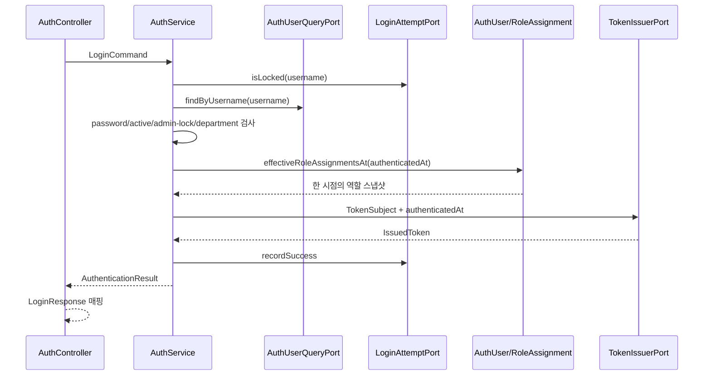
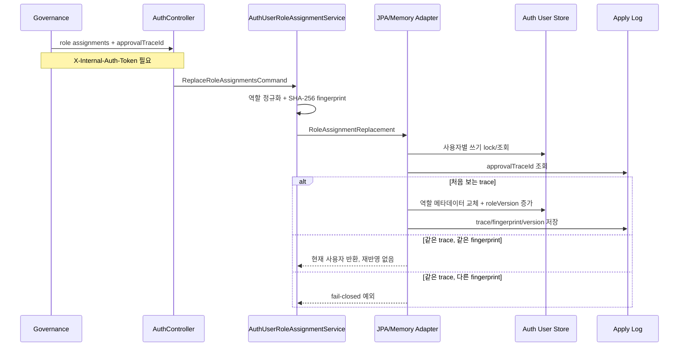

# auth process flow

## API 입구

| 메서드 | 경로 | 역할 |
| --- | --- | --- |
| `POST` | `/api/auth/login` | 명시적 `NORMAL` 비밀번호 로그인의 자격 증명을 검증하고 JWT를 발급합니다. SSO/LDAP는 신뢰 공급자가 없어 fail-closed입니다. |
| `POST` | `/api/auth/validate-token-version` | 버전과 현재 계정/유효 역할 상태를 확인합니다. |
| `POST` | `/api/auth/internal/users/{username}/role-assignments` | Governance 승인 결과로 사용자 역할 목록을 멱등 교체합니다. |
| `GET` | `/api/admin/users` | 프런트엔드 관리 화면용 사용자 목록을 username 순서로 조회합니다. |

## 관리자 사용자 목록 투영

`GET /api/admin/users`는 Gateway가 JWT에서 다시 만든 신뢰 헤더 `X-Auth-Roles`에 `ROLE_SYSTEM_ADMIN` 또는 `SYSTEM_ADMIN`이 있을 때만 허용합니다. 헤더가 없거나 다른 역할뿐이면 저장소를 조회하지 않고 403으로 fail-closed합니다. 서비스는 역할 할당을 함께 읽고 하나의 요청 시각에서 유효 역할을 계산한 뒤 username 오름차순으로 반환합니다. 현재 Auth 스키마의 자연키는 username이며 숫자 ID, 별도 이름·이메일, 마지막 로그인 시각을 저장하지 않으므로 응답은 다음과 같은 제한된 표시용 투영입니다.

- `id`: username의 SHA-256 앞 48비트에 1을 더한 표시용 값입니다. 목록 순서와 무관하게 안정적이고 JavaScript 안전 정수 범위 안이지만, 축약 해시라 충돌할 수 있으며 영속 식별자가 아닙니다.
- `name`, `email`: 모두 username을 사용합니다.
- `role`: 요청 시점에 유효한 첫 역할을 프런트엔드의 `SYSTEM_ADMIN`, `ACCOUNTING_ADMIN`, `RISK_MANAGER`, `RISK_ANALYST`, `MASTER_MANAGER`, `AUDITOR`, `USER` 중 하나로 명시 변환합니다. 레거시 `ROLE_ADMIN`은 `SYSTEM_ADMIN`으로 변환하고, 알 수 없거나 유효한 역할이 없으면 `USER`입니다.
- `status`: 활성 상태이고 잠기지 않은 계정만 `ACTIVE`, 나머지는 `INACTIVE`입니다.
- `lastLogin`: 저장 필드가 없어 빈 문자열입니다.
- `dept`: departmentCode이며 값이 없으면 빈 문자열입니다.

따라서 이 목록의 표시용 ID를 권한 판단이나 사용자 수정·삭제용 키로 사용하면 안 됩니다. 실제 사용자 프로필, 충돌 없는 ID, 로그인 이력 필드가 필요하면 별도 스키마·마이그레이션 계약이 선행되어야 합니다.

## 로그인 흐름



core는 `api.dto`를 참조하지 않습니다. 역할 유효성 계산 시각을 서비스가 한 번 만들고 JWT 어댑터에 전달하므로 응답과 claim이 같은 스냅샷을 사용합니다.

현재 성공 경로는 대소문자를 구분하지 않는 명시적 `NORMAL`뿐입니다. 신뢰할 SSO 공급자가 없으므로 `SSO` 요청은 일반적인 자격 증명 오류로 끝나며 사용자 조회나 JWT 발급으로 진행하지 않습니다. null, 공백, 알 수 없는 로그인 유형도 같은 공개 오류를 반환합니다. 이들은 자격 증명 검증이 시작되지 않은 요청이므로 로그인 실패 저장소를 조회하거나 실패 횟수와 임시 잠금 카운터를 변경하지 않습니다.

LDAP 요청은 사용자와 비밀번호 및 임시 잠금 정책을 확인한 뒤에도 OTP 검증 공급자가 없으면 항상 일반적인 자격 증명 오류로 끝납니다. 고정값 또는 기본값 OTP를 성공 조건으로 사용하지 않으며 JWT를 발급하지 않습니다.

`AuthService`는 사용자 조회, master-data 원격 확인, 로그인 실패 저장 전체를 하나의 DB 트랜잭션으로 묶지 않습니다. JPA 조회/실패 기록 어댑터가 각각 짧은 read/write 트랜잭션을 소유해 외부 호출 중 DB 연결을 오래 잡거나 실패 기록이 readOnly 경계에 묻히는 일을 막습니다.

## 역할 변경 멱등 반영 흐름



JPA 모드는 사용자 행의 비관적 쓰기 lock으로 서로 다른 승인 요청의 버전 증가 순서를 직렬화합니다. apply log는 외부 호출 성공 후 응답 유실로 같은 요청이 재전송되는 상황을 막습니다.

## Token Version 검증

```text
username 존재
AND roleVersion 일치
AND account_active = true
AND account_locked = false
AND 검증 시점의 유효 역할이 1개 이상
=> valid = true
```

## Gateway와의 관계

Gateway는 JWT 서명과 issuer를 검증하고 인증 헤더를 뒤쪽 서비스로 전달합니다. 역할 변경 직후 기존 JWT를 강하게 차단해야 하는 경로는 Auth token-version API를 호출하거나 동일 의미의 캐시 정책을 사용해야 합니다.
