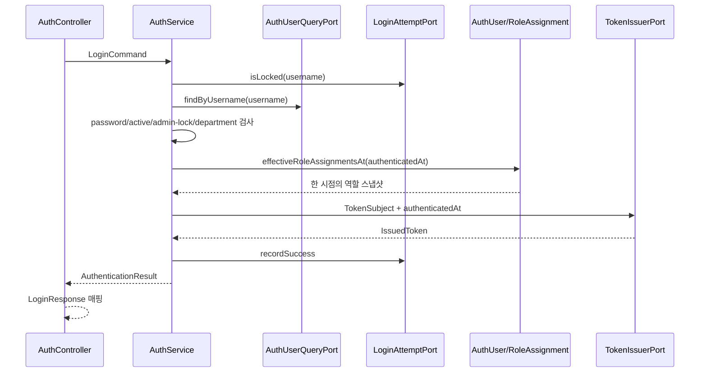
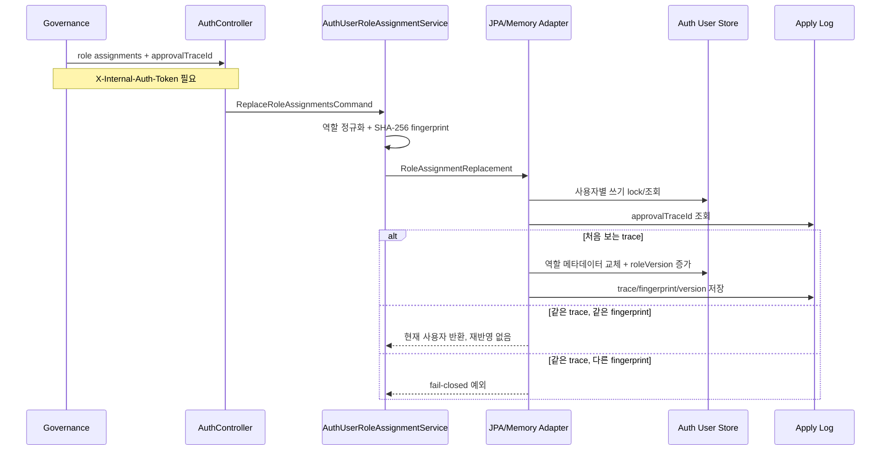

# auth process flow

## API 입구

| 메서드 | 경로 | 역할 |
| --- | --- | --- |
| `POST` | `/api/auth/login` | 명시적 `NORMAL` 비밀번호 로그인의 자격 증명을 검증하고 JWT를 발급합니다. SSO/LDAP는 신뢰 공급자가 없어 fail-closed입니다. |
| `POST` | `/api/auth/validate-token-version` | 버전과 현재 계정/유효 역할 상태를 확인합니다. |
| `POST` | `/api/auth/internal/users/{username}/role-assignments` | Governance 승인 결과로 사용자 역할 목록을 멱등 교체합니다. |
| `GET` | `/api/admin/users` | 프런트엔드 관리 화면용 사용자 목록을 username 순서로 조회합니다. |
| `POST/GET` | `/api/auth/pat` | 인증된 사용자의 PAT 생성·목록 조회. |
| `DELETE` | `/api/auth/pat/{id}` | 인증된 소유자의 PAT 폐기. |
| `GET/DELETE` | `/api/auth/admin/pat[/{id}]` | 현재 시스템 관리자만 전체 목록 조회·강제 폐기. |

## PAT 관리 권한 흐름

모든 PAT 경로는 로그인에서 발급한 `Authorization: Bearer <JWT>`를 요구합니다. Auth는 JWT의 서명·issuer·만료와 역할 버전을 확인한 다음, JWT subject와 정확히 같은 키의 현재 `AuthUser`를 조회합니다. 활성·잠금·유효 역할 상태도 현재 계정에서 검사합니다. 일반 경로는 이 정식 username의 PAT만 처리하고, 관리자 경로는 현재 유효 역할에 `ROLE_SYSTEM_ADMIN` 또는 `SYSTEM_ADMIN`이 있는 경우만 허용합니다. JWT의 역할 문자열과 `X-Auth-*` 헤더, 요청 본문·쿼리의 `username`은 권한 근거가 아닙니다. 대소문자가 다른 username은 다른 사용자로 취급합니다.

인증 정보가 없거나 유효하지 않으면 401, 검증된 일반 사용자가 관리자 경로를 호출하면 403입니다. 소유하지 않은 PAT의 일반 폐기는 내용을 드러내지 않는 404입니다. 생성된 원문 PAT는 생성 응답에서 한 번만 반환하고 저장소에는 해시만 남습니다. 성공한 생성·실제 상태 변경이 일어난 폐기는 동일 트랜잭션에서 행위자·소유자·토큰 ID·시각을 감사 이력으로 남깁니다. 반복 폐기는 새 감사 이벤트를 만들지 않습니다.

현재 Gateway에는 PAT 라우트가 없습니다. 이 설명은 Auth 서비스에 직접 도달하는 요청의 보호 경계이며, Gateway 공개나 PAT를 다른 API 인증 수단으로 사용하는 기능을 뜻하지 않습니다.

## 관리자 사용자 목록 투영

`/api/admin/**` 수신 필터는 `Authorization: Bearer <JWT>` 하나를 요구하고 HS256 서명, issuer, 설정된 audience(`AUTH_JWT_AUDIENCE`, 기본값 `account-api`), 발급·만료 시각, 역할 형식, 현재 `roleVersion`을 확인합니다. Gateway가 전달한 `X-Auth-*`/`X-User-ID`가 있으면 JWT 신원과 정확히 일치해야 합니다. 없는 헤더는 JWT claim으로 대신하며, Controller는 검증된 claim 역할만 사용합니다. 원시 헤더만 있거나 위조·만료·불일치 토큰이면 use case 전에 401, 유효 토큰에 관리자 역할이 없으면 403입니다. 이후 core가 해당 사용자를 현재 저장소에서 다시 읽어 활성·잠금 상태, **모든 저장 역할의 `GLOBAL` 범위**, 요청 시점에 유효한 시스템 관리자 역할을 확인합니다. 어느 하나라도 실패하면 전체 목록 조회 전에 403으로 중단합니다. 역할 이름이 같아도 `GLOBAL` 관리자는 조회할 수 있고 `FIN` 같은 scoped 관리자는 조회할 수 없습니다. `OPTIONS` preflight와 공개 `POST /api/auth/login`에는 이 관리자 필터가 적용되지 않습니다. 현재 Auth 스키마의 자연키는 username이며 숫자 ID, 별도 이름·이메일, 마지막 로그인 시각을 저장하지 않으므로 응답은 다음과 같은 제한된 표시용 투영입니다.

관리자 경로 판별은 MVC가 라우팅 전에 제거하는 matrix parameter와 퍼센트 인코딩을 고려합니다. 예를 들어 `/api/admin;v=1/users`와 `/api/admin%3Bv=1/users`도 Bearer 검증을 거치며, 역할 헤더만 보낸 요청은 401이고 목록 조회에 도달하지 않습니다.

- `id`: username의 SHA-256 앞 48비트에 1을 더한 표시용 값입니다. 목록 순서와 무관하게 안정적이고 JavaScript 안전 정수 범위 안이지만, 축약 해시라 충돌할 수 있으며 영속 식별자가 아닙니다.
- `name`, `email`: 모두 username을 사용합니다.
- `role`: 요청 시점에 유효한 첫 역할을 프런트엔드의 `SYSTEM_ADMIN`, `ACCOUNTING_ADMIN`, `RISK_MANAGER`, `RISK_ANALYST`, `MASTER_MANAGER`, `AUDITOR`, `USER` 중 하나로 명시 변환합니다. 레거시 `ROLE_ADMIN`은 `SYSTEM_ADMIN`으로 변환하고, 알 수 없거나 유효한 역할이 없으면 `USER`입니다.
- `status`: 활성 상태이고 잠기지 않은 계정만 `ACTIVE`, 나머지는 `INACTIVE`입니다.
- `lastLogin`: 저장 필드가 없어 빈 문자열입니다.
- `dept`: departmentCode이며 값이 없으면 빈 문자열입니다.

따라서 이 목록의 표시용 ID를 권한 판단이나 사용자 수정·삭제용 키로 사용하면 안 됩니다. 실제 사용자 프로필, 충돌 없는 ID, 로그인 이력 필드가 필요하면 별도 스키마·마이그레이션 계약이 선행되어야 합니다.

## 로그인 흐름



core는 `api.dto`를 참조하지 않습니다. 역할 유효성 계산 시각을 서비스가 한 번 만들고 JWT 어댑터에 전달하므로 응답과 claim이 같은 스냅샷을 사용합니다.

현재 인가 가능한 `dataScope`는 정확한 문자열 `GLOBAL` 한 가지이며 별도 scope subject는 없습니다. 새 역할 교체 요청에 `dataScope`가 없거나 비어 있으면 API가 400을 반환합니다. `FIN`, `DEPARTMENT:FIN`, 소문자나 앞뒤 공백 등 그 밖의 값도 core가 저장·멱등 fingerprint 계산 전에 400으로 거부합니다. 기존 저장 행의 비전역 범위 문자열은 `GLOBAL`로 바꾸지 않고 보존합니다. 그런 행이 하나라도 있는 사용자는 로그인에서 403을 받고 JWT를 발급받지 못합니다. 직접 JWT 발급 어댑터를 호출해도 같은 범위가 거부됩니다. 이는 부서별 권한 정책과 대상 데이터 필터가 정해지기 전의 차단 규칙입니다.

현재 성공 경로는 대소문자를 구분하지 않는 명시적 `NORMAL`뿐입니다. 신뢰할 SSO 공급자가 없으므로 `SSO` 요청은 일반적인 자격 증명 오류로 끝나며 사용자 조회나 JWT 발급으로 진행하지 않습니다. null, 공백, 알 수 없는 로그인 유형도 같은 공개 오류를 반환합니다. 이들은 자격 증명 검증이 시작되지 않은 요청이므로 로그인 실패 저장소를 조회하거나 실패 횟수와 임시 잠금 카운터를 변경하지 않습니다.

LDAP 요청은 사용자와 비밀번호 및 임시 잠금 정책을 확인한 뒤에도 OTP 검증 공급자가 없으면 항상 일반적인 자격 증명 오류로 끝납니다. 고정값 또는 기본값 OTP를 성공 조건으로 사용하지 않으며 JWT를 발급하지 않습니다.

`AuthService`는 사용자 조회, master-data 원격 확인, 로그인 실패 저장 전체를 하나의 DB 트랜잭션으로 묶지 않습니다. JPA 조회/실패 기록 어댑터가 각각 짧은 read/write 트랜잭션을 소유해 외부 호출 중 DB 연결을 오래 잡거나 실패 기록이 readOnly 경계에 묻히는 일을 막습니다.

### 원격 부서 검증과 로그인 차단

`auth.master-data.enabled=true`이면 `AuthService`가 사용자에게 저장된 부서 코드를
`DepartmentValidationPort`로 전달하고, 원격 어댑터가 `GET /api/basic/departments/{departmentCode}`를 호출합니다.
정확히 HTTP 200이고 JSON 객체의 `code`가 문자열이며 요청 코드와 대소문자·공백까지 일치해야 검증에 성공합니다.
본문 전체가 하나의 JSON 객체여야 하므로 객체 뒤의 공백만 허용하고, 추가 JSON 객체나 잘못된 문자열이 붙으면 거부합니다.
중복 필드도 거부합니다. 특히 `code`가 두 번 나오면 값이 서로 같아도 부서 확인의 증거로 사용하지 않습니다.
`name` 같은 추가 필드는 허용하지만 숫자를 문자열로 바꾸거나 다른 부서의 응답을 허용하지 않습니다.
부서가 없는 사용자에 대한 기존 검사 생략과 명시적 로컬 어댑터의 동작은 그대로입니다.

| 원격 결과 | 로그인 결과 |
| --- | --- |
| 200 + 요청 코드와 같은 문자열 `code`를 가진 객체 | OTP·유효 역할 검사로 진행하고 모든 검사가 성공해야 JWT 발급 |
| 404 | `INVALID_DEPARTMENT` 실패 기록 후 403, `Department code is invalid` |
| 401/403/5xx, 그 밖의 상태, 연결 실패 또는 timeout | 검증 불가 예외로 중단, 현재 API의 5xx 경로 사용 |
| 빈 본문, 읽을 수 없는 JSON, 뒤따르는 추가 데이터, 중복 필드, 객체가 아닌 값, 누락/잘못된 자료형/불일치 `code` | 같은 검증 불가 예외로 중단 |

검증 불가 예외 메시지는 항상 `Department validation is unavailable`이며 원격 예외를 cause나 suppressed로
연결하지 않습니다. API가 예외를 로그에 남겨도 요청 부서, 원격 주소, 응답 본문이 노출되지 않게 하기 위해서입니다.
404 공개 메시지에도 부서 코드를 넣지 않습니다. 검증 장애는 사용자 비밀번호 실패로 집계하지 않으며,
JWT 발급과 로그인 성공 기록에 도달하지 않습니다. 원격 장애를 정상 부서로 간주하는 fallback은 없습니다.

초보자 관점에서는 부서 명부 담당자가 정확한 소속을 확인해 줘야 출입증을 발급하는 절차입니다.
명부를 읽지 못했거나 다른 부서의 답을 받았다면 확인될 때까지 발급을 멈춥니다.
장애 전용 503 매핑은 후속 #800, 연결·응답 대기시간 상한 설정은 #801에서 다룹니다.
현재 timeout 테스트는 예외를 모의한 것이며 실제 대기시간 상한을 검증하지 않습니다.

JDK 17과 캐시된 Gradle 의존성이 있는 저장소 루트에서 다음 회귀 검증을 실행합니다.
`MockRestServiceServer`와 실제 `AuthService`를 연결한 `MockMvc`를 사용하므로 외부 서비스, DB, 실제 credential이 필요 없습니다.

```powershell
./gradlew.bat :auth:core:test :auth:api:test :gateway:test --offline --no-daemon --console=plain --max-workers=2
```

기대 결과는 실패·오류·skip 0입니다. `MasterDataDepartmentValidationAdapterTest`는 상태와 본문 증명을,
`DepartmentValidationLoginIntegrationTest`는 로그인 거부·발급 호출 없음·공개 응답과 애플리케이션 로그의 입력 비노출을 확인합니다.
정상 응답에서는 같은 역할 스냅샷으로 발급 포트가 호출되는지도 확인합니다. 실제 네트워크나 배포 환경의 검증은 포함하지 않습니다.

## 역할 변경 멱등 반영 흐름



JPA 모드는 사용자 행의 비관적 쓰기 lock으로 서로 다른 승인 요청의 버전 증가 순서를 직렬화합니다. apply log는 외부 호출 성공 후 응답 유실로 같은 요청이 재전송되는 상황을 막습니다.

## Token Version 검증

```text
username 존재
AND roleVersion 일치
AND account_active = true
AND account_locked = false
AND 모든 저장 역할의 dataScope = GLOBAL
AND 검증 시점의 유효 역할이 1개 이상
=> valid = true
```

만료되었거나 비승인인 비전역 역할도 차단합니다. 과거 JWT에 서명된 역할 내용은 현재 이 API의 username/roleVersion 입력만으로 복원할 수 없기 때문입니다. Gateway가 token-version 검증을 끄거나 이전 성공을 캐시한 동안에는 이 Auth 응답이 즉시 모든 서비스에 적용되지 않습니다. Gateway의 `roleAssignments` 해석·전달과 master-data 쓰기 정책은 별도 모듈 변경이 필요합니다.

## Gateway와의 관계

Gateway는 JWT 서명·issuer·시간과 역할 버전을 검증하고 원시 신원 헤더를 제거한 뒤 검증된 헤더와 `Authorization`을 뒤쪽 서비스로 전달합니다. 현재 Gateway 검증기는 audience를 검사하지 않습니다. Auth 관리자 수신 필터는 JWT의 audience까지 독립 검증하고 `AuthUseCase.validateTokenVersion`으로 현재 역할 버전과 계정 상태를 확인합니다. 직접 호출도 동일하게 처리됩니다. 이 검사는 로컬 auth 사용자 저장소를 사용하며 Gateway의 별도 버전 검증 호출에 의존하지 않습니다.

Auth 발급기의 `AUTH_JWT_AUDIENCE`와 Master Data 수신 검증기의 `AUTH_JWT_AUDIENCE`는 같은 값으로 설정합니다(기본값 `account-api`). 값이 다르면 Master Data의 보호된 요청은 401로 거부됩니다. Gateway에도 audience 검증을 추가할 경우 같은 값을 사용해야 합니다.
