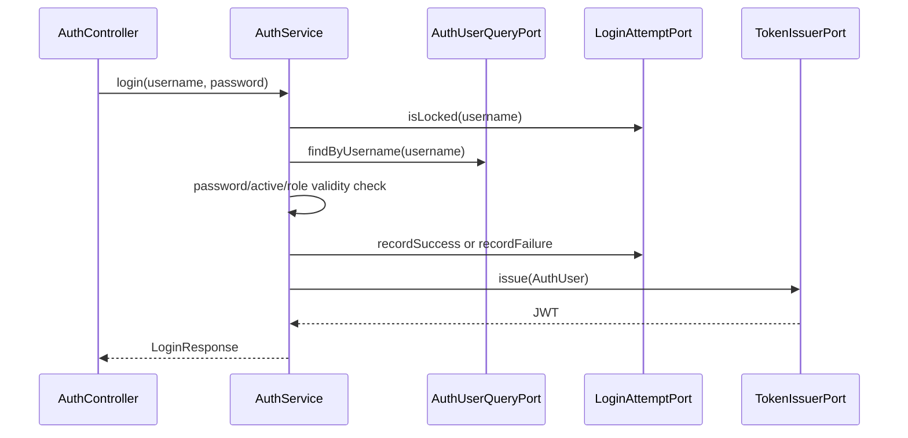
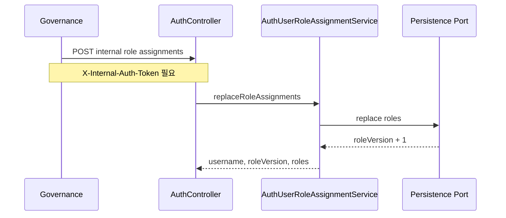

# auth process flow

## API 입구

| 메서드 | 경로 | 역할 |
| --- | --- | --- |
| `POST` | `/api/auth/login` | username/password로 로그인하고 JWT를 발급합니다. |
| `POST` | `/api/auth/validate-token-version` | JWT 안의 roleVersion이 현재 사용자 roleVersion과 같은지 확인합니다. |
| `POST` | `/api/auth/internal/users/{username}/role-assignments` | Governance 승인 결과로 사용자 역할 목록을 교체합니다. |

## 로그인 흐름

`LoginAttemptPort`는 저장 기술을 숨기는 출력 포트입니다. 기본 로컬 실행은 `InMemoryLoginAttemptAdapter`가 실패 횟수를 JVM 메모리에 보관합니다. 운영처럼 Auth 서버가 여러 대이면 `auth.login-security.store=jpa`로 바꿔 `JpaLoginAttemptAdapter`가 `AUTH_LOGIN_ATTEMPTS` 테이블에 실패 횟수와 `locked_until`을 저장하게 합니다.

## 역할 변경 반영 흐름

## Gateway와의 관계

Gateway는 JWT의 서명과 issuer를 검증하고 `X-Auth-User`, `X-Auth-Roles`, `X-Auth-Role-Version`, `X-Auth-Department` 헤더를 뒤쪽 서비스로 전달합니다. 역할 변경 직후 기존 JWT를 강하게 차단해야 하는 경로는 Gateway가 Auth의 token-version 검증 또는 캐시 정책과 연동합니다.
