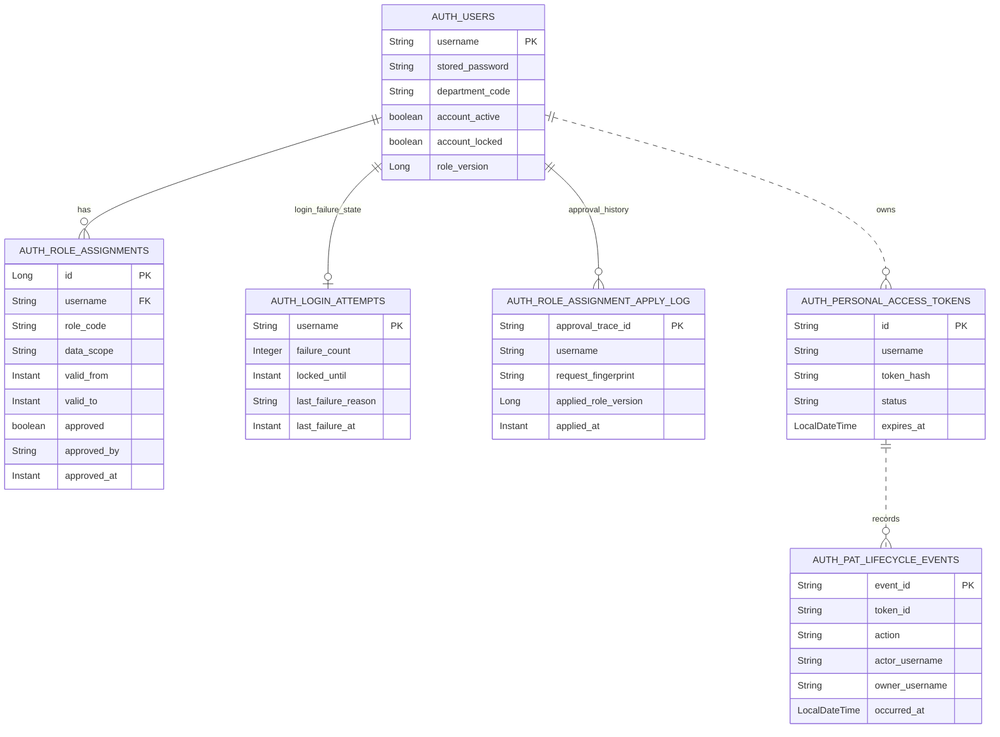

# auth schema

## 핵심 테이블

Flyway V70~V74 기준으로 Auth는 사용자, 역할, 로그인 실패, 승인 반영 이력과 Personal Access Token 및 PAT 수명주기 감사를 저장합니다.

점선은 username/token ID의 논리적 연결을 나타냅니다. V73·V74에는 해당 외래 키가 없어 감사 이력은 향후 PAT 행을 정리해도 유지됩니다.

## 마이그레이션 책임

| 버전 | 책임 |
| --- | --- |
| `V70` | `auth_users`, `auth_role_assignments`와 조회 인덱스 |
| `V71` | 여러 Auth 인스턴스가 공유하는 로그인 실패/잠금 상태 |
| `V72` | Governance 역할 승인 재시도를 막는 멱등 수신 이력 |
| `V73` | Personal Access Token 해시와 만료/폐기 상태 |
| `V74` | PAT 생성·폐기 감사 이벤트와 PAT 소유자 username 길이(80자) 정합화 |

## 주요 설정

| 설정 | 기본값 | 의미 |
| --- | --- | --- |
| `AUTH_PERSISTENCE_MODE` | `jpa` | JPA 또는 memory 사용자/역할 어댑터 |
| `AUTH_INTERNAL_API_TOKEN` | 없음(필수 실행 입력) | 내부 역할 반영 API 토큰. local도 실행 시 임시 값을 주입 |
| `AUTH_MASTER_DATA_BASE_URL` | `http://localhost:8082` | 부서 코드 검증용 master-data 주소 |
| `AUTH_LOGIN_MAX_FAILURES` | `5` | 잠금 전 연속 실패 횟수 |
| `AUTH_LOGIN_LOCK_DURATION_MINUTES` | `15` | 임시 잠금 시간 |
| `AUTH_LOGIN_SECURITY_STORE` | `memory` | 로그인 실패 저장소. 운영 다중 인스턴스는 `jpa` |
| `AUTH_JWT_SECRET` | 없음(필수 실행 입력) | JWT 서명키. local도 실행 시 임시 값을 주입하며 HS256 기준 32바이트 이상 필요 |
| `AUTH_JWT_ISSUER` | `auth-service` | JWT issuer |
| `AUTH_JWT_EXPIRATION_SECONDS` | `3600` | JWT 최대 수명. 2초 이상 필수. 포함된 역할의 가장 이른 `validTo`가 더 빠르면 그 시각으로 단축 |

## 상태와 정합성 정책

- 역할 교체는 기존 행을 새 승인 목록으로 바꾸고 `roleVersion`을 1 증가시킵니다.
- 같은 `approvalTraceId`와 fingerprint 재시도는 버전을 증가시키지 않습니다.
- 같은 trace의 내용이 달라지면 승인 오염으로 보고 거부합니다.
- `validFrom`은 포함, `validTo`는 제외하는 반개구간으로 역할 유효성을 판단합니다.
- token-version 검증은 버전뿐 아니라 계정 활성/관리 잠금/유효 역할도 확인합니다.
- PAT 소유자는 `AuthUser.username`과 대소문자까지 정확히 일치해야 합니다. 감사 이력은 행위자와 소유자를 별도로 저장하며 원문 토큰이나 해시를 기록하지 않습니다.
- `auth_login_attempts.username` 기본키가 사용자별 실패·성공 상태 전이의 잠금 대상입니다. 만료된 행은 읽기 중 삭제하지 않고 다음 실패에서 1회로 재시작하며, 성공은 현재 활성 잠금을 지우지 않습니다. 별도 스키마 변경은 필요하지 않습니다.
