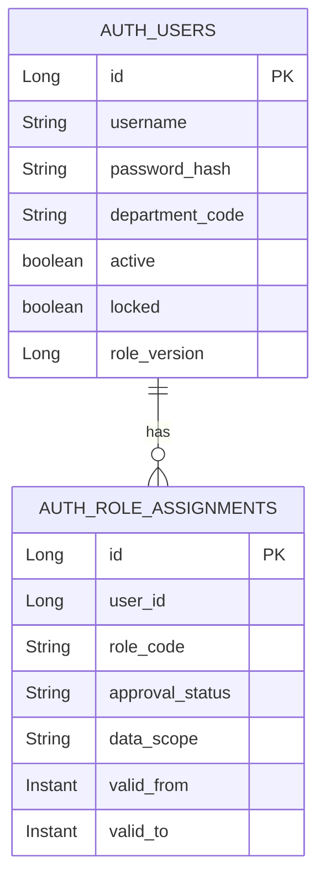

# auth schema

## 핵심 테이블

Flyway `V70__auth_user_role_schema.sql` 기준으로 Auth는 사용자와 역할 할당을 저장합니다.

## 주요 설정

| 설정 | 기본값 | 의미 |
| --- | --- | --- |
| `AUTH_PERSISTENCE_MODE` | `jpa` | JPA 또는 memory 어댑터 선택 |
| `AUTH_INTERNAL_API_TOKEN` | `local-internal-auth-token` | 내부 역할 반영 API 토큰 |
| `AUTH_MASTER_DATA_BASE_URL` | `http://localhost:8082` | 부서 코드 검증용 master-data 주소 |
| `AUTH_LOGIN_MAX_FAILURES` | `5` | 잠금 전 연속 실패 횟수 |
| `AUTH_LOGIN_LOCK_DURATION_MINUTES` | `15` | 임시 잠금 시간 |
| `AUTH_JWT_SECRET` | 로컬 기본값 | JWT 서명키. HS256 기준 32바이트 이상 필요 |
| `AUTH_JWT_ISSUER` | `auth-service` | JWT issuer |
| `AUTH_JWT_EXPIRATION_SECONDS` | `3600` | 토큰 만료 시간 |

## 상태와 정책

- 로그인 성공 시 실패 횟수를 초기화합니다.
- 연속 실패 횟수가 기준을 넘으면 일정 시간 잠급니다.
- 승인되지 않았거나 유효기간 밖의 역할은 JWT에 넣지 않습니다.
- 역할 교체 시 `roleVersion`을 증가시킵니다.
