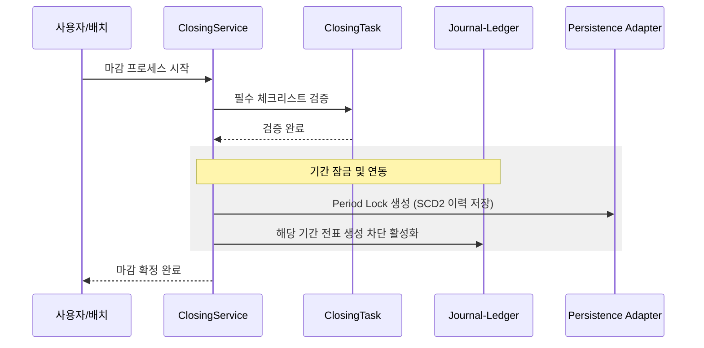
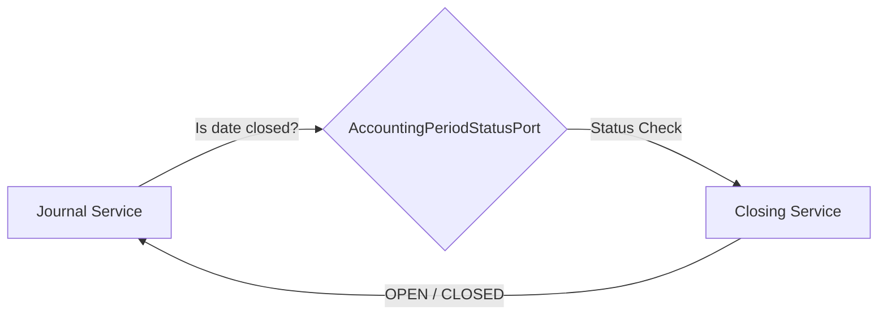
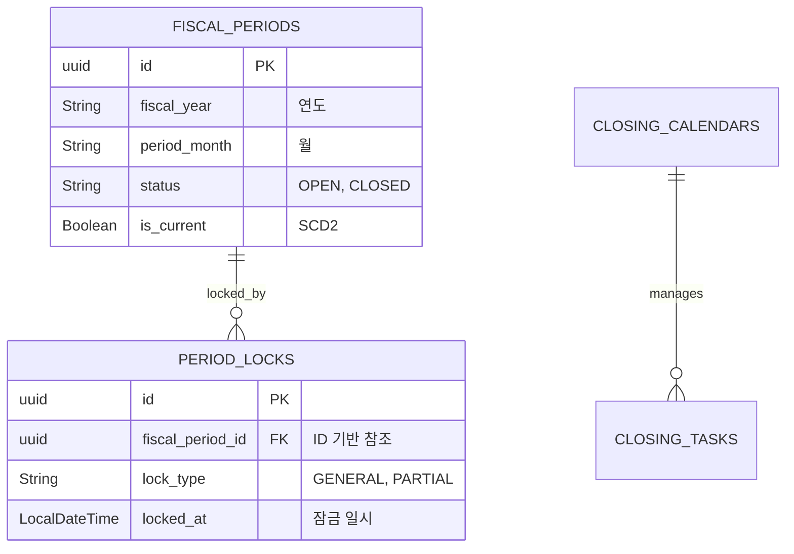

# 🔒 Closing Service (결산 마감 관리)

`closing` 모듈은 회계 기간의 종료를 통제하고, 장부를 봉인하여 과거 데이터의 임의 수정을 방지하는 시스템의 '안전 자물쇠' 역할을 합니다.

---

## 0. 📚 문서 읽기 순서

세부 문서는 `closing/docs`에 모았습니다.

1. [문서 인덱스](docs/README.md)
2. [입문 가이드](docs/beginner-guide.md)
3. [업무 흐름](docs/process-flow.md)
4. [데이터 모델](docs/schema.md)
5. [IntelliJ/Gradle 로컬 실행](docs/local-run.md)

IntelliJ에서는 `.run`의 `Closing API bootRun`, `Closing Batch Context` 실행 설정을 사용할 수 있습니다.

---

## 1. 🐣 초보자를 위한 개념 설명 (Beginner Guide)

**결산 마감은 '가계부 한 달 치를 확정하고 테이프로 봉인하는 것'과 같습니다.**
1. **결산(Closing):** 한 달 동안의 모든 거래를 모아 "이달의 이익은 얼마!"라고 최종 확정 짓는 작업입니다.
2. **태스크(Task):** 마감 전 반드시 체크해야 할 리스트입니다. (예: "통장 잔액 확인", "법인카드 정산")
3. **잠금(Lock):** 마감이 끝난 달에 누군가 몰래 과거 날짜로 전표를 넣지 못하도록 해당 기간을 잠그는 것입니다.
4. **재오픈(Reopen):** 정말 중요한 실수로 인해 잠긴 기간을 수정해야 할 때, 높은 책임자의 승인을 받아 임시로 자물쇠를 푸는 절차입니다.

---

## 2. 🔄 프로세스 흐름 (Process Flow)

### 📌 결산 캘린더 및 마감 파이프라인
마감 시작부터 태스크 검증, 최종 기간 잠금까지의 헥사고날 아키텍처 흐름입니다.



### 📌 타 모듈과의 연동 (Status Port)
전표 모듈은 전표를 끊기 전, 이 포트를 통해 해당 날짜가 마감되었는지 확인합니다.



---

## 3. 📊 데이터 모델 (Schema)

회계 기간의 상태와 잠금 이력을 완벽히 추적합니다.



---

## 4. 🧪 로컬 실행 및 설정 방법

먼저 테스트와 컴파일로 모듈 상태를 확인합니다.

```powershell
.\gradlew :closing:core:test :closing:api:compileJava :closing:batch:test --console=plain --max-workers=1 --no-daemon
```

API 컨텍스트 실행:

```powershell
.\gradlew :closing:api:bootRun --args="--server.port=8086 --spring.cloud.config.enabled=false --spring.cloud.discovery.enabled=false --spring.cloud.loadbalancer.enabled=false --eureka.client.enabled=false --spring.jpa.hibernate.ddl-auto=create-drop" --console=plain
```

Batch 컨텍스트만 실행:

```powershell
.\gradlew :closing:batch:bootRun --args="--spring.batch.job.enabled=false --spring.batch.jdbc.initialize-schema=always --spring.jpa.hibernate.ddl-auto=create-drop" --console=plain
```

ECL 충당 Job 예시:

```powershell
.\gradlew :closing:batch:bootRun --args="--spring.batch.job.enabled=true --spring.batch.job.name=eclProvisionJob closingDate=2026-04-30 provisionBatchId=20260430 --spring.batch.jdbc.initialize-schema=always" --console=plain
```

**설정 주의사항:**
- 자동 평가/충당 분개 계정은 `account.closing.accounting.*` 설정을 통해 동적으로 할당됩니다.
- ECL 충당 배치는 `allowance_summary`에 확정된 IFRS 9 산출 결과가 있을 때만 목표 충당금을 읽어 보충/환입 전표를 생성합니다. 더 이상 `대출채권 잔액 * 1%` 고정률로 목표 충당금을 계산하지 않습니다.
- FX/ECL 배치 전표번호는 기준일, 배치 ID, 계정 식별자를 조합해 20자 이내로 결정적으로 생성됩니다. 배치 ID 파라미터가 없으면 기준일(`yyyyMMdd`)을 기본값으로 사용해 같은 기준일 재실행이 중복 전표번호로 감지될 수 있게 합니다.
- FX/ECL 결산 조정 전표는 기본적으로 `DRAFT`로 남아 검토와 승인을 기다립니다. 통제된 환경에서만 `account.closing.accounting.auto-post-adjustments=true`로 자동 승인/전기를 허용합니다.
- 전표 모듈 연동을 위해 `AccountingPeriodStatusPort` 구현체가 정상적으로 노출되어야 합니다.
- Docker 실행이 필요하면 `closing/docker-compose.yml`을 사용할 수 있지만, 신규 개발자는 먼저 위 Gradle 명령으로 컨텍스트와 테스트를 확인하는 편이 문제 범위를 좁히기 쉽습니다.
