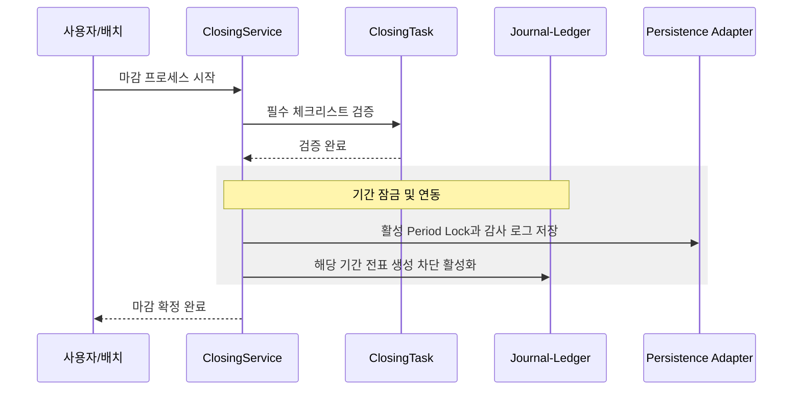
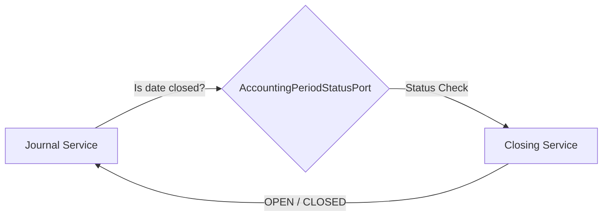
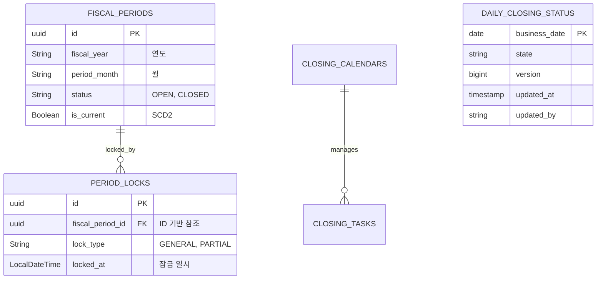

# 🔒 Closing Service (결산 마감 관리)

`closing` 모듈은 회계 기간의 종료를 통제하고, 장부를 봉인하여 과거 데이터의 임의 수정을 방지하는 시스템의 '안전 자물쇠' 역할을 합니다. 상태 변경과 결산 전표 생성은 입력이나 기준정보가 빠지면 추정하지 않고 실패시키는 것을 원칙으로 합니다.

일반 전표의 Closing 측 허용 판정은 Master 회계기간 `OPEN`, Closing 캘린더 `OPEN`, 활성 잠금 없음이
모두 확인될 때만 허용합니다. `GET /api/closing/admission?accountingDate=2026-01-15`로 같은 판정을
조회할 수 있습니다. 이는 조회 시점의 결과이며 전기 커밋을 예약하는 권한은 아닙니다.
현재 독립 배포 Journal은 이 조회를 아직 소비하지 않습니다. Journal 소비자 연결, 승인된 조정 전표 경로와
GL07/#762 커밋 동시성 통합 전에는 #772 전체 해결로 간주할 수 없습니다.
정책과 검증 범위는 [업무 흐름](docs/process-flow.md#일반-전표-허용-판정-gh-772)을 참고하세요.

월말 승인·반려와 체크리스트 변경은 캘린더 단위로 직렬화합니다. 원격 마감·재오픈 반영이
불명확하면 영속 전이 기록을 유지하고 자동 재전송하지 않습니다.
[월말 동시 결정과 복구](docs/process-flow.md#월말-동시-결정과-복구-gh-774)를 참고하세요.

연차 손익 대체 API는 연도만 받고, 이익잉여금 목적지는 배포 검토를 거친
`account.closing.annual`의 단일 법인·정확한 연도 규칙으로 결정합니다. 규칙은 계정 코드,
`postable: true` 승인 표시, 승인자, 변경 참조를 모두 갖추어야 하며, 12월 31일 기준
Master Data가 같은 계정을 `EQUITY`/`CREDIT`로 반환해야 Journal 조회로 넘어갑니다.
Master Data에 실제 postability 필드가 없으므로 `postable`은 검증된 Master 속성이 아니라
통제 평면의 승인 확인입니다. Journal 계약에도 법인 차원이 없어 하나의 런타임은 여러
법인을 서비스하면 안 됩니다.

해당 연도의 `POSTED` 원천 헤더·상세와 설정 통제 identity는 #775 source snapshot에
함께 들어갑니다. 현재 원천·설정과 헤더·라인 전체가 같은 `DRAFT`만 재사용하고,
재오픈 뒤 추가 전기가 있으면 검증된 `POSTED` 결산을 뺀 잔여분만 별도 초안으로 만듭니다.
설정을 개정하면 기존 pending 초안은 stale 충돌이 되며 자동 교체하지 않습니다. 상세 규칙과
운영 한계는 [연차 손익 대체](docs/process-flow.md#연차-손익-대체-gh-775-gh-776)를 참고하세요.

최종 마감은 체크리스트 외에 불변 typed evidence를 요구합니다. 월 마감에는 AP·AR·리스·대출
보조부, Journal 조정, ECL 대사 여섯 통제가 필요하고 연 마감에는 연차 손익 대체 통제가 추가됩니다.
누락·실패·만료·기간 불일치는 Master 상태 변경 전에 거부합니다.
준비 후 전송 전에 증빙이 만료되면 같은 바인딩을 재검증해 차단하고, 권한 있는 운영자가
미전송 의도를 사유와 함께 감사 기록에 취소한 뒤 새 증빙으로 재준비합니다.
[최종 마감 증빙](docs/process-flow.md#최종-마감-증빙-gh-778)을 참고하세요.

---

## 0. 📚 문서 읽기 순서

세부 문서는 `closing/docs`에 모았습니다.

1. [문서 인덱스](docs/README.md)
2. [입문 가이드](docs/beginner-guide.md)
3. [업무 흐름](docs/process-flow.md)
4. [데이터 모델](docs/schema.md)
5. [IntelliJ/Gradle 로컬 실행](docs/local-run.md)

IntelliJ에서는 `.run`의 `Closing API bootRun`, `Closing Batch Context` 실행 설정을 사용할 수 있습니다.

---

## 1. 🐣 초보자를 위한 개념 설명 (Beginner Guide)

**결산 마감은 '가계부 한 달 치를 확정하고 테이프로 봉인하는 것'과 같습니다.**
1. **결산(Closing):** 한 달 동안의 모든 거래를 모아 "이달의 이익은 얼마!"라고 최종 확정 짓는 작업입니다.
2. **태스크(Task):** 마감 전 반드시 체크해야 할 리스트입니다. (예: "통장 잔액 확인", "법인카드 정산")
3. **잠금(Lock):** 마감이 끝난 달에 누군가 몰래 과거 날짜로 전표를 넣지 못하도록 해당 기간을 잠그는 것입니다.
4. **재오픈(Reopen):** 정말 중요한 실수로 인해 잠긴 기간을 수정해야 할 때, 높은 책임자의 승인을 받아 임시로 자물쇠를 푸는 절차입니다.
5. **EOD/BOD:** 영업일 한 건을 `OPEN → PRE_CLOSING → CLOSING_IN_PROGRESS → CLOSED`로 닫고, 닫힌 행을 보존한 채 다음 영업일을 `BOD_IN_PROGRESS → OPEN`으로 여는 일마감 흐름입니다.

---

## 2. 🔄 프로세스 흐름 (Process Flow)

### 🧭 Core/Batch 책임 경계

FX 평가와 ECL 충당의 금액 산출, 차대변 판단, 전표 라인 구성은 `closing:core`의 application service가 담당합니다. `closing:batch`는 Spring Batch Job/Step, Reader/Writer/Tasklet, 외부 Repository/JournalUseCase 어댑터만 담당합니다.

API 평가/충당 실행도 고정 금액을 받지 않습니다. API는 `FX_RATE`, 충당은 `ECL`만 지원하며,
API와 Batch 모두 실제 `POSTED` 전표를 집계하는 공통 SQL과 같은 core 금융 정책을 사용합니다.
누락 환율이나 확정 ECL summary는 첫 Journal 쓰기 전에 실패합니다.

초보자 설명: Batch는 "공장 컨베이어 벨트"이고 core는 "회계 규칙을 판단하는 업무 담당자"입니다. 컨베이어가 어떤 순서로 데이터를 흘릴지는 batch가 정하지만, 어떤 금액을 차변/대변에 놓을지는 core가 결정해야 테스트와 API/Batch 흐름이 같은 규칙을 공유할 수 있습니다.

### 📌 결산 캘린더 및 마감 파이프라인
마감 시작부터 태스크 검증, 최종 기간 잠금까지의 헥사고날 아키텍처 흐름입니다.



### 📌 EOD/BOD 날짜 이력

`DailyClosingStatus`는 영업일별 한 행을 보존합니다. 어제의 `CLOSED` 행을 다시 `OPEN`으로 되돌리지 않으며, BOD 시작 명령이 잠긴 전일 행을 확인하고 운영자가 명시한 다음 영업일 행을 원자적으로 생성합니다. 주말·휴일을 코드가 임의로 `plusDays(1)` 처리하지 않습니다.

상태 변경 API는 임의의 목표 상태를 받지 않고 `prepare`, `start`, `complete`, `cancel-preparation`, `start/complete BOD` 명령으로만 노출됩니다. Gateway가 JWT를 검증해 만든 `X-Auth-User`와 `X-Auth-Roles`를 사용하므로 Closing API 포트를 외부에 직접 공개하지 않습니다.

### 📌 타 모듈과의 연동 (Status Port)
전표 모듈은 전표를 끊기 전, 이 포트를 통해 해당 날짜가 마감되었는지 확인합니다.



---

## 3. 📊 데이터 모델 (Schema)

회계 기간의 상태와 잠금 이력을 완벽히 추적합니다.



---

## 4. 🧪 로컬 실행 및 설정 방법

먼저 테스트와 컴파일로 모듈 상태를 확인합니다.

```powershell
.\gradlew :closing:core:test :closing:api:test :closing:batch:test --console=plain --max-workers=1 --no-daemon
```

API 컨텍스트 실행:

```powershell
.\gradlew :closing:api:bootRun --console=plain
```

Batch 컨텍스트만 실행:

```powershell
.\gradlew :closing:batch:bootRun --args="--spring.main.web-application-type=none" --console=plain
```

`bootRun`과 profile을 생략한 실행 JAR은 `local`을 기본값으로 사용합니다. API와 Batch는 서로
분리된 in-memory H2를 사용하고, 외부 control plane과 Batch Job 자동 실행을 끕니다.

ECL 충당 Job 예시:

```powershell
.\gradlew :closing:batch:bootRun --args="--spring.batch.job.enabled=true --spring.batch.job.name=eclProvisionJob closingDate=2026-04-30 provisionBatchId=20260430 --spring.batch.jdbc.initialize-schema=always" --console=plain
```

**설정 주의사항:**
- 자동 평가/충당 분개 계정은 `account.closing.accounting.*` 설정을 통해 동적으로 할당됩니다.
- ECL 충당 배치는 `allowance_summary`에 확정된 IFRS 9 산출 결과가 있을 때만 목표 충당금을 읽어 보충/환입 전표를 생성합니다. 더 이상 `대출채권 잔액 * 1%` 고정률로 목표 충당금을 계산하지 않습니다.
- FX/ECL 배치 전표번호는 기준일, 양수 배치 ID, 계정·통화 식별자를 조합해 20자 이내로 결정적으로 생성됩니다. 날짜와 배치 ID는 모두 필수이며 시스템 날짜나 임의 ID로 대체하지 않습니다.
- FX 평가는 실제 전기 원장인 `journal_entries`/`journal_details`의 `POSTED` 전표를 고정 개수 계정 범위로 스트리밍합니다. 별도 이중통화 잔액 read model이 구축되기 전까지는 이 집계를 원장 기준으로 대사해야 합니다.
- FX 평가 전 `account.closing.accounting.fx-valuation-policies`에 계정별 유효기간과 화폐성/역사적 원가 정책을 명시해야 합니다. 수익·비용·역사적 원가 비화폐성 자산은 제외하고, 정책 누락·중복·계정 분류 불일치는 실패시킵니다. [평가 적격성](docs/process-flow.md#평가-대상-계정의-유효일자-정책-gh-780)과 [설정 예시](docs/local-run.md#fx-평가-적격성-설정-gh-780)를 참고하세요.
- FX 장부금액은 이전에 전기한 평가 조정과 역분개를 원천통화별로 포함합니다. 평가액은 외화 원금을 바꾸지 않으며, 전월 평가가 전기되고 환율이 같으면 다음 평가 차액은 0입니다. [귀속과 대사 기준](docs/process-flow.md#이전-평가를-포함한-장부금액-gh-779)을 참고하세요.
- ECL은 하나의 확정 run/model, 하나의 법인, 동일 기준일의 summary만 허용하며 계정·통화별 목표와 실제 전기된 거래통화·기능통화 잔액을 각각 대사합니다. 외화는 기준일 환율이 필요하며, 기존 장부액이 그 환율과 다르면 FX 평가 전기를 먼저 요구합니다. summary가 비어 있으면 성공으로 처리하지 않습니다. [통화별 계산과 재시도](docs/process-flow.md#ecl-거래통화와-기능통화-대사-gh-781)를 참고하세요.
- FX/ECL 결산 조정 전표는 기본적으로 `DRAFT`로 남아 검토와 승인을 기다립니다. `dev`의 원격 Journal HTTP 어댑터는 maker 승인 요청·별도 checker 승인·poster 전기를 안전하게 수행할 서비스 주체 계약이 없어 `account.closing.accounting.auto-post-adjustments=true`이면 첫 Journal 쓰기 전에 실패합니다. 원격 자동 전기는 이 계약을 구현·검증하기 전까지 사용할 수 없습니다.
- API는 FX evidence를 한 번 스트리밍해 기본 10,000행, 생성 전표 command 1,000개의 hard cap 안에서 전체 command를 먼저 불변 목록으로 확정한 뒤 그 목록만 게시합니다. ECL source 조회도 최대 1,001개 전표 그룹과 60초 query timeout으로 경계를 두고, 1,000개를 넘으면 그룹별 원장/환율 조회와 Journal 게시 전에 실패합니다.
- API 실행 이력은 전표가 0건이거나 자동 전기이면 `COMPLETED`, DRAFT가 하나 이상이면 `PENDING_APPROVAL`, 예외이면 `FAILED`입니다. 전표가 여러 건이면 단일 `generated_journal_entry_id`에는 `null`을 기록합니다.
- FX Batch는 쓰기 없는 전체 source validation step을 먼저 실행한 뒤 기존 partition/cursor/chunk 전기를 수행합니다. 재시작 때 validation도 다시 실행합니다. 두 단계 사이의 분산 snapshot을 제공하지 않으므로 원장·환율·정책을 운영 절차로 동결해야 합니다.
- `dev` profile은 `closing.sources.enabled=false` 또는 미설정일 때 외부 source/Journaling을 fail-closed합니다.
- 연차 API 본문에는 `year`만 넣습니다. 이익잉여금 계정과 법인을 요청으로 선택할 수 없으며, `account.closing.annual`에 연도별 승인 규칙이 없거나 `postable`/`approvedBy`/`changeReference` 증빙이 부족하면 실패합니다. 설정은 버전 관리·동료 검토된 배포 입력으로 관리하고, 변경 시 연차 호출을 drain한 뒤 모든 instance를 재시작합니다.
- 이익잉여금 계정은 매호출 12월 31일 Master Data에서 정확한 코드·`EQUITY`·`CREDIT`를 검증합니다. 자산·부채·수익·비용·알 수 없는 분류, 차변 정상잔액은 Journal 조회·생성 전에 거부합니다. 순이익·순손실·순액 0 모두 이 검증을 우회하지 않습니다.
- 실제 연차 JDBC 조회는 Journal 상세에 분류 컬럼이 없어 계정 코드와 상세 회계일자로 Master Data를 조회합니다. 같은 키의 반복 조회는 캐시합니다. 조회 누락·계정 불일치·빈 값·미지원 분류는 실패하며, 수익·비용만 금액 대체 대상이지만 다른 지원 분류도 source snapshot 식별에 포함됩니다.
- 연차 읽기는 `dev`/`local` 이외의 내장 모놀리스에서 쓰기와 같은 primary PostgreSQL Journal DB를 사용합니다. `dev`에서만 `closing.sources.enabled=true`로 별도 읽기 전용 Journal 연결을 사용합니다. 같은 MVCC snapshot을 두 번 cursor 순회하고 공급자 합계를 대사합니다. JDBC 상세에는 분류 컬럼이 없어 계정·회계일별 Master 조회를 캐시합니다. 원천 전체 목록과 전표별 HTTP 상세 조회를 사용하지 않습니다. 별도 Master 분류 조회와 Journal 초안 쓰기는 분산 원자적 트랜잭션이 아니며, `HttpClosingJournalAdapter`의 maker 헤더 전달만으로 신뢰된 서비스 주체가 성립하지 않습니다. 독립 Journal 원격 초안 생성은 별도 승인된 인증 통합이 필요합니다. [실행계획과 한계](docs/annual-close-postgresql-evidence.md)를 확인하세요.
- 전표 모듈 연동을 위해 `AccountingPeriodStatusPort` 구현체가 정상적으로 노출되어야 합니다.
- 현재 `AccountingPeriodStatusPort`는 월 회계기간 잠금만 확인합니다. `EodState.isTransactionAllowed()`를 Journal 신규 전표 게이트에 연결하는 작업은 별도 변경이며, 연결 전에는 일마감 상태만으로 전표가 자동 차단된다고 간주하면 안 됩니다.
- Closing 전용 Flyway 위치는 `classpath:db/closing-migration`, 독립 이력 테이블은 `flyway_schema_history_closing`입니다. clean DB는 V49의 10개 Closing 소유 테이블 baseline을 적용하고, V50으로 EOD/BOD 상태를 승격한 뒤 V51로 운영 조회 인덱스를 수렴시키고 V52로 월말 전이 기록을 추가합니다. 기존 legacy DB는 runner가 전체 컬럼 타입·길이·nullability·identity·PK/FK/기간 unique를 확인한 경우에만 49 baseline을 기록하고 V50/V51/V52를 forward 적용합니다. V52는 미완료 월말 전이 기록을 추가하며 새 버전 기동 전에 적용해야 합니다.
- 이 금융 실행 경로 변경에는 새 스키마나 migration이 없습니다.
- Docker 실행이 필요하면 `closing/docker-compose.yml`을 사용할 수 있지만, 신규 개발자는 먼저 위 Gradle 명령으로 컨텍스트와 테스트를 확인하는 편이 문제 범위를 좁히기 쉽습니다.
