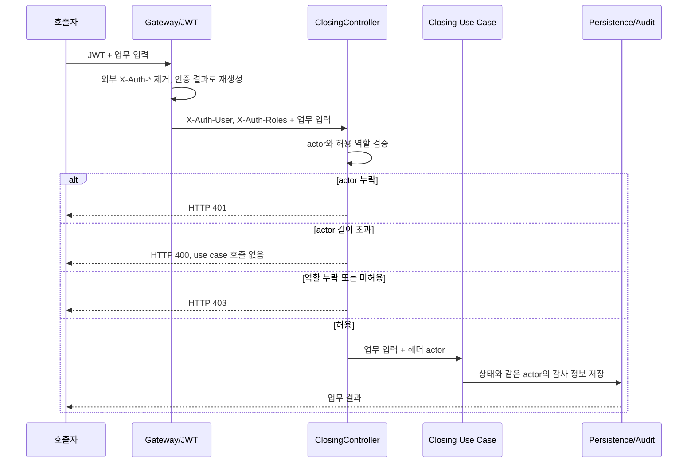
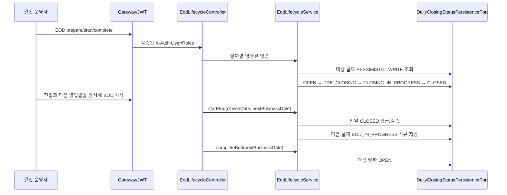
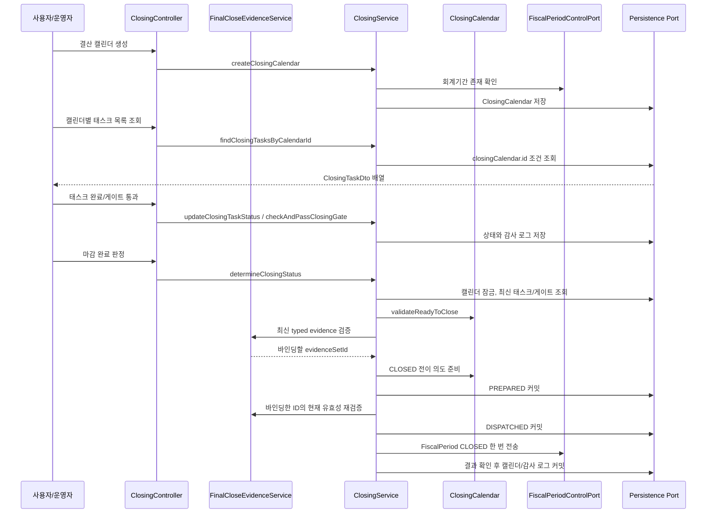
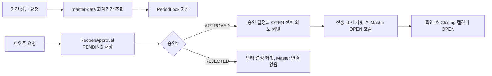
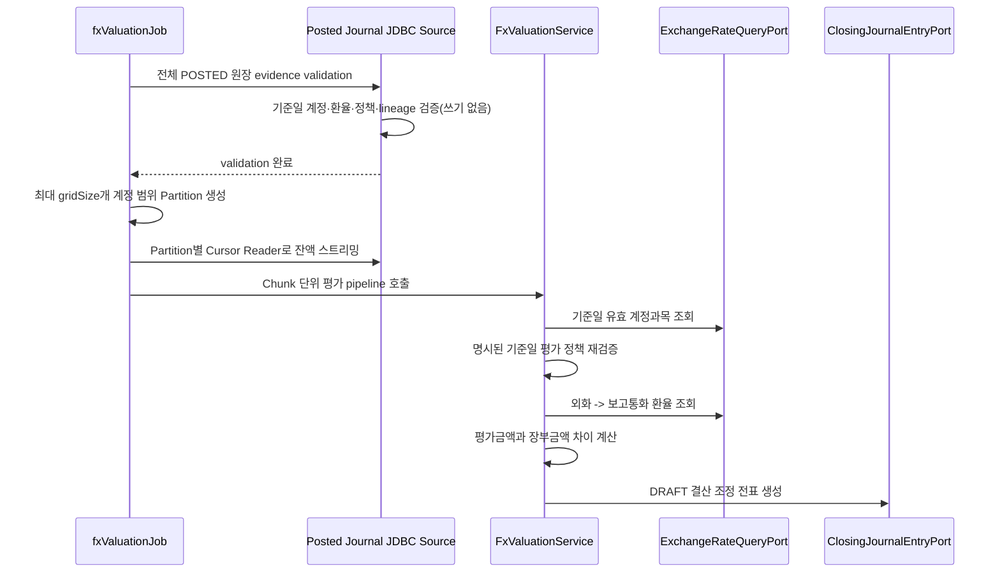
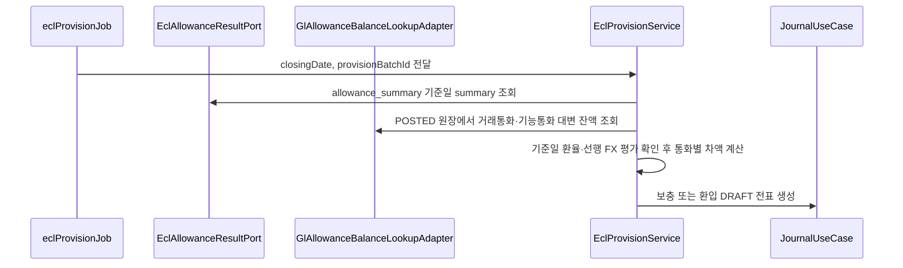
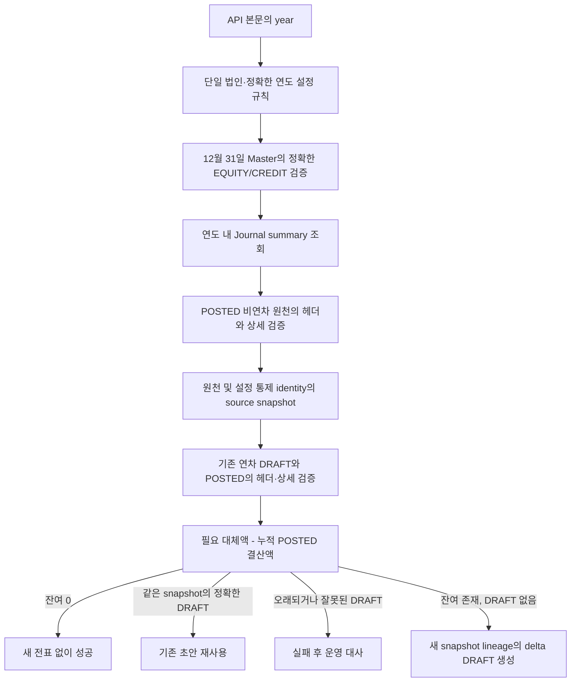

# Closing 업무 흐름

이 문서는 `closing` 모듈이 DDD/헥사고날 구조에서 어떤 흐름으로 동작하는지 설명합니다.

## 헥사고날 경계

| 계층 | 책임 | 예시 |
| --- | --- | --- |
| Inbound Adapter | 외부 요청을 유즈케이스 호출로 변환 | `ClosingController`, `EodLifecycleController` |
| Application Service | 트랜잭션 경계, 도메인 협업, 외부 포트 호출 | `ClosingService`, `EodLifecycleService`, `AnnualClosingService`, `FxValuationService`, `EclProvisionService` |
| Domain | 상태 변경 규칙과 검증 | `DailyClosingStatus`, `ClosingCalendar.validateReadyToClose`, `ClosingCalendar.close` |
| Outbound Port | 기술 독립 외부 인터페이스 | `DailyClosingStatusPersistencePort`, `ClosingCalendarPersistencePort`, `EclAllowanceResultPort`, `FxExchangeRateLookupPort`, `AllowanceBalanceLookupPort`, `ClosingJournalEntryPort` |
| Infrastructure Adapter | JPA/JDBC/외부 시스템 실제 구현 | `JpaDailyClosingStatusPersistenceAdapter`, `ClosingCalendarRepository`, `JdbcEclAllowanceResultAdapter` |

## 일반 변경 명령의 권한 경계 (GH-771)

일반 Closing 변경 명령은 클라이언트가 주장하는 이름과 인증된 주체를 분리합니다.



대상은 캘린더·태스크·게이트 생성과 상태 변경, 기간 잠금·해제, 재오픈 요청·결정,
HTTP 평가·충당 실행, 결산 조정 등록, 마감 완료 판정, 연차 손익 대체를 포함한 모든 일반
Closing mutation입니다. `X-Auth-User`가 비어 있으면 HTTP 401이고, `X-Auth-Roles`에
`ROLE_ADMIN`, `ROLE_ACCOUNTING_ADMIN`, `ROLE_CLOSING_MANAGER` 중 하나가 없으면 HTTP 403입니다.
영속 actor 컬럼과의 호환성을 위해 일반 Closing 명령과 월말 transition 조회·복구의 actor는
trim 후 최대 50자입니다. 기존 EOD/BOD 경계는 80자를 유지합니다. 각 한도를 넘으면 use case를
호출하기 전에 HTTP 400이며, 비어 있는 actor의 401과 허용 역할 부족의 403 계약은 그대로입니다.

JSON이나 query의 `user`, `requestedBy`, `approvedBy`, `runBy` 등 actor처럼 보이는 필드는
인증·권한·감사 주체가 아닙니다. 이런 입력은 공개 요청 계약에서 제거되거나 주체 판정에서
무시되며, application service에 전달되고 감사 기록에 저장되는 actor는 Gateway가 재생성한
`X-Auth-User`입니다. 재오픈 요청 시 이 헤더 주체가 요청자가 되고, 나중의 승인·반려 시점
헤더 주체가 결정자가 됩니다. 두 주체가 같으면 도메인 규칙에 따라 거부합니다.

기존 EOD/BOD 명령의 actor/role 검사와 상태 규칙은 그대로입니다. 이 변경은 일반 GET 조회나
`GET /api/closing/admission`의 접근 범위를 넓히지 않습니다. 또한
`POST /valuation-batches/run`, `POST /provision-batches/run`의 HTTP 권한 경계는 Spring Batch
스케줄러, JobLauncher 또는 운영 Job 기동 권한과 별개입니다.

API는 외부가 넣은 `X-Auth-*`를 제거하고 JWT에서 다시 만드는 Gateway 뒤의 사설 서비스로
배포해야 합니다. Closing 내부 검사는 그 배포·네트워크 경계를 전제로 하며, 이 변경만으로
Gateway 재작성 정책이나 API 포트의 외부 차단이 입증되지는 않습니다. 따라서 직접 API 포트에
조작한 헤더를 보내 성공시키는 테스트는 컨트롤러 기능 검증일 뿐 보안 검증이 아닙니다.

## 일마감 EOD/BOD 흐름



`CLOSED`는 같은 날짜에서 `BOD_IN_PROGRESS`로 전이하지 않습니다. 이 규칙은 전일 마감 이력을 보존하고, 주말·휴일을 포함한 다음 영업일 선택을 운영 캘린더가 명시하도록 합니다. 같은 목표 상태의 재시도는 멱등 처리하지만 중간 상태를 건너뛰는 명령은 실패합니다.

현재 Journal의 `AccountingPeriodStatusPort`는 Master Data 월 회계기간을 기준으로 전표를 차단합니다. EOD 상태의 거래 허용 값을 Journal 생성 경로에 연결하는 것은 별도 통합 범위이며, 그 전까지 이 상태 머신 자체가 시스템 전체 거래를 차단하지는 않습니다.

## 월말 결산 기본 흐름



마감 완료 판정은 단순히 상태값만 바꾸지 않습니다. 필수 태스크와 게이트를 조회한 뒤 도메인 메서드가 마감 가능 여부를 검증합니다. 이 구조 덕분에 API, Batch, 테스트가 같은 도메인 규칙을 공유할 수 있습니다.

화면은 `GET /api/closing/calendars/{calendarId}/tasks`로 한 캘린더의 태스크를 조회합니다. 예를 들어 `GET /api/closing/calendars/10/tasks`는 해당 캘린더에 속한 태스크를 `ClosingTaskDto` 배열로 반환하고, 태스크가 없으면 빈 배열을 반환합니다. `calendarId`는 양수여야 하며 이 조회는 상태를 변경하거나 감사 로그를 만들지 않습니다.

캘린더는 `OPEN -> IN_PROGRESS -> CLOSED -> OPEN(승인된 재오픈)` 순서만 허용합니다. 필수 태스크와 게이트가 최소 한 개씩 있어야 하며, JSON 조건 문자열이 설정된 태스크/게이트는 아직 typed evidence evaluator가 없으므로 fail-closed 처리합니다.

## 최종 마감 증빙 (GH-778)

최종 마감용 typed evidence는 태스크/게이트의 자유 형식 JSON 조건과 별도인 필수 통제입니다.
신뢰된 내부 공급자는 `POST /api/closing/calendars/{calendarId}/final-close-evidence`로 스냅샷을
추가하고, Closing은 캘린더별 `observedAt DESC, append id DESC`의 최신 한 건만 판단합니다.
따라서 더 오래된 PASS 뒤에 최신 FAIL을 제출하면 FAIL이 마감을 차단하며, 과거 PASS로 되돌리는
선택이나 수동 override는 없습니다. 수정은 새 `evidenceSetId`의 더 최신 스냅샷으로 제출합니다.

월/분기/반기에는 아래 여섯 통제가 각각 정확히 한 번 있어야 합니다. `fiscalPeriod=YEAR`이면
`ANNUAL_TRANSFER/closing`도 정확히 한 번 추가합니다. 다른 통제, 중복 통제, 예상 원천 시스템이
아닌 통제는 거부합니다.

| 통제 타입 | `sourceSystem` |
| --- | --- |
| `AP_SUBLEDGER` | `payable` |
| `AR_SUBLEDGER` | `receivable` |
| `LEASE_SUBLEDGER` | `asset-lease` |
| `LOAN_SUBLEDGER` | `loan` |
| `JOURNAL_ADJUSTMENTS` | `journal-ledger` |
| `ECL_RECONCILIATION` | `ecl` |
| `ANNUAL_TRANSFER` | `closing` (`YEAR`만 필수) |

각 통제는 불변 `sourceRunId`, `outcome=PASS`, `blockingItemCount=0`과 하나 이상의
계정·통화별 `sourceTotal`/`postedTotal`을 포함합니다. 금액은 `BigDecimal` 숫자 비교로 같아야 하고,
같은 통제 안의 계정·대문자 통화 차원은 중복될 수 없습니다. 활동이 없어도 합계 목록을 비우지 않고
공급자 계약에서 합의한 차원을 `0/0`으로 명시합니다. Closing은 누락 차원을 0으로 추정하지 않습니다.

제출 시 캘린더를 잠그고 미완료 전이가 없는 `IN_PROGRESS`인지, path/body의 `calendarId`와
캘린더의 `fiscalYear`/`fiscalPeriod`가 같은지, canonical digest가 같은지 확인하고 미래 `observedAt`은
저장 전에 거부합니다. 미래 값은 최신 선택 순서를 장기간 점유해 올바른 재제출을 막을 수 있기 때문입니다.
최종 마감 시에는
Master의 `fiscalPeriodId`·회계연도·기간과 증빙이 정확히 같고 `ledgerCutoff`이 Master 기간 종료일과
같은지 다시 확인합니다. `observedAt`은 현재 마감의 `closeInitiatedAt`보다 엄격히 뒤이고 미래가
아니며 `account.closing.final-close-evidence.max-age`(기본 `PT24H`) 이내여야 합니다.

`contentDigest`는 아래 문자열을 순서대로 canonicalize한 SHA-256 소문자 hex입니다. 각 문자열마다
4-byte big-endian UTF-8 byte 길이와 UTF-8 bytes를 digest에 넣습니다. trim 대상 문자열은 도메인이
trim한 값, 통화는 대문자, 날짜/시각은 `LocalDate.toString()`/`Instant.toString()`, 정수는 10진 문자열,
금액은 trailing zero를 제거한 plain 문자열(모든 0은 `0`)입니다.

PostgreSQL `TIMESTAMP WITH TIME ZONE` 저장 정밀도에 맞춰 `observedAt`은 digest 계산 전에 나노초를
**반올림하지 않고 마이크로초로 절삭**합니다. 공급자는 이 정규화한 ISO Instant를 요청 body와 digest
입력에 동일하게 사용해야 합니다. 예를 들어 `...00.123456789Z`는 `...00.123456Z`가 되며, 응답과
영속화된 값도 정규화된 시각입니다.

1. `FINAL_CLOSE_EVIDENCE_V1`, `evidenceSetId`, `calendarId`, `fiscalPeriodId`, `fiscalYear`,
   `fiscalPeriod`, `ledgerCutoff`, `observedAt`, Gateway가 정한 `submittedBy`, 통제 개수
2. 통제를 enum 선언 순서 → `sourceSystem` → `sourceRunId`로 정렬한 뒤, 각 통제의 `type`,
   `sourceSystem`, `sourceRunId`, `outcome`, `blockingItemCount`, 합계 개수
3. 각 통제의 합계를 `accountCode` → 대문자 `currencyCode`로 정렬한 뒤, `accountCode`,
   `currencyCode`, `sourceTotal`, `postedTotal`

본문의 `contentDigest` 자체는 digest 입력에 넣지 않습니다.
같은 `evidenceSetId`/digest 재제출은 기존 행을 돌려주지만, 같은 ID의 다른 내용은 거부합니다.
`submittedBy`는 본문에 없고 `X-Auth-User`만 사용하므로 공급자는 최종 Gateway actor까지 포함해
digest를 계산해야 합니다.

최종 마감 준비 트랜잭션은 체크리스트와 Master OPEN identity를 확인한 다음 최신 증빙을 검증하고,
선택한 `evidenceSetId`를 `transition_evidence_set_id`에 기록한 뒤에만 `PREPARED`를 커밋합니다.
누락·FAIL·blocking item·빈/불일치 합계·오래됨·미래 시각·기간/cutoff/digest 불일치는 이 단계에서
실패하므로 Master 상태 변경 호출 전에 차단됩니다. 최초 전송 또는 `PREPARED` 복구의
`PREPARED → DISPATCHED` 직전에는 캘린더 잠금 아래 **원래 바인딩한 ID**를 다시 조회하고
Master 기간·마감 cycle·digest·필수 통제·현재 시각의 freshness를 재검증합니다. 만료되었거나
행이 없거나 내용이 맞지 않으면 `DISPATCHED`로 전이하지 않으며 Master 쓰기 횟수는 0입니다.
현재 최신 스냅샷으로 조용히 갈아끼우지 않습니다. `DISPATCHED`는 원격 결과가 불확실하므로
재전송하거나 취소하지 않고 기존 operation ID와 증빙 ID로 Master 결과만 대사합니다.

만료된 `PREPARED`를 다시 준비하려면 권한 있는 운영자가 Master가 아직 `OPEN`이고 원격 전송이
한 번도 표시되지 않았음을 확인한 뒤, 정확한 operation ID와 사유를 넣어
`POST /api/closing/calendars/{calendarId}/transition/cancel-prepared`를 호출합니다. 서버는 캘린더를
잠그고 `CLOSED` 목표·`PREPARED` 단계와 Master 기간을 재확인한 후 이전 operation·증빙 ID·사유·
실행자를 감사 로그에 남기고 **전이 의도만** 해제합니다. 기존 증빙과 PREPARED 감사 기록은 보존합니다.
그 다음 신뢰된 공급자가 새 ID의 최신 증빙을 append하고 운영자가 일반 마감 명령을 다시 실행합니다.
이는 수동 통과나 증빙 교체가 아닙니다. `DISPATCHED`에는 취소를 허용하지 않습니다.
증빙 없는 legacy CLOSED 전이는 V53 이행을 위해
DB에는 남을 수 있지만 런타임 dispatch/finish는 fail-closed합니다.

V53 전환 전의 `IN_PROGRESS` 캘린더는 이전 서버의 시간대 없는 `closeInitiatedAt`이 남을 수
있습니다. 배포 전 원래 애플리케이션 시간대와 금융 통제를 목록화하고 안전하게 drain해야 합니다.
체크리스트 플래그만으로 이전 버전에서 마감을 완료해서는 안 됩니다. 남은 행은 UTC로 임의
변환하지 않고 운영 대사와 검토된 forward correction까지 마감을 HOLD합니다.

이 API는 사설 포트여야 합니다. Gateway는 외부 `X-Auth-User`/`X-Auth-Roles`를 제거하고 검증된
사용자와 `ROLE_CLOSING_EVIDENCE_PROVIDER` 권한을 재구성해야 합니다. 이 역할과
`account.closing.final-close-evidence.trusted-submitters`의 actor가 모두 맞아야 합니다. allowlist는
기본 빈 집합이라 deny-all이고 최대 64개이며, 각 actor는 trim 후 100자 이하·대소문자까지 정확히
일치합니다. body의 `submittedBy`, 운영자 수동 통과 플래그, 실패 시 허용 경로는 제공하지 않습니다.

헤더와 로컬 allowlist는 그 자체로 암호학적 서비스 identity를 증명하지 않습니다. production 준비에는
Closing 포트의 사설 네트워크 격리와 Gateway의 외부 헤더 제거/검증된 헤더 재구성을 end-to-end로
확인해야 합니다. 향후에는 mTLS 또는 서명된 서비스 토큰 같은 강한 서비스 인증을 사용할 수 있습니다.
원천 서비스/Gateway의 생산 계약과 실제 PostgreSQL·분산 호출 TOCTOU는 Closing 단위 테스트만으로
증명되지 않으므로 사람이 감독하는 end-to-end/운영 검증이 필요합니다.

## 기간 잠금과 재오픈



`PeriodLock`은 `FiscalPeriod` 엔티티를 직접 참조하지 않고 ID 값을 저장합니다. 이는 `closing` 도메인이 `master-data`의 JPA 모델에 묶이지 않도록 하기 위한 경계입니다.

잠금·해제·재오픈 요청은 같은 기간의 캘린더 행을 잠그고 최신 상태를 확인합니다. 생성 시
영속 삽입을 트랜잭션 안에서 즉시 확인하며, V54의 고유 제약이 다른 writer까지 포함해
기간당 활성 잠금 한 건과 `PENDING` 요청 한 건만 허용합니다. 중복 생성 또는 잠금 충돌은
HTTP 409로 반환하고 두 번째 잠금/요청과 감사 기록은 커밋하지 않습니다. 잠금 해제는
기존 행의 `active`를 해제하고 해제자·시각을 남겨 다음 잠금의 새 행을 허용합니다. 승인 또는
반려는 원 요청 행을 남긴 채 `PENDING` 슬롯만 비웁니다. 과거 행은 허용 판정의 활성 잠금
조회에서 제외됩니다. V54 적용 전 중복 대사는 [데이터 모델](schema.md#기간-잠금과-재오픈-고유성-gh-887)에 설명합니다.

## 월말 동시 결정과 복구 (GH-774)

월말 변경의 공통 잠금은 `closing_calendars` 한 행입니다. 같은 기간의 마감 시작·확정,
태스크 생성·변경, 게이트 생성·통과, 재오픈 요청·결정은 캘린더를 잠근 뒤 최신 상태를 읽어 검증합니다.
기간 잠금·해제와 조정 등록도 같은 잠금을 사용하고 미완료 전이가 있으면 거부합니다.
잠금 전에 읽은 자식 엔티티나 체크리스트 목록은 검증 근거로 재사용하지 않습니다.
닫힌 캘린더와 미완료 원격 전이가 있는 캘린더에서는 체크리스트를 변경할 수 없습니다.

예를 들어 두 운영자가 같은 `PENDING` 요청을 승인·반려해도 하나의 결정만 커밋됩니다.
나머지 요청은 HTTP 409 충돌을 받으며 승인자를 덮어쓰거나 Master를 다시 변경하지 않습니다.
요청자와 결정자는 달라야 하고, 필수 태스크·게이트 및 typed evidence 미구현 시 차단 규칙은 유지합니다.

마감 시작·확정과 승인·반려의 공개 유즈케이스는 진행 중인 호출자 트랜잭션 안에서 호출할 수 없습니다
(`Propagation.NEVER`). 각 내부 단계가 독립적으로 커밋돼야 하며, 호출자의 롤백이 이미 확정된 결정까지
취소한다고 오해하지 않도록 진입 단계에서 거부합니다. API 요청은 이 경계를 직접 호출합니다.

원격 Master는 별도 트랜잭션이므로 로컬 롤백이 이미 반영된 Master 상태를 되돌리지 못합니다.
이를 처리하기 위해 캘린더에 작업 ID, 목표 상태, 원 결정자와 전송 단계를 저장합니다.

1. 캘린더 잠금 아래 조건을 검증하고 `PREPARED`를 커밋합니다. CLOSED 목표는 검증한
   `transition_evidence_set_id`도 함께 고정합니다. 재오픈 승인은 이때
   `APPROVED`로 확정되지만 캘린더는 아직 `CLOSED`입니다. 승인이 원격 반영 완료를 뜻하지 않습니다.
2. `DISPATCHED`를 별도 커밋한 실행자만 Master 상태 PUT을 한 번 보냅니다.
3. 같은 기간·목표 상태의 정상 결과를 확인하면 캘린더를 목표 상태로 바꾸고 완료 감사 기록을 남깁니다.
   준비·전송 중에는 마감 캘린더가 `IN_PROGRESS`, 재오픈 캘린더가 `CLOSED`여서 일반 전표를 차단합니다.
4. 응답 유실, 원격 예외 또는 로컬 완료 저장 실패 시 전송 표시를 보존합니다. 경쟁 변경은 계속 차단합니다.

복구는 작업 ID와 준비 때 바인딩한 최종 마감 증빙 ID에 묶입니다. 아직 `PREPARED`이면 바인딩 증빙을 현재 시각으로 재검증한 뒤 최초 전송을 진행할 수 있지만,
`DISPATCHED`이면 자동 재전송하지 않습니다. 권한 있는 운영자가 원 요청이 더 이상 실행될 수 없음을
확인한 뒤 Master를 재조회하고, 목표 상태와 일치할 때만 로컬 완료를 확정합니다.
재조회에서도 원래 상태가 보이면 차단을 유지하고 별도 Master 운영 절차로 정합성을 해결해야 합니다.
원격 호출 전 중단과 응답 유실을 GET+PUT만으로 구분할 수 없기 때문입니다.
종료 확인 값은 운영자의 확인 기록이며 원격 작업 종료를 시스템이 증명하는 토큰은 아닙니다.

초보자 설명: 승인 도장을 먼저 기록하고 외부 시스템에 한 번 전달한 뒤 수신 결과를 확인하는 흐름입니다.
전화가 끊겼다고 같은 지시를 무조건 다시 보내지 않습니다. 이전 지시가 뒤늦게 도착해 이후 마감을
뒤집을 수 있으므로, 확인이 끝나기 전까지 해당 기간의 변경을 멈춥니다.

이 프로토콜은 Closing 명령을 직렬화합니다. Master 직접 변경과 다른 배포의 오래된 Closing writer를
원격에서 차단하는 작업 키·버전 계약은 제공하지 않습니다. 배포 시 V53까지 먼저 적용하고 오래된 월말
writer를 모두 중지·배출한 뒤 새 버전을 사용해야 합니다. 미해결 전이가 있으면 기록을 지우거나 이전
버전으로 바로 돌아가지 말고 먼저 원 요청 종료와 두 시스템 상태를 대사합니다.
구체적인 조회·복구 API와 검증 범위는 [로컬 실행 가이드](local-run.md#월말-전이-조회와-복구-gh-774)를 참조하세요.

## 일반 전표 허용 판정 (GH-772)

`ClosingAdmissionService`는 회계일자에서 월 회계기간을 찾고 Master 상태, Closing 캘린더,
기간 잠금을 결합합니다. `ClosingUseCase.isClosed`, `ClosingStatusAdapter`의
`AccountingPeriodStatusPort.isClosed`, HTTP 조회가 이 규칙을 공유합니다.
이때 `isClosed=true`는 **일반 전표 차단**을 뜻하며 최종 마감 완료만을 뜻하지 않습니다.

| 확인 항목 | 허용 조건 | 조건 불충족 시 |
| --- | --- | --- |
| Master 회계기간 | 양수 ID, 요청 연월·회계일자에 맞는 유효 기간, 정확한 `OPEN` 상태 | 누락·잘못된 기간은 예외, null·알 수 없는 상태와 모든 비OPEN 상태는 차단 |
| Closing 캘린더 | 요청 연월에 해당하는 캘린더의 정확한 `OPEN` 상태 | 누락·불일치·null·`IN_PROGRESS`·`CLOSED`·`PERMANENTLY_CLOSED`는 차단 |
| 활성 기간 잠금 | 대상 ID의 `PeriodLock` 행 없음 | 모든 잠금 유형에서 일반 전표 차단 |
| 조회 가능 여부 | 필요한 저장소·Master 조회 성공 | 실패를 허용 결과로 바꾸지 않고 예외 전파 |

예를 들어 1월이 두 시스템 모두 `OPEN`이면 일반 전표가 허용됩니다. 같은 기간에 잠금을 등록하면
차단되고, 잠금을 해제하면 다른 조건을 다시 확인합니다. 캘린더가 `IN_PROGRESS`이면 잠금 해제만으로
허용되지 않습니다. 마감 후에는 기존 승인된 재오픈 절차로 Master와 캘린더를 모두 `OPEN`으로 바꿔야 하며,
별도 잠금이 남아 있으면 계속 차단됩니다. 캘린더가 아직 생성되지 않은 기간도 허용하지 않습니다.

현재 잠금은 행의 존재가 활성 여부입니다. `unlockPeriod`는 감사 로그를 남기고 해당 행을 삭제합니다.
`NON_ADJUSTMENT_ENTRIES`나 `PARTIAL_LOCK`도 날짜만 받는 이 조회에서 일반 전표 예외를 만들지 않습니다.
전표의 `ADJUSTMENT` 문자열이나 `SYSTEM` 처리자는 승인 증거가 아닙니다. 기존
`createClosingAdjustment`의 Master OPEN·기간·차대변·0원 거부 검증과 승인자 기록은 그대로 유지됩니다.
이 등록 절차와 실제 조정 전표 생성·전기는 다르며, 진행 중 조정 전표를 허용하는 정책은 신뢰 가능한
권한·전표 식별 정보를 받는 별도 계약과 통합 검증이 필요합니다.

쿼리 서비스는 Journal 쓰기 포트에 의존하지 않습니다. 이를 통해 상태 어댑터를 Journal에 조합할 때
`ClosingService → Journal → ClosingService` 생성자 순환을 피합니다. 테스트는 실제 Journal의
`ClosingLockValidationFilter`와 `PostingService`에 이 어댑터를 명시적으로 연결하여 차단 시
승인 전표와 전표·원장·잔액 쓰기가 보존되는지 검사합니다.

**남은 통합 조건:** 독립 Journal은 현재 자신의 `@Primary FiscalPeriodAccountingPeriodStatusAdapter`로
Master만 조회합니다. Closing API/Batch 배포 산출물에도 Journal core가 포함되어 있지 않으므로 기존
Journal 패키지 scan 선언만으로 연동이 생기지 않습니다. 이 변경의 HTTP 공급자와 명시적 조합 테스트는
운영 Journal 소비자 선택을 바꾸지 않습니다. Journal 모듈에서 로컬·원격 소비자를 연결하고,
GL07/#762에서 진행 중 전기 종료와 마감 확정을 커밋까지 조정하는 검증이 필요합니다.
두 번째 상태 조회나 JVM 안의 mutex로 이 경쟁을 해결했다고 간주해서는 안 됩니다.
일별 EOD, 분기·연간 잠금의 월별 전파도 이 월 회계기간 조회의 보장 범위에 포함되지 않습니다.

## FX 평가 Batch



실행 파라미터:

| 파라미터 | 예시 | 설명 |
| --- | --- | --- |
| `spring.batch.job.name` | `fxValuationJob` | 실행할 Job |
| `valuationDate` | `2026-04-30` | 평가 기준일 |
| `valuationBatchId` | `20260430` | 전표 lineage와 전표번호 결정성에 사용 |

FX 원천 잔액은 차변을 양수, 대변을 음수로 집계합니다. `FxValuationService`는 재평가 차이를 이 부호에 맞춰 계정 라인과 환산손익 반대 라인으로 구성합니다. Batch는 기술적인 범위 분할·Cursor·chunk/checkpoint만 맡고, 한 chunk 안의 어느 항목이라도 실패하면 실패 ID를 모아 예외를 던져 그 chunk 전체를 롤백합니다.

Job의 첫 step은 전체 source를 스트리밍하며 core preparation을 호출하지만 Journal에는 쓰지
않습니다. 그 다음에만 기존 고정 범위 partition, cursor, chunk posting을 수행합니다.
`allowStartIfComplete(true)`이므로 posting 실패 후 재시작해도 validation을 다시 실행하고 기존
checkpoint에서 posting을 재개합니다. 두 step은 원장을 따로 읽으며 분산 snapshot을 만들지
않습니다. 따라서 실행 동안 원장, 기준일 환율, 유효 정책을 운영 절차로 동결해야 합니다.

API FX 경로는 같은 posted-journal SQL과 core 정책으로 evidence를 정확히 한 번 스트리밍합니다.
기본 evidence 10,000행/command 1,000개 hard cap 안에서 모든 command를 선검증해 불변 목록으로
만든 뒤 그 목록만 게시합니다. ECL source query도 60초 timeout과 1,001개 그룹 제한을 두고,
1,000개 초과를 그룹별 원장/환율 조회 전에 거부한 다음 전체 command를 Journal 쓰기 전에 검증합니다.

### 평가 대상 계정의 유효일자 정책 (GH-780)

외화 전표에 등장한다는 사실만으로 평가 대상이 되지는 않습니다. Closing은
`account.closing.accounting.fx-valuation-policies`의 계정별 정책과 기준일에 유효한
Master 계정 정보를 함께 확인합니다. `effective-from`과 `effective-to`는 양 끝을 포함하며
둘 다 명시해야 합니다. 한 계정의 유효기간이 겹치거나 기준일에 적용할 정책이 없으면
실패합니다. `fixedAsset=false`, 자산/부채 분류 또는 정상잔액 방향만으로 화폐성을 추정하지 않습니다.

| 명시한 treatment | 적용 조건 | 처리 |
| --- | --- | --- |
| `MONETARY` | 기준일 계정 분류가 `ASSETS`/`ASSET` 또는 `LIABILITIES`/`LIABILITY`, 고정자산이 아님 | 외화 원금과 장부금액의 차이를 평가 |
| `HISTORICAL_COST` | 기준일 계정과 분류가 확인되고 명시적으로 평가 제외됨 | 수익·비용·자본·역사적 원가 비화폐성 항목을 재평가하지 않음 |
| 누락·유효기간 공백·중복·불완전한 계정 정보·모순된 분류 | 평가 근거 부족 | 예외로 실행 실패; 평가 대상으로 추정하지 않음 |

비화폐성 공정가치, 해외사업장 환산, 기타 예외 정책은 지원하지 않습니다. 그런 항목을
`MONETARY`로 우회 등록하지 말고 별도의 명시적 회계 정책과 검증을 먼저 구현해야 합니다.
정책은 Closing 설정으로 제공하며 공용 계정 계약이나 외부 모듈 테이블은 바꾸지 않습니다.

원천 조회는 core의 같은 적격성 판단으로 계정 범위를 검증하고 Reader 결과에서 제외 계정을
걸러냅니다. 서비스를 직접 호출해도 기준일 계정·정책을 다시 검증하므로 조회 필터를 우회할 수
없습니다. 적격성 확인은 환율 조회와 평가차액 0 처리 전에 수행합니다. 제외 항목 때문에 불필요한
환율을 요구하지 않으며, 차액이 0이라는 이유로 분류 누락을 숨기지도 않습니다.

Reader는 제외한 행까지 원래 Cursor의 읽기 횟수에 포함해 checkpoint를 저장합니다.
따라서 첫 제외 행에서 스트림이 끝나거나 재시작 위치가 앞당겨지지 않습니다. 계정·통화순
조회 중 같은 계정의 연속 행은 마지막 계정 판정 하나만 재사용하며, 전체 잔액을 메모리에
쌓지 않습니다. 현재 Master 포트는 단건 조회이므로 partition 탐색과 Reader에서 계정별
조회가 있고 서비스에서도 다시 검증합니다. 운영 규모의 조회 비용은 별도 측정이 필요합니다.

예를 들어 USD100을 매출로 받아 현금 차변100 / 수익 대변100, 장부금액 각각110으로
전기한 뒤 환율1.2가 되면 현금만10 증가시키고 환산이익10을 기록합니다. 수익을 다시
평가하여 손실10으로 상쇄하지 않습니다. 비용 또는 역사적 원가 고정자산 차변100 /
화폐성 미지급금 대변100의 경우에는 미지급금만10 증가하고 환산손실10이 발생합니다.
실제 잔액이 정상 방향과 반대라면 원장 부호로 계산하므로 현금 대변잔액에는 손실,
부채 차변잔액에는 이익이 생깁니다.

배포 전에 외화 원천에 등장하는 계정의 정책을 기준일별로 준비해야 합니다. 재실행 때는
동일 기준일 정책과 Master 이력을 보존하고 입력 원장을 확정해야 합니다. 설정 이력을
영속적인 실행 스냅샷으로 저장하거나 동시 변경을 잠그는 기능은 제공하지 않습니다.
기존 잘못된 평가 전표를 자동 수정하지 않으므로 해당 전표는 별도로 대사·정정합니다.
설정 예시는 [로컬 실행 가이드](local-run.md#fx-평가-적격성-설정-gh-780)를 참고하세요.

### 이전 평가를 포함한 장부금액 (GH-779)

평가 입력은 계정·원천통화별 **외화 원금**과 **보고통화 장부금액**입니다. 일반 외화 전표는
두 금액에 모두 반영하지만, 이미 전기된 FX 평가 조정은 장부금액에만 반영합니다.
평가 전표의 헤더 통화는 보고통화이고 `FX_VALUATION` 원천 ID는
`배치ID|평가계정|원천통화`입니다. 이 기존 식별자로 평가 계정 라인만 원천통화에 연결하며,
상대 환산손익 라인이나 일반 보고통화 거래를 외화 원금에 섞지 않습니다.
같은 계정의 USD와 EUR도 각각의 조정액을 따로 합산합니다.

예를 들어 USD100의 취득 장부금액이 KRW1,000이면 환율12에서 KRW200을 추가합니다.
이 전표를 전기한 뒤 다음 달에도 환율12라면 장부금액은 KRW1,200이므로 추가 전표가 없습니다.
이후 환율13이면 KRW100만 추가하고, 환율11이면 KRW200을 차감합니다.
대변 잔액과 비정상 잔액도 원장의 실제 부호로 계산하며 정상잔액 방향으로 부호를 덮어쓰지 않습니다.

역분개는 `REVERSAL` / `JOURNAL_ENTRY`의 원전표 ID를 따라 최초 FX 평가의 원천통화를
상속합니다. 원 평가와 전기된 역분개 라인을 각각 실제 차대변 부호로 합산하므로 상쇄되며,
역분개의 역분개도 같은 원천을 유지합니다. 각 라인은 자기 전표가 `POSTED`이고 회계일자가
평가기준일 이내일 때만 반영합니다. 역분개 초안을 만들었다는 이유로 원 평가를 제거하지 않습니다.
이 조회는 원전표·lineage를 수정하지 않습니다.

외화 원금과 장부금액 중 하나만 0인 잔액은 기존 core 검증에서 실패합니다. 원천 식별자가
불완전한 평가를 통화별로 추정 배분하거나, 남은 장부금액을 임의 상각하지 않습니다.
`FX_VALUATION`으로 식별된 유효일자 내 전기 건의 잘못된 식별자·헤더나 평가 계정 라인 누락은
조회 검증에서 실패합니다. 원전표가 사라진 보고통화 역분개는 FX인지 판별할 근거가 없으므로
자동 귀속하지 않습니다. 그런 레거시 고아 연결은 실행 전에 원장·원천 대사로 복구해야 합니다.
기본 DRAFT 생성·지원되는 어댑터의 선택적 자동 전기·결정적 전표번호·재시도 시 전표 내용 일치 검사는 유지됩니다.
평가기준일의 입력 원장이 확정된 상태에서 실행해야 하며, 동시 전기까지 묶는 전역 스냅샷이나
분산 트랜잭션을 제공하는 변경은 아닙니다.

현재 원장 집계는 정합성 우선의 과도기 구현입니다. 1억 건 운영 완료 조건은 전기 시 거래통화/기준통화 잔액을 bulk 갱신하는 read model, 계정·통화·일자 인덱스, 원장 대사, PostgreSQL 실행계획과 부하 테스트입니다.
기존 lineage·전표 상태/일자·상세 계정/전표 인덱스를 활용할 수 있지만, 역분개 원천 추적은
과거 FX 헤더 전체를 탐색할 수 있습니다. 계정 수·범위 조회와 각 partition이 이 관계를 다시
계산하므로 `gridSize`는 메모리에 보관하는 범위 메타데이터와 동시성의 상한이지 DB 스캔 비용의
상한이 아닙니다. 현재 변경은 인덱스·스키마를 추가하거나 운영 규모 성능을 보증하지 않습니다.

## ECL 충당 Batch



ECL 충당 배치는 Stage/PD/LGD/EAD를 계산하지 않습니다. 그 계산은 `ecl`에서 끝난 뒤 `allowance_summary`로 확정되어야 합니다. JDBC 어댑터가 exposure 행을 전표 계정·통화·run/model/법인 단위로 먼저 합산해 메모리를 포트폴리오 건수가 아닌 전표 그룹 수에 비례하게 만들고, `EclProvisionService`는 하나의 run/model과 하나의 법인만 허용합니다. summary가 비어 있거나 목표액이 null이면 0으로 추정하지 않고 실패합니다.

### ECL 거래통화와 기능통화 대사 (GH-781)

`target_allowance_amount`의 단위는 summary의 `currency_code`입니다. `gl_balances`는
거래통화 키 아래에 기능통화 금액을 저장하므로 외화 목표와 직접 비교할 수 없습니다.
`AllowanceBalanceLookupPort`는 거래통화·기능통화 코드와 각 통화의 대변 잔액을 함께 반환합니다.
조회 어댑터는 기준일까지 `POSTED`인 실제 전표 상세를 집계하며, FX 평가와 같은 귀속 SQL을
사용해 기존 평가액 및 역분개를 원천통화의 기능통화 잔액에만 포함합니다. 초안·미래 전표는 제외합니다.
ECL 잔액 조회에는 FX 평가 적격성 필터를 적용하지 않습니다. 기존 잔액을 확인하는 것과
새 평가를 허용하는 것은 별개이기 때문입니다.

기능통화는 기존 `fx-valuation-reporting-currency-code` 설정과 동일하게 사용합니다.
두 통화가 같을 때만 환율 1을 사용하고, 외화는 Master Data의 `closingDate` 이하 최신
환율을 조회합니다. 환율 누락·0 이하·저장 정밀도 초과, 통화 불일치와 원장 금액 오류는
전표 생성 전에 실패합니다. 모든 그룹의 금액·환율을 먼저 검증한 뒤 전표를 생성합니다.

계산은 다음 순서를 따릅니다. 금액은 전표 저장 계약의 소수 2자리이며 목표 합계는
한 번 `HALF_UP` 반올림합니다.

1. 기존 기능통화 잔액이 `round(기존 거래통화 잔액 × 기준일 환율, 2)`인지 확인합니다.
   불일치하는 외화 잔액은 먼저 해당 충당금 계정의 FX 평가를 승인·전기하고 다시 실행해야 합니다.
   두 통화가 같은데 금액이 다르면 FX 평가로 고칠 수 없으므로 원장 원천을 대사해야 합니다.
   ECL이 환산손익을 충당 비용에 섞거나 #780의 평가 적격성 정책을 우회하지 않습니다.
2. 거래통화 전표액은 `목표 거래통화액 − 기존 거래통화 잔액`입니다.
3. 기능통화 전표액은 `round(목표 거래통화액 × 환율, 2) − 기존 기능통화 잔액`입니다.
   누적 잔액 대사를 위해 두 기말 금액의 차이를 사용하므로 `round(거래통화 차액 × 환율, 2)`와
   0.01 차이가 날 수 있습니다. 두 금액의 부호가 다르거나 한쪽만 0이면 자동 전표를 거부합니다.
4. 두 통화 모두 차이가 0이면 전표가 없습니다. 양수 차이는 비용/충당금 보충,
   음수 차이는 충당금/환입수익으로 기록하며 실제 기준일 환율을 Journal 명령에 전달합니다.

예를 들어 목표 USD100, 기존 USD80/KRW104,000, 환율1,300이면 USD20/KRW26,000을
보충해 최종 USD100/KRW130,000이 됩니다. 환율이1,400으로 바뀌었는데 기존 장부가
KRW104,000이면 실행을 차단합니다. FX 평가 KRW8,000을 전기해 기존 장부를
USD80/KRW112,000으로 맞춘 뒤 실행하면 USD20/KRW28,000을 보충합니다.
목표가 USD80으로 같아도 FX 평가가 빠진 기능통화 잔액을 무처리 성공으로 숨기지 않습니다.

기존 결정적 전표번호·lineage와 DRAFT 기본값을 유지합니다. Journal 조회 계약에 환율
필드가 없으므로 ECL 설명에 통화쌍과 정규화된 환율을 함께 보존합니다. 재시도는 설명과
양 통화 상세를 비교해 환율만 바뀐 요청도 거부합니다. 변경 전 형식으로 만든 기존 초안은
자동 재사용하지 않으므로 별도 대사 후 처리해야 합니다. 전기 후 두 잔액이 목표와 같으면
재실행은 무처리입니다. 원격 전표 쓰기와 원장 조회는 분산 원자성을 보장하지 않으며,
동시 원장 변경·부분 전기·변경된 입력은 운영 대사와 승인 절차가 필요합니다.

조회는 exposure별 호출이 아닌 계정/통화 그룹별 집계입니다. 다만 그룹마다 과거 전표와
FX 귀속 관계를 읽으므로 운영 규모에서는 PostgreSQL 실행계획·부하 검증과 전기 시 함께
갱신되는 이중통화 잔액 read model이 필요합니다. 이번 변경은 스키마·데이터를 변경하지 않습니다.

실행 파라미터:

| 파라미터 | 예시 | 설명 |
| --- | --- | --- |
| `spring.batch.job.name` | `eclProvisionJob` | 실행할 Job |
| `closingDate` | `2026-04-30` | `allowance_summary.base_date`와 GL 잔액 기준일 |
| `provisionBatchId` | `20260430` | 전표 lineage와 전표번호 결정성에 사용 |

## 연차 손익 대체 (GH-775, GH-776)

`AnnualClosingService`는 요청에서 연도만 받습니다. `RetainedEarningsMappingPort`가
`account.closing.annual`에서 단일 법인의 정확한 회계연도 규칙을 선택하고, 연말 Master
Data가 목적지를 정확한 `EQUITY`/`CREDIT` 계정으로 확인한 뒤에만 Journal을 읽습니다.
그 다음 #775 source snapshot과 누적 `POSTED` 금액을 사용해 잔여분만 대체하는 `DRAFT`를
만듭니다. 순이익·순손실·순액 0은 전표 금액만 다를 뿐, 설정과 목적지 검증을 먼저
하는 통제 흐름은 같습니다.



### 목적지 설정과 연말 Master 검증

- 하나의 Closing 런타임에는 하나의 `legalEntityCode`만 설정합니다. Journal summary·detail·생성 명령에 법인 차원이 없으므로 이 제약이 없으면 법인별 집계·전기 분리를 증명할 수 없습니다.
- `mappings`의 모든 행을 검증한 뒤 요청 `fiscalYear`와 정확히 일치하는 한 행을 사용합니다. 가까운 연도로 fallback하지 않으며, 누락·중복 연도는 실패합니다.
- 규칙은 `accountCode`, 명시적 `postable: true`, `approvedBy`, `changeReference`를 모두 요구합니다. 이 값들은 동료 검토·버전 관리된 배포 설정의 통제 증빙입니다.
- `AccountSubjectRef`에는 실제 postability 필드가 없습니다. 따라서 `postable: true`는 Master Data가 반환한 사실이 아니라 승인된 control-plane attestation이며, `fixedAsset`/`unsettled`로 추론하지 않습니다.
- 서비스는 연도의 12월 31일로 `findAccountSubjectAt(accountCode, yearEnd)`을 호출합니다. 조회 누락, 다른 계정 코드, `EQUITY` 아닌 모든 분류, 빈/알 수 없는 분류, 차변 정상잔액은 실패합니다. 즉 자산·부채·수익·비용·기타 분류와 `EQUITY`/차변 계정은 Journal 조회나 초안 생성 전에 차단됩니다.
- 설정은 빈 기본값으로 기동할 수 있지만 연차 호출 시 fail-closed 검증합니다. adapter가 Spring bean으로 생성될 때 설정을 snapshot하므로 변경은 연차 호출을 drain한 뒤 모든 instance를 재시작해야 적용됩니다.

### Source snapshot 입력과 식별

- 대상은 1월 1일부터 12월 31일까지의 `POSTED`이면서 연차 결산이 아닌 전표입니다. `DRAFT` 원천은 금액과 identity에서 제외합니다.
- 전표 헤더의 ID, 전표번호, 전표일·회계일, 설명, 상태, 유형, 통화, lineage 쌍과 각 상세의 ID, 계정, 유효 분류, 차대변, 금액·기준통화금액, 회계일, 헤더 연결 값, 상세 설명과 부서·거래처·계좌 차원을 정규화합니다.
- 상세와 전표 순서를 정렬하고 연도·이익잉여금 계정·정규화한 설정 통제 identity와 함께 SHA-256으로 식별합니다. 설정 identity는 `legalEntityCode`, 연도, 계정 코드, `postable`, `approvedBy`, `changeReference`를 포함합니다. 공급자의 반환 순서만 바뀌면 identity는 같지만, 원천 금액·계정·분류·헤더/lineage나 이 설정 증빙이 바뀌면 다른 snapshot입니다.
- 상세가 비어 있지 않은 지원 `accountCategory`를 제공하면 그 값을 사용합니다. 값이 없으면 상세의 계정 코드와 회계일자로 `MasterDataQueryPort.findAccountSubjectAt`을 호출하며, 같은 실행의 동일 계정·일자는 캐시합니다. dev에서 remote Master Data 설정을 활성화한 경우의 구현은 `HttpClosingMasterDataQueryAdapter`입니다.
- 지원 분류는 `ASSETS`, `LIABILITIES`, `EQUITY`, `REVENUE`, `EXPENSES`, `NON_OPERATING_INCOME`, `NON_OPERATING_EXPENSES`입니다. 기준일 계정 조회 누락, 다른 계정 코드 반환, 빈 분류, 미지원 분류와 연차 라인의 현재 원천 분류 불일치는 실패합니다. `REVENUE`와 `EXPENSES`만 대체 금액에 포함되며, 한 계정이 두 손익 분류로 나타나거나 이익잉여금 계정이 손익 계정이면 실패합니다.

새 연차 전표는 `ANNUAL_CLOSING` lineage에 `연도|이익잉여금 계정 식별자|source snapshot identity`를
보존하고, snapshot을 포함한 결정적 `ACL` 전표번호를 사용합니다. 생성자와 감사 사용자는 기존 계약대로
`SYSTEM`이며, 이것은 사람 운영자의 검토·승인 증거가 아닙니다.

### 재실행, 재오픈과 기존 전표 검증

- `DRAFT` 재사용 전 연말 일자, 설명, `TRANSFER`, `KRW`, lineage와 전표번호를 검증합니다. 상세는 ID·계정 중복 없음, 양수 금액, `amount=baseAmount`, 헤더 연결, 계정 분류, 정확한 설명, 차원 없음, 차대변 균형과 현재 잔여 계정별 금액까지 모두 일치해야 합니다.
- 현재 snapshot·전표번호·전체 내용 중 하나라도 다르거나 pending 초안이 둘 이상이면 자동 덮어쓰기나 두 번째 생성을 하지 않고 실패합니다. lineage 누락·형식 오류와 변조된 헤더/상세도 같은 fail-closed 대상입니다.
- pending `DRAFT` 이후 승인자·변경 참조를 포함한 설정을 개정하면 snapshot이 바뀌므로 기존 초안은 stale로 실패합니다. 이미 완전한 연차 전표가 `POSTED`되어 잔여가 0이라면 감사 metadata만 바뀌었다는 이유로 새 금액 delta를 만들지 않습니다.
- 유효한 `POSTED` 연차 전표들은 계정별 signed 기준통화금액으로 누적합니다. 현재 원천을 닫는 데 필요한 금액에서 이 누계를 뺀 잔여가 0이면 새 전표 없이 끝납니다. 같은 snapshot의 `POSTED`가 있는데도 잔여가 남으면 불완전 결산으로 보고 실패합니다.
- 기존 승인 절차가 연도를 재오픈해 새 `POSTED` 원천이 들어올 수 있게 된 뒤 활동이 추가되면 snapshot과 전표번호가 달라집니다. 기존 전기분을 다시 만들지 않고 잔여 수익·비용과 이익잉여금만 새로운 delta `DRAFT`로 만듭니다. 이 delta가 `POSTED`된 뒤 같은 입력으로 재실행하면 무처리입니다. `AnnualClosingService` 자체는 `ReopenApproval`을 조회하거나 승인 여부를 검증하지 않으므로, 이는 재오픈 권한 통제가 아니라 재오픈 이후의 재무 잔여분 통제입니다.
- 과거 `lineageSourceId=연도` 형식은 `POSTED`일 때만 허용합니다. 헤더·전표번호·전체 라인을 먼저 검증하고 누계에 포함하므로, 이후 조정분도 잔여 delta로 생성됩니다. 같은 형식의 legacy `DRAFT`는 재사용하지 않습니다.
- 연차 후보 상태는 `DRAFT`와 `POSTED`만 허용합니다. `APPROVED`, `REJECTED`, `REVERSED` 또는 알 수 없는 상태를 성공이나 완료로 해석하지 않습니다.

오래되거나 잘못된 초안/전기분은 HTTP 충돌로 드러납니다. 운영자는 원천 snapshot과 기존 연차
전표의 lineage·헤더·상세·상태를 대사하고 Journal의 승인된 취소/정정 절차로 충돌을 해소한 뒤
재실행해야 합니다. 이 API는 기존 전표를 자동 삭제·반려·역분개하지 않습니다.

API:

```http
POST /api/closing/annual/perform-income-statement-closing
Content-Type: application/json

{"year": 2026}
```

본문에는 1900~9999의 정수 `year`만 허용합니다. 계정 코드나 법인을 포함한 추가 필드,
누락되거나 범위를 벗어난 연도는 use case 호출 전 HTTP 400입니다. 성공 응답 계약은 HTTP 200
빈 본문입니다. 최초 실행은 새 `DRAFT`, 정확한 초안 재시도나
누적 `POSTED` 완료 상태는 새 전표 없는 성공, 기존 승인 흐름의 재오픈 후 원천 추가는 잔여 delta
`DRAFT`가 기대 결과입니다. 검증 실패는 HTTP 409 `WORKFLOW_STATE_CONFLICT`이며 성공으로 간주하면
안 됩니다. 이 순서는 통제된 포트 회귀 테스트의 기대 결과이며 실제 배포 API를 순서대로 호출해 확인한
결과가 아닙니다.

현재 source snapshot은 공급자가 한 시점에 고정해 반환하는 DB snapshot이 아닙니다. summary 조회 후
전표별 상세를 다시 읽는 N+1 방식이고, 원격 조회와 원격 초안 생성도 하나의 분산 트랜잭션이 아닙니다.
동시 원천 변경을 막는 안정적 pagination/snapshot 포트, 실 PostgreSQL 실행계획·대량 부하, 분산 장애와
운영 데이터 복구는 검증하지 않았습니다. 실행 전후 원천과 생성 전표를 운영 대사해야 하며 배포 준비나
운영 원자성을 이 흐름만으로 주장하지 않습니다. Journal에 법인 차원이 생기기 전에는
여러 법인 원천이 한 실행에 섞이지 않음을 구조적으로 증명할 수 없으므로 런타임을 법인별로 분리합니다.

독립 Journal의 쓰기 API는 신뢰된 service principal을 `X-Auth-User`와 `X-Auth-Roles`로 요구합니다.
현재 Closing의 `HttpClosingJournalAdapter`는 maker 헤더를 전달하지만, 이 값만으로 신뢰된
서비스 주체를 증명하지 못합니다. 실제 원격 초안 생성은 검증하지 않았고, 통제된 포트와
loopback 테스트도 이 인증 통합을 증명하지 않습니다.
실서비스 쓰기 전 별도 승인된 인증·권한 전파 구현과 통합 검증이 필요합니다.

## 재실행과 정합성 체크

- 기준일과 양수 batch ID는 필수이며, 동일 입력은 결정적 전표번호와 lineage를 생성합니다.
- ECL summary가 없으면 정상 무처리로 간주하지 않고 실패합니다. 0건 포트폴리오를 성공 처리하려면 향후 명시적인 zero-portfolio 완료 마커가 필요합니다.
- API 평가/충당 실행 이력은 전표 트랜잭션과 분리해 `RUNNING -> COMPLETED`, `PENDING_APPROVAL`, 또는 `FAILED`를 보존합니다. DRAFT 전표 생성만으로 `COMPLETED`가 되지 않습니다.
- API 결과가 0건이거나 지원되는 어댑터에서 실제 자동 전기이면 `COMPLETED`, DRAFT 전표가 하나 이상이면 `PENDING_APPROVAL`, 예외이면 `FAILED`입니다. 여러 전표는 scalar history ID로 표현할 수 없어 ID를 `null`로 둡니다.
- remote Journal 효과와 로컬 이력/Batch metadata는 원자적이지 않습니다. HTTP timeout·응답 유실이나 여러 전표 중 일부만 작성된 뒤 `FAILED`가 기록되면, 결정적 slip/lineage로 원격 전표를 조회하고 헤더·상세·상태 및 Closing 이력을 대사합니다. 원격 DRAFT를 자동 삭제하거나 요청을 맹목적으로 재전송하지 않습니다. 불일치는 권한 있는 담당자가 Journal 승인·정정/역분개 절차로 처리합니다.
- API 요청 멱등 key와 다중 전표 ID 조회는 아직 제공하지 않습니다. production PostgreSQL 실행계획·대용량 부하와 validation/posting 사이 동시 source 변경도 별도 검증/운영 통제가 필요합니다.
- 이 흐름은 새 테이블·컬럼·migration 없이 기존 이력과 원천 스키마를 사용합니다.
- 결산 조정 등록은 전표 회계일자가 대상 회계기간 안에 있는지 검증합니다.
- 결산 조정 등록은 전표 상세의 차변/대변 합계가 같은지 검증합니다.
- `dev`의 원격 Journal HTTP 어댑터는 `account.closing.accounting.auto-post-adjustments=true`를 첫 전표 쓰기 전에 거부합니다. maker 승인 요청→별도 checker 승인→poster 전기와 불확실한 응답 후 상태 확인을 위한 신뢰된 서비스 주체 계약이 없기 때문입니다. 기본 `false`의 DRAFT는 Journal 담당자가 별도 승인·전기합니다.
