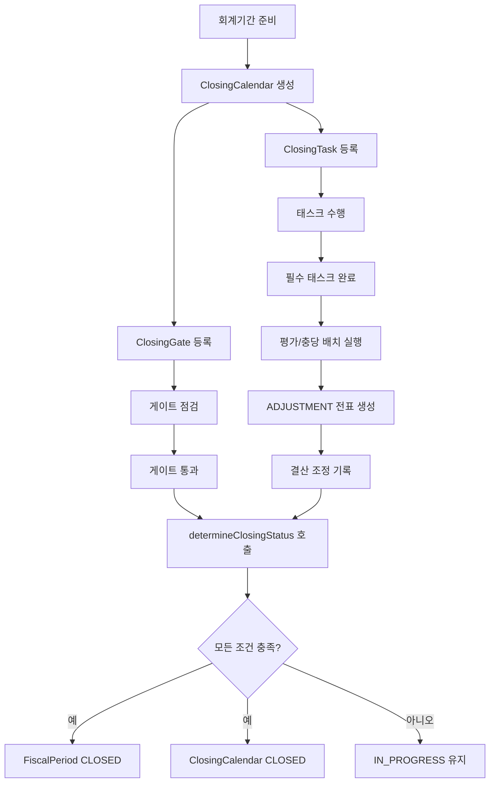
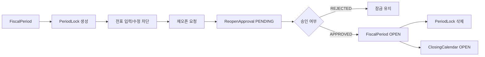

# closing process flow

## 1. 이 모듈이 하는 일

`closing`은 "해당 회계기간을 정말 닫아도 되는가"를 운영적으로 관리하는 모듈이다.

핵심 책임:

- 결산 캘린더 생성
- 결산 체크리스트 관리
- 게이트 통과 관리
- 기간 잠금/해제
- 재오픈 승인
- 평가/충당 배치 실행
- 결산 조정 전표 기록
- 마감 완료 가능 여부 시스템 판정

## 2. 전체 흐름도

## 3. 기간 잠금과 재오픈 흐름

## 4. 코드 기준 단계별 설명

### 4.1 마감 여부 조회

- 어댑터: `ClosingStatusAdapter`
- 계약: `AccountingPeriodStatusPort`
- 사용처: `journal-ledger` 등 다른 모듈
- 기준:
  - `FiscalPeriod.closingStatus`가 `CLOSED` 또는 `PERMANENTLY_CLOSED`면 닫힌 기간으로 본다

### 4.2 결산 캘린더 생성

- 진입점: `POST /api/closing/calendars`
- 서비스: `ClosingService.createClosingCalendar`
- 처리:
  - 같은 연도/기간의 `FiscalPeriod` 존재 여부 확인
  - 캘린더 상태를 `OPEN`으로 생성

### 4.3 태스크와 게이트 운영

- 태스크 생성: `POST /api/closing/tasks`
- 게이트 생성: `POST /api/closing/gates`
- 태스크 상태 갱신: `PUT /api/closing/tasks/{id}/status`
- 게이트 검사: `PUT /api/closing/gates/{id}/check`

현재 구현 포인트:

- 태스크 완료 조건 JSON은 저장만 하고 실제 평가 엔진은 아직 없다
- 게이트 조건 JSON도 저장만 하고 현재는 임시로 통과 처리 가능 구조다

### 4.4 기간 잠금

- 진입점: `POST /api/closing/period-locks`
- 서비스: `ClosingService.lockPeriod`
- 처리:
  - `FiscalPeriod` 조회
  - 이미 잠겨 있으면 중복 잠금 차단
  - 잠금 유형, 사유, 잠금 사용자 기록

### 4.5 재오픈 승인

- 요청: `POST /api/closing/reopen-approvals`
- 승인/반려: `PUT /api/closing/reopen-approvals/{id}/status`

승인 시 실제로 일어나는 일:

- `FiscalPeriod.closingStatus`를 `OPEN`으로 변경
- 해당 `PeriodLock` 삭제
- 연결된 `ClosingCalendar`를 `OPEN`으로 변경

### 4.6 평가/충당 배치

- 평가 배치: `POST /api/closing/valuation-batches/run`
- 충당 배치: `POST /api/closing/provision-batches/run`

현재 구현:

- 실제 정교한 계산 엔진 대신 임시 자동 전표 생성 로직이 들어 있다
- 생성 전표는 `entryType = ADJUSTMENT`
- 더미 계정 `999998`, `999999`를 사용해 차대 전표를 만든다

### 4.7 결산 조정

- 진입점: `POST /api/closing/adjustments`
- 서비스: `ClosingService.createClosingAdjustment`
- 조건:
  - 대상 전표가 `ADJUSTMENT` 타입이어야 함
  - 전표 회계일자가 해당 회계기간 범위 안이어야 함

### 4.8 최종 마감 상태 판정

- 진입점: `POST /api/closing/calendars/determine-status`
- 서비스: `ClosingService.determineClosingStatus`

판정 조건:

1. 필수 태스크가 모두 `COMPLETED`
2. 게이트가 모두 `PASSED`
3. 대사 성공 여부는 현재 TODO이며 임시로 성공 처리

조건 충족 시:

- `FiscalPeriod`를 `CLOSED`로 변경
- `ClosingCalendar`를 `CLOSED`로 변경

## 5. 초보자가 꼭 기억할 포인트

- 이 모듈의 핵심은 "전표를 만드는 것"이 아니라 "마감 통제"다.
- 실제 잠금 판단은 `FiscalPeriod` 상태를 본다.
- 게이트와 태스크의 JSON 조건 평가는 아직 완전 구현이 아니다.
- 평가/충당 배치 전표는 현재 임시 구현 성격이 강하다.
