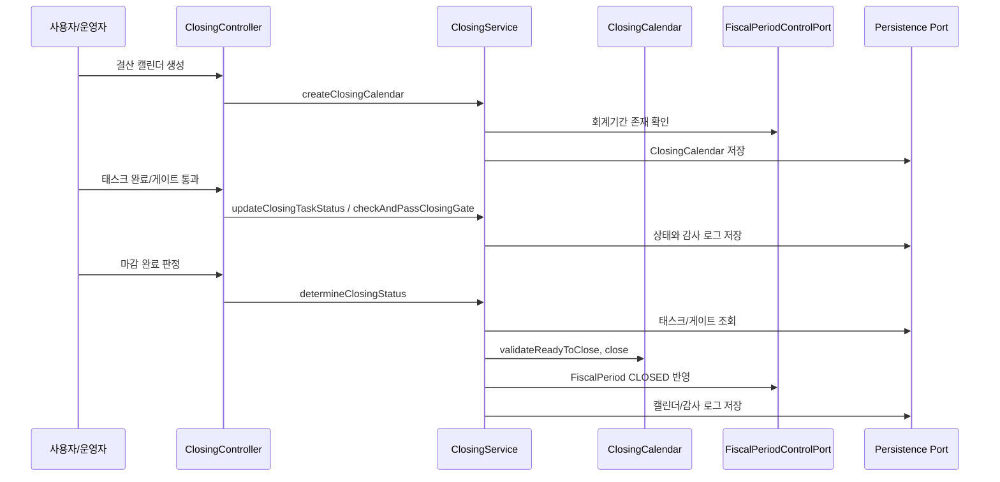
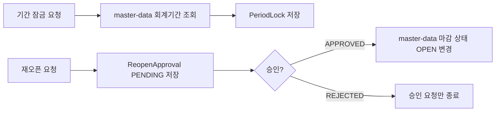
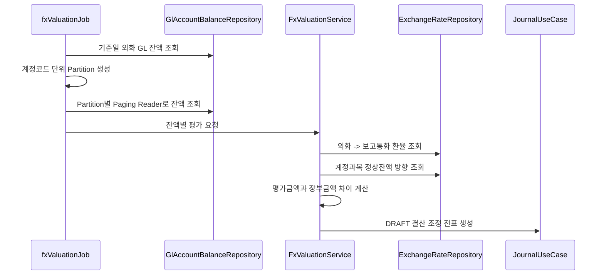
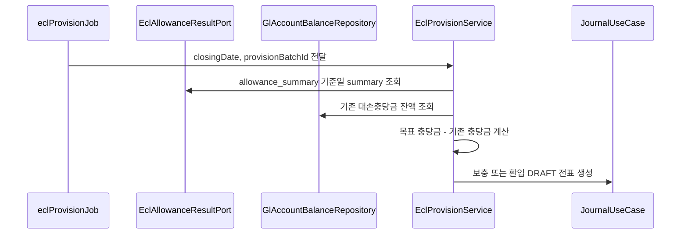

# Closing 업무 흐름

이 문서는 `closing` 모듈이 DDD/헥사고날 구조에서 어떤 흐름으로 동작하는지 설명합니다.

## 헥사고날 경계

| 계층 | 책임 | 예시 |
| --- | --- | --- |
| Inbound Adapter | 외부 요청을 유즈케이스 호출로 변환 | `ClosingController` |
| Application Service | 트랜잭션 경계, 도메인 협업, 외부 포트 호출 | `ClosingService`, `AnnualClosingService`, `FxValuationService`, `EclProvisionService` |
| Domain | 상태 변경 규칙과 검증 | `ClosingCalendar.validateReadyToClose`, `ClosingCalendar.close` |
| Outbound Port | 기술 독립 외부 인터페이스 | `ClosingCalendarPersistencePort`, `EclAllowanceResultPort`, `FxExchangeRateLookupPort`, `AllowanceBalanceLookupPort`, `ClosingJournalEntryPort` |
| Infrastructure Adapter | JPA/JDBC/외부 시스템 실제 구현 | `ClosingCalendarRepository`, `JdbcEclAllowanceResultAdapter` |

## 월말 결산 기본 흐름



마감 완료 판정은 단순히 상태값만 바꾸지 않습니다. 필수 태스크와 게이트를 조회한 뒤 도메인 메서드가 마감 가능 여부를 검증합니다. 이 구조 덕분에 API, Batch, 테스트가 같은 도메인 규칙을 공유할 수 있습니다.

## 기간 잠금과 재오픈



`PeriodLock`은 `FiscalPeriod` 엔티티를 직접 참조하지 않고 ID 값을 저장합니다. 이는 `closing` 도메인이 `master-data`의 JPA 모델에 묶이지 않도록 하기 위한 경계입니다.

## FX 평가 Batch



실행 파라미터:

| 파라미터 | 예시 | 설명 |
| --- | --- | --- |
| `spring.batch.job.name` | `fxValuationJob` | 실행할 Job |
| `valuationDate` | `2026-04-30` | 평가 기준일 |
| `valuationBatchId` | `20260430` | 전표 lineage와 전표번호 결정성에 사용 |

FX 평가는 계정과목의 정상잔액 방향을 함께 봅니다. 자산처럼 차변 정상잔액인 계정은 평가 증가를 차변 계정/대변 이익으로 처리하고, 부채처럼 대변 정상잔액인 계정은 평가 증가를 대변 계정/차변 손실로 처리합니다. 이 판단은 `closing:core`의 `FxValuationService`가 담당하고, Batch는 외화 GL 잔액을 계정코드 파티션과 JPA Paging Reader로 나누어 읽은 뒤 core 입력 DTO로 변환합니다.

## ECL 충당 Batch



ECL 충당 배치는 Stage/PD/LGD/EAD를 계산하지 않습니다. 그 계산은 `ecl`에서 끝난 뒤 `allowance_summary`로 확정되어야 합니다. `closing:core`의 `EclProvisionService`는 확정 summary와 기존 GL 충당금 잔액의 차이만 계산하고, `closing:batch`는 `JdbcEclAllowanceResultAdapter`, `GlAllowanceBalanceLookupAdapter`, `JournalLedgerClosingJournalEntryAdapter`로 외부 기술을 연결합니다.

실행 파라미터:

| 파라미터 | 예시 | 설명 |
| --- | --- | --- |
| `spring.batch.job.name` | `eclProvisionJob` | 실행할 Job |
| `closingDate` | `2026-04-30` | `allowance_summary.base_date`와 GL 잔액 기준일 |
| `provisionBatchId` | `20260430` | 전표 lineage와 전표번호 결정성에 사용 |

## 연차 손익 대체

`AnnualClosingService`는 해당 연도의 수익/비용 계정 잔액을 집계해 이익잉여금 계정으로 대체하는 DRAFT 전표를 생성합니다.

API:

```http
POST /api/closing/annual/perform-income-statement-closing?year=2026&retainedEarningsAccountCode=35000
```

## 재실행과 정합성 체크

- 동일 기준일과 동일 batch ID를 사용하면 전표번호가 결정적으로 생성되어 중복 실행을 추적하기 쉽습니다.
- ECL summary가 없으면 ECL 충당 전표는 생성되지 않습니다.
- 결산 조정 등록은 전표 회계일자가 대상 회계기간 안에 있는지 검증합니다.
- 결산 조정 등록은 전표 상세의 차변/대변 합계가 같은지 검증합니다.
- 운영 자동 전기는 `account.closing.accounting.auto-post-adjustments=true`일 때만 허용합니다.
