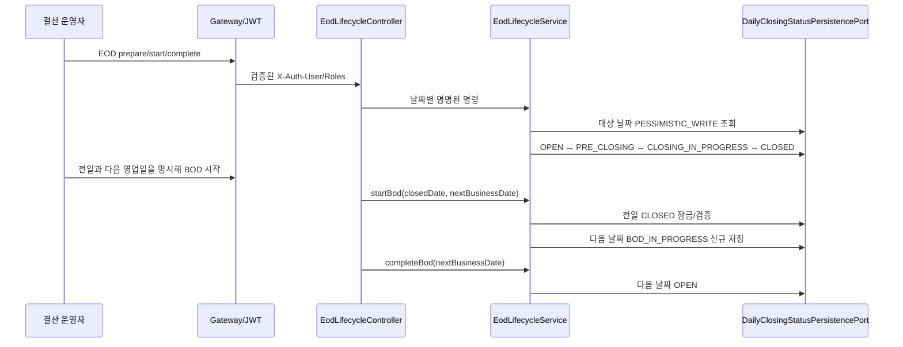
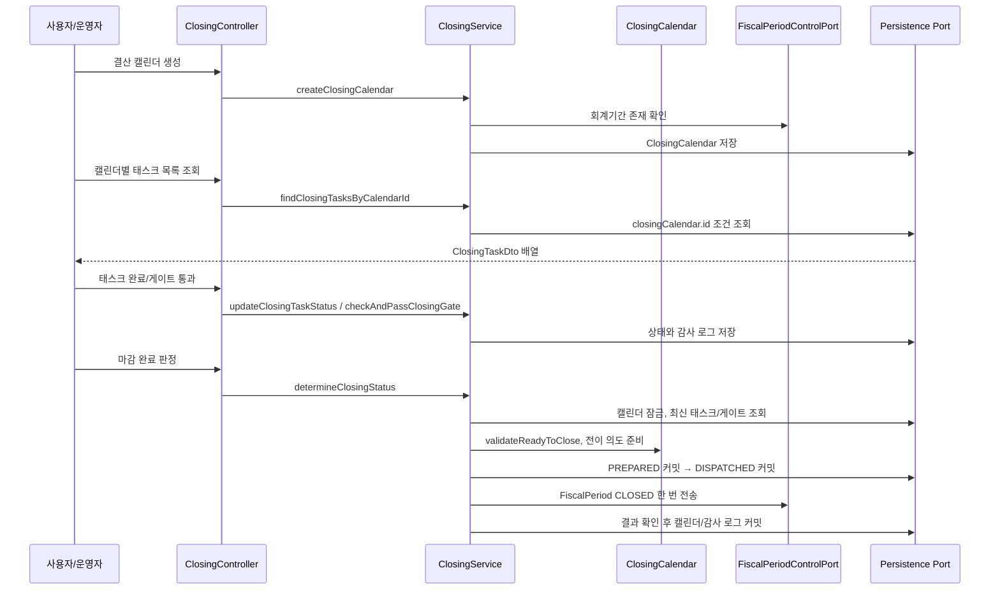
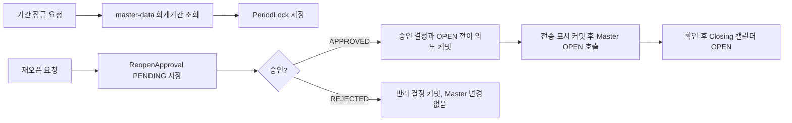
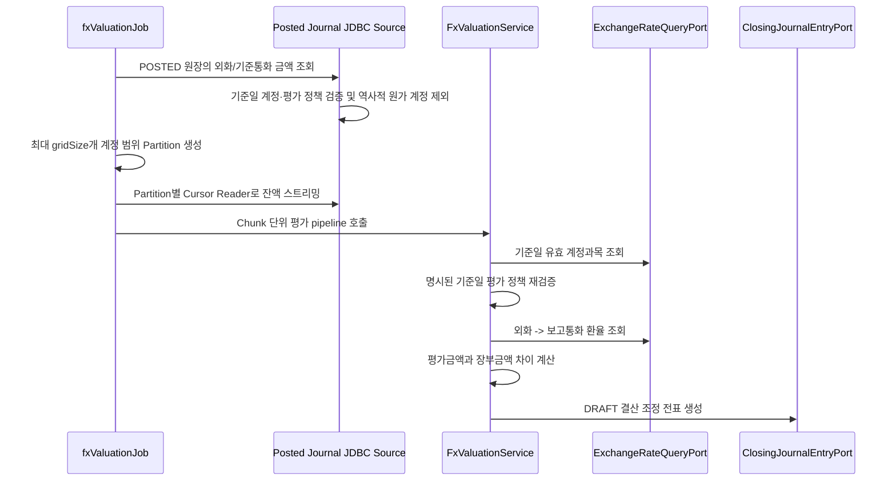
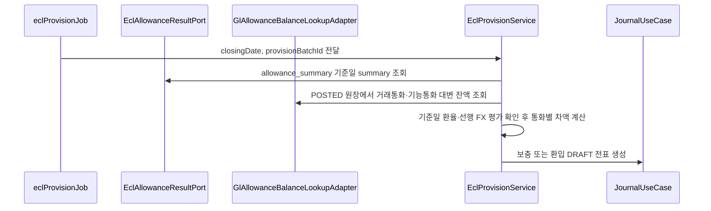

# Closing 업무 흐름

이 문서는 `closing` 모듈이 DDD/헥사고날 구조에서 어떤 흐름으로 동작하는지 설명합니다.

## 헥사고날 경계

| 계층 | 책임 | 예시 |
| --- | --- | --- |
| Inbound Adapter | 외부 요청을 유즈케이스 호출로 변환 | `ClosingController`, `EodLifecycleController` |
| Application Service | 트랜잭션 경계, 도메인 협업, 외부 포트 호출 | `ClosingService`, `EodLifecycleService`, `AnnualClosingService`, `FxValuationService`, `EclProvisionService` |
| Domain | 상태 변경 규칙과 검증 | `DailyClosingStatus`, `ClosingCalendar.validateReadyToClose`, `ClosingCalendar.close` |
| Outbound Port | 기술 독립 외부 인터페이스 | `DailyClosingStatusPersistencePort`, `ClosingCalendarPersistencePort`, `EclAllowanceResultPort`, `FxExchangeRateLookupPort`, `AllowanceBalanceLookupPort`, `ClosingJournalEntryPort` |
| Infrastructure Adapter | JPA/JDBC/외부 시스템 실제 구현 | `JpaDailyClosingStatusPersistenceAdapter`, `ClosingCalendarRepository`, `JdbcEclAllowanceResultAdapter` |

## 일마감 EOD/BOD 흐름



`CLOSED`는 같은 날짜에서 `BOD_IN_PROGRESS`로 전이하지 않습니다. 이 규칙은 전일 마감 이력을 보존하고, 주말·휴일을 포함한 다음 영업일 선택을 운영 캘린더가 명시하도록 합니다. 같은 목표 상태의 재시도는 멱등 처리하지만 중간 상태를 건너뛰는 명령은 실패합니다.

현재 Journal의 `AccountingPeriodStatusPort`는 Master Data 월 회계기간을 기준으로 전표를 차단합니다. EOD 상태의 거래 허용 값을 Journal 생성 경로에 연결하는 것은 별도 통합 범위이며, 그 전까지 이 상태 머신 자체가 시스템 전체 거래를 차단하지는 않습니다.

## 월말 결산 기본 흐름



마감 완료 판정은 단순히 상태값만 바꾸지 않습니다. 필수 태스크와 게이트를 조회한 뒤 도메인 메서드가 마감 가능 여부를 검증합니다. 이 구조 덕분에 API, Batch, 테스트가 같은 도메인 규칙을 공유할 수 있습니다.

화면은 `GET /api/closing/calendars/{calendarId}/tasks`로 한 캘린더의 태스크를 조회합니다. 예를 들어 `GET /api/closing/calendars/10/tasks`는 해당 캘린더에 속한 태스크를 `ClosingTaskDto` 배열로 반환하고, 태스크가 없으면 빈 배열을 반환합니다. `calendarId`는 양수여야 하며 이 조회는 상태를 변경하거나 감사 로그를 만들지 않습니다.

캘린더는 `OPEN -> IN_PROGRESS -> CLOSED -> OPEN(승인된 재오픈)` 순서만 허용합니다. 필수 태스크와 게이트가 최소 한 개씩 있어야 하며, JSON 조건 문자열이 설정된 태스크/게이트는 아직 typed evidence evaluator가 없으므로 fail-closed 처리합니다.

## 기간 잠금과 재오픈



`PeriodLock`은 `FiscalPeriod` 엔티티를 직접 참조하지 않고 ID 값을 저장합니다. 이는 `closing` 도메인이 `master-data`의 JPA 모델에 묶이지 않도록 하기 위한 경계입니다.

## 월말 동시 결정과 복구 (GH-774)

월말 변경의 공통 잠금은 `closing_calendars` 한 행입니다. 같은 기간의 마감 시작·확정,
태스크 생성·변경, 게이트 생성·통과, 재오픈 요청·결정은 캘린더를 잠근 뒤 최신 상태를 읽어 검증합니다.
기간 잠금·해제와 조정 등록도 같은 잠금을 사용하고 미완료 전이가 있으면 거부합니다.
잠금 전에 읽은 자식 엔티티나 체크리스트 목록은 검증 근거로 재사용하지 않습니다.
닫힌 캘린더와 미완료 원격 전이가 있는 캘린더에서는 체크리스트를 변경할 수 없습니다.

예를 들어 두 운영자가 같은 `PENDING` 요청을 승인·반려해도 하나의 결정만 커밋됩니다.
나머지 요청은 HTTP 409 충돌을 받으며 승인자를 덮어쓰거나 Master를 다시 변경하지 않습니다.
요청자와 결정자는 달라야 하고, 필수 태스크·게이트 및 typed evidence 미구현 시 차단 규칙은 유지합니다.

마감 시작·확정과 승인·반려의 공개 유즈케이스는 진행 중인 호출자 트랜잭션 안에서 호출할 수 없습니다
(`Propagation.NEVER`). 각 내부 단계가 독립적으로 커밋돼야 하며, 호출자의 롤백이 이미 확정된 결정까지
취소한다고 오해하지 않도록 진입 단계에서 거부합니다. API 요청은 이 경계를 직접 호출합니다.

원격 Master는 별도 트랜잭션이므로 로컬 롤백이 이미 반영된 Master 상태를 되돌리지 못합니다.
이를 처리하기 위해 캘린더에 작업 ID, 목표 상태, 원 결정자와 전송 단계를 저장합니다.

1. 캘린더 잠금 아래 조건을 검증하고 `PREPARED`를 커밋합니다. 재오픈 승인은 이때
   `APPROVED`로 확정되지만 캘린더는 아직 `CLOSED`입니다. 승인이 원격 반영 완료를 뜻하지 않습니다.
2. `DISPATCHED`를 별도 커밋한 실행자만 Master 상태 PUT을 한 번 보냅니다.
3. 같은 기간·목표 상태의 정상 결과를 확인하면 캘린더를 목표 상태로 바꾸고 완료 감사 기록을 남깁니다.
   준비·전송 중에는 마감 캘린더가 `IN_PROGRESS`, 재오픈 캘린더가 `CLOSED`여서 일반 전표를 차단합니다.
4. 응답 유실, 원격 예외 또는 로컬 완료 저장 실패 시 전송 표시를 보존합니다. 경쟁 변경은 계속 차단합니다.

복구는 작업 ID에 묶입니다. 아직 `PREPARED`이면 최초 전송을 진행할 수 있지만,
`DISPATCHED`이면 자동 재전송하지 않습니다. 권한 있는 운영자가 원 요청이 더 이상 실행될 수 없음을
확인한 뒤 Master를 재조회하고, 목표 상태와 일치할 때만 로컬 완료를 확정합니다.
재조회에서도 원래 상태가 보이면 차단을 유지하고 별도 Master 운영 절차로 정합성을 해결해야 합니다.
원격 호출 전 중단과 응답 유실을 GET+PUT만으로 구분할 수 없기 때문입니다.
종료 확인 값은 운영자의 확인 기록이며 원격 작업 종료를 시스템이 증명하는 토큰은 아닙니다.

초보자 설명: 승인 도장을 먼저 기록하고 외부 시스템에 한 번 전달한 뒤 수신 결과를 확인하는 흐름입니다.
전화가 끊겼다고 같은 지시를 무조건 다시 보내지 않습니다. 이전 지시가 뒤늦게 도착해 이후 마감을
뒤집을 수 있으므로, 확인이 끝나기 전까지 해당 기간의 변경을 멈춥니다.

이 프로토콜은 Closing 명령을 직렬화합니다. Master 직접 변경과 다른 배포의 오래된 Closing writer를
원격에서 차단하는 작업 키·버전 계약은 제공하지 않습니다. 배포 시 V52를 먼저 적용하고 오래된 월말
writer를 모두 중지·배출한 뒤 새 버전을 사용해야 합니다. 미해결 전이가 있으면 기록을 지우거나 이전
버전으로 바로 돌아가지 말고 먼저 원 요청 종료와 두 시스템 상태를 대사합니다.
구체적인 조회·복구 API와 검증 범위는 [로컬 실행 가이드](local-run.md#월말-전이-조회와-복구-gh-774)를 참조하세요.

## 일반 전표 허용 판정 (GH-772)

`ClosingAdmissionService`는 회계일자에서 월 회계기간을 찾고 Master 상태, Closing 캘린더,
기간 잠금을 결합합니다. `ClosingUseCase.isClosed`, `ClosingStatusAdapter`의
`AccountingPeriodStatusPort.isClosed`, HTTP 조회가 이 규칙을 공유합니다.
이때 `isClosed=true`는 **일반 전표 차단**을 뜻하며 최종 마감 완료만을 뜻하지 않습니다.

| 확인 항목 | 허용 조건 | 조건 불충족 시 |
| --- | --- | --- |
| Master 회계기간 | 양수 ID, 요청 연월·회계일자에 맞는 유효 기간, 정확한 `OPEN` 상태 | 누락·잘못된 기간은 예외, null·알 수 없는 상태와 모든 비OPEN 상태는 차단 |
| Closing 캘린더 | 요청 연월에 해당하는 캘린더의 정확한 `OPEN` 상태 | 누락·불일치·null·`IN_PROGRESS`·`CLOSED`·`PERMANENTLY_CLOSED`는 차단 |
| 활성 기간 잠금 | 대상 ID의 `PeriodLock` 행 없음 | 모든 잠금 유형에서 일반 전표 차단 |
| 조회 가능 여부 | 필요한 저장소·Master 조회 성공 | 실패를 허용 결과로 바꾸지 않고 예외 전파 |

예를 들어 1월이 두 시스템 모두 `OPEN`이면 일반 전표가 허용됩니다. 같은 기간에 잠금을 등록하면
차단되고, 잠금을 해제하면 다른 조건을 다시 확인합니다. 캘린더가 `IN_PROGRESS`이면 잠금 해제만으로
허용되지 않습니다. 마감 후에는 기존 승인된 재오픈 절차로 Master와 캘린더를 모두 `OPEN`으로 바꿔야 하며,
별도 잠금이 남아 있으면 계속 차단됩니다. 캘린더가 아직 생성되지 않은 기간도 허용하지 않습니다.

현재 잠금은 행의 존재가 활성 여부입니다. `unlockPeriod`는 감사 로그를 남기고 해당 행을 삭제합니다.
`NON_ADJUSTMENT_ENTRIES`나 `PARTIAL_LOCK`도 날짜만 받는 이 조회에서 일반 전표 예외를 만들지 않습니다.
전표의 `ADJUSTMENT` 문자열이나 `SYSTEM` 처리자는 승인 증거가 아닙니다. 기존
`createClosingAdjustment`의 Master OPEN·기간·차대변·0원 거부 검증과 승인자 기록은 그대로 유지됩니다.
이 등록 절차와 실제 조정 전표 생성·전기는 다르며, 진행 중 조정 전표를 허용하는 정책은 신뢰 가능한
권한·전표 식별 정보를 받는 별도 계약과 통합 검증이 필요합니다.

쿼리 서비스는 Journal 쓰기 포트에 의존하지 않습니다. 이를 통해 상태 어댑터를 Journal에 조합할 때
`ClosingService → Journal → ClosingService` 생성자 순환을 피합니다. 테스트는 실제 Journal의
`ClosingLockValidationFilter`와 `PostingService`에 이 어댑터를 명시적으로 연결하여 차단 시
승인 전표와 전표·원장·잔액 쓰기가 보존되는지 검사합니다.

**남은 통합 조건:** 독립 Journal은 현재 자신의 `@Primary FiscalPeriodAccountingPeriodStatusAdapter`로
Master만 조회합니다. Closing API/Batch 배포 산출물에도 Journal core가 포함되어 있지 않으므로 기존
Journal 패키지 scan 선언만으로 연동이 생기지 않습니다. 이 변경의 HTTP 공급자와 명시적 조합 테스트는
운영 Journal 소비자 선택을 바꾸지 않습니다. Journal 모듈에서 로컬·원격 소비자를 연결하고,
GL07/#762에서 진행 중 전기 종료와 마감 확정을 커밋까지 조정하는 검증이 필요합니다.
두 번째 상태 조회나 JVM 안의 mutex로 이 경쟁을 해결했다고 간주해서는 안 됩니다.
일별 EOD, 분기·연간 잠금의 월별 전파도 이 월 회계기간 조회의 보장 범위에 포함되지 않습니다.

## FX 평가 Batch



실행 파라미터:

| 파라미터 | 예시 | 설명 |
| --- | --- | --- |
| `spring.batch.job.name` | `fxValuationJob` | 실행할 Job |
| `valuationDate` | `2026-04-30` | 평가 기준일 |
| `valuationBatchId` | `20260430` | 전표 lineage와 전표번호 결정성에 사용 |

FX 원천 잔액은 차변을 양수, 대변을 음수로 집계합니다. `FxValuationService`는 재평가 차이를 이 부호에 맞춰 계정 라인과 환산손익 반대 라인으로 구성합니다. Batch는 기술적인 범위 분할·Cursor·chunk/checkpoint만 맡고, 한 chunk 안의 어느 항목이라도 실패하면 실패 ID를 모아 예외를 던져 그 chunk 전체를 롤백합니다.

### 평가 대상 계정의 유효일자 정책 (GH-780)

외화 전표에 등장한다는 사실만으로 평가 대상이 되지는 않습니다. Closing은
`account.closing.accounting.fx-valuation-policies`의 계정별 정책과 기준일에 유효한
Master 계정 정보를 함께 확인합니다. `effective-from`과 `effective-to`는 양 끝을 포함하며
둘 다 명시해야 합니다. 한 계정의 유효기간이 겹치거나 기준일에 적용할 정책이 없으면
실패합니다. `fixedAsset=false`, 자산/부채 분류 또는 정상잔액 방향만으로 화폐성을 추정하지 않습니다.

| 명시한 treatment | 적용 조건 | 처리 |
| --- | --- | --- |
| `MONETARY` | 기준일 계정 분류가 `ASSETS`/`ASSET` 또는 `LIABILITIES`/`LIABILITY`, 고정자산이 아님 | 외화 원금과 장부금액의 차이를 평가 |
| `HISTORICAL_COST` | 기준일 계정과 분류가 확인되고 명시적으로 평가 제외됨 | 수익·비용·자본·역사적 원가 비화폐성 항목을 재평가하지 않음 |
| 누락·유효기간 공백·중복·불완전한 계정 정보·모순된 분류 | 평가 근거 부족 | 예외로 실행 실패; 평가 대상으로 추정하지 않음 |

비화폐성 공정가치, 해외사업장 환산, 기타 예외 정책은 지원하지 않습니다. 그런 항목을
`MONETARY`로 우회 등록하지 말고 별도의 명시적 회계 정책과 검증을 먼저 구현해야 합니다.
정책은 Closing 설정으로 제공하며 공용 계정 계약이나 외부 모듈 테이블은 바꾸지 않습니다.

원천 조회는 core의 같은 적격성 판단으로 계정 범위를 검증하고 Reader 결과에서 제외 계정을
걸러냅니다. 서비스를 직접 호출해도 기준일 계정·정책을 다시 검증하므로 조회 필터를 우회할 수
없습니다. 적격성 확인은 환율 조회와 평가차액 0 처리 전에 수행합니다. 제외 항목 때문에 불필요한
환율을 요구하지 않으며, 차액이 0이라는 이유로 분류 누락을 숨기지도 않습니다.

Reader는 제외한 행까지 원래 Cursor의 읽기 횟수에 포함해 checkpoint를 저장합니다.
따라서 첫 제외 행에서 스트림이 끝나거나 재시작 위치가 앞당겨지지 않습니다. 계정·통화순
조회 중 같은 계정의 연속 행은 마지막 계정 판정 하나만 재사용하며, 전체 잔액을 메모리에
쌓지 않습니다. 현재 Master 포트는 단건 조회이므로 partition 탐색과 Reader에서 계정별
조회가 있고 서비스에서도 다시 검증합니다. 운영 규모의 조회 비용은 별도 측정이 필요합니다.

예를 들어 USD100을 매출로 받아 현금 차변100 / 수익 대변100, 장부금액 각각110으로
전기한 뒤 환율1.2가 되면 현금만10 증가시키고 환산이익10을 기록합니다. 수익을 다시
평가하여 손실10으로 상쇄하지 않습니다. 비용 또는 역사적 원가 고정자산 차변100 /
화폐성 미지급금 대변100의 경우에는 미지급금만10 증가하고 환산손실10이 발생합니다.
실제 잔액이 정상 방향과 반대라면 원장 부호로 계산하므로 현금 대변잔액에는 손실,
부채 차변잔액에는 이익이 생깁니다.

배포 전에 외화 원천에 등장하는 계정의 정책을 기준일별로 준비해야 합니다. 재실행 때는
동일 기준일 정책과 Master 이력을 보존하고 입력 원장을 확정해야 합니다. 설정 이력을
영속적인 실행 스냅샷으로 저장하거나 동시 변경을 잠그는 기능은 제공하지 않습니다.
기존 잘못된 평가 전표를 자동 수정하지 않으므로 해당 전표는 별도로 대사·정정합니다.
설정 예시는 [로컬 실행 가이드](local-run.md#fx-평가-적격성-설정-gh-780)를 참고하세요.

### 이전 평가를 포함한 장부금액 (GH-779)

평가 입력은 계정·원천통화별 **외화 원금**과 **보고통화 장부금액**입니다. 일반 외화 전표는
두 금액에 모두 반영하지만, 이미 전기된 FX 평가 조정은 장부금액에만 반영합니다.
평가 전표의 헤더 통화는 보고통화이고 `FX_VALUATION` 원천 ID는
`배치ID|평가계정|원천통화`입니다. 이 기존 식별자로 평가 계정 라인만 원천통화에 연결하며,
상대 환산손익 라인이나 일반 보고통화 거래를 외화 원금에 섞지 않습니다.
같은 계정의 USD와 EUR도 각각의 조정액을 따로 합산합니다.

예를 들어 USD100의 취득 장부금액이 KRW1,000이면 환율12에서 KRW200을 추가합니다.
이 전표를 전기한 뒤 다음 달에도 환율12라면 장부금액은 KRW1,200이므로 추가 전표가 없습니다.
이후 환율13이면 KRW100만 추가하고, 환율11이면 KRW200을 차감합니다.
대변 잔액과 비정상 잔액도 원장의 실제 부호로 계산하며 정상잔액 방향으로 부호를 덮어쓰지 않습니다.

역분개는 `REVERSAL` / `JOURNAL_ENTRY`의 원전표 ID를 따라 최초 FX 평가의 원천통화를
상속합니다. 원 평가와 전기된 역분개 라인을 각각 실제 차대변 부호로 합산하므로 상쇄되며,
역분개의 역분개도 같은 원천을 유지합니다. 각 라인은 자기 전표가 `POSTED`이고 회계일자가
평가기준일 이내일 때만 반영합니다. 역분개 초안을 만들었다는 이유로 원 평가를 제거하지 않습니다.
이 조회는 원전표·lineage를 수정하지 않습니다.

외화 원금과 장부금액 중 하나만 0인 잔액은 기존 core 검증에서 실패합니다. 원천 식별자가
불완전한 평가를 통화별로 추정 배분하거나, 남은 장부금액을 임의 상각하지 않습니다.
`FX_VALUATION`으로 식별된 유효일자 내 전기 건의 잘못된 식별자·헤더나 평가 계정 라인 누락은
조회 검증에서 실패합니다. 원전표가 사라진 보고통화 역분개는 FX인지 판별할 근거가 없으므로
자동 귀속하지 않습니다. 그런 레거시 고아 연결은 실행 전에 원장·원천 대사로 복구해야 합니다.
기본 DRAFT 생성·선택적 자동 전기·결정적 전표번호·재시도 시 전표 내용 일치 검사는 유지됩니다.
평가기준일의 입력 원장이 확정된 상태에서 실행해야 하며, 동시 전기까지 묶는 전역 스냅샷이나
분산 트랜잭션을 제공하는 변경은 아닙니다.

현재 원장 집계는 정합성 우선의 과도기 구현입니다. 1억 건 운영 완료 조건은 전기 시 거래통화/기준통화 잔액을 bulk 갱신하는 read model, 계정·통화·일자 인덱스, 원장 대사, PostgreSQL 실행계획과 부하 테스트입니다.
기존 lineage·전표 상태/일자·상세 계정/전표 인덱스를 활용할 수 있지만, 역분개 원천 추적은
과거 FX 헤더 전체를 탐색할 수 있습니다. 계정 수·범위 조회와 각 partition이 이 관계를 다시
계산하므로 `gridSize`는 메모리에 보관하는 범위 메타데이터와 동시성의 상한이지 DB 스캔 비용의
상한이 아닙니다. 현재 변경은 인덱스·스키마를 추가하거나 운영 규모 성능을 보증하지 않습니다.

## ECL 충당 Batch



ECL 충당 배치는 Stage/PD/LGD/EAD를 계산하지 않습니다. 그 계산은 `ecl`에서 끝난 뒤 `allowance_summary`로 확정되어야 합니다. JDBC 어댑터가 exposure 행을 전표 계정·통화·run/model/법인 단위로 먼저 합산해 메모리를 포트폴리오 건수가 아닌 전표 그룹 수에 비례하게 만들고, `EclProvisionService`는 하나의 run/model과 하나의 법인만 허용합니다. summary가 비어 있거나 목표액이 null이면 0으로 추정하지 않고 실패합니다.

### ECL 거래통화와 기능통화 대사 (GH-781)

`target_allowance_amount`의 단위는 summary의 `currency_code`입니다. `gl_balances`는
거래통화 키 아래에 기능통화 금액을 저장하므로 외화 목표와 직접 비교할 수 없습니다.
`AllowanceBalanceLookupPort`는 거래통화·기능통화 코드와 각 통화의 대변 잔액을 함께 반환합니다.
조회 어댑터는 기준일까지 `POSTED`인 실제 전표 상세를 집계하며, FX 평가와 같은 귀속 SQL을
사용해 기존 평가액 및 역분개를 원천통화의 기능통화 잔액에만 포함합니다. 초안·미래 전표는 제외합니다.
ECL 잔액 조회에는 FX 평가 적격성 필터를 적용하지 않습니다. 기존 잔액을 확인하는 것과
새 평가를 허용하는 것은 별개이기 때문입니다.

기능통화는 기존 `fx-valuation-reporting-currency-code` 설정과 동일하게 사용합니다.
두 통화가 같을 때만 환율 1을 사용하고, 외화는 Master Data의 `closingDate` 이하 최신
환율을 조회합니다. 환율 누락·0 이하·저장 정밀도 초과, 통화 불일치와 원장 금액 오류는
전표 생성 전에 실패합니다. 모든 그룹의 금액·환율을 먼저 검증한 뒤 전표를 생성합니다.

계산은 다음 순서를 따릅니다. 금액은 전표 저장 계약의 소수 2자리이며 목표 합계는
한 번 `HALF_UP` 반올림합니다.

1. 기존 기능통화 잔액이 `round(기존 거래통화 잔액 × 기준일 환율, 2)`인지 확인합니다.
   불일치하는 외화 잔액은 먼저 해당 충당금 계정의 FX 평가를 승인·전기하고 다시 실행해야 합니다.
   두 통화가 같은데 금액이 다르면 FX 평가로 고칠 수 없으므로 원장 원천을 대사해야 합니다.
   ECL이 환산손익을 충당 비용에 섞거나 #780의 평가 적격성 정책을 우회하지 않습니다.
2. 거래통화 전표액은 `목표 거래통화액 − 기존 거래통화 잔액`입니다.
3. 기능통화 전표액은 `round(목표 거래통화액 × 환율, 2) − 기존 기능통화 잔액`입니다.
   누적 잔액 대사를 위해 두 기말 금액의 차이를 사용하므로 `round(거래통화 차액 × 환율, 2)`와
   0.01 차이가 날 수 있습니다. 두 금액의 부호가 다르거나 한쪽만 0이면 자동 전표를 거부합니다.
4. 두 통화 모두 차이가 0이면 전표가 없습니다. 양수 차이는 비용/충당금 보충,
   음수 차이는 충당금/환입수익으로 기록하며 실제 기준일 환율을 Journal 명령에 전달합니다.

예를 들어 목표 USD100, 기존 USD80/KRW104,000, 환율1,300이면 USD20/KRW26,000을
보충해 최종 USD100/KRW130,000이 됩니다. 환율이1,400으로 바뀌었는데 기존 장부가
KRW104,000이면 실행을 차단합니다. FX 평가 KRW8,000을 전기해 기존 장부를
USD80/KRW112,000으로 맞춘 뒤 실행하면 USD20/KRW28,000을 보충합니다.
목표가 USD80으로 같아도 FX 평가가 빠진 기능통화 잔액을 무처리 성공으로 숨기지 않습니다.

기존 결정적 전표번호·lineage와 DRAFT 기본값을 유지합니다. Journal 조회 계약에 환율
필드가 없으므로 ECL 설명에 통화쌍과 정규화된 환율을 함께 보존합니다. 재시도는 설명과
양 통화 상세를 비교해 환율만 바뀐 요청도 거부합니다. 변경 전 형식으로 만든 기존 초안은
자동 재사용하지 않으므로 별도 대사 후 처리해야 합니다. 전기 후 두 잔액이 목표와 같으면
재실행은 무처리입니다. 원격 전표 쓰기와 원장 조회는 분산 원자성을 보장하지 않으며,
동시 원장 변경·부분 전기·변경된 입력은 운영 대사와 승인 절차가 필요합니다.

조회는 exposure별 호출이 아닌 계정/통화 그룹별 집계입니다. 다만 그룹마다 과거 전표와
FX 귀속 관계를 읽으므로 운영 규모에서는 PostgreSQL 실행계획·부하 검증과 전기 시 함께
갱신되는 이중통화 잔액 read model이 필요합니다. 이번 변경은 스키마·데이터를 변경하지 않습니다.

실행 파라미터:

| 파라미터 | 예시 | 설명 |
| --- | --- | --- |
| `spring.batch.job.name` | `eclProvisionJob` | 실행할 Job |
| `closingDate` | `2026-04-30` | `allowance_summary.base_date`와 GL 잔액 기준일 |
| `provisionBatchId` | `20260430` | 전표 lineage와 전표번호 결정성에 사용 |

## 연차 손익 대체

`AnnualClosingService`는 해당 연도의 `POSTED` 수익/비용 기준통화 잔액만 집계해 이익잉여금 계정으로 대체하는 DRAFT 전표를 생성합니다. 연도·기준일·이익잉여금 계정으로 결정한 전표번호가 이미 있고 헤더가 같으면 기존 실행을 재사용하며, 다른 내용이나 반려/역분개 상태이면 실패합니다.

API:

```http
POST /api/closing/annual/perform-income-statement-closing?year=2026&retainedEarningsAccountCode=35000
```

## 재실행과 정합성 체크

- 기준일과 양수 batch ID는 필수이며, 동일 입력은 결정적 전표번호와 lineage를 생성합니다.
- ECL summary가 없으면 정상 무처리로 간주하지 않고 실패합니다. 0건 포트폴리오를 성공 처리하려면 향후 명시적인 zero-portfolio 완료 마커가 필요합니다.
- API 평가/충당 실행 이력은 전표 트랜잭션과 분리해 `RUNNING -> PENDING_APPROVAL` 또는 `FAILED`를 보존합니다. DRAFT 전표 생성만으로 `COMPLETED`가 되지 않습니다.
- 결산 조정 등록은 전표 회계일자가 대상 회계기간 안에 있는지 검증합니다.
- 결산 조정 등록은 전표 상세의 차변/대변 합계가 같은지 검증합니다.
- 운영 자동 전기는 `account.closing.accounting.auto-post-adjustments=true`일 때만 허용합니다.
