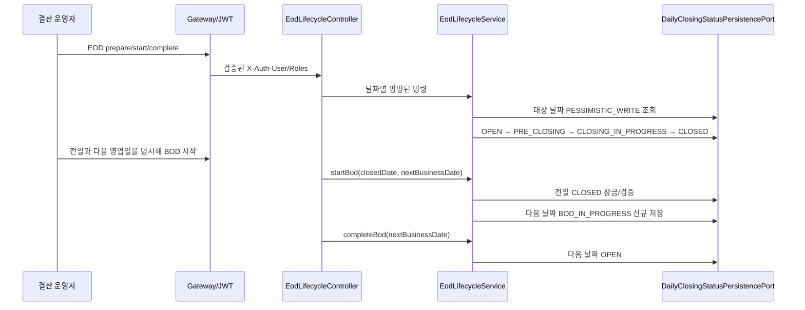
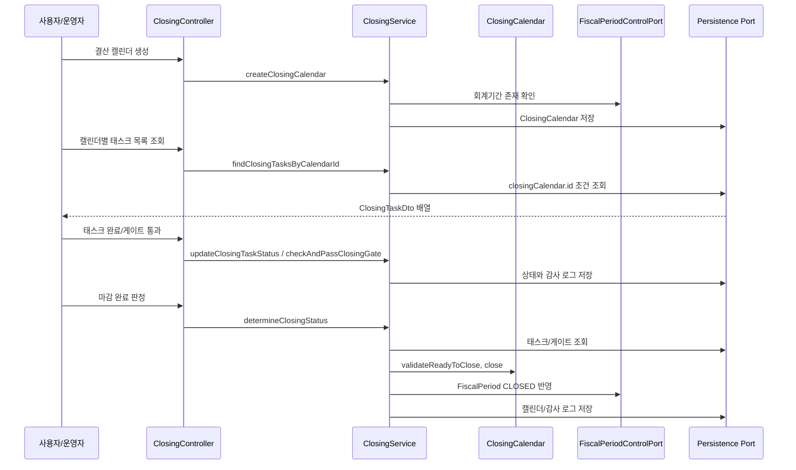
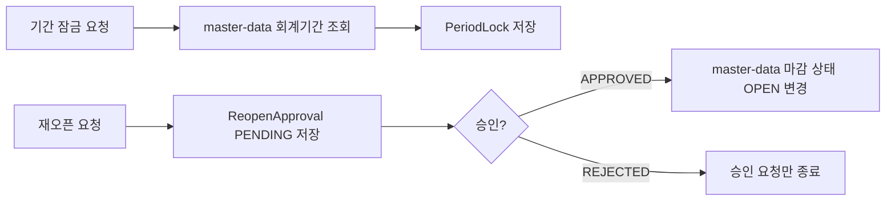
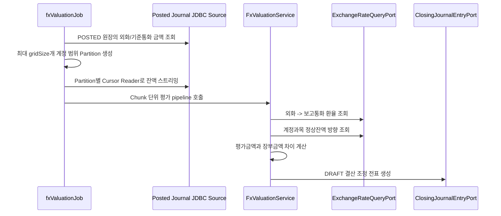
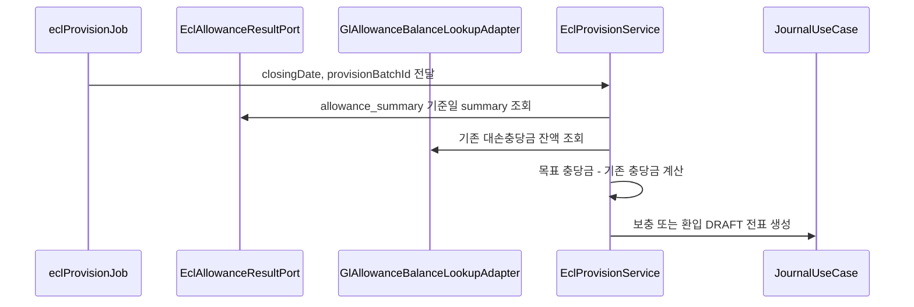

# Closing 업무 흐름

이 문서는 `closing` 모듈이 DDD/헥사고날 구조에서 어떤 흐름으로 동작하는지 설명합니다.

## 헥사고날 경계

| 계층 | 책임 | 예시 |
| --- | --- | --- |
| Inbound Adapter | 외부 요청을 유즈케이스 호출로 변환 | `ClosingController`, `EodLifecycleController` |
| Application Service | 트랜잭션 경계, 도메인 협업, 외부 포트 호출 | `ClosingService`, `EodLifecycleService`, `AnnualClosingService`, `FxValuationService`, `EclProvisionService` |
| Domain | 상태 변경 규칙과 검증 | `DailyClosingStatus`, `ClosingCalendar.validateReadyToClose`, `ClosingCalendar.close` |
| Outbound Port | 기술 독립 외부 인터페이스 | `DailyClosingStatusPersistencePort`, `ClosingCalendarPersistencePort`, `EclAllowanceResultPort`, `FxExchangeRateLookupPort`, `AllowanceBalanceLookupPort`, `ClosingJournalEntryPort` |
| Infrastructure Adapter | JPA/JDBC/외부 시스템 실제 구현 | `JpaDailyClosingStatusPersistenceAdapter`, `ClosingCalendarRepository`, `JdbcEclAllowanceResultAdapter` |

## 일마감 EOD/BOD 흐름



`CLOSED`는 같은 날짜에서 `BOD_IN_PROGRESS`로 전이하지 않습니다. 이 규칙은 전일 마감 이력을 보존하고, 주말·휴일을 포함한 다음 영업일 선택을 운영 캘린더가 명시하도록 합니다. 같은 목표 상태의 재시도는 멱등 처리하지만 중간 상태를 건너뛰는 명령은 실패합니다.

현재 Journal의 `AccountingPeriodStatusPort`는 Master Data 월 회계기간을 기준으로 전표를 차단합니다. EOD 상태의 거래 허용 값을 Journal 생성 경로에 연결하는 것은 별도 통합 범위이며, 그 전까지 이 상태 머신 자체가 시스템 전체 거래를 차단하지는 않습니다.

## 월말 결산 기본 흐름



마감 완료 판정은 단순히 상태값만 바꾸지 않습니다. 필수 태스크와 게이트를 조회한 뒤 도메인 메서드가 마감 가능 여부를 검증합니다. 이 구조 덕분에 API, Batch, 테스트가 같은 도메인 규칙을 공유할 수 있습니다.

화면은 `GET /api/closing/calendars/{calendarId}/tasks`로 한 캘린더의 태스크를 조회합니다. 예를 들어 `GET /api/closing/calendars/10/tasks`는 해당 캘린더에 속한 태스크를 `ClosingTaskDto` 배열로 반환하고, 태스크가 없으면 빈 배열을 반환합니다. `calendarId`는 양수여야 하며 이 조회는 상태를 변경하거나 감사 로그를 만들지 않습니다.

캘린더는 `OPEN -> IN_PROGRESS -> CLOSED -> OPEN(승인된 재오픈)` 순서만 허용합니다. 필수 태스크와 게이트가 최소 한 개씩 있어야 하며, JSON 조건 문자열이 설정된 태스크/게이트는 아직 typed evidence evaluator가 없으므로 fail-closed 처리합니다.

## 기간 잠금과 재오픈



`PeriodLock`은 `FiscalPeriod` 엔티티를 직접 참조하지 않고 ID 값을 저장합니다. 이는 `closing` 도메인이 `master-data`의 JPA 모델에 묶이지 않도록 하기 위한 경계입니다.

## FX 평가 Batch



실행 파라미터:

| 파라미터 | 예시 | 설명 |
| --- | --- | --- |
| `spring.batch.job.name` | `fxValuationJob` | 실행할 Job |
| `valuationDate` | `2026-04-30` | 평가 기준일 |
| `valuationBatchId` | `20260430` | 전표 lineage와 전표번호 결정성에 사용 |

FX 원천 잔액은 차변을 양수, 대변을 음수로 집계합니다. `FxValuationService`는 재평가 차이를 이 부호에 맞춰 계정 라인과 환산손익 반대 라인으로 구성합니다. Batch는 기술적인 범위 분할·Cursor·chunk/checkpoint만 맡고, 한 chunk 안의 어느 항목이라도 실패하면 실패 ID를 모아 예외를 던져 그 chunk 전체를 롤백합니다.

현재 원장 집계는 정합성 우선의 과도기 구현입니다. 1억 건 운영 완료 조건은 전기 시 거래통화/기준통화 잔액을 bulk 갱신하는 read model, 계정·통화·일자 인덱스, 원장 대사, PostgreSQL 실행계획과 부하 테스트입니다.

## ECL 충당 Batch



ECL 충당 배치는 Stage/PD/LGD/EAD를 계산하지 않습니다. 그 계산은 `ecl`에서 끝난 뒤 `allowance_summary`로 확정되어야 합니다. JDBC 어댑터가 exposure 행을 전표 계정·통화·run/model/법인 단위로 먼저 합산해 메모리를 포트폴리오 건수가 아닌 전표 그룹 수에 비례하게 만들고, `EclProvisionService`는 하나의 run/model과 하나의 법인만 허용합니다. 이후 `gl_balances`의 최신 대변 잔액을 그룹당 한 번만 차감합니다. summary가 비어 있거나 목표액이 null이면 0으로 추정하지 않고 실패합니다.

실행 파라미터:

| 파라미터 | 예시 | 설명 |
| --- | --- | --- |
| `spring.batch.job.name` | `eclProvisionJob` | 실행할 Job |
| `closingDate` | `2026-04-30` | `allowance_summary.base_date`와 GL 잔액 기준일 |
| `provisionBatchId` | `20260430` | 전표 lineage와 전표번호 결정성에 사용 |

## 연차 손익 대체

`AnnualClosingService`는 해당 연도의 `POSTED` 수익/비용 기준통화 잔액만 집계해 이익잉여금 계정으로 대체하는 DRAFT 전표를 생성합니다. 연도·기준일·이익잉여금 계정으로 결정한 전표번호가 이미 있고 헤더가 같으면 기존 실행을 재사용하며, 다른 내용이나 반려/역분개 상태이면 실패합니다.

API:

```http
POST /api/closing/annual/perform-income-statement-closing?year=2026&retainedEarningsAccountCode=35000
```

## 재실행과 정합성 체크

- 기준일과 양수 batch ID는 필수이며, 동일 입력은 결정적 전표번호와 lineage를 생성합니다.
- ECL summary가 없으면 정상 무처리로 간주하지 않고 실패합니다. 0건 포트폴리오를 성공 처리하려면 향후 명시적인 zero-portfolio 완료 마커가 필요합니다.
- API 평가/충당 실행 이력은 전표 트랜잭션과 분리해 `RUNNING -> PENDING_APPROVAL` 또는 `FAILED`를 보존합니다. DRAFT 전표 생성만으로 `COMPLETED`가 되지 않습니다.
- 결산 조정 등록은 전표 회계일자가 대상 회계기간 안에 있는지 검증합니다.
- 결산 조정 등록은 전표 상세의 차변/대변 합계가 같은지 검증합니다.
- 운영 자동 전기는 `account.closing.accounting.auto-post-adjustments=true`일 때만 허용합니다.
