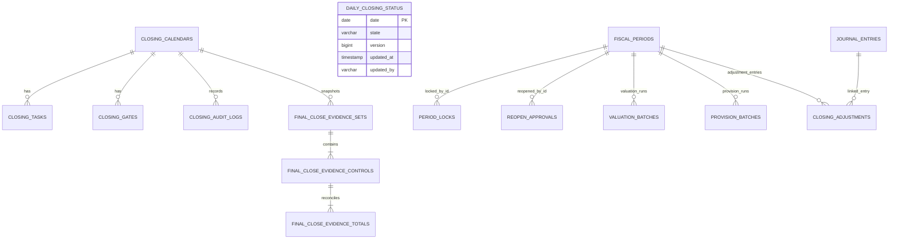

# Closing 데이터 모델

이 문서는 `closing` 모듈의 주요 저장 데이터와 외부 테이블 의존성을 정리합니다.

## 도메인과 저장 모델의 경계 (GH-895)

`closing:core`의 `domain` 객체는 JPA/Spring 어노테이션과 영속성 콜백 없이 마감 상태 전이와
검증 규칙을 실행합니다. `infrastructure.persistence`의 `*Entity`가 기존 테이블/컬럼,
관계 및 생성·수정 시각 콜백을 소유하고, `ClosingEntityMapper`와 포트 어댑터가 양쪽 상태를
명시적으로 변환합니다. 태스크·게이트·감사 로그의 캘린더 참조는 ID를 보존하며, 마감
캘린더의 미완료 전이 식별자·증빙 바인딩도 재구성합니다.

`daily_closing_status`의 `@Version`은 `DailyClosingStatusEntity`에 있고, 어댑터는
기존 행의 버전을 확인한 뒤 관리 중인 행에 상태 변경을 반영합니다. 날짜별 행 조회에는
기존 `PESSIMISTIC_WRITE` 잠금을 유지합니다. 도메인 의존성 검사는
`DomainDependencyArchitectureTest`가 새 도메인 소스까지 순회하며 Spring/JPA/Hibernate
import를 거부합니다. 회귀 검증은 `./gradlew :closing:test`입니다.

## 주요 엔티티



`FISCAL_PERIODS`와 `JOURNAL_ENTRIES`는 개념상 외부 모듈의 데이터입니다. `closing`은 JPA 엔티티를 직접 물고 가지 않고 포트와 ID 중심으로 연결합니다.

## 테이블별 역할

| 테이블 | 도메인 | 역할 |
| --- | --- | --- |
| `closing_calendars` | `ClosingCalendar` | 회계연도/기간별 마감 진행 상태 |
| `closing_tasks` | `ClosingTask` | 마감 체크리스트와 담당자/기한/완료 조건 |
| `closing_gates` | `ClosingGate` | 다음 단계로 진행하기 위한 통제 지점 |
| `period_locks` | `PeriodLock` | 회계기간 잠금 이력 |
| `reopen_approvals` | `ReopenApproval` | 닫힌 기간 재오픈 요청/승인 이력 |
| `valuation_batches` | `ValuationBatch` | FX 등 평가 배치 실행 기록 |
| `provision_batches` | `ProvisionBatch` | ECL 등 충당 배치 실행 기록 |
| `closing_adjustments` | `ClosingAdjustment` | 결산 조정 전표와 회계기간의 연결 |
| `closing_audit_logs` | `ClosingAuditLog` | 캘린더, 태스크, 게이트, 재오픈, 조정 감사 로그 |
| `daily_closing_status` | `DailyClosingStatus` | 날짜별 EOD/BOD 상태, 낙관적 버전, 단계별 처리자/시각 |
| `final_close_evidence_sets` | `FinalCloseEvidenceSet` | 캘린더/회계기간/cutoff/관측시각/제출자/digest의 불변 공급자 스냅샷 |
| `final_close_evidence_controls` | `FinalCloseEvidenceControl` | 통제 타입별 원천 시스템·불변 실행 ID·PASS/FAIL·차단 건수 |
| `final_close_evidence_totals` | `FinalCloseEvidenceTotal` | 계정·통화별 `DECIMAL(38,18)` 원천 합계와 전기 합계 |

월·연 기간 상태는 `closing_calendars`와 Master Data의 `fiscal_periods`가 권위 모델입니다. 별도 `closing_period` 테이블과 setter 기반 병렬 엔티티는 사용하지 않습니다. 연차 손익 대체는 `AnnualClosingService`가 담당합니다.

## 연차 이익잉여금 설정 모델 (GH-776)

연차 목적지는 DB 테이블이 아니라 버전 관리·동료 검토된
`account.closing.annual` 배포 설정입니다. 따라서 #776은 스키마 변경, backfill, Flyway
migration을 추가하지 않습니다. 설정 변경 이력과 승인 근거는 배포 저장소의 변경 검토로
관리합니다.

| 설정 요소 | 카디널리티 | 의미 |
| --- | --- | --- |
| `legal-entity-code` | 런타임당 1개 | Journal에 법인 차원이 없으므로 하나의 런타임이 대표하는 법인 |
| `mappings[].fiscal-year` | 연도당 정확히 1개 | fallback 없이 API `year`와 일치할 회계연도 |
| `mappings[].account-code` | 연도당 1개 | 12월 31일 Master Data에서 재검증할 이익잉여금 계정 |
| `mappings[].postable` | 반드시 `true` | Master 사실이 아닌, 검토된 control-plane 전기 가능 승인 표시 |
| `mappings[].approved-by` | 비어 있지 않음 | 설정 규칙 승인자 식별자 |
| `mappings[].change-reference` | 비어 있지 않음 | 버전 관리·승인 변경 참조 |

`AccountSubjectRef`는 계정 코드, 분류, 정상잔액 방향은 제공하지만 postability는 제공하지
않습니다. `postable: true`를 Master 데이터로 오해하거나 `fixedAsset`/`unsettled`로 추론하면
안 됩니다. 서비스는 별도로 연말 계정이 정확히 `EQUITY`/`CREDIT`인지 검증합니다.

설정의 법인·연도·계정·`postable`·승인자·변경 참조는 정규화된 통제 identity로
#775 source snapshot hash에 포함됩니다. 그러므로 pending 초안 후 설정이 바뀌면 stale로
거부됩니다. 이 identity는 새 DB 컬럼이 아니라 기존 64자 source snapshot digest에
들어가므로 기존 Journal lineage 길이 계약을 변경하지 않습니다.

## 월말 전이 기록 (GH-774)

V52는 `closing_calendars`에 nullable 전이 컬럼을 추가합니다. 기존 캘린더는 전이가 없는 상태로 유지됩니다.

| 컬럼 | 의미 |
| --- | --- |
| `transition_id` | 한 번의 마감/재오픈 작업 UUID |
| `transition_target` | Master와 캘린더가 도달할 `OPEN` 또는 `CLOSED` |
| `transition_stage` | 아직 전송 권한을 획득하지 않은 `PREPARED`, 전송 여부가 불명확할 수 있는 `DISPATCHED` |
| `transition_fiscal_period_id` | Master 회계기간 ID |
| `transition_approval_id` | 재오픈 승인 ID; 마감에서는 null |
| `transition_actor`, `transition_prepared_at` | 원 결정자와 준비 시각 |

전이 완료는 캘린더 상태 변경·감사 기록·전이 컬럼 제거를 한 로컬 트랜잭션으로 처리합니다.
실패하면 전이 기록을 보존합니다. DB CHECK 제약은 전이 컬럼의 부분 저장을 거부하고,
재오픈 의도는 `CLOSED` 캘린더와 승인 ID, 마감 의도는 `IN_PROGRESS` 캘린더와 연결되게 합니다.
준비·완료·복구 감사 기록에는 작업 ID와 원 결정자를 남깁니다. 완료 감사는 회계기간 ID와 승인 ID도
보존해 전이 필드를 비운 뒤에도 원 승인을 추적할 수 있으며, 복구 기록의 처리자는 별도로 보존합니다.
전송 전 재개와 전송 후 종료 확인에 따른 복구는 감사 사유로 구분합니다. `reopen_approvals.status=APPROVED`만으로 실제 재오픈 완료를
판단하지 말고 캘린더 상태와 미완료 전이를 함께 확인해야 합니다.
동시성 경계와 운영 복구 조건은 [업무 흐름](process-flow.md#월말-동시-결정과-복구-gh-774)에 설명합니다.

V52와 후속 V53은 기존 `migration-runner`의 Closing 리소스 수집 대상에 자동 포함됩니다.
새 API/Batch를 시작하기 전에 V53까지 release-time migrate/validate를 수행해야 합니다.
기존 버전 writer는 새 잠금·전이 규칙을 모르므로 혼합 버전 쓰기를 허용하지 않습니다.
미해결 전이 컬럼을 삭제하는 down migration이나 데이터 초기화는 롤백 방법이 아닙니다.

## 최종 마감 증빙과 전이 바인딩 (GH-778)

V53은 위 세 증빙 테이블과 `closing_calendars.transition_evidence_set_id`를 추가합니다.
증빙 set은 공급자 `evidence_set_id`가 전역 unique이고, 애플리케이션 포트는 append/find만 제공합니다.
같은 ID와 digest의 재시도는 기존 set을 반환하며 다른 digest는 거부합니다. 자식 행은 set 삽입과 같은
새 트랜잭션에서 기록되고 JPA 컬럼은 수정 불가입니다. 캘린더 삭제가 증빙을 지우지 않도록 set의
`calendar_id`는 역방향 FK가 아니며, 전이 바인딩 FK는 `ON DELETE NO ACTION`입니다.

최신 set 인덱스는 `(calendar_id, observed_at DESC, id DESC)`입니다. 같은 관측 시각에는 append ID가
큰 set이 우선하므로 새 FAIL을 과거 PASS가 가리지 않습니다. `transition_evidence_set_id`는 CLOSED
`PREPARED`/`DISPATCHED` 의도와 함께 유지되고 완료 시 전이 필드와 함께 비워집니다. 감사 사유에는
작업 ID·기간 ID·승인 ID·증빙 set ID가 남습니다. OPEN 재오픈 전이는 증빙 ID를 가질 수 없습니다.

V52에서 이미 만들어진 CLOSED 미완료 전이는 증빙 ID가 없을 수 있어 V53 CHECK가 마이그레이션은
허용하지만, 새 writer는 반드시 ID를 넣고 런타임 dispatch/finish는 누락 시 차단합니다. V53은
forward-only입니다. 롤백 시 증빙이나 미완료 전이를 삭제하지 말고 원격 Master와 먼저 대사합니다.

## 외부 데이터 의존성

| 외부 데이터 | 제공 모듈 | `closing`에서 사용하는 이유 |
| --- | --- | --- |
| 회계기간 ID/기간/마감 상태 | `master-data` | 캘린더 생성, 마감 확정, 재오픈, 기간 잠금 |
| 전표 요약/상세 | `journal-ledger` | 결산 조정 전표 검증, 연차 손익 대체 집계 |
| `POSTED` 전표 라인 | `journal-ledger` | FX/ECL 거래통화·기능통화 잔액의 원천 집계 및 이전 FX 평가 귀속 |
| 환율 | `master-data` | FX 평가와 ECL 목표·잔액의 기준일 기능통화 환산 |
| `allowance_summary` | `ecl` | ECL 목표 충당금 조회 |

FX 집계는 기존 `journal_entries.entry_type`, `lineage_source_type`, `lineage_source_id`도
읽습니다. `FX_VALUATION`의 `배치ID|평가계정|원천통화`는 보고통화로 전기된 평가액을
원래 외화에 귀속시키는 식별자입니다. `REVERSAL` / `JOURNAL_ENTRY`는 원전표 ID를
연결하며 역분개를 거듭해도 최초 평가의 귀속을 유지합니다. 평가 계정과 일치하는 상세의
`base_amount`만 장부금액에 더하고 외화 원금에는 더하지 않습니다. 새 컬럼·테이블이나
기존 lineage의 backfill은 필요하지 않습니다. 근거 없는 레거시 식별자는 별도 대사가 필요합니다.

API와 Batch의 FX/ECL 원장 조회는 core의 `PostedJournalContributionQuery`를 공유합니다.
API 실행도 고정 금액을 저장하거나 별도 고정 금액 설정을 사용하지 않습니다. 이번 금융
실행 변경에는 스키마나 migration 추가가 없습니다.

## `allowance_summary` 연결 기준

ECL 충당 배치는 아래 컬럼을 기준으로 전표 금액과 계정 코드를 결정합니다.

| 컬럼 | 사용처 |
| --- | --- |
| `base_date` | `closingDate`와 일치하는 summary 조회 |
| `run_id`, `model_version` | lineage 추적 |
| `legal_entity_code`, `currency_code`, `exposure_account_code` | summary 식별과 전표번호 구분 |
| `allowance_account_code` | 대손충당금 계정 |
| `bad_debt_expense_account_code` | 보충 적립 시 비용 계정 |
| `reversal_income_account_code` | 환입 시 수익 계정 |
| `target_allowance_amount` | `currency_code` 거래통화 단위의 목표 충당금 |

현재 배치는 JDBC에서 동일 run/model·법인·계정/통화별 목표를 먼저 합산하고, 실제 전기 원장에서 기존 거래통화·기능통화 잔액을 대변 양수로 함께 조회합니다. 기능통화만 저장하는 `gl_balances`는 ECL의 거래통화 잔액으로 사용하지 않습니다. 외화의 기존 기능통화 잔액이 기준일 환율과 맞지 않으면 FX 평가 전기를 요구하며, 동일 통화의 금액 불일치는 원장 대사가 필요합니다. [통화별 계산·반올림·재시도](process-flow.md#ecl-거래통화와-기능통화-대사-gh-781)를 참고하세요. 원장에 법인 차원이 없기 때문에 한 실행에 여러 법인이 있으면 실패합니다.

## 설정 키

| 설정 | 기본값/예시 | 설명 |
| --- | --- | --- |
| `account.closing.accounting.fx-valuation-reporting-currency-code` | `KRW` | FX 평가 보고통화 및 ECL 기능통화; 원장의 base 금액 단위와 일치해야 함 |
| `account.closing.final-close-evidence.max-age` | `PT24H` | 최신 증빙의 최대 허용 나이; 양수 `Duration`만 허용하며 마감 시작 뒤 관측 조건도 별도 적용 |
| `account.closing.final-close-evidence.trusted-submitters` | 빈 집합(deny-all) | 증빙 제출 actor allowlist. 최대 64개, 각 값은 trim 후 100자 이하이며 `X-Auth-User`와 대소문자까지 정확히 일치해야 함 |
| `account.closing.accounting.fx-valuation-policies` | 빈 목록; 실행 전 명시 필요 | 계정별 `account-code`, 양 끝 포함 `effective-from`/`effective-to`, `treatment` (`MONETARY`/`HISTORICAL_COST`). 정책 누락·기간 중복은 실패 |
| `account.closing.accounting.fx-translation-gain-account-code` | `72000` | 외화환산이익 계정 |
| `account.closing.accounting.fx-translation-loss-account-code` | `92000` | 외화환산손실 계정 |
| `account.closing.accounting.auto-post-adjustments` | `false` | 원격 HTTP Journal 연결에서 `true`는 첫 전표 쓰기 전에 실패; 기본 DRAFT 검토 |
| `account.closing.accounting.api-financial-run-max-evidence-rows` | `10000` | API FX source evidence hard cap |
| `account.closing.accounting.api-financial-run-max-journal-commands` | `1000` | API FX/ECL 전표 command hard cap; ECL source도 cap+1 그룹까지만 조회해 초과를 fail-closed |
| `account.closing.accounting.provision-rules.ECL.debit-account-code` | 운영 설정 필요 | ECL 비용 계정 fallback mapping |
| `account.closing.accounting.provision-rules.ECL.credit-account-code` | 운영 설정 필요 | ECL 충당금 계정 fallback mapping |
| `closing.sources.enabled` (`dev`) | `false`/미설정 | `true`일 때만 승인된 외부 source/Journaling 구성; 그 외 금융 실행 fail-closed |
| `account.closing.annual.legal-entity-code` | 사용 가능한 기본값 없음 | 이 Closing 런타임이 전담하는 단일 법인 |
| `account.closing.annual.mappings[]` | 사용 가능한 기본값 없음 | 정확한 연도별 `account-code`, `postable`, `approved-by`, `change-reference` |
| `account.closing.batch.fx.chunk-size` | `1000` | FX Cursor 처리와 트랜잭션 checkpoint 단위 |
| `account.closing.batch.fx.grid-size` | `4` | FX 병렬 계정 범위와 동시 실행 상한 |

## 알려진 스키마 후속 작업

- V49는 clean PostgreSQL/H2용으로 위 10개 Closing JPA 소유 테이블을 생성하고 `daily_closing_status`만 legacy Boolean 모양으로 둡니다. 이어지는 V50이 `is_closed`를 `OPEN`/`CLOSED`로 backfill하고 Boolean 컬럼을 제거합니다.
- V51은 49에서 baseline된 기존 DB에도 캘린더 하위 조회, 기간별 배치/승인/조정 조회 인덱스를 forward-only로 보강합니다. 같은 이름의 잘못된 인덱스가 있으면 runner가 baseline 전에 거부합니다.
- V52는 미완료 월말 전이를, V53은 append-only 최종 마감 증빙과 CLOSED 전이의 증빙 ID 바인딩을 추가합니다. 새 writer를 시작하기 전에 V53까지 migrate/validate하고 오래된 writer를 배출해야 합니다.
- Closing API/Batch는 전용 Flyway 위치 `classpath:db/closing-migration`과 이력 테이블 `flyway_schema_history_closing`을 공유합니다. 기존 history 없는 스키마는 runner가 전체 V49 컬럼의 타입·길이·nullability, identity, PK/FK/기간 unique를 확인한 경우에만 49에서 baseline하며, 일부만 존재하거나 V50이 부분 적용된 모양은 자동 보정하지 않습니다.
- `period_locks`는 현재 unlock 시 감사 로그를 남기고 활성 행을 삭제합니다. `active`, `unlocked_by`, `unlocked_at`, `unlock_reason`을 추가하는 forward migration 후 이력 행 보존 방식으로 전환해야 합니다.
- FX용 `gl_account_balances`에는 생산 writer가 없어서 사용하지 않습니다. 전기와 함께 갱신되는 이중통화 read model과 원장 대사 절차를 별도 migration으로 추가해야 합니다.
- `valuation_batches`/`provision_batches`에는 기간·유형·기준일·요청 키의 멱등 unique key가 아직 없습니다. 중복 요청과 crash recovery를 포함한 migration이 필요합니다.
- 두 history 테이블의 `generated_journal_entry_id`는 scalar라서 0건/다중 전표 실행 ID를 표현하지 못합니다. 현재는 `null`이며, 다중 전표 조회 모델은 후속 설계가 필요합니다.

원격 Journal의 멱등 slip 처리와 로컬 history/Batch metadata 사이 원자성, FX Batch validation과
posting 사이 원장·환율·정책 동결은 스키마가 아니라 운영/통합 통제입니다. production
PostgreSQL 실행계획과 대용량 부하는 아직 검증하지 않았습니다.

## 운영 점검 SQL 예시

```sql
SELECT fiscal_year, fiscal_period, status
FROM closing_calendars
ORDER BY fiscal_year, fiscal_period;
```

```sql
SELECT base_date, legal_entity_code, currency_code, allowance_account_code, target_allowance_amount
FROM allowance_summary
WHERE base_date = DATE '2026-04-30'
ORDER BY legal_entity_code, currency_code, allowance_account_code;
```

```sql
SELECT fiscal_period_id, adjustment_type, journal_entry_id, approved_by, approved_at
FROM closing_adjustments
ORDER BY approved_at DESC;
```
