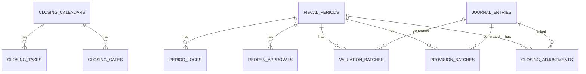
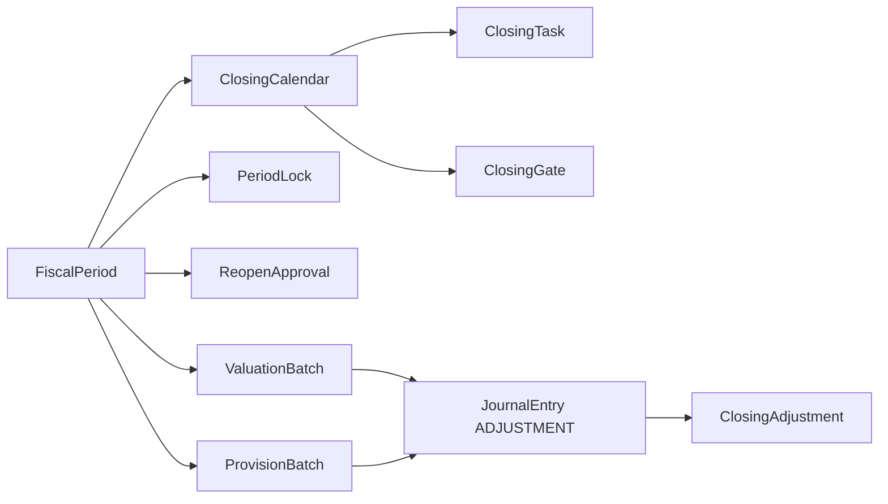

# closing schema

## 1. 한눈에 보는 구조

## 2. 핵심 엔티티

### 2.1 `closing_calendars`

결산 운영 단위 헤더다.

주요 컬럼:

- `id`
- `fiscal_year`
- `fiscal_period`
- `status`
- `close_initiated_by`
- `close_initiated_at`
- `closed_by`
- `closed_at`
- `reopened_by`
- `reopened_at`
- `is_current_period`

상태값:

- `OPEN`
- `IN_PROGRESS`
- `CLOSED`
- `PERMANENTLY_CLOSED`

### 2.2 `closing_tasks`

결산 체크리스트 항목이다.

주요 컬럼:

- `calendar_id`
- `name`
- `description`
- `category`
- `due_date`
- `assigned_to`
- `status`
- `completion_condition_json`
- `is_mandatory`
- `task_order`

상태값:

- `PENDING`
- `IN_PROGRESS`
- `COMPLETED`
- `FAILED`
- `SKIPPED`

### 2.3 `closing_gates`

결산 진행의 중요한 관문이다.

주요 컬럼:

- `calendar_id`
- `name`
- `description`
- `status`
- `check_condition_json`
- `passed_by`
- `passed_at`

상태값:

- `PENDING`
- `PASSED`
- `FAILED`

### 2.4 `period_locks`

회계기간 잠금 기록이다.

주요 컬럼:

- `fiscal_period_id`
- `lock_type`
- `locked_by`
- `locked_at`
- `reason`

잠금 유형:

- `ALL_TRANSACTIONS`
- `NON_ADJUSTMENT_ENTRIES`
- `PARTIAL_LOCK`

### 2.5 `reopen_approvals`

마감 기간 재오픈 승인 요청 기록이다.

주요 컬럼:

- `fiscal_period_id`
- `requested_by`
- `requested_at`
- `reason`
- `status`
- `approved_by`
- `approved_at`
- `impact_analysis_report`

상태값:

- `PENDING`
- `APPROVED`
- `REJECTED`

### 2.6 `valuation_batches`

평가 배치 실행 이력이다.

주요 컬럼:

- `fiscal_period_id`
- `valuation_type`
- `run_date_time`
- `status`
- `generated_journal_entry_id`
- `report_link`
- `run_by`

### 2.7 `provision_batches`

충당/손상 배치 실행 이력이다.

주요 컬럼:

- `fiscal_period_id`
- `provision_type`
- `run_date_time`
- `status`
- `generated_journal_entry_id`
- `report_link`
- `run_by`

### 2.8 `closing_adjustments`

결산 조정 전표 연결 테이블이다.

주요 컬럼:

- `fiscal_period_id`
- `journal_entry_id`
- `adjustment_type`
- `description`
- `approved_by`
- `approved_at`

### 2.9 `daily_closing_status`

일별 마감 상태 엔티티다.

주요 컬럼:

- `date`
- `is_closed`
- `closed_at`
- `closed_by`

주의:

- 엔티티는 존재하지만, 루트 문서 기준 현행 DDL에는 누락된 것으로 정리돼 있다.

### 2.10 `closing_period`

별도 `ClosingPeriod` 엔티티도 존재한다.

주의:

- 현재 `ClosingService`의 핵심 흐름은 주로 `FiscalPeriod`와 `ClosingCalendar`를 기준으로 움직인다.
- 즉, `ClosingPeriod`는 현재 운영 중심 모델이라기보다 보조/잔존 모델에 가깝다.

## 3. 데이터 흐름 관점

## 4. 초보자용 해석

- `ClosingCalendar`는 마감 프로젝트 보드다.
- `ClosingTask`는 할 일 목록이다.
- `ClosingGate`는 넘어가기 전에 확인해야 하는 관문이다.
- `PeriodLock`은 실거래를 막는 통제 장치다.
- `ReopenApproval`은 닫힌 문을 다시 열기 위한 승인 절차다.
- 배치와 조정은 결국 결산용 전표와 연결된다.
