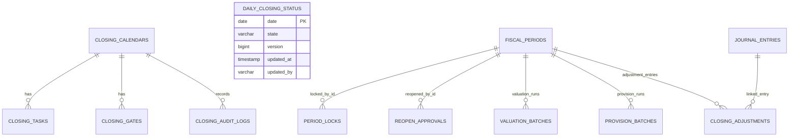

# Closing 데이터 모델

이 문서는 `closing` 모듈의 주요 저장 데이터와 외부 테이블 의존성을 정리합니다.

## 주요 엔티티



`FISCAL_PERIODS`와 `JOURNAL_ENTRIES`는 개념상 외부 모듈의 데이터입니다. `closing`은 JPA 엔티티를 직접 물고 가지 않고 포트와 ID 중심으로 연결합니다.

## 테이블별 역할

| 테이블 | 도메인 | 역할 |
| --- | --- | --- |
| `closing_calendars` | `ClosingCalendar` | 회계연도/기간별 마감 진행 상태 |
| `closing_tasks` | `ClosingTask` | 마감 체크리스트와 담당자/기한/완료 조건 |
| `closing_gates` | `ClosingGate` | 다음 단계로 진행하기 위한 통제 지점 |
| `period_locks` | `PeriodLock` | 회계기간 잠금 이력 |
| `reopen_approvals` | `ReopenApproval` | 닫힌 기간 재오픈 요청/승인 이력 |
| `valuation_batches` | `ValuationBatch` | FX 등 평가 배치 실행 기록 |
| `provision_batches` | `ProvisionBatch` | ECL 등 충당 배치 실행 기록 |
| `closing_adjustments` | `ClosingAdjustment` | 결산 조정 전표와 회계기간의 연결 |
| `closing_audit_logs` | `ClosingAuditLog` | 캘린더, 태스크, 게이트, 재오픈, 조정 감사 로그 |
| `daily_closing_status` | `DailyClosingStatus` | 날짜별 EOD/BOD 상태, 낙관적 버전, 단계별 처리자/시각 |

월·연 기간 상태는 `closing_calendars`와 Master Data의 `fiscal_periods`가 권위 모델입니다. 별도 `closing_period` 테이블과 setter 기반 병렬 엔티티는 사용하지 않습니다. 연차 손익 대체는 `AnnualClosingService`가 담당합니다.

## 외부 데이터 의존성

| 외부 데이터 | 제공 모듈 | `closing`에서 사용하는 이유 |
| --- | --- | --- |
| 회계기간 ID/기간/마감 상태 | `master-data` | 캘린더 생성, 마감 확정, 재오픈, 기간 잠금 |
| 전표 요약/상세 | `journal-ledger` | 결산 조정 전표 검증, 연차 손익 대체 집계 |
| `POSTED` 전표 라인 | `journal-ledger` | FX 거래통화/기준통화 잔액의 현재 원천 집계 |
| `gl_balances` | `journal-ledger` | ECL 기존 충당금의 기준일 최신 대변 잔액 조회 |
| 환율 | `master-data` | FX 평가 시 외화 금액을 보고통화로 재평가 |
| `allowance_summary` | `ecl` | ECL 목표 충당금 조회 |

## `allowance_summary` 연결 기준

ECL 충당 배치는 아래 컬럼을 기준으로 전표 금액과 계정 코드를 결정합니다.

| 컬럼 | 사용처 |
| --- | --- |
| `base_date` | `closingDate`와 일치하는 summary 조회 |
| `run_id`, `model_version` | lineage 추적 |
| `legal_entity_code`, `currency_code`, `exposure_account_code` | summary 식별과 전표번호 구분 |
| `allowance_account_code` | 대손충당금 계정 |
| `bad_debt_expense_account_code` | 보충 적립 시 비용 계정 |
| `reversal_income_account_code` | 환입 시 수익 계정 |
| `target_allowance_amount` | 목표 충당금 |

현재 배치는 JDBC에서 동일 run/model·법인·계정/통화별 금액을 먼저 합산하고, 그룹당 기존 GL 충당금 잔액을 한 번만 차감합니다. GL 잔액은 `debit - credit` 부호로 저장되므로 충당금 조회 어댑터가 대변 잔액을 양수로 변환합니다. GL에 법인 차원이 없기 때문에 한 실행에 여러 법인이 있으면 실패합니다.

## 설정 키

| 설정 | 기본값/예시 | 설명 |
| --- | --- | --- |
| `account.closing.accounting.fx-valuation-reporting-currency-code` | `KRW` | FX 평가 보고통화 |
| `account.closing.accounting.fx-translation-gain-account-code` | `72000` | 외화환산이익 계정 |
| `account.closing.accounting.fx-translation-loss-account-code` | `92000` | 외화환산손실 계정 |
| `account.closing.accounting.auto-post-adjustments` | `false` | 결산 조정 전표 자동 승인/전기 여부 |
| `account.closing.accounting.valuation-rules.FX_RATE.*` | 운영 설정 필요 | API 평가 배치가 만들 자동분개 룰 |
| `account.closing.accounting.provision-rules.ECL.*` | 운영 설정 필요 | API 충당 배치가 만들 자동분개 룰 |
| `account.closing.batch.fx.chunk-size` | `1000` | FX Cursor 처리와 트랜잭션 checkpoint 단위 |
| `account.closing.batch.fx.grid-size` | `4` | FX 병렬 계정 범위와 동시 실행 상한 |

## 알려진 스키마 후속 작업

- V50은 legacy `daily_closing_status.is_closed`를 `OPEN`/`CLOSED`로 backfill하고 Boolean 컬럼을 제거합니다. Closing API는 전용 Flyway 위치 `classpath:db/closing-migration`과 이력 테이블 `flyway_schema_history_closing`을 사용하고 기존 스키마는 49에서 baseline합니다.
- `period_locks`는 현재 unlock 시 감사 로그를 남기고 활성 행을 삭제합니다. `active`, `unlocked_by`, `unlocked_at`, `unlock_reason`을 추가하는 forward migration 후 이력 행 보존 방식으로 전환해야 합니다.
- FX용 `gl_account_balances`에는 생산 writer가 없어서 사용하지 않습니다. 전기와 함께 갱신되는 이중통화 read model과 원장 대사 절차를 별도 migration으로 추가해야 합니다.
- `valuation_batches`/`provision_batches`에는 기간·유형·기준일·요청 키의 멱등 unique key가 아직 없습니다. 중복 요청과 crash recovery를 포함한 migration이 필요합니다.

## 운영 점검 SQL 예시

```sql
SELECT fiscal_year, fiscal_period, status
FROM closing_calendars
ORDER BY fiscal_year, fiscal_period;
```

```sql
SELECT base_date, legal_entity_code, currency_code, allowance_account_code, target_allowance_amount
FROM allowance_summary
WHERE base_date = DATE '2026-04-30'
ORDER BY legal_entity_code, currency_code, allowance_account_code;
```

```sql
SELECT fiscal_period_id, adjustment_type, journal_entry_id, approved_by, approved_at
FROM closing_adjustments
ORDER BY approved_at DESC;
```
