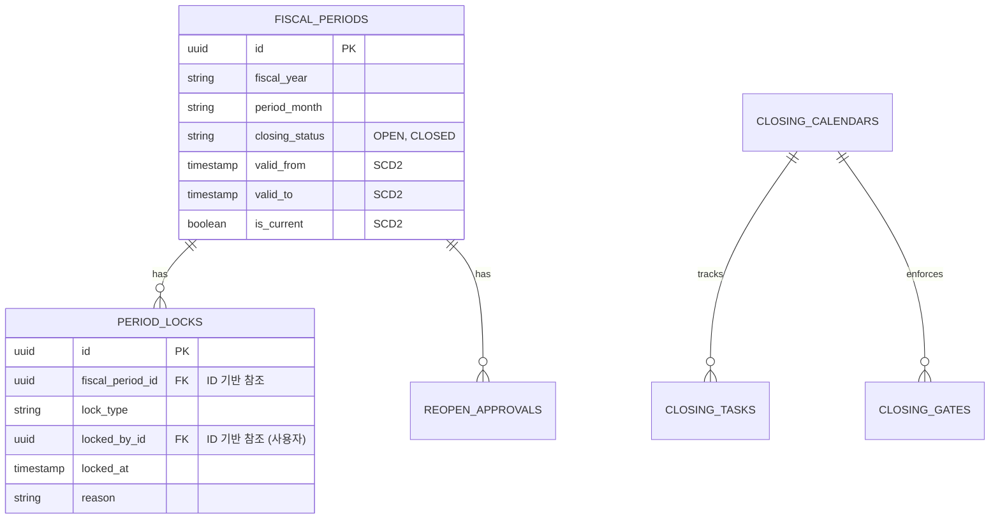

# Closing Schema

## 1. 엔티티 구조도 (ID 기반 및 이력 보존 중심)

## 2. 핵심 설계 개념

### 2.1 헥사고날 관점의 DB 분리
DB 엔티티와 비즈니스 객체는 분리됩니다. DB에서 조회된 `FISCAL_PERIODS` 데이터(어댑터 계층)는 마감 로직(도메인 계층)으로 들어갈 때 순수 자바 객체로 매핑됩니다. 따라서 DB 스키마가 변경되어도 검증 로직 자체는 수정되지 않습니다.

### 2.2 ID 기반 식별자 적극 도입
- `locked_by_id`, `approved_by_id` 등 결산을 수행하거나 재오픈을 승인한 주체는 텍스트 이름이나 부서 코드가 아닌 확실한 시스템 ID값으로 매핑됩니다. 사용자 정보가 필요할 땐 이 ID를 기반으로 Auth/User 모듈에서 가져옵니다.

### 2.3 회계 기간에 대한 SCD2 설계 적용
- 가장 중요한 `FISCAL_PERIODS` 엔티티는 상태 변경(예: `OPEN` -> `CLOSED`) 시 물리적인 덮어쓰기 대신 변경 이력을 쌓는 SCD2 방식을 적용하거나, 그에 준하는 완벽한 감사 테이블을 둡니다. 이를 통해 "작년 3월 마감이 언제 정확히 잠겼고, 언제 다시 열렸었는지"를 쿼리 한 번으로 시계열 분석할 수 있습니다.

### 2.4 배치 트랜잭션과 조정 전표
- `VALUATION_BATCHES`와 `CLOSING_ADJUSTMENTS` 테이블은 배치 작업의 결과물인 `journal_entry_id`만을 참조값으로 들고 있습니다. 원본 전표 데이터는 원장 모듈이 관리하므로 철저한 ID 참조 및 관심사 분리가 달성되었습니다.