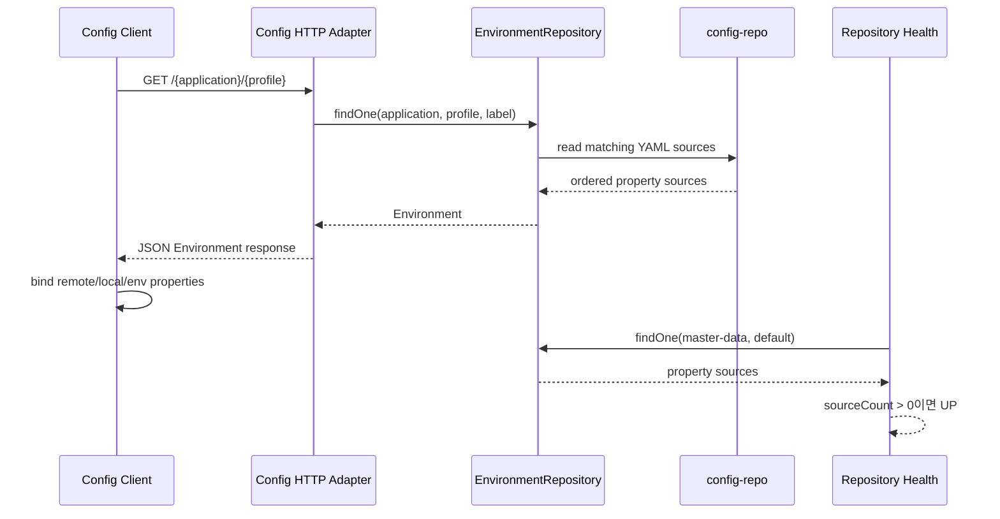

# Config Server process flow

## 설정 조회 데이터 흐름



## 메서드와 객체 책임 순서

1. Spring MVC Config endpoint가 URL의 application/profile/label을 해석합니다.
2. Spring Cloud Config의 `EnvironmentRepository`가 backend 기술을 숨깁니다.
3. 현재 native adapter가 `config-repo`의 YAML을 읽습니다.
4. 프레임워크가 우선순위가 있는 `Environment.propertySources`를 만듭니다.
5. HTTP adapter가 값을 다시 계산하지 않고 그대로 직렬화합니다.
6. 클라이언트가 자신의 Environment에 바인딩합니다.

이 모듈에는 금액 계산, 상태 전이, 승인 같은 도메인 규칙을 넣지 않습니다. Config Server 자체가 인프라 inbound/outbound adapter이며, 저장소 가용성 판단만 프로젝트 정책으로 추가합니다.

## 대표 설정 readiness 흐름

`ConfigRepositoryHealthIndicator`는 다음 규칙을 적용합니다.

```text
EnvironmentRepository.findOne(probeApplication, probeProfile, probeLabel)
  -> 조회 예외이면 DOWN
  -> propertySources가 비어 있으면 DOWN
  -> 하나 이상이면 UP
```

health 응답에는 설정 값이나 저장소 URL을 싣지 않고 application/profile/sourceCount만 기록합니다. Docker healthcheck는 `/actuator/health/readiness`를 호출하며, root Compose에서 Config Server에 의존하는 15개 서비스는 `service_healthy`를 기다립니다.

## 전체 MSA 기동 순서

```text
Config Server readiness UP
  -> Discovery readiness UP
  -> Auth와 업무 서비스
  -> Gateway
```

일부 서비스의 Config import가 `optional`이면 Config Server 없이도 로컬 기본값으로 시작할 수 있습니다. 전체 MSA 통합 실행에서는 중앙 포트와 주소를 일치시키기 위해 위 순서를 사용합니다.

## 장애와 변경 흐름

| 상황 | 결과 | 대응 |
| --- | --- | --- |
| 대표 설정 조회 성공 | readiness UP | 의존 서비스 시작 |
| 대표 설정 결과가 비어 있음 | readiness DOWN | application/profile/경로 확인 |
| native 저장소 접근 실패 | readiness DOWN | volume/권한/경로 확인 |
| 클라이언트가 `optional` import 사용 | 로컬 설정으로 기동 가능 | 중앙 설정과 값 차이 확인 |
| 실행 중 파일만 변경 | 다음 Config 조회에는 반영 가능 | 클라이언트 재시작/검증된 refresh 필요 |
| 잘못된 설정 배포 | 서비스 기동/업무 오류 가능 | 승인 버전으로 rollback |

## 현재 설정 원본

- `auth-service.yml`
- `discovery-service.yml`
- `gateway-service.yml`
- `governance-service.yml`
- `journal-ledger.yml`
- `master-data.yml`

파일명은 클라이언트의 `spring.application.name`과 일치해야 합니다. 민감 값은 평문 YAML에 확정하지 않고 환경변수나 승인된 secret 관리 체계로 분리합니다.