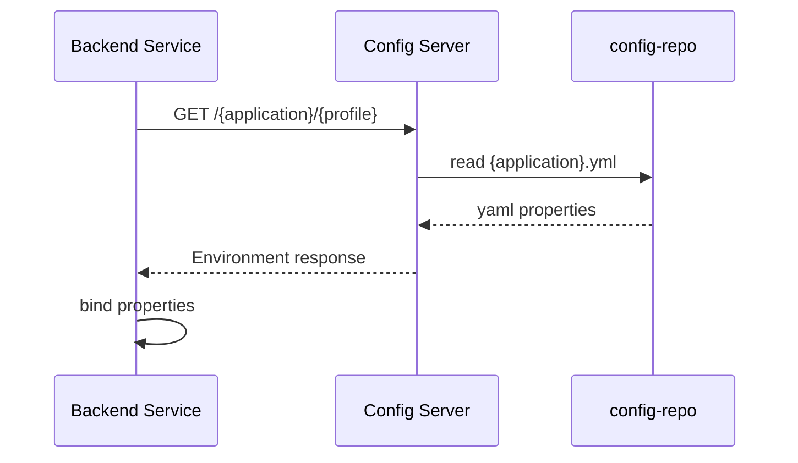

# config-server process flow

## 설정 조회 흐름



## 현재 설정 파일

| 파일 | 대상 서비스 |
| --- | --- |
| `config-repo/auth-service.yml` | Auth |
| `config-repo/discovery-service.yml` | Discovery |
| `config-repo/gateway-service.yml` | Gateway |
| `config-repo/governance-service.yml` | Governance |
| `config-repo/master-data.yml` | Master Data |
| `config-repo/journal-ledger.yml` | Journal Ledger |

## 로컬 인프라 기동 순서

```text
config-server -> discovery -> auth/master-data/governance/journal-ledger -> gateway
```

Config Server는 가장 먼저 켭니다. Discovery는 Config Server에서 포트와 Eureka 설정을 받아오고, 그 뒤 업무 서비스와 Gateway가 Eureka에 등록됩니다.

## 운영 확장 포인트

- native file system 대신 Git backend 사용.
- secret 값은 plain yaml이 아니라 Vault, 환경변수, 배포 시스템 secret으로 분리.
- 설정 변경 후 refresh 전략 정리.
