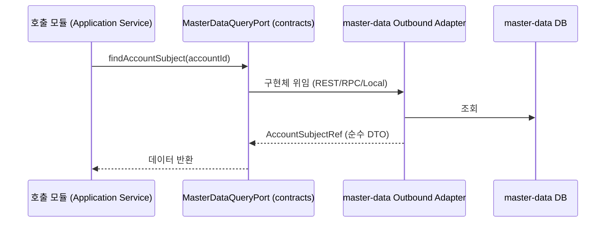
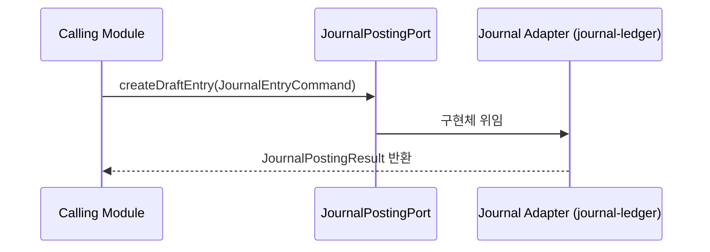

# contracts 프로세스 흐름 (Process Flow)

## 1. 헥사고날 아키텍처의 포트(Port) 중심 호출 흐름

```mermaid
flowchart TD
    A[호출 모듈\n(예: expenditure-resolution)] --> B[Outbound Port\n(contracts 정의)]
    B --> C[수신 모듈\n(예: journal-ledger) Inbound Adapter]
    C --> D[수신 모듈\nApplication Service]
```

`contracts` 모듈 자체는 프로세스를 실행하지 않습니다. 시스템의 전체적인 흐름이 "어떻게 연결되는지"에 대한 규약을 제공할 뿐입니다.

## 2. 마스터 데이터 ID 기반 참조 흐름 (조회 계약)


호출 모듈은 `master-data` 엔티티 구조를 모르며, SCD2 등 내부 이력 관리 방식에도 영향을 받지 않습니다.

## 3. 전표 생성 계약 흐름 (명령 계약)


전표를 발행하고자 하는 모든 모듈(자산, 지출, 마감 등)은 오직 이 Command 규약에 맞춰 데이터를 조립합니다.

## 4. 소스문서 드릴다운 (Lineage) 추적 흐름

```mermaid
flowchart TD
    A[조회 API / UI] --> B[SourceDocumentProvider 포트]
    B --> C{supports(lineageSourceType)?}
    C -- loan --> D[loan 모듈 제공자]
    C -- asset --> E[asset-lease 모듈 제공자]
    D --> F[원문서 JSON Map 반환]
    E --> F
```
`journal-ledger`에서 전표를 볼 때, 해당 전표가 어디서 왔는지(원문서) 추적할 수 있도록 돕는 다형성 계약입니다. 각 모듈은 자신만의 Provider를 구현합니다.