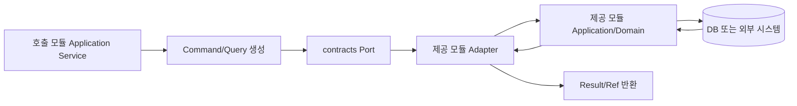
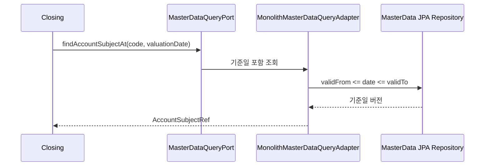

# Contracts 업무 및 데이터 흐름

## 1. 전체 호출 순서



`contracts`는 C 지점의 의미와 입력/출력 형식을 소유합니다. 트랜잭션, 승인, 계산, 저장은 제공
모듈이 소유합니다.

## 2. 전표 생성

1. 호출 서비스가 업무 엔티티의 승인/상태를 확인합니다.
2. `JournalLineCommand`를 생성하면서 차대 코드, 계정 코드, 금액 필수 형식을 검증합니다.
3. `JournalEntryCommand`가 일자와 비어 있지 않은 라인 목록을 확인하고 List를 불변 복사합니다.
4. `JournalPostingPort.createDraftEntry()`를 호출합니다.
5. journal-ledger Adapter가 계약을 도메인 전표로 변환합니다.
6. journal-ledger가 차변/대변 합계, 회계기간, 계정 사용 가능 여부를 검증합니다.
7. 저장 결과를 `JournalPostingResult`로 반환합니다.

계약 검증과 도메인 검증을 분리하는 이유는 “필드가 없음”과 “업무상 전기 불가”를 서로 다른
책임으로 처리하기 위해서입니다.

## 3. 기준정보 SCD2 조회



실제 master-data 어댑터는 계정과목, 거래처, 부서의 기준일 조회를 구현합니다. 호환용 default는
아직 일부 로컬/원격 어댑터를 위해 남아 있으며 제거 TODO가 있습니다.

## 4. 원문서 드릴다운

`SourceDocumentProvider`는 같은 Spring 프로세스의 제공 Bean을 capability로 찾습니다. 이는
Eureka 주소 검색이 아닙니다.

```text
Journal UI/API
  -> SourceDocumentService
  -> 로컬 ServiceDiscoveryRegistry
  -> SourceDocumentProvider.supports(sourceType)
  -> 제공 모듈 원문서 조회
  -> Map 응답
```

현재 Map 응답은 필드 버전과 민감정보 통제가 약하므로 sourceType별 DTO로 교체할 TODO가 있습니다.

## 5. 원격 MSA로 분리할 때

Port 메서드가 자동으로 네트워크 호출로 바뀌지 않습니다. 별도 어댑터에서 다음을 결정합니다.

- REST/Feign/Kafka 중 어떤 전송을 사용할지
- timeout/retry/circuit breaker
- 404, 업무 거절, 일시 장애의 오류 의미
- 계약 version과 하위 호환성
- 민감정보와 감사 추적