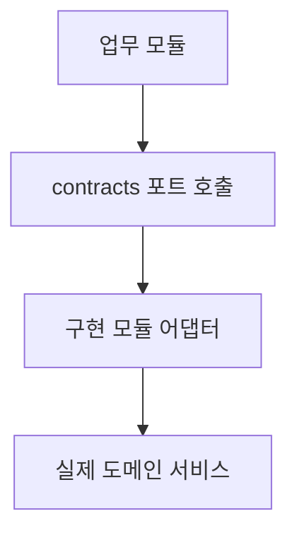
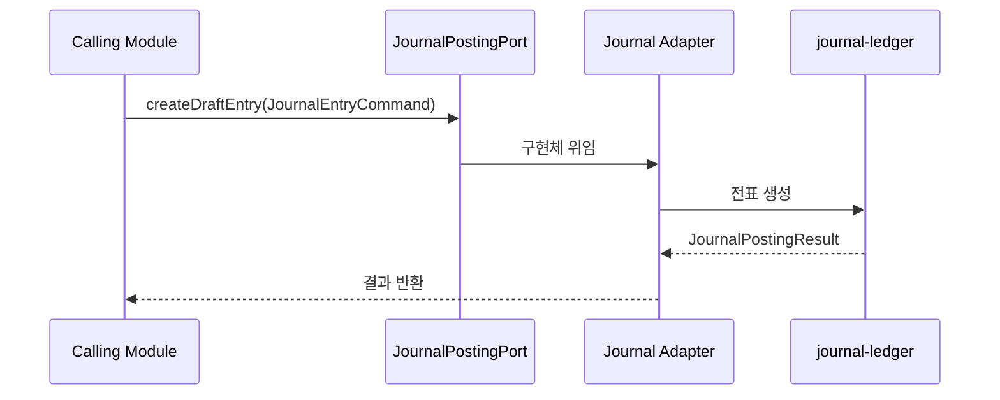
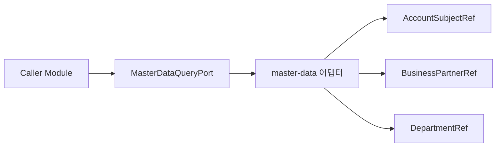
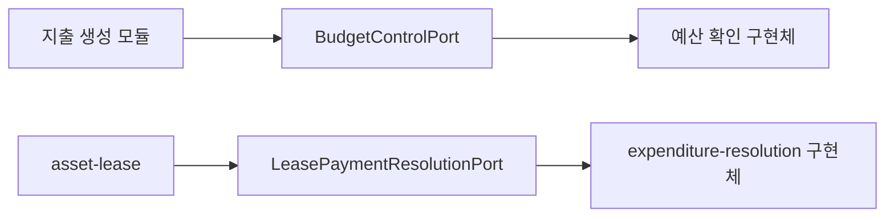
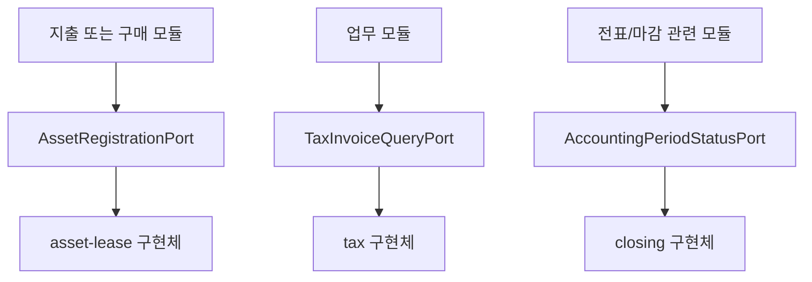

# Contracts Process Flow

## 1. 전체 역할



설명:
- `contracts`는 직접 일을 하지 않습니다.
- 대신 "어떻게 호출할지"를 통일합니다.

## 2. 전표 생성 계약 흐름



핵심 입력:
- 전표 헤더: `JournalEntryCommand`
- 전표 라인: `JournalLineCommand`

핵심 출력:
- `JournalPostingResult`

## 3. 마스터 조회 계약 흐름



설명:
- 호출자는 계정, 거래처, 부서를 직접 JPA로 보지 않고 참조용 DTO만 받습니다.
- 그래서 다른 모듈이 `master-data` 내부 엔티티에 직접 의존하지 않아도 됩니다.

## 4. 소스문서 드릴다운 계약 흐름

```mermaid
flowchart TD
    A[UI 또는 분개 조회] --> B[lineageSourceType / lineageSourceId]
    B --> C[SourceDocumentProvider 목록]
    C --> D{supports(type)?}
    D -- 예 --> E[getSourceDocument]
    D -- 아니오 --> F[다음 provider]
    E --> G[원문서 맵 반환]
```

설명:
- `journal-ledger`, `loan`, `asset-lease` 같은 모듈이 이 계약을 구현합니다.
- 구현체는 자신이 다루는 `lineageSourceType`만 응답합니다.

## 5. 예산/지출 연계 흐름



설명:
- 예산 확인은 `BudgetControlPort.checkBudgetAvailability(...)`로 호출합니다.
- 리스 월지급 해소는 `LeasePaymentResolutionCommand`로 전달됩니다.

## 6. 자산/세금/마감 연계 흐름



설명:
- 자산 취득 자동 등록과 리스 활성화는 `AssetRegistrationPort`가 담당합니다.
- 세금계산서 참조는 최소 DTO `TaxInvoiceRef`로 가져옵니다.
- 마감 여부 확인은 회계일자 기준 boolean 계약으로 단순화되어 있습니다.

## 7. 현재 구현상 주의점

- 계약은 단순하지만, 실제 검증 규칙은 구현 모듈마다 다릅니다.
- `SourceDocumentProvider`는 반환 타입이 `Map<String, Object>`라 컴파일 타입 안전성이 낮습니다.
- `AccountingPeriodStatusPort`는 닫힘 여부만 제공해서 세부 마감 사유는 담지 않습니다.
