# Contracts Schema

## 1. 계약 맵

```mermaid
flowchart TD
    A[Journal Contracts]
    B[Master Data Contracts]
    C[Source Contracts]
    D[Expenditure Contracts]
    E[Asset Contracts]
    F[Tax Contracts]
    G[Closing Contracts]

    A --> A1[JournalPostingPort]
    A --> A2[JournalEntryCommand]
    A --> A3[JournalLineCommand]
    A --> A4[JournalPostingResult]

    B --> B1[MasterDataQueryPort]
    B --> B2[AccountSubjectRef]
    B --> B3[BusinessPartnerRef]
    B --> B4[DepartmentRef]

    C --> C1[SourceDocumentProvider]
    D --> D1[BudgetControlPort]
    D --> D2[LeasePaymentResolutionPort]
    D --> D3[LeasePaymentResolutionCommand]
    E --> E1[AssetRegistrationPort]
    E --> E2[AssetAcquisitionCommand]
    F --> F1[TaxInvoiceQueryPort]
    F --> F2[TaxInvoiceRef]
    G --> G1[AccountingPeriodStatusPort]
```

## 2. Journal 계약

### `JournalPostingPort`

메서드:
- `JournalPostingResult createDraftEntry(JournalEntryCommand command)`

의미:
- 호출 모듈이 초안 전표 생성을 요청할 때 쓰는 공통 포트입니다.

### `JournalEntryCommand`

필드:
- `slipDate`
- `accountingDate`
- `description`
- `entryType`
- `currencyCode`
- `exchangeRate`
- `createdBy`
- `auditUser`
- `lineageSourceType`
- `lineageSourceId`
- `lines`

의미:
- 전표 헤더 전체를 한 번에 전달합니다.

### `JournalLineCommand`

필드:
- `drcrType`
- `accountCode`
- `amount`
- `baseAmount`
- `departmentCode`
- `businessPartnerCode`
- `detailDescription`

의미:
- 전표 상세라인 한 건을 표현합니다.

### `JournalPostingResult`

필드:
- `journalEntryId`
- `slipNo`
- `status`

의미:
- 전표 생성 후 호출자에게 최소 결과만 반환합니다.

## 3. Master Data 계약

### `MasterDataQueryPort`

메서드:
- `findAccountSubject(String accountCode)`
- `findBusinessPartner(String businessPartnerCode)`
- `findDepartment(String departmentCode)`

반환:
- `Optional<AccountSubjectRef>`
- `Optional<BusinessPartnerRef>`
- `Optional<DepartmentRef>`

### `AccountSubjectRef`

필드:
- `code`
- `name`
- `unsettled`
- `fixedAsset`

### `BusinessPartnerRef`

필드:
- `code`
- `name`
- `partnerType`
- `active`

### `DepartmentRef`

필드:
- `code`
- `name`
- `type`

## 4. Expenditure 계약

### `BudgetControlPort`

메서드:
- `checkBudgetAvailability(String yearMonth, String departmentCode, String accountCode, BigDecimal amount)`

의미:
- 예산 가능 여부를 검사하고, 부족하면 구현체가 예외를 던지는 방식으로 쓰입니다.

### `LeasePaymentResolutionPort`

메서드:
- `createLeasePaymentResolution(LeasePaymentResolutionCommand command)`

### `LeasePaymentResolutionCommand`

필드:
- `title`
- `resolutionDate`
- `paymentDate`
- `departmentCode`
- `accountCode`
- `businessPartnerCode`
- `amount`
- `detailDescription`

## 5. Asset 계약

### `AssetRegistrationPort`

메서드:
- `registerAcquiredAsset(AssetAcquisitionCommand command)`
- `activateLeaseContract(Long leaseContractId)`

### `AssetAcquisitionCommand`

필드:
- `assetCode`
- `assetName`
- `accountCode`
- `acquisitionDate`
- `acquisitionCost`
- `departmentCode`
- `usefulLife`
- `depreciationMethod`
- `status`

## 6. Tax / Closing / Source 계약

### `TaxInvoiceQueryPort`

메서드:
- `findById(Long taxInvoiceId)`

반환:
- `Optional<TaxInvoiceRef>`

### `TaxInvoiceRef`

필드:
- `id`
- `issueId`
- `type`

### `AccountingPeriodStatusPort`

메서드:
- `boolean isClosed(LocalDate accountingDate)`

### `SourceDocumentProvider`

메서드:
- `boolean supports(String lineageSourceType)`
- `Optional<Map<String, Object>> getSourceDocument(String lineageSourceType, String lineageSourceId)`

## 7. 읽을 때 중요한 점

- `contracts`는 저장 테이블이 없고, 타입 계약만 있습니다.
- 스키마라는 말도 여기서는 "데이터 구조 계약"에 가깝습니다.
- 이 모듈의 변경은 여러 모듈 컴파일에 동시에 영향을 줍니다.
