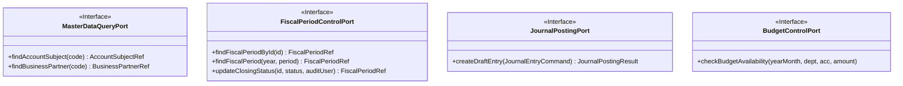

# contracts 스키마 (Schema)

## 1. 개념적 스키마 (DTO 및 Port 구조)

`contracts` 모듈은 물리적인 데이터베이스 테이블을 가지지 않습니다. 이곳의 스키마는 **데이터 교환을 위한 순수 객체(Command, Reference DTO)** 구조를 의미합니다. 다른 모듈의 멀티 스테이지 환경 배포를 위해 REST API 페이로드 또는 Kafka 이벤트 메시지로 직렬화/역직렬화하기 좋은 형태로 유지해야 합니다.

## 2. 주요 Reference DTO (읽기 전용 계약)

다른 모듈의 데이터를 참조할 때 사용하는 가벼운 객체입니다. Entity가 아님에 주의합니다.

### `AccountSubjectRef`
- `code` (String, 식별자)
- `name` (String)
- `unsettled` (Boolean, 미결 여부)

### `BusinessPartnerRef`
- `code` (String)
- `name` (String)

### `FiscalPeriodRef`
- `id` (Long)
- `fiscalYear` (String)
- `fiscalPeriod` (String)
- `startDate` / `endDate` (LocalDate)
- `closingStatus` (String)

## 3. 주요 Command DTO (쓰기/명령 계약)

다른 모듈에 작업을 지시할 때 사용하는 객체입니다.

### `JournalEntryCommand`
- `slipDate` (LocalDate)
- `accountingDate` (LocalDate)
- `lineageSourceType` (String - 이력 추적용)
- `lineageSourceId` (String - 이력 추적용)
- `lines` (List&lt;JournalLineCommand&gt;)

### `JournalLineCommand`
- `drcrType` (Enum: DEBIT/CREDIT)
- `accountCode` (String)
- `amount` (BigDecimal)
- `departmentCode` (String)

## 4. 헥사고날/MSA 환경에서의 원칙
- **결합도 최소화:** 이 모듈 안에는 `@Entity`나 `@Table`, JPA 관련 어노테이션이 절대 포함되어서는 안 됩니다.
- **불변성(Immutability):** 가급적 Record 클래스나 final 필드를 사용하여 전달 중 값이 오염되지 않도록 합니다.
