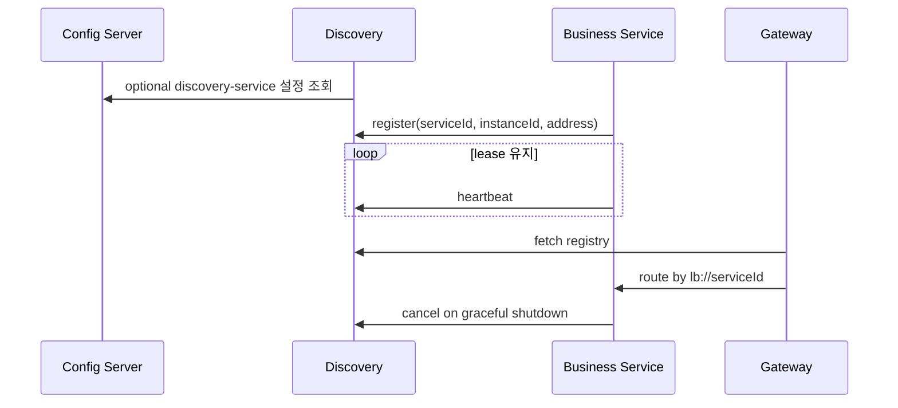

# Discovery Concept

## 1. 한 문장 요약

`discovery`는 MSA 환경의 서비스 전화번호부이자 살아 있는 인스턴스의 lease 상태 저장소입니다. Gateway는 IP를 하드코딩하지 않고 서비스 ID로 현재 `UP`인 인스턴스를 찾습니다.

## 2. 왜 필요한가

서비스는 재배포·수평 확장·장애 복구 때 주소가 바뀝니다. 호출자가 주소 목록을 직접 관리하면 다음 문제가 생깁니다.

- 죽은 인스턴스로 계속 요청할 수 있음
- 인스턴스 추가/제거마다 설정과 배포가 필요함
- Gateway와 서비스마다 서로 다른 주소 목록을 가질 수 있음

Eureka는 등록 정보와 lease를 중앙에서 관리해 이 목록을 일관된 방식으로 제공합니다.

## 3. 핵심 용어

| 용어 | 초보자 설명 | 현재 역할 |
|---|---|---|
| service ID | 전화번호부의 부서 이름 | `AUTH-SERVICE`, `MASTER-DATA` 등 |
| instance ID | 같은 부서 안의 한 직원/서버 식별자 | 프로세스별 고유값 |
| register | 영업 시작 신고 | 시작 시 주소·상태·metadata 등록 |
| heartbeat/renew | 아직 살아 있다는 주기적 신호 | lease 만료 방지 |
| fetch registry | 현재 전화번호부 내려받기 | Gateway/서비스 client cache 갱신 |
| cancel | 정상 종료 신고 | instance 제거 |
| eviction | heartbeat 없는 lease 정리 | server의 만료 판단 |
| self-preservation | 대규모 통신 장애 때 삭제 보류 | 기본값 `true` 유지 |

## 4. 실행 흐름



Config Server가 없어도 Discovery는 local 기본값으로 8761에서 시작합니다. Config Server가 있으면 같은 포트/서버 전용 client 정책과 관측 설정을 중앙에서 보강합니다.

## 5. 책임 경계

- Discovery는 계정, 권한, 전표, 마감, 금액 업무 규칙을 소유하지 않습니다.
- Eureka 라이브러리가 registry/lease/peer 알고리즘을 수행합니다.
- 이 모듈은 실행 진입점, Config 연결, 단일 노드 기본값, readiness, 관측, Docker 기동 순서와 검증을 소유합니다.
- 라우팅 경로와 JWT 정책은 Gateway/Config Repo가 소유합니다.
- 각 서비스의 올바른 service ID/health URL/metadata는 해당 서비스가 소유합니다.

인프라 프레임워크를 단순 감싸기 위해 의미 없는 Service/Repository를 추가하지 않습니다. 대신 실제 register -> lookup -> cancel 흐름과 설정 정책을 통합 테스트로 검증합니다.

## 6. self-preservation과 정합성

Eureka는 예상 heartbeat 수가 급격히 줄면 네트워크 분리 가능성을 고려해 lease eviction을 보수적으로 수행합니다. 이를 꺼 버리면 일시적인 네트워크 장애가 전체 서비스 제거로 이어질 수 있습니다.

- 현재 기본값 `true` 유지
- 로컬 테스트에서만 registry 동작을 빠르게 확인하기 위한 별도 test property 사용
- 운영 임계값 변경 전 heartbeat 주기, 인스턴스 수, 네트워크 장애 시나리오 부하 검증 필요

## 7. readiness와 Compose

프로세스가 생성됐다는 사실만으로 registry가 요청을 받을 준비가 됐다고 볼 수 없습니다.

```text
Discovery process start
  -> Spring context
  -> Eureka server context/registry initialization
  -> actuator readiness UP
  -> Docker healthy
  -> dependent services start and register
```

루트 Compose는 Discovery를 참조하는 서비스에 `condition: service_healthy`를 적용합니다. Dockerfile healthcheck는 `/actuator/health/readiness`를 호출합니다.

## 8. 보안과 HA 경계

현재는 단일 노드/내부망 개발 구성이며 Dashboard와 registration API에 앱 인증을 강제하지 않습니다.

- 운영에서는 8761을 private network로 제한해야 합니다.
- 서비스가 임의 이름/주소를 등록하지 못하도록 mTLS 또는 자격 증명 정책이 필요합니다.
- 멀티 AZ 전환 시 peer Eureka URL, registry sync, split-brain, 한 노드 장애 시 client failover를 검증해야 합니다.

정책/인프라 주소가 확정되지 않았으므로 두 항목은 `config-repo/discovery-service.yml`의 명시적 `@todo`입니다.
