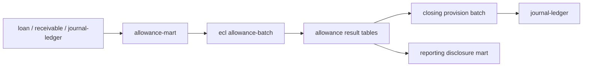

# Account Mart / ECL 대손충당금 전용화 설계

## 1. 결론

`account-mart`와 `ecl`은 대손충당금 산출에 활용할 수 있다. 다만 현재 상태는 기존 대손충당금(IFRS9)/규제자본 시스템을 통째로 가져온 구조라서, 그대로 결산 모듈에 붙이면 빌드 좌표, 패키지, 공통 모듈, 산출 범위가 모두 충돌한다.

전환 방향은 다음과 같다.

- `account-mart`: 전사 리스크 데이터 마트가 아니라 **ECL 산출 입력 마트**로 축소한다.
- `ecl`: RWA/국제 금융 규제/감독보고/집중도 분석 엔진이 아니라 **IFRS 9 대손충당금 산출 엔진**으로 축소한다.
- `closing`: 현재 고정 1% 충당률 계산을 제거하고, ECL 산출 결과의 **목표 충당금**을 읽어 보충법 전표만 생성한다.

## 2. 현재 구조 분석

### 2.1 account-mart

현재 역할:

- ODS 계좌원장, 고객, 상품, 담보, 금리, 잔액 이력을 읽어 통합 리스크 포지션 CDM을 만든다.
- `IntegratedPositionProcessor`가 계좌원장과 고객/조기경보/금리 정보를 결합해 `IntegratedRiskPosition`을 생성한다.
- DQ, ODS 대사, 시장데이터, IRRBB/금리리스크, RWA 배분 원장까지 포함한다.

대손충당금에 필요한 부분:

- 계좌/차주/상품/담보/연체/등급/만기/통화/잔액/한도/조기경보/채무조정 여부.
- 기준일별 원천 합계와 GL 대사 결과.
- ECL 산출 대상 여부와 회계 계정 매핑.

줄일 부분:

- IRRBB, 시장금리 VaR, Stress Simulator, RWA Allocation Ledger, 감독보고 확장 테이블.
- 프론트/API 조회 기능 중 ECL 산출 입력 검증과 배치 상태 조회에 직접 필요 없는 화면성 API.

### 2.2 ecl

현재 역할:

- PD, LGD, EAD, ECL, RWA를 모두 산출한다.
- `CreditRiskCalculator.calculateEcl`과 `ForwardLookingEclService`는 대손충당금 핵심 재사용 대상이다.
- `EclProcessor`는 Lifetime PD와 미래전망 시나리오를 결합해 `weightedEcl`을 산출한다.
- `RwaProcessor`, `SaRwMapper`, 규제보고/집중도/스트레스 서비스는 대손충당금 전용 범위 밖이다.

대손충당금에 필요한 부분:

- IFRS 9 Stage 1/2/3 판정.
- 12개월 PD와 Lifetime PD 곡선.
- EAD, LGD, CCF, 담보 회수 효과.
- 거시경제 시나리오별 PD 조정과 가중평균 ECL.
- 기준일, 실행 ID, 모델 버전, 입력 스냅샷, 산출 근거 저장.

줄일 부분:

- RWA SA/IRB, K-value, asset correlation, 국제 금융 규제 파라미터.
- 감독보고 요약, 집중도 분석, 자본 최적화 목적의 담보 배분.
- 규제자본 테스트와 API는 보관하더라도 기본 실행 경로에서 제외한다.

### 2.3 현재 closing ECL 배치

현재 `closing`의 `EclProvisionService`는 다음 한계를 가진다.

- 대출채권 계정이 하드코딩되어 있다.
- KRW가 하드코딩되어 있다.
- 목표 충당금을 `대출채권 잔액 * 1%`로 산출한다.
- 환입 시 별도 환입 수익 계정이 아니라 비용 계정을 재사용한다.
- 자동 승인/전기가 별도 결산 승인 정책을 거치지 않는다.

따라서 `closing`은 계산 엔진이 아니라 회계처리 엔진으로 역할을 줄여야 한다.

## 3. 목표 아키텍처



### 3.1 모듈 책임

| 모듈 | 목표 책임 | 금지할 책임 |
| --- | --- | --- |
| `account-mart` | ECL 입력 데이터 정규화, 원천/GL 대사, DQ, 산출 대상 스냅샷 생성 | ECL 금액 산출, 전표 생성 |
| `ecl` | IFRS 9 Stage/PD/LGD/EAD/ECL 산출, 산출 결과와 모델 버전 저장 | 전표 생성, 마감 승인, RWA/감독보고 본산출 |
| `closing` | 목표 충당금과 기존 충당금 차이 계산, 보충/환입 전표 생성, 결산 통제 | PD/LGD/EAD 직접 계산 |
| `reporting` | 산출 결과와 전표를 공시/감독보고 라인으로 연결 | 모델 파라미터 변경 |

### 3.2 포트 설계

`closing`은 `ecl` 구현체를 직접 참조하지 않는다. `closing:core`에 다음 outbound port를 두고, `closing:batch`가 이 포트를 사용한다.

```java
public interface EclAllowanceResultPort {
    List<EclAllowanceSummary> loadSummaries(LocalDate baseDate);
}
```

어댑터 후보:

- 단일 런타임 통합 단계: `JdbcEclAllowanceResultAdapter` (1차 구현 완료)
- MSA 분리 단계: `RestEclAllowanceResultAdapter`
- 테스트: `InMemoryEclAllowanceResultAdapter`

반환 모델 최소 필드:

- `baseDate`
- `runId`
- `modelVersion`
- `legalEntityCode`
- `currencyCode`
- `exposureAccountCode`
- `allowanceAccountCode`
- `badDebtExpenseAccountCode`
- `reversalIncomeAccountCode`
- `targetAllowanceAmount`
- `sourceExposureAmount`
- `stage1AllowanceAmount`
- `stage2AllowanceAmount`
- `stage3AllowanceAmount`

## 4. 데이터 모델 초안

### 4.1 allowance exposure snapshot

ECL 산출 입력 스냅샷. `account-mart`가 생성하고 `ecl`이 읽는다.

필수 키:

- `base_date`
- `exposure_id`
- `source_system`
- `source_account_no`
- `customer_code`
- `customer_type`
- `is_sme`
- `country_code`
- `industry_code`
- `product_code`
- `product_category`
- `legal_entity_code`
- `branch_code`
- `currency_code`

산출 입력:

- `outstanding_amount`
- `undrawn_amount`
- `interest_rate`
- `effective_interest_rate`
- `open_date`
- `maturity_date`
- `delinquent_days`
- `staging`
- `original_rating`
- `current_rating`
- `warning_level`
- `debt_restructured`
- `collateral_value`
- `collateral_type`
- `accounting_account_code`
- `allowance_account_code`

### 4.2 allowance calculation run

산출 실행 헤더.

- `run_id`
- `base_date`
- `model_version`
- `scenario_set_id`
- `status`
- `started_at`
- `completed_at`
- `input_snapshot_hash`
- `requested_by`

### 4.3 allowance exposure result

건별 ECL 결과.

- `run_id`
- `base_date`
- `exposure_id`
- `stage`
- `pd_12m`
- `lifetime_pd`
- `lgd`
- `ead`
- `discount_rate`
- `ecl_boom`
- `ecl_base`
- `ecl_recession`
- `weighted_ecl`
- `calculation_status`
- `error_message`

### 4.4 allowance summary

`closing`이 읽는 집계 결과.

- `run_id`
- `base_date`
- `legal_entity_code`
- `currency_code`
- `exposure_account_code`
- `allowance_account_code`
- `bad_debt_expense_account_code`
- `reversal_income_account_code`
- `target_allowance_amount`
- `source_exposure_amount`
- `stage1_amount`
- `stage2_amount`
- `stage3_amount`

## 5. 배치 흐름

### Phase 1. 입력 마트 생성

`account-mart`:

1. 기준일별 대출/채권/미사용한도/담보/고객/등급/연체 정보를 읽는다.
2. 필수값 DQ를 수행한다.
3. GL 잔액과 원천 잔액 합계를 대사한다.
4. 산출 대상 스냅샷을 적재한다.

### Phase 2. ECL 산출

`ecl`:

1. 스냅샷을 기준일/ID 범위로 파티셔닝한다.
2. IFRS 9 Stage를 판정한다.
3. PD, Lifetime PD, CCF, EAD, LGD를 산출한다.
4. 거시경제 시나리오별 ECL과 가중평균 ECL을 산출한다.
5. 건별 결과와 회계 집계를 저장한다.

### Phase 3. 결산 충당 전표

`closing`:

1. ECL 산출 실행이 완료되었는지 확인한다.
2. `allowance summary`의 목표 충당금을 조회한다.
3. 기존 대손충당금 잔액과 비교해 보충/환입 금액을 계산한다.
4. 보충이면 `대손상각비 / 대손충당금`, 환입이면 `대손충당금 / 대손충당금환입` 전표를 생성한다.
5. 전표 lineage에 `runId`, `baseDate`, `modelVersion`, `summaryKey`를 기록한다.

## 6. 전환 작업 계획

### 6.1 1단계: 수입 모듈 정리

- `settings.gradle`에 바로 포함하지 말고, 먼저 패키지/프로젝트 좌표를 정리한다.
- 기존 `project(':common')`, `project(':risk-data-mart-service:...')`, `project(':credit-risk-service:...')` 참조를 현재 저장소 기준으로 치환한다.
- `com.risk.*` 네임스페이스를 유지할지 `com.ho.account.*`로 이관할지 결정한다. 통합 운영 기준은 `com.ho.account.allowance.*` 이관을 권장한다.
- Java/Spring Boot 버전을 저장소 표준(Java 17, 현행 Gradle BOM)에 맞춘다.

### 6.2 2단계: ECL 전용 실행 경로 생성

- `allowanceEclJob`을 새로 만들고 RWA/집중도/감독보고 step을 제외한다.
- 기존 `CreditRiskMasterJobConfig`는 보관하되 기본 실행 대상에서 제외하거나 deprecated 처리한다.
- `CreditRiskCalculator`에서 ECL 산식은 유지하고 RWA 산식은 별도 컴포넌트로 분리한다.
- `CrRiskResult`는 `AllowanceExposureResult`로 축소하거나 RWA 컬럼을 optional legacy 필드로 분리한다.

### 6.3 3단계: closing 연동

- `EclProvisionService`의 고정 1% 산식을 제거한다. (1차 구현 완료)
- `EclAllowanceResultPort`를 통해 목표 충당금을 조회한다. (1차 구현 완료)
- 계정/통화/법인 단위로 복수 summary를 처리한다. (1차 구현 완료)
- 환입 수익 계정을 `account.closing.accounting.provision-rules.ECL.reversalIncomeAccountCode` 같은 설정으로 분리한다.
- 자동 승인/전기는 결산 승인 정책을 통과한 뒤 수행하도록 포트를 둔다.

1차 구현에서는 `reversalIncomeAccountCode`를 ECL summary에서 받도록 했다. 별도 closing 설정 항목은 후속 보강 대상이다.

### 6.4 4단계: 검증

- Domain: Stage 1/2/3 ECL 산식, 할인율, Lifetime PD, 시나리오 가중평균 테스트.
- Batch: 동일 기준일/동일 입력 재실행 시 동일 `runId` 또는 동일 결과 hash 검증.
- Closing: 목표 충당금 100, 기존 80이면 20 보충 전표, 목표 80, 기존 100이면 20 환입 전표 검증.
- Reconciliation: ECL 산출 대상 원천 합계와 GL 잔액 대사 검증.
- Reporting: 공시 주석에서 ECL 금액 -> summary -> exposure result -> source account drill-through 검증.

## 7. 우선순위

1. `closing`의 1% 고정 산식을 제거할 수 있는 최소 포트와 summary 테이블 설계. (완료)
2. `ecl`의 ECL 전용 job 생성. (1차 구현 완료)
3. `account-mart`의 ECL 입력 스냅샷 생성. (1차 구현 완료)
4. RWA/규제자본 기능 비활성화 또는 별도 archive 분리.
5. reporting drill-through 연결.

## 8. 남은 의사결정

- 기존 `ecl` 디렉터리명을 유지할지, `allowance` 또는 `allowance-ecl`로 바꿀지.
- RWA/감독보고 코드를 삭제할지, deprecated legacy로 보관할지.
- ECL 결과를 DB 공유로 읽을지, REST/이벤트로 closing에 전달할지.
- 법인/통화/상품별 충당 계정 매핑을 master-data로 둘지 closing 설정으로 둘지.

권장안은 디렉터리는 일단 유지하고, 모듈명과 패키지만 `allowance` 관점으로 정리한 뒤 빌드 가능한 최소 경로를 먼저 만든다. 삭제는 컴파일 가능한 ECL 전용 흐름이 선 뒤에 수행하는 것이 안전하다.

## 9. 2026-05-27 구현 상태

### 9.1 Closing summary 소비 경로

- `closing:core`에 `EclAllowanceResultPort`, `EclAllowanceSummary`를 추가했다.
- `closing:batch`에 `JdbcEclAllowanceResultAdapter`를 추가해 `allowance_summary` 테이블을 읽는 기본 구현체를 마련했다.
- `EclProvisionService`는 더 이상 대출채권 잔액에 1%를 곱하지 않는다.
- `EclProvisionService`는 기준일의 ECL summary 목록을 읽고, 목표 충당금과 기존 GL 대손충당금 잔액의 차이만 보충/환입 전표로 처리한다.
- 통화, 충당금 계정, 비용 계정, 환입 수익 계정은 summary/설정에서 resolve한다.

### 9.2 ECL summary 생성 경로

- `ecl:ecl-core`에 `AllowanceSummaryService`, `AllowanceSummaryBuildPort`, `AllowanceSummaryBuildResult`를 추가했다.
- `JdbcAllowanceSummaryPersistenceAdapter`가 완료된 `cr_risk_results`와 `cr_accounts`, `allowance_account_mappings`를 SQL bulk 집계해 `allowance_summary`를 재생성한다.
- 같은 기준일에 이전 run summary가 남아 `closing`이 중복 조회하지 않도록, mapping 검증 통과 후 기준일 summary를 교체한다.
- `allowance_account_mappings`가 누락된 완료 결과가 있으면 기존 summary를 보존한 채 실패시킨다.
- `ecl:ecl-batch`의 `MainReportingBatchConfig`에 `allowanceSummaryStep`을 추가하고, 개별 재수행용 `standaloneAllowanceSummaryJob`도 노출했다.
- `ecl:ecl-api`에 `V3__add_allowance_summary.sql`을 추가해 `allowance_account_mappings`, `allowance_summary` 테이블을 정의했다.

### 9.3 남은 통합 과제

- `ecl`과 `account-mart`는 루트 `settings.gradle`에 편입했고, `risk-common` 호환 모듈을 통해 기존 `com.ho.account.shared.finance` 좌표를 최소 복구했다.
- `account-mart`가 회계 계정 매핑까지 포함한 allowance exposure snapshot을 생성하는 경로는 1차 구현했다.
- 대손충당금 전용 운영에서 RWA/집중도/감독보고 step을 제외하는 `allowanceEclJob`을 1차 구현했다.

### 9.4 루트 Gradle 편입 및 account-mart wiring

- 루트 `settings.gradle`에 `risk-common`, `account-mart:*`, `ecl:*`를 포함했다.
- `risk-common`에는 기존 수입 모듈이 참조하던 공통 엔티티/enum/event/API 응답/예외/락 애노테이션을 최소 호환 타입으로 추가했다.
- `ecl`/`account-mart`의 stale `project(':common')`, 예전 `domain.*.repository/entity` import, Kafka 의존성 누락을 정리했다.
- `account-mart` batch/API가 현재 순수 도메인 모델과 JPA entity 분리를 지키도록 JPA reader projection과 persistence adapter를 보강했다.
- `IntegratedPositionProcessor`는 외화 포지션의 `marketValue`를 환율 포트로 KRW 환산해 채운다.
- `account-mart` demo batch는 테스트에서 Kafka 이벤트 발행을 끌 수 있도록 `mart.batch.cdm-event.enabled=false`를 지원한다.
- 검증: `account-mart:mart-batch:test`, `account-mart:mart-core` 프로세서 테스트, `ecl:ecl-core` allowance summary 테스트, 신규 편입 모듈 compile이 통과했다.

### 9.5 allowance exposure snapshot 및 allowanceEclJob

- `account-mart:mart-core`에 `AllowanceExposureSnapshotService`, `AllowanceExposureSnapshotBuildPort`, `JdbcAllowanceExposureSnapshotPersistenceAdapter`를 추가했다.
- `allowance_exposure_snapshots`는 CDM `dim_integrated_position_master`와 `ods_product_mst`를 조인해 기준일별로 재생성한다.
- 스냅샷에는 고객 속성, 상품 속성, 통화, 잔액, 미사용한도, 연체일수, Stage, 등급, 조기경보, 담보금액, 회계 노출 계정코드를 포함한다.
- `account-mart:mart-batch`의 `integratedPositionEtlJob`은 `cdmLoadStep` 직후 `allowanceExposureSnapshotStep`을 실행한다.
- 개별 재수행용 `allowanceExposureSnapshotJob`을 추가했다.
- `account-mart:mart-api`에는 `V2__add_allowance_exposure_snapshot.sql`을 추가했다.
- `ecl:ecl-core`에 `AllowanceExposureSyncService`와 `JdbcAllowanceExposureSyncAdapter`를 추가해 `allowance_exposure_snapshots`에서 `cr_customers`, `cr_accounts`를 bulk upsert한다.
- `ecl:ecl-batch`에 `allowanceEclJob`을 추가했다. 실행 순서는 `allowanceExposureSyncStep -> dqStep -> staging -> EAD/LGD -> ECL -> allowanceEclCompletionStep -> allowanceSummaryStep`이다.
- `allowanceEclCompletionStep`은 RWA를 수행하지 않는 전용 경로에서 weighted ECL 산출 결과를 `COMPLETED`로 마킹해 `allowance_summary` 집계 대상이 되도록 한다.
- `JobRunner`는 `spring.batch.job.enabled=false`를 존중하고, CLI `job.name` 또는 `spring.batch.job.name`으로 `allowanceEclJob`을 선택 실행할 수 있도록 보강했다.
- `StressSimulatorService`의 깨진 baseline 식별자를 복구해 `account-mart:mart-core` 컴파일 차단을 해소했다.
