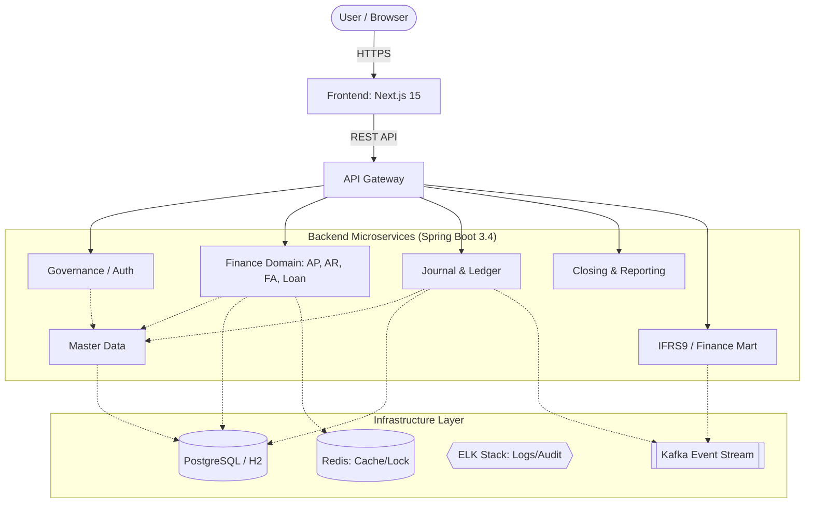
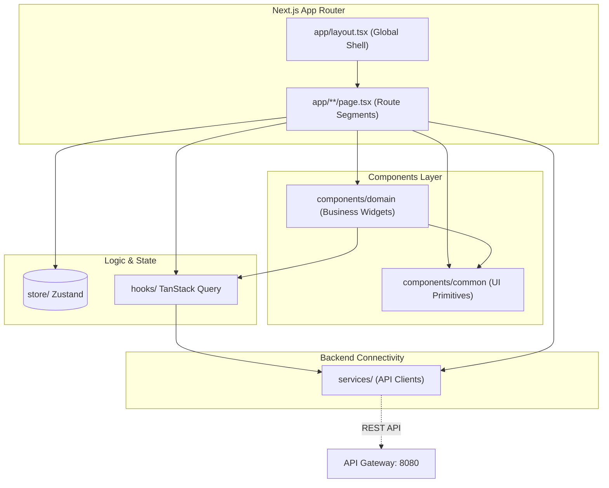

# 🏛️ 차세대 재무 시스템 통합 아키텍처 명세서 (Architecture Guide)

본 문서는 `account` 프로젝트의 전체적인 설계 원칙, 계층 구조 및 프론트엔드/백엔드 통합 아키텍처를 정의하는 마스터 문서입니다. 시스템의 지속 가능한 성장과 유지보수를 위한 핵심 가이드라인을 제공합니다.

---

## 1. 시스템 컨텍스트 (System Context)

본 시스템은 은행 및 엔터프라이즈 환경의 핵심 재무 엔진으로서, 다양한 원천 거래(여신, 수신, 지출 등)를 수집하여 **총계정원장(GL)** 및 **보조원장(SL)**을 생성하고, 최종적으로 **IFRS 9 기준 대손충당금** 및 **재무제표**를 산출합니다.

### 1.1 하이레벨 아키텍처 다이어그램

---

## 2. 백엔드 설계 원칙

### 2.1 헥사고날 아키텍처 (Hexagonal Architecture)
비즈니스 로직(내부)과 기술적 구현(외부)을 명확히 분리하여 유연한 교체가 가능한 구조를 지향합니다.
- **`domain`**: 순수 자바 객체. JPA, Spring 등 프레임워크 의존성이 전혀 없는 핵심 비즈니스 로직.
- **`application.port`**: 도메인과 외부를 연결하는 계약(Interface). Inbound(UseCase)와 Outbound(Repository, API Port)로 구분.
- **`application.service`**: UseCase 구현체. 여러 도메인 객체를 조합하여 비즈니스 흐름 제어.
- **`adapter`**: 포트의 실제 구현체. REST Controller, JPA Repository 구현, 메시징 클라이언트 등.

### 2.2 모듈화 및 의존성 규칙
- **모듈 간 독립성**: 동위 도메인 모듈 간 직접적인 JPA Entity 참조나 서비스 호출은 엄격히 금지됩니다.
- **계약 기반 통신**: 타 모듈의 정보가 필요할 경우 `contracts` 모듈에 정의된 `QueryPort` 및 `Ref DTO`를 통해서만 접근합니다.
- **ID Reference**: 객체 그래프를 직접 연결하지 않고 ID(코드)를 사용하여 결합도를 낮춥니다.

---

## 3. 프론트엔드 아키텍처 (Next.js 15)

프론트엔드는 현대적인 사용자 경험과 타입 안정성을 최우선으로 설계되었습니다.

### 3.1 기술 스택
- **Framework**: Next.js 15 (App Router)
- **Language**: TypeScript
- **State Management**: Zustand (Global), TanStack Query (Server State)
- **Styling**: Vanilla CSS (CSS Modules)

### 3.2 컴포넌트 구조

---

## 4. 핵심 데이터 관리 원칙

### 4.1 정밀도 및 타입 정책
- **금액 데이터**: 부동소수점 오차 방지를 위해 반드시 `BigDecimal`을 사용합니다.
- **통화 처리**: 다통화 환경을 지원하며, 모든 거래는 발생 통화와 장부 통화(KRW 등)로 동시에 기록됩니다.

### 4.2 이력 관리 (SCD2 & Lineage)
- **SCD2 (Slowly Changing Dimension Type 2)**: 마스터 데이터는 `valid_from`, `valid_to`를 통해 과거 시점의 상태를 완벽히 보존합니다.
- **데이터 라인리지**: 보고서의 숫자에서부터 전표, 원천 거래 문서까지 막힘없는 역추적(Drill-through)이 가능해야 합니다.

### 4.3 불변성 및 정정 정책
- **물리 삭제 금지**: 확정된 트랜잭션 데이터는 삭제할 수 없습니다.
- **역분개 (Reversal)**: 오류 발생 시 동일 금액의 반대 전표를 발행하여 회계적 정합성을 유지합니다.

---

## 5. 아키텍처 점검 및 품질 지표

현재 시스템은 지속적인 리팩토링 과정을 거치고 있습니다. 상세한 품질 상태는 [TOTAL_QUALITY_REPORT.md](./TOTAL_QUALITY_REPORT.md)를 참조하십시오.

- **[journal-ledger]**: 모범적인 DDD 및 헥사고날 구조 유지.
- **[closing]**: 헥사고날 전환 완료, 자가 검증 로직 강화 중.
- **[payable/receivable]**: ID 기반 참조로 전환 및 엔티티 직접 참조 제거 작업 진행 중.

---
**담당자**: [기획/팀장/모델러/프론트]
**최종 수정일**: 2026-05-29
