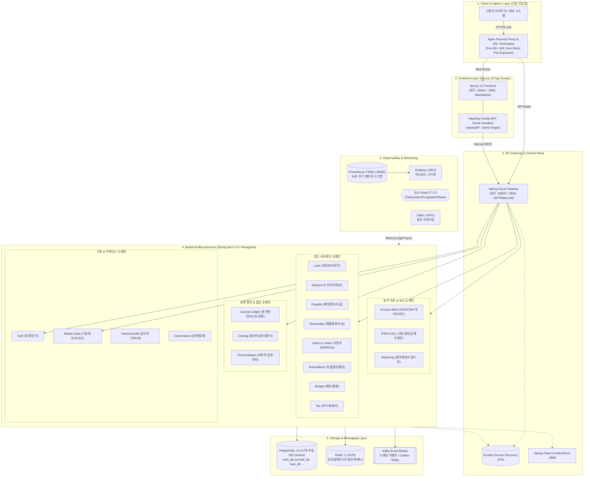
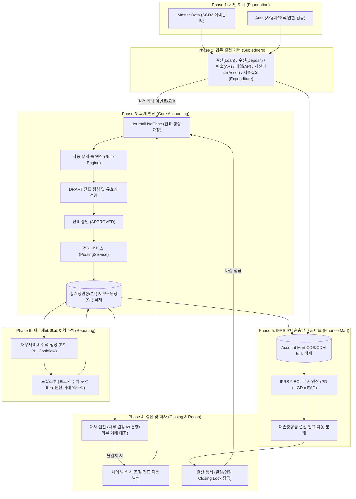
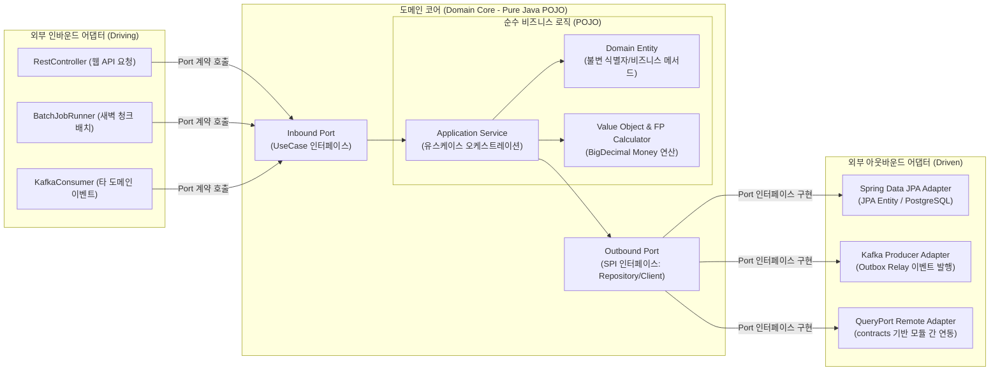

# 🏛️ 차세대 재무 시스템 통합 아키텍처 명세서 (Enterprise Architecture Guide)

본 문서는 `account` 프로젝트의 전체적인 시스템 토폴로지, 도메인 설계 원칙, 계층 구조 및 프론트엔드/백엔드 통합 아키텍처를 정의하는 전사 마스터 문서입니다. 시스템의 지속 가능한 확장성과 금융 데이터 정합성을 위한 핵심 가이드라인을 제공합니다.

---

## 1. 시스템 컨텍스트 및 토폴로지 (System Context & Topology)

본 시스템은 은행 및 엔터프라이즈 환경의 핵심 재무 엔진으로서, 다양한 원천 거래(여신, 수신, 지출, 자산 등)를 수집하여 **총계정원장(GL)** 및 **보조원장(SL)**을 생성하고, 최종적으로 **IFRS 9 기준 대손충당금** 및 **법정 재무제표**를 산출합니다.

### 1.1 시스템 전체 토폴로지 구성도 (System Architecture Diagram)



---

### 1.2 6단계 엔드투엔드 금융 비즈니스 파이프라인 (Financial Business Pipeline)



---

## 2. 백엔드 설계 원칙 및 헥사고날 아키텍처

### 2.1 헥사고날 아키텍처 (Ports & Adapters)
비즈니스 로직(Core)과 외부 기술 구현(Adapters)을 완전히 격리하여 프레임워크나 인프라 변경에도 핵심 금융 규칙을 안전하게 보존합니다.



- **`domain`**: 순수 자바 객체(POJO). JPA, Spring 프레임워크 어노테이션이 전혀 없는 핵심 금융 엔티티 및 비즈니스 규칙.
- **`application.port`**: 도메인과 외부를 연결하는 인터페이스 계약. Inbound(`UseCase`)와 Outbound(`Repository`, `EventPublisher`)로 구분.
- **`application.service`**: UseCase 인터페이스 구현체. 여러 도메인 모델과 Outbound 포트를 오케스트레이션.
- **`adapter`**: 포트의 실제 기술 구현체. Web MVC Controller, Spring Data JPA Repository Adapter, Kafka Producer/Consumer 등.

### 2.2 모듈 간 분리 및 계약(Contract) 기반 연동
- **엔티티 직접 참조 금지**: 마이크로서비스 간, 그리고 동위 도메인 모듈 간 JPA Entity 직접 참조는 컴파일 타임에 엄격히 차단됩니다.
- **`contracts` 모듈 활용**: 타 모듈의 조회가 필요할 경우 `:contracts`에 정의된 `QueryPort` 및 `Ref DTO`를 통해서만 통신합니다.
- **Transactional Outbox 패턴**: 비즈니스 DB 변경과 이벤트 발행의 원자성(Atomicity)을 보장하기 위해 로컬 Outbox 테이블에 적재 후 Relay 스케줄러를 통해 Kafka로 안전하게 발행합니다.

---

## 3. 프론트엔드 아키텍처 (Next.js 15 & BFF Pattern)

프론트엔드는 현대적인 사용자 경험, 강력한 타입 안정성, 그리고 보안 강화(HttpOnly Cookie BFF)를 결합하여 설계되었습니다.

### 3.1 기술 스택
- **Framework**: Next.js 15 (App Router, Standalone Output)
- **Language**: TypeScript
- **State Management**: Zustand (Global UI 상태), TanStack Query (Server State 캐싱)
- **Styling**: Tailwind CSS & CSS Modules (KBank 스타일 Dual-Theme 지원)
- **Security**: Next.js API Route 기반 HttpOnly Session BFF

### 3.2 컴포넌트 및 BFF 라우팅 구조

```mermaid
flowchart TD
    subgraph "Next.js App Router"
        LAYOUT["app/layout.tsx (Global Shell & Dual Theme)"]
        PAGE["app/**/page.tsx (122개 경로 세그먼트)"]
        LAYOUT --> PAGE
    end

    subgraph "Components Layer"
        COMMON["components/common (UI Primitives)"]
        DOMAIN["components/domain (Business Widgets)"]
        PAGE --> COMMON
        PAGE --> DOMAIN
        DOMAIN --> COMMON
    end

    subgraph "Logic & State"
        STORE[("store/ Zustand (UI State)")]
        HOOKS["hooks/ TanStack Query"]
        PAGE --> STORE
        PAGE --> HOOKS
        DOMAIN --> HOOKS
    end

    subgraph "HttpOnly BFF Layer"
        BFF_ROUTES["app/api/auth/* (Route Handlers)"]
        PROXY["app/api/[...path] (BFF Proxy)"]
        HOOKS --> BFF_ROUTES
        PAGE --> PROXY
    end

    PROXY -.->|REST API (Internal Network)| Gateway["Spring Cloud Gateway: 18000"]
```

---

## 4. 핵심 데이터 및 금융 무결성 원칙

### 4.1 정밀도 및 통화 정책 (Financial Precision)
- **`BigDecimal` 필수 사용**: 금융 금액 및 이자율, 상각률 연산에 부동소수점(`double`, `float`) 사용은 전사적으로 엄격히 금지됩니다.
- **다통화(Multi-Currency) 처리**: 발생 통화(Transaction Currency)와 장부 통화(Book Currency: KRW)를 동시 보존하며 환율 이력을 추적합니다.

### 4.2 이력 관리 및 감사 추적 (SCD2 & Lineage)
- **SCD2 (Slowly Changing Dimension Type 2)**: 기준정보(Master Data)는 `valid_from`, `valid_to`를 통해 과거 특정 시점의 상태를 완벽히 재현할 수 있습니다.
- **데이터 라인리지(Lineage) 및 드릴스루(Drill-through)**: 최종 재무제표의 금액에서 전표(Journal), 그리고 원천 거래 전표(대출, 지출결의서 등)까지 양방향 추적이 가능합니다.

### 4.3 회계적 불변성 및 역분개 (Immutability & Reversal)
- **원장 물리 삭제 금지**: 전기(Post) 완료된 전표 및 원장 레코드는 물리적 삭제(`DELETE`)가 불가능합니다.
- **역분개 전표 발행**: 오류 발생 시 반대 부호의 역분개(Reversal) 전표를 생성하여 회계적 정합성과 감사 궤적을 100% 보존합니다.

---

## 5. 인프라, 격리 및 관측성 아키텍처

### 5.1 실행 프로파일 체계
- **`local` 프로파일**: H2 인메모리 DB를 사용하여 외부 의존성(PostgreSQL, Eureka, Kafka) 없이 단독 `./gradlew :module:api:bootRun` 및 초고속 단위 테스트 수행.
- **`dev` (external-dev / self-contained)**: Docker/Podman 기반으로 실제 17개 PostgreSQL DB 컨텍스트, Redis, 플랫폼 서비스와 결합하여 검증.
- **`prod` 프로파일**: 불변(Immutable) 컨테이너 이미지와 Vault 시크릿, 외부 공인 PostgreSQL 클러스터 기반 배포.

### 5.2 관측성 인프라 (Observability)
- **메트릭 (Prometheus & Grafana)**: Spring Boot Actuator `/actuator/prometheus` 엔드포인트를 15초 주기로 스크랩하여 TSDB 적재 및 대시보드 시각화.
- **중앙 로그 (ELK Stack)**: Logstash TCP 5000 리스너를 통해 JSON 로그를 인덱싱하고 Kibana에서 전사 로그 검색 제공.
- **분산 추적 (Zipkin)**: Micrometer Tracing을 통해 Gateway부터 마이크로서비스 간 HTTP/Kafka 요청 흐름을 Trace ID 기반으로 추적.

---

## 6. 전역 문서 참조 및 아키텍처 허브

- **[전사 문서 허브 (Repository Docs Hub)](../README.md)**
- **[도메인 카탈로그 (Domain Catalog)](./domain-catalog.md)**
- **[비즈니스 업무 시나리오 (Business Workflow)](./business_workflow.md)**
- **[헥사고날 & DDD 실무 가이드](../guides/hexagonal-ddd-architecture-guide.md)**
- **[Nginx SSL 및 단일 진입점 가이드](../guides/ssl-nginx-reverse-proxy-guide.md)**
- **[개발 환경 Compose 가이드](../guides/development-compose.md)**
- **[품질 감사 리포트](../TOTAL_QUALITY_REPORT.md)**

---
**문서 소유자**: 전사 아키텍처 팀
**최종 갱신일**: 2026-09-07 (최신 MSA/BFF/관측성 토폴로지 정합화)
