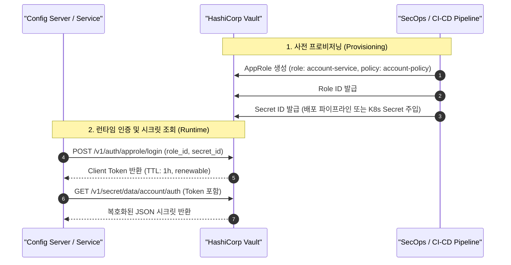

# 🔒 Spring Cloud Config & HashiCorp Vault 하이브리드 시크릿 거버넌스 아키텍처 가이드
> **문서 상태**: 공식 승인 (Approved)  
> **최종 수정일**: 2026-09-03  
> **대상 독자**: 엔터프라이즈 아키텍트, 보안 담당자(SecOps), 백엔드/인프라 엔지니어, 마이크로서비스 개발자  
> **연관 이슈**: [#574](https://github.com/skyg547/account/issues/574), [#520](https://github.com/skyg547/account/issues/520), [#570](https://github.com/skyg547/account/issues/570), [#436](https://github.com/skyg547/account/issues/436)

---

## 1. 🏛️ 아키텍처 배경 및 목적 (Background & Motivation)

금융 및 자산회계 시스템(`account`)은 데이터 무결성과 정밀성뿐 아니라 최고 수준의 정보보안 거버넌스를 요구합니다. 마이크로서비스 아키텍처(MSA)에서 설정 관리와 시크릿 관리를 단일 계층에 혼재시키면 다음과 같은 심각한 보안 및 운영 결함이 발생합니다:

1. **Git 저장소 내 평문 시크릿 노출 위험**: 개발 편의를 위해 DB 패스워드나 암호화 키를 Git에 평문 커밋할 위험.
2. **감사 추적(Audit Trail)과 권한 분리(ACL) 부재**: 일반 비즈니스 설정 변경자와 민감 암호화 키 접근 권한자가 분리되지 않음.
3. **로컬 개발자 경험 저하**: 보안 강화를 위해 복잡한 외부 시크릿 매니저를 로컬 환경에 강제할 경우 개발 생산성 급감.

본 아키텍처는 **"설정(Configuration)과 기밀(Secret)의 물리적·논리적 분리"** 원칙에 따라, **Spring Cloud Config(Git)**와 **HashiCorp Vault(보안 금고)**를 결합한 **하이브리드 시크릿 거버넌스 체계**를 정립합니다.

```mermaid
flowchart TD
    subgraph ClientLayer ["1. 마이크로서비스 계층 (Microservices)"]
        AUTH["auth-api"]
        MD["master-data-api"]
        GATEWAY["gateway"]
        OTHER["domain-apis..."]
    end

    subgraph ConfigLayer ["2. 중앙 설정 계층 (Config Server :8888)"]
        CS["Spring Cloud Config Server"]
        PROBE["Readiness Probe / Health"]
    end

    subgraph StorageLayer ["3. 스토리지 계층 (Storage Backend)"]
        subgraph NonSensitive ["일반 비즈니스 설정 (Non-Sensitive)"]
            GIT["Git Repository (account-config-repo)\n- 로그 레벨, 타임아웃, 포트\n- Git Commit 기반 투명한 이력 추적"]
            NATIVE["Local Native Repo (file:./config-repo)\n- 로컬 오프라인 개발용"]
        end
        
        subgraph Sensitive ["민감 기밀값 (Sensitive Secrets)"]
            VAULT["HashiCorp Vault (KV v2 :8200)\n- DB 비밀번호, JWT 시크릿, API Key\n- AES-256-GCM 암호화 금고\n- AppRole / Token 인증 & 세분화된 ACL"]
        end
    end

    AUTH -->|1. 설정 및 시크릿 조회 요청| CS
    MD -->|1. 설정 및 시크릿 조회 요청| CS
    GATEWAY -->|1. 설정 및 시크릿 조회 요청| CS
    OTHER -->|1. 설정 및 시크릿 조회 요청| CS

    CS -->|2-A. application.yml 조회| GIT
    CS -->|2-A. 로컬 개발 시 파일 조회| NATIVE
    CS -->|2-B. secret/data/* 조회 (AppRole/Token)| VAULT
    CS -->|3. 병합된 Environment 반환| AUTH
```

---

## 2. 💡 핵심 설계 원칙 및 역할 분담 (Separation of Concerns)

### 2.1. Git vs HashiCorp Vault 역할 분담 매트릭스

| 구분 | Spring Cloud Config (Git / Native) | HashiCorp Vault (보안 금고) |
| :--- | :--- | :--- |
| **관리 대상** | 일반 비즈니스 및 인프라 파라미터 | 민감 자격 증명 및 기밀(Secret) |
| **구체적 항목** | 포트 번호, 타임아웃, 로깅 레벨, 캐시 TTL, 라우팅 규칙, DDL 검증 정책 | DB 패스워드, JWT 시크릿, 내부 서비스 토큰, 외부 결제/연계 API Key, 대칭키(`ENCRYPT_KEY`) |
| **저장 형태** | 버전 관리 텍스트 파일 (`.yml`, `.properties`) | 암호화된 볼트 스토리지 (AES-256-GCM, KV v2) |
| **접근 제어** | Git 브랜치 권한, Pull Request 코드 리뷰 | Vault Token / AppRole 인증, 세분화된 Path ACL 정책 |
| **감사 추적** | Git 커밋 로그 (누가, 언제, 어떤 라인을 수정했는가) | Vault 실시간 감사 로그 (누가, 언제, 어떤 시크릿을 읽었는가) |
| **라이프사이클** | 애플리케이션 릴리즈 및 형상 관리 주기 | 시크릿 정기 회전(Rotation) 및 침해 시 즉시 무효화 주기 |

### 2.2. 보안 불변식 (Security Invariants)

1. **Fail-Closed 보안**:
   * 시크릿 환경변수나 Vault 접근 권한이 누락된 경우 서버는 기본 비밀번호로 조용히 시작하지 않고 즉시 기동 실패(Fail-Fast)해야 합니다.
   * 소스코드나 저장소 기본 설정에 `dev_pass`, `admin`과 같은 하드코딩된 폴백 비밀번호를 절대 포함하지 않습니다.
2. **최소 권한의 원칙 (Least Privilege)**:
   * 마이크로서비스는 자신에게 할당된 시크릿 경로(`secret/data/account/{service}`)만 읽을 수 있으며, 타 서비스의 시크릿이나 루트 설정에 접근할 수 없습니다.
3. **개발자 생산성 보장 (Developer Ergonomics)**:
   * 로컬 개발 환경에서 Vault 설치 및 기동 없이도 개발할 수 있도록 `SPRING_CLOUD_VAULT_ENABLED=false` 시 로컬 환경변수 주입 방식을 지원합니다.

---

## 3. 🌐 환경별 프로파일 활성화 전략 (Profile Strategy)

우리 시스템은 개발 단계의 유연성과 운영 단계의 철통 보안을 모두 만족하기 위해 환경별로 차별화된 프로파일 구성을 채택합니다.

```text
┌──────────────────────────────────────────────────────────────────────────────────┐
│ 🚀 환경별 시크릿 주입 전략                                                       │
├───────────────────┬───────────────────────────────┬──────────────────────────────┤
│ 환경 구분         │ SPRING_CLOUD_VAULT_ENABLED    │ 시크릿 공급원                │
├───────────────────┼───────────────────────────────┼──────────────────────────────┤
│ local (H2/독립개발)│ false (기본값)                │ 로컬 .env 또는 실행 환경변수 │
│ dev (Docker/개발) │ false (선택적 true)           │ docker-compose.vault.yml / .env│
│ staging (통합검증)│ true (필수)                   │ Vault AppRole (시뮬레이션)   │
│ prod (실운영)     │ true (필수)                   │ Vault AppRole (운영 금고)    │
└───────────────────┴───────────────────────────────┴──────────────────────────────┘
```

### 3.1. 로컬 및 개발 환경 (`local` / `dev`)
* **설정**: `SPRING_CLOUD_VAULT_ENABLED=false`, `SPRING_PROFILES_ACTIVE=native`
* **동작**: Config Server는 로컬 파일(`file:./config-repo`)을 참조하며, 마이크로서비스는 `.env` 또는 개발용 환경변수(`AUTH_JWT_SECRET`, `DEV_DB_PASSWORD` 등)를 통해 값을 공급받습니다.
* **장점**: 인터넷 단절 환경이나 가벼운 로컬 디버깅 시 추가 인프라(Vault) 기동 없이 빠르게 개발 가능.

### 3.2. 스테이징 및 운영 환경 (`staging` / `prod`)
* **설정**: `SPRING_CLOUD_VAULT_ENABLED=true`, `SPRING_PROFILES_ACTIVE=prod,vault`
* **동작**: Config Server는 중앙 Git 저장소(`application-prod.yml`)와 HashiCorp Vault(`application-vault.yml`)를 복합(Composite) 저장소로 결합합니다.
* **우선순위**: Vault PropertySource가 `order: 1`로 설정되어 일반 Git 설정값보다 높은 우선순위로 민감 시크릿을 오버라이드합니다.

---

## 4. 🔑 HashiCorp Vault 인증 및 시크릿 경로 체계

### 4.1. 인증 방식: Token vs AppRole



* **개발 환경 (Token 인증)**:
  * 로컬 개발 시에는 간편한 `VAULT_TOKEN` (예: `root` 또는 개발자 전용 토큰)을 사용하여 직접 인증합니다.
* **운영 환경 (AppRole 인증)**:
  * 마이크로서비스나 Config Server 인스턴스에 고정 토큰을 전달하지 않습니다.
  * 2단계 인증 자격 증명인 **Role ID**(공개 식별자)와 **Secret ID**(일회성/제한적 수명의 비밀값)를 배포 파이프라인이나 K8s Secret을 통해 개별 주입합니다.
  * Config Server는 실행 시 `auth/approle/login`을 호출하여 세션 토큰을 획득하고 주기적으로 갱신(Token Renewal)합니다.

### 4.2. 시크릿 경로 표준화 규약 (Secret Path Hierarchy)

KV v2 엔진(마운트 지점: `secret/`)을 기준으로 계층 구조화합니다:

```text
secret/
├── application                         # 모든 마이크로서비스 공통 시크릿 (예: 공통 TLS 암호 등)
└── account/                            # account 시스템 전용 네임스페이스
    ├── auth/                           # auth-api 및 인증 전용 시크릿
    │   ├── AUTH_JWT_SECRET             # 서명용 HMAC-SHA256 / RSA 개인키
    │   └── DEV_DB_PASSWORD             # auth DB 접속 암호
    ├── master-data/                    # master-data 서비스 시크릿
    │   └── DEV_DB_PASSWORD             # master-data DB 접속 암호
    ├── gateway/                        # API Gateway 시크릿
    │   ├── AUTH_JWT_SECRET             # 토큰 검증용 비밀키
    │   └── BFF_GATEWAY_SHARED_SECRET   # 프론트엔드 BFF 상호 인증 시크릿
    └── {domain-service}/               # 각 도메인 서비스별 격리 시크릿
        └── {VARIABLE_NAME}
```

### 4.3. Vault ACL 정책 (Least Privilege Policy) 예시

각 서비스 계정이 허용된 경로만 읽을 수 있도록 세분화된 HCL 정책을 적용합니다:

```hcl
# account-policy: 일반 account 서비스 권한
path "secret/data/account/{{identity.entity.metadata.service_name}}" {
  capabilities = ["read", "list"]
}

path "secret/data/application" {
  capabilities = ["read", "list"]
}

# 쓰기, 삭제, 메타데이터 변조는 애플리케이션 런타임에 일절 불허
path "secret/data/*" {
  capabilities = ["deny"]
}
```

---

## 5. 🛠️ Config Server 구성 상세

### 5.1. `application.yml` (Vault 프로파일 그룹 및 연결 기본값)

```yaml
spring:
  application:
    name: config-server
  profiles:
    active: ${SPRING_PROFILES_ACTIVE:native}
    group:
      # vault 프로파일 그룹 선언: --spring.profiles.active=vault 지정 시 Vault 프로파일 활성화
      vault: vault
  cloud:
    config:
      server:
        vault:
          host: ${VAULT_HOST:127.0.0.1}
          port: ${VAULT_PORT:8200}
          scheme: ${VAULT_SCHEME:http}
```

### 5.2. `application-vault.yml` (Vault 백엔드 상세 설정)

```yaml
spring:
  cloud:
    config:
      server:
        vault:
          host: ${VAULT_HOST:127.0.0.1}
          port: ${VAULT_PORT:8200}
          scheme: ${VAULT_SCHEME:http}
          backend: ${VAULT_BACKEND:secret}
          default-key: ${VAULT_DEFAULT_KEY:application}
          profile-separator: ${VAULT_PROFILE_SEPARATOR:/}
          kv-version: ${VAULT_KV_VERSION:2}
          order: ${VAULT_ORDER:1}
          token: ${VAULT_TOKEN:}
          app-role:
            role-id: ${VAULT_APPROLE_ROLE_ID:}
            secret-id: ${VAULT_APPROLE_SECRET_ID:}
            role: ${VAULT_APPROLE_ROLE:account-service}
            app-role-path: ${VAULT_APPROLE_PATH:approle}
```

---

## 6. 🐳 로컬 Vault 컨테이너 운용 (`docker-compose.vault.yml`)

로컬 개발 환경에서 HashiCorp Vault를 즉시 띄우고 테스트할 수 있도록 독립 실행형 Compose 정의를 제공합니다.

### 6.1. 구성 특징
* **Dev Mode (`vault:1.13.3`)**: 인메모리 스토리지 및 자동 언실(Auto-unseal) 지원.
* **Auto Seeding (`vault-seed`)**: 컨테이너 헬스체크 통과 직후 `secret/account/auth`, `secret/account/master-data` 시크릿과 AppRole을 자동 주입.
* **보안 격리**: 호스트 바인딩 시 `127.0.0.1:8200`으로 제한하여 외부 네트워크 무단 노출 차단.

### 6.2. 로컬 실행 및 검증 명령어

```bash
# 1. Vault 및 초기 시딩 컨테이너 기동
docker compose -f docker-compose.vault.yml up -d

# 2. Vault 상태 및 언실 여부 확인
docker exec -it account-vault vault status

# 3. 주입된 시크릿 조회 검증
docker exec -it account-vault vault kv get secret/account/auth
docker exec -it account-vault vault kv get secret/account/master-data

# 4. AppRole Role-ID 확인
docker exec -it account-vault vault read auth/approle/role/account-service/role-id

# 5. Config Server를 Vault 프로파일과 함께 실행
SPRING_PROFILES_ACTIVE=native,vault ./gradlew :config-server:bootRun
```

---

## 7. 🔐 운영 환경 언실(Unseal) 및 토큰 관리 절차

### 7.1. Shamir's Secret Sharing vs 클라우드 KMS 자동 언실

```text
┌──────────────────────────────────────────────────────────────────────────────────┐
│ 🛡️ 언실(Unseal) 아키텍처 비교                                                    │
├──────────────────────────┬───────────────────────────────────────────────────────┤
│ 샤미르 비밀 분할 (Shamir)│ 클라우드 KMS 자동 언실 (Cloud Auto-Unseal)            │
├──────────────────────────┼───────────────────────────────────────────────────────┤
│ 5개 키 조각 중 3개 이상  │ AWS KMS, GCP KMS, Azure Key Vault 연동               │
│ 운영자가 수동 입력       │ 서버 재부팅 시 KMS 마스터 키로 자동 복호화           │
│ 온프레미스 고보안 환경   │ 클라우드 네이티브 MSA 무중단 자동 복구 표준          │
└──────────────────────────┴───────────────────────────────────────────────────────┘
```

1. **프로덕션 표준 (Cloud Auto-Unseal 권장)**:
   * Vault 설정(`vault.hcl`) 내 `seal "awskms"` 또는 `seal "gcpckms"` 블록을 선언하여 인스턴스 재기동 시 사람의 수동 개입 없이 안전하게 자동 언실합니다.
2. **비상 운영 (Shamir 키 복구 절차)**:
   * 자동 언실 장애 시 3명의 보안 키 홀더(Key Holder)가 참석하여 `vault operator unseal <key_share>`를 순차 실행합니다.

### 7.2. 토큰 갱신(Token Renewal) 및 시크릿 회전(Secret Rotation)
* **AppRole 토큰 수명**: `token_ttl=1h`, `token_max_ttl=4h`로 제한.
* **백그라운드 리뉴얼**: Spring Vault / Config Server 라이프사이클 관리자가 TTL 만료 전(예: 30분 시점)에 자동으로 토큰 연장(Renew) API를 호출합니다.
* **시크릿 회전 절차**:
  1. 새 비밀번호를 Vault KV v2에 새 버전(`v2`)으로 커밋.
  2. Spring Cloud Bus 또는 각 서비스의 `/actuator/refresh` 호출을 통해 실시간 동기화.
  3. 구버전 비밀번호 폐기.

---

## 8. 📋 변경 체크리스트 및 롤백 가이드

### 8.1. 배포 전 점검 목록
- [ ] `SPRING_CLOUD_VAULT_ENABLED` 환경변수가 스테이징/운영에서 `true`로 설정되었는가?
- [ ] `VAULT_HOST`, `VAULT_PORT`, `VAULT_SCHEME` 주소가 정확한가?
- [ ] Vault AppRole의 `role-id`와 `secret-id`가 배포 시크릿으로 주입되었는가?
- [ ] `secret/account/{service}` 경로에 해당 서비스의 필수 환경변수(`DB_PASSWORD` 등)가 시딩되었는가?
- [ ] 로컬 개발 환경에서 Vault 없이 실행 시 (`SPRING_CLOUD_VAULT_ENABLED=false`) 정상 기동하는가?

### 8.2. 비상 롤백(Rollback) 절차
만일 운영 중 Vault 클러스터 장애가 발생하거나 AppRole 인증 실패가 지속될 경우:
1. `SPRING_CLOUD_VAULT_ENABLED=false`로 즉시 전환.
2. 기존 Spring Cloud Config 대칭키 복호화 방식(`{cipher}...` 및 `ENCRYPT_KEY`) 또는 환경변수 직접 주입 방식으로 롤백.
3. 서비스 컨테이너를 신속 재기동하여 시스템 가용성을 유지합니다.
