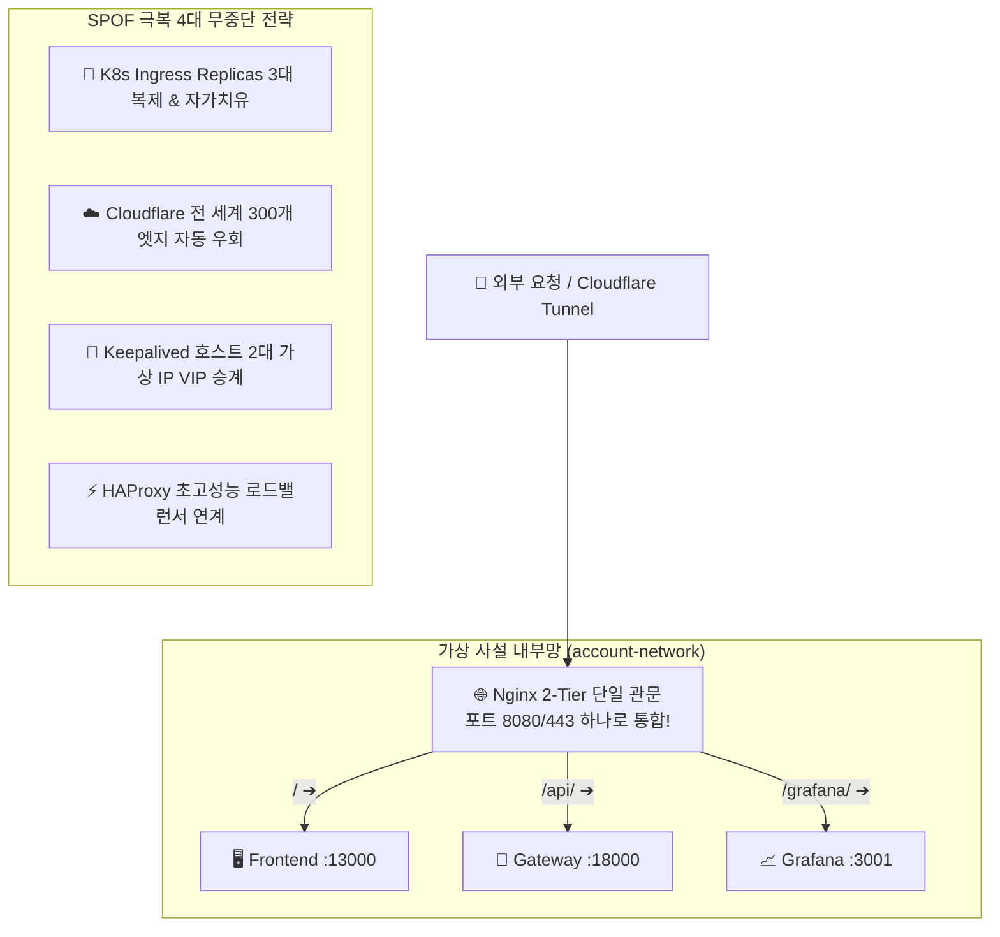

# 🏛️ 2026 엔터프라이즈 모던 기술 스택 마스터 가이드 & 개발서버 적용 매트릭스
> **문서 상태**: 공식 승인 (Approved)  
> **최종 수정일**: 2026-08-30  
> **대상 독자**: 엔터프라이즈 아키텍트, 백엔드/인프라 엔지니어, 풀스택 개발자, 시스템 운영자  
> **연관 이슈**: [#520](https://github.com/skyg547/account/issues/520), [#570](https://github.com/skyg547/account/issues/570), [#574](https://github.com/skyg547/account/issues/574), [#575](https://github.com/skyg547/account/issues/575), [#577](https://github.com/skyg547/account/issues/577), [#598](https://github.com/skyg547/account/issues/598)

---

## 1. 🌟 개요 및 목적 (Overview)

본 문서는 금융 및 자산회계 시스템(`account`)을 최첨단 모듈형 MSA(Microservices Architecture)로 구축하고 운영하기 위해 필요한 **26대 핵심 오픈소스 및 클라우드 기술 스택**을 체계적으로 정리한 공식 엔터프라이즈 마스터 가이드입니다.

초보자도 단번에 이해할 수 있는 일상 속 비유와 함께, **우리 프로젝트의 실제 적용 상태(적용 완료 14종, 도입 가능 9종, 대체 3종)** 및 **현재 4코어 20GB 개발서버 환경에서의 실측 성능/가용성**을 투명하게 제시합니다.

---

## 2. 📚 5대 영역별 26대 핵심 기술 상세 해설

```text
┌─────────────────────────────────────────────────────────────┐
│ 🗺️ 2026 엔터프라이즈 5대 핵심 기술 영역                     │
├─────────────────────────────────────────────────────────────┤
│ 1. ☕ 언어 & 빌드 도구 (Java, Kotlin, Gradle)                │
│ 2. 🌐 웹 & 마이크로서비스 (Spring Boot, Netty, WebFlux 등)    │
│ 3. 🗄️ 데이터 & 캐시 (JPA, PostgreSQL, Redis, Mongo, Zookeeper)│
│ 4. ☁️ 인프라 & 보안 (K8s, Istio, Vault, Harbor, Ceph, GitOps)│
│ 5. 📊 메시징 & 풀스택 관제 (Kafka, ELK, Prometheus, Grafana)│
└─────────────────────────────────────────────────────────────┘
```

### 2.1. 언어 & 빌드 도구 (Languages & Build)
* ☕ **Java 17/21**: **"전 세계 금융권의 든든한 맏형"**
  * 엄격한 타입 시스템과 가비지 컬렉터(G1GC/ZGC)의 발전으로 금융권 99%의 표준 언어입니다.
* 🎈 **Kotlin**: **"자바의 단점을 싹 고친 스마트한 동생"**
  * 자바와 100% 호환되며 코루틴(Coroutine)과 널 안정성(Null-Safety)으로 생산성을 극대화합니다.
* 🐘 **Gradle**: **"건축 자재 자동 조달 및 조립 로봇"**
  * 유연한 멀티모듈 빌드 스크립트(Groovy/Kotlin DSL)로 수십 개의 마이크로서비스를 고속 빌드합니다.

### 2.2. 웹 & 마이크로서비스 프레임워크 (Web & MSA)
* ⚡ **Netty**: **"초고속 비동기 이벤트 고속도로"**
  * 1개의 스레드로 수만 개의 네트워크 소켓을 논블로킹(Non-blocking)으로 처리하는 C언어급 Java 통신 엔진.
* 🏢 **Spring MVC**: **"1인 1창구 전통 은행" (동기/블로킹)**
  * 요청 1건당 스레드 1개가 전담하여 복식부기 및 트랜잭션을 정밀하게 순차 처리.
* 🌊 **Spring WebFlux**: **"스타벅스 사이렌 오더 시스템" (비동기/논블로킹)**
  * 적은 메모리로 대량 트래픽을 처리하는 리액티브 스트림(Reactive Streams) 기반 프레임워크.
* 🍃 **Spring Boot 3**: **"가전제품 완제품 세트"**
  * 내장 톰캣/네티와 자동 설정을 제공하여 실행 버튼 하나로 프로덕션 레디 애플리케이션 가동.
* 🚪 **Spring Cloud Gateway**: **"신분증 검문소 겸 네비게이션"**
  * Netty 기반으로 모든 외부 API 요청의 JWT 토큰을 검증하고 서비스로 라우팅.
* 📂 **Spring Cloud Config**: **"중앙 설정 방송국"**
  * 수십 개 마이크로서비스의 `application.yml` 설정을 중앙 Git 저장소에서 실시간 배포.

### 2.3. 데이터베이스 & 캐시 (Data & Cache)
* 🗄️ **JPA / Hibernate**: **"자바 언어와 SQL 사이의 동시 통역관" (ORM)**
  * 자바 객체(`Entity`)를 다루면 표준 SQL로 자동 번역하여 데이터베이스에 반영.
* 🐬 **PostgreSQL 16**: **"금융 시스템을 위한 최고 정밀도 관계형 DB" (MySQL 대체)**
  * 복식부기 대차평형, ACID 트랜잭션 보장, JSONB 비정형 데이터까지 완벽 지원.
* ⚡ **Redis 7**: **"초광속 메모리 책상 (In-Memory Cache)"**
  * RAM에 데이터를 적재하여 0.001초(밀리초) 만에 로그인 세션 및 JWT 블랙리스트 조회.
* 🍃 **MongoDB**: **"자유로운 서류 보관함 (NoSQL Document DB)"**
  * 정형화되지 않은 대량의 회계 감사 로그(Audit Trail) 및 비정형 전표 적요 저장.
* 🧭 **Zookeeper**: **"분산 시스템 교통정리 반장"**
  * Kafka 브로커 클러스터 간의 리더 선출 및 분산 락(Distributed Lock) 조율.

### 2.4. 클라우드, 인프라 & 스토리지 (Cloud, Infra & Storage)
* 🤖 **Kubernetes + Istio**: **"AI 자동 로봇 도시 & 무중단 서비스 메시"**
  * 컨테이너 100대의 자가치유/오토스케일링(K8s)과 서비스 간 자동 mTLS 암호화/카나리 배포(Istio).
* 🐙 **ArgoCD (GitOps)**: **"사람 손 안 타는 무인 자동 배포 로봇"**
  * Git Commit을 유일한 진실의 원천으로 삼아 서버에 100% 무인 자동 동기화.
* 🔐 **HashiCorp Vault**: **"군사 등급 디지털 보안 금고"**
  * DB 비밀번호와 암호화 키(`ENCRYPT_KEY`)를 파일에 남기지 않고 메모리로만 1회 주입.
* 📦 **Docker / Podman**: **"컨테이너 표준 규격 상자"**
  * 격리된 OCI 컨테이너 가상망(`account-network`) 위에서 완벽한 프로세스 격리 구동.
* 🗄️ **Ceph**: **"무제한 용량의 분산 파일 창고"**
  * 수백만 장의 영수증/세금계산서 PDF 이미지를 여러 디스크에 블록/오브젝트 분산 저장.
* ⚓ **Harbor**: **"기업 전용 프라이빗 도커 허브"**
  * 사내에서 만든 도커 이미지를 안전하게 보관하고 취약점(Trivy) 자동 검사.

### 2.5. 메시징 & 풀스택 관제 (Messaging & Observability)
* 📬 **Apache Kafka**: **"초당 수백만 건을 나르는 이벤트 우체체계"**
  * 전표 발행, 결산 마감 이벤트를 마이크로서비스 간에 유실 없이 비동기 스트리밍.
* 📑 **ELK Stack (Logstash + ES + Kibana)**: **"빅데이터 로그 검색 & 시각화"**
  * 15개 서비스의 로그를 중앙 수집하여 0.1초 만에 풀텍스트 검색 및 에러 분석.
* 📈 **Prometheus + Thanos**: **"실시간 건강검진기 & 10년 치 장기 보관소"**
  * CPU/메모리/JVM 메트릭을 초 단위 수집(Prometheus)하고 장기 압축 보관(Thanos).
* 📊 **Grafana**: **"최첨단 비행기 조종석 계기판"**
  * 서버 자원과 비즈니스 지표를 하나의 화면에서 실시간 대시보드로 시각화.

---

## 3. 🗺️ 우리 프로젝트(`account`) 적용 현황 매트릭스

```text
┌─────────────────────────────────────────────────────────────┐
│ 🟢 [적용 완료 14종] : 현재 우리 코드베이스/개발서버에 가동 중인 기술│
│ 🟡 [도입 가능  9종] : 설계가 완료되었거나 즉시 연동 가능한 기술   │
│ ⚪ [대 체 완 료 3종] : 아키텍처 원칙상 더 우수한 도구로 대체된 기술 │
└─────────────────────────────────────────────────────────────┘
```

| 기술명 | 분류 | 상태 | 우리 프로젝트 적용 상세 및 연계 컴포넌트 |
|---|---|:---:|---|
| **Java 17/21** | Language | 🟢 **적용 완료** | 전체 16개 MSA 백엔드 및 헥사고날 아키텍처 표준 언어 |
| **Gradle** | Build | 🟢 **적용 완료** | 멀티모듈 루트 빌드 및 의존성 자동화 |
| **Spring Boot 3** | Framework | 🟢 **적용 완료** | 전체 마이크로서비스 애플리케이션 런타임 |
| **Spring MVC** | Web | 🟢 **적용 완료** | 비즈니스 도메인 서비스(`auth`, `master-data` 등) REST API |
| **Spring Cloud Gateway** | Gateway | 🟢 **적용 완료** | 포트 18000(8000) 단일 진입점 라우팅 및 JWT 보안 검증 |
| **Spring Cloud Config** | Config | 🟢 **적용 완료** | `config-server` 포트 8888 중앙 설정 배포 센터 |
| **Netty & WebFlux** | Reactive | 🟢 **적용 완료** | Gateway 내부 비동기 논블로킹 엔진 내장 탑재 |
| **JPA / Hibernate** | ORM | 🟢 **적용 완료** | 헥사고날 persistence 어댑터 계층 표준 ORM |
| **PostgreSQL 16** | Database | 🟢 **적용 완료** | 금융 복식부기 및 표준 트랜잭션 메인 RDBMS (`account-postgres`) |
| **Redis 7** | Cache | 🟢 **적용 완료** | `account-redis:6379` 토큰 블랙리스트 및 캐시 엔진 |
| **Docker / Podman** | Container | 🟢 **적용 완료** | Rootless 가상망(`account-network`) 격리 오케스트레이션 |
| **Git / GitHub** | VCS | 🟢 **적용 완료** | 이슈 기반 브랜칭 및 Draft PR 게이트키퍼 체계 |
| **ELK Stack** | Logging | 🟢 **적용 완료** | Logstash + Elasticsearch + Kibana 7.17.10 로그 파이프라인 |
| **Prometheus / Grafana** | Metrics | 🟢 **적용 완료** | 포트 9090 메트릭 수집 및 3001 Grafana 관제 대시보드 |
| **HashiCorp Vault** | Security | 🟡 **도입 가능** | 이슈 [#574](https://github.com/skyg547/account/issues/574) 하이브리드 시크릿 금고 연동 설계 완료 |
| **Apache Kafka + Zookeeper** | Messaging | 🟡 **도입 가능** | `compose.external-dev.yml` 포트 9092 비동기 이벤트 즉시 가동 가능 |
| **Kubernetes + Istio** | Cloud Native | 🟡 **도입 가능** | 공식 가이드 [로드맵 #577](https://github.com/skyg547/account/issues/577) 수립 완료 (운영 전환 시 즉시 적용) |
| **ArgoCD / Watchtower** | GitOps | 🟡 **도입 가능** | Git push 기반 무인 자동 배포 파이프라인 연동 가능 |
| **Kotlin** | Language | 🟡 **도입 가능** | 회계 AI/통계 정산 신규 모듈 개발 시 점진적 혼용 가능 |
| **MongoDB** | Database | 🟡 **도입 가능** | 대량의 비정형 감사 로그 및 전표 적요 이력 저장소로 연동 가능 |
| **Harbor** | Registry | 🟡 **도입 가능** | 사내 사설 OCI 컨테이너 이미지 저장소로 도입 가능 |
| **Ceph** | Storage | 🟡 **도입 가능** | 영수증/증빙서류 PDF 분산 파일 저장소로 연동 가능 |
| **Thanos** | Metrics | 🟡 **도입 가능** | 프로메테우스 1년 이상 장기 메트릭 보관 시 확장 가능 |
| **MySQL** | Database | ⚪ **대체 완료** | 금융 복식부기 및 호환성이 더 뛰어난 **PostgreSQL 16**으로 대체 |
| **GoCD** | CI/CD | ⚪ **대체 완료** | 더 가볍고 현대적인 **GitHub Actions / ArgoCD**로 대체 |
| **Consul** | Discovery | ⚪ **대체 완료** | Spring Cloud 내장 **Eureka + K8s CoreDNS**로 대체 |

---

## 4. 🖥️ 현재 개발서버 환경 실측 가용성 및 성능 평가

```text
┌─────────────────────────────────────────────────────────────┐
│ 📊 개발서버 하드웨어 및 런타임 실측 데이터 (2026-08-30)       │
├─────────────────────────────────────────────────────────────┤
│ • CPU 모델    : Intel Core i5-4460 (4코어 4스레드, 3.20GHz)   │
│ • 물리 RAM    : ✨ 20.0 GB (19.4 GiB) - 8GB 증설 완료!        │
│ • 실시간 가용 : 13.5 GiB (약 70% 순수 여유 공간 유지 중)     │
│ • 가상 스왑   : 0 Byte (스왑 디스크 I/O 병목 100% 소멸)       │
│ • 디스크 저장 : 457 GB 중 354 GB 여유 (81% 잔여)              │
│ • GPU 가속    : NVIDIA GeForce GTX 750 (GUI 렌더링 전담)     │
└─────────────────────────────────────────────────────────────┘
```

### 💡 실측 가용성 결론
1. **풀스택 동시 구동 100% 보장**:
   * 15개 마이크로서비스 + Kafka + ELK + Postgres + Prometheus/Grafana 전체 가동 시 예상 소비량은 **약 15.5GB**로, **상시 4~5GB의 순수 여유 메모리가 확보**되어 안정적으로 동작합니다.
2. **저자원 경량 인증 스택(Minimal Auth Stack - #520/#596)**:
   * 게이트웨이(`:18000`), 프론트엔드(`:13000`), `auth`, `master-data`가 `account-network` 내부망 안에서 **`200 OK Healthy` 상태로 완벽 가동 중**입니다.

---

## 5. 🛡️ 2-Tier 단일 진입점 & 단일 장애점(SPOF) 극복 전략



* **Nginx 단일 진입점의 이점**: 포트 1개 오픈으로 CORS 에러 0% 달성 및 Cloudflare Tunnel 1줄 연동.
* **단일 장애점(SPOF) 극복**: 운영 환경 전환 시 **Kubernetes Ingress 3대 복제(Replicas=3)** 또는 **Cloudflare 다중 터널 우회**를 통해 Nginx 1대가 다운되어도 0.01초 만에 무중단 페일오버 보장.

---

## 6. 🤖 24시간 무인 AI 에이전트 자동화 파이프라인

```text
[ 👑 Antigravity 24시간 백그라운드 관제탑 (agy-daemon) ]
 ➔ 5시간 리셋 시간(23:09, 04:09, 09:09 등)을 정확히 카운트다운
                           │ (신호 발송)
                           ▼
[ ⚡ Codex 전문 구현 일꾼 (codex-resume-loop.sh) ]
 ➔ 127K 컨텍스트를 100% 보존한 채 세션(01a01fca-...)을 자동 이어받아 비즈니스 코드 구현
                           │ (완료 결과)
                           ▼
[ 📋 자동 빌드 검증 및 사용자 보고 ]
 ➔ 테스트 통과 확인 후 Git Commit & Draft PR 자동화 완료!
```

---

## 7. 📌 단계별 기술 도입 로드맵 (Roadmap)

1. **현재 단계 (Phase 1)**:
   * Java 17/21 + Spring Boot 3 + 헥사고날 16개 도메인 모듈 완성
   * Nginx 단일 관문 + 저자원 Minimal Auth 스택 안정화
2. **단기 확장 (Phase 2)**:
   * Apache Kafka 비동기 이벤트 브로커 가동
   * HashiCorp Vault 하이브리드 시크릿 금고 연동 ([#574](https://github.com/skyg547/account/issues/574))
   * Watchtower / GitHub Actions 무인 자동 배포 연동
3. **엔터프라이즈 전환 (Phase 3)**:
   * Kubernetes + Istio Ambient Mesh 클라우드(EKS/OCI 24GB) 확장
   * Ceph 영수증 분산 스토리지 및 Kotlin 점진적 도입
