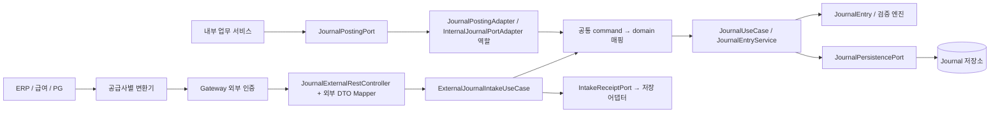
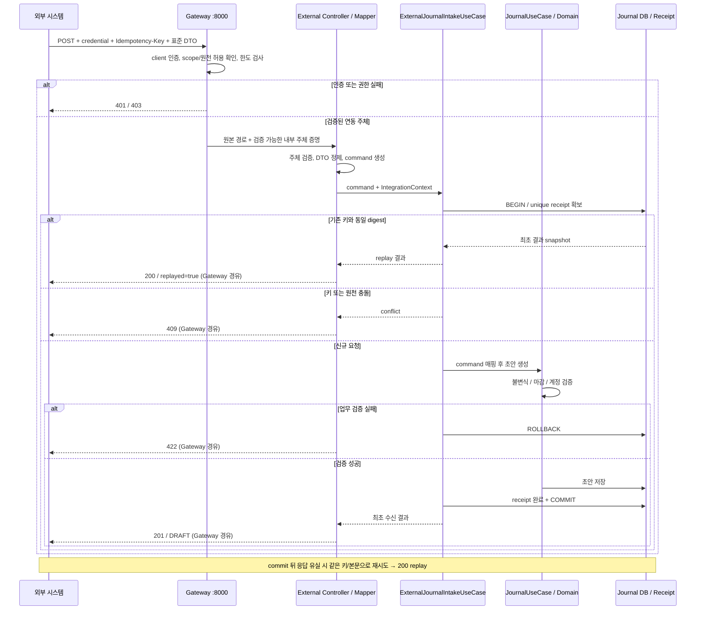

# 외부 업무시스템 분개 인입 REST / OpenAPI 계약 RFC

- 상태: 제안, Issue [#719](https://github.com/skyg547/account/issues/719). 작성 기준: `origin/main@87206771d8057fdd4f39bd35df0331768d0bf05f`, 2026-09-12.
- 목적: ERP·급여·PG가 내부 Java 모델을 알지 못해도 표준 전표 초안 생성 계약을 사용할 수 있게 한다.
- 이번 변경은 설계 문서다. 아래 외부 endpoint, 인증 필터, 멱등 저장소, DTO 및 명세 생성 작업은 **후속 구현 대상**이며 현재 제공되는 기능이 아니다.
- 범위 밖: 실제 route 개방, 승인·전기 자동화, 운영 설정/DB 변경, 공급사별 원문 포맷 수집, 대량 비동기 업로드. 기존 Java/HTTP/event 계약은 유지한다.

## 1. 현재 구현과 제안의 차이

| 확인한 구현 | 현재 의미 | 제안과의 관계 |
| --- | --- | --- |
| [JournalPostingPort](../../contracts/src/main/java/com/ho/account/contracts/journal/JournalPostingPort.java), [JournalEntryCommand](../../contracts/src/main/java/com/ho/account/contracts/journal/JournalEntryCommand.java) | 내부 호출자의 기술 독립 계약. 같은 JVM에서는 Bean 호출이며 서비스 간 네트워크 전송을 자동 제공하지 않는다. | Java 계약을 외부 wire schema로 노출하지 않는다. |
| [JournalPostingAdapter](../../journal-ledger/core/src/main/java/com/ho/account/journalledger/infrastructure/adapter/JournalPostingAdapter.java) | `JournalPostingPort` 구현. command를 domain으로 바꾸고 `JournalUseCase` 호출. lineage 조회로 기존 전표를 먼저 반환한다. | Issue의 `InternalJournalPortAdapter`는 이 역할의 제안 이름이다. 현재 해당 이름의 클래스는 없다. 이름 변경 자체는 필요하지 않다. |
| [JournalPostingRestController](../../journal-ledger/api/src/main/java/com/ho/account/journalledger/adapter/in/web/journal/JournalPostingRestController.java) | `POST /api/v1/journals/posting`, Java command를 직접 JSON 역직렬화하고 `200` 결과 반환. | 외부 전용 `JournalExternalRestController`와 별도 유지. 기존 URL을 외부 URL로 rewrite하지 않는다. |
| [JournalEntryService](../../journal-ledger/core/src/main/java/com/ho/account/journalledger/application/service/journal/JournalEntryService.java), [JournalValidationEngine](../../journal-ledger/core/src/main/java/com/ho/account/journalledger/application/service/journal/validator/JournalValidationEngine.java) | 트랜잭션 내 채번, 도메인 불변식·마감·회계일 기준 계정 조회, 저장. | 외부 요청도 동일 업무 검증을 거친다. Controller에서 차대 계산·승인·저장을 구현하지 않는다. |
| [Gateway 로컬 설정](../../gateway/src/main/resources/application.yml), [중앙 설정](../../config-repo/gateway-service.yml) | `:8000`, `lb://journal-ledger`, `/api/journals/**` 등 기존 경로. 새 외부 경로는 없다. 기존 `/api/v1/journals/posting`도 이 journal route predicate에 포함되지 않는다. | 실제 외부 공개는 별도 명시 route와 보안 변경이 함께 통과해야 한다. |
| [Gateway JWT 필터](../../gateway/src/main/java/com/ho/account/gateway/filter/JwtAuthenticationFilter.java) | 사용자 JWT와 Auth roleVersion 검증 계약. | 외부 API Key/OAuth2 client_credentials 인증이 이미 가능하다고 가정하지 않는다. |
| [API build](../../journal-ledger/api/build.gradle), [Gateway build](../../gateway/build.gradle), [루트 build](../../build.gradle) | Boot 3.2.5/JDK 17. Gateway에 springdoc WebFlux 2.5.0. journal API에는 직접 선언이 없지만 core → shared-kernel의 api 의존성으로 WebMVC UI 2.5.0이 전달된다. | journal MVC API에서 자체 외부 group을 생성해야 한다. Gateway에 전체 journal 명세 집계 route가 있지만 외부 전용 group/생성 CI는 없다. |

현재 lineage 인덱스는 [V11](../../journal-ledger/core/src/main/resources/db/migration/V11__journal_ledger_postgresql_baseline.sql)의 일반 인덱스다. 조회 후 저장은 동시 요청 원자성 및 다른 payload 충돌을 보장하지 않는다. `JournalEntryCommand`는 도메인 Entity가 아닌 `contracts`의 내부 입력 명령이며, 전표 결과는 초안 생성 결과다. 이름의 posting을 승인/원장 전기 완료로 해석하지 않는다.

## 2. 경계와 호출 구조



- `api/adapter/in/web/external`: 외부 DTO, JSON/Bean Validation, 인증된 요청 문맥 추출, command 매핑, HTTP 오류 변환, OpenAPI annotation을 소유한다.
- `core/application/port/in/ExternalJournalIntakeUseCase`와 application service(제안): command와 기술 독립 `IntegrationContext`를 받아 원천 권한·멱등 receipt·트랜잭션을 조정한다. 단순 전달 service가 아니라 원자적 수신 유즈케이스다.
- 기존 adapter의 command → domain 조립을 공통 mapper로 추출하고 양 경로가 같은 `JournalUseCase`를 사용한다. 외부 service가 기존 adapter의 비원자적 lineage 조기 반환을 호출하도록 연결하지 않는다. 외부 DTO나 HTTP header 타입을 core/contracts로 옮기지 않는다.
- `core/application/port/out/IntakeReceiptPort`와 infrastructure adapter(제안)가 유일키/락/SQL을 캡슐화한다. Batch는 해당 동기 API에 관여하지 않으며 대량 인입은 별도 계약으로 설계한다.
- SAP IDoc, CSV, 급여 고유 코드 같은 원문은 공급사 측 또는 공급사별 경계 변환기가 표준 DTO로 변환한다. 공용 endpoint에 임의 `Map<String,Object>`를 받지 않는다. 회사별 계정 코드 매핑의 소유자/버전은 연동 등록 시 확정하고, 매핑되지 않는 코드는 거부한다.
- 내부 API의 `approveAndPost`는 외부 수신 유즈케이스에서 호출하지 않는다. 외부 `journals:write` 권한은 초안 생성만 허용하며 승인자는 별도 권한과 기존 승인 절차를 따른다.

### 외부 DTO → 내부 command 매핑

| 외부 입력 / 문맥 | 내부 값 | 규칙 |
| --- | --- | --- |
| `slipDate`, `accountingDate` | 동일 필드, `LocalDate` | ISO 날짜. 서버 현재 날짜로 대체하지 않는다. |
| `description` | `description` | 최대 200자. |
| `currencyCode`, `exchangeRate` | 동일 필드, `BigDecimal` | 통화 3자리, 환율 DECIMAL(19,8). 무음 기본값/반올림 없음. |
| `sourceSystem` | `lineageSourceType = EXT:<등록 코드>` | 등록 코드 최대 40자, 인증된 client의 허용 목록과 일치. `EXT:` namespace는 외부 전용으로 예약하고 다른 인입 경로에서 사용을 거부하는 것이 개방 조건이다. |
| `sourceDocumentId` | `lineageSourceId` | 최대 100자. 등록 코드의 회계 장부 범위 내에서 유일한 전표 이벤트 ID. 문서 한 건에서 여러 전표가 생기면 원천이 안정된 하위 이벤트 ID를 발급한다. |
| 검증된 `IntegrationContext.actorId` | `createdBy`, `auditUser` | 서버 등록 actor ID(최대 50자). payload·사용자 제공 `X-User-ID`를 신뢰하지 않는다. |
| 서버 정책 | `entryType = NORMAL`, `slipNo = null` | 외부 초안 전용. 채번과 상태는 core 소유. |
| `lines[].side` | `JournalLineCommand.drcrType` | `DEBIT` 또는 `CREDIT`. 음수 부호로 방향을 추측하지 않는다. |
| `lines[].accountCode`, `departmentCode`, `businessPartnerCode`, `detailDescription` | 동일 라인 필드 | 문자열 코드만 전달하며 Entity 참조 없음. |
| `lines[].amount`, `baseAmount` | 동일 필드, `BigDecimal` | 양수 DECIMAL(19,2), baseAmount도 필수. |
| `Idempotency-Key`, 서버 request ID, client ID | 수신 문맥/receipt | JournalEntryCommand에 HTTP 필드를 추가하지 않는다. |

금액은 JSON 문자열로 전달해 JavaScript 정밀도 손실을 막는다. `new BigDecimal(text)`로 해석하며 지수·콤마·부호·공백·과도한 소수 자릿수는 거부한다. core의 [AccountingPrecision](../../journal-ledger/core/src/main/java/com/ho/account/journalledger/domain/ledger/domain/AccountingPrecision.java) 정책을 재사용한다. 0은 schema 형식에 들어올 수 있지만 도메인에서 422로 거부한다.

원천은 확정된 거래통화 금액과 기준통화 금액을 둘 다 보낸다. Adapter는 환산을 계산하지 않는다. 지원 통화/기준통화와 환산·차대 일치 검증 정책은 장부 등록 및 core 책임이다. 현 구현이 모든 환산 관계를 검증한다고 주장하지 않으며, 외화의 허용/반올림 정책과 baseAmount 검증을 후속 core 구현에서 확정·검증하기 전에는 외화 연동을 개방하지 않는다. 다중 회사/장부는 현재 command에 식별자가 없으므로 v1 등록 코드는 하나의 배포 장부에만 귀속한다. 다중 장부 지원은 별도 계약 확장이 필요하다.

## 3. 수신 결과와 멱등성

제안 endpoint는 `POST /api/v1/external/journals`, JSON 한 요청에 전표 한 건(2~1,000줄), body 상한 1 MiB다. 부분 성공은 없으며 모든 라인을 한 트랜잭션으로 생성한다.

| HTTP | 의미 / 재시도 |
| --- | --- |
| 201 | 초안과 receipt가 함께 commit된 최초 수신. 결과의 status는 `DRAFT`. |
| 200 | 동일 키·동일 payload 재전송. 저장된 최초 응답 snapshot 반환, `replayed=true`. 현재 승인 상태 조회 응답이 아니다. |
| 400 / 413 / 415 | DTO·헤더 형식 / body 크기 / Content-Type 오류. 입력 수정 필요. |
| 401 / 403 | 인증 실패 / scope·원천 시스템 권한 부족. 인증 방식은 연동 등록 정책에 따른다. |
| 409 | `IDEMPOTENCY_CONFLICT` 또는 `SOURCE_DOCUMENT_CONFLICT`. 다른 payload로 덮어쓰지 않는다. |
| 422 | 차대 불일치, 마감 기간, 미등록 계정, 0 금액 등 업무 검증 실패. |
| 429 / 503 | 한도 초과 / 의존 서비스 장애·제한 시간 내 lock 획득 실패. `Retry-After` 이후 같은 키·payload로 재시도. |
| 500 / 502 / 504 | 내부 오류 또는 Gateway upstream 실패. commit 여부가 불명확하므로 같은 키·payload로 제한된 지수 backoff와 jitter 재시도. |

**후속 구현의 원자성 계약:**

1. core service 트랜잭션에서 `(integrationClientId, idempotencyKey)` unique receipt와 `(sourceSystem, sourceDocumentId)` unique 원천 수신 인덱스를 확보한다. 후자는 **새 외부 receipt 저장소**의 제약이며 기존 전체 journal lineage에 unique를 바로 추가하지 않는다.
2. payload digest는 검증 후 정규 DTO의 모든 업무 필드에 대해 계산한다. 날짜/decimal 표현을 정규화하고 라인 순서를 보존한다. HTTP 헤더·JSON 필드 순서·공백·request ID는 제외한다. 정규화 버전도 receipt에 저장한다.
3. 같은 키·같은 digest는 기존 응답을 재생하고, 같은 키·다른 digest는 409. 같은 원천 ID·다른 키는 payload가 같아도 409로 고정한다. 원천 ID 변경으로 중복을 우회하지 않는 것은 송신 시스템 계약이다.
4. 신규 전표 생성과 receipt 완료/응답 snapshot 저장은 같은 DB 트랜잭션이다. 실패 시 함께 rollback한다. unique 충돌은 실패한 트랜잭션 밖에서 승자 receipt를 읽어 분류하고, 동시 요청은 bounded wait 후 replay/409/503으로 끝낸다. 미commit 전표를 성공으로 응답하지 않는다.
5. receipt는 외부 전표 수명 동안 보관하며 v1에서는 자동 TTL 삭제하지 않는다. 민감한 원문 body 대신 digest, 정규화 버전, 키, 원천, actor, 전표 ID와 최소 응답 snapshot을 저장한다. client credential 회전은 안정된 client ID/원천 소유권을 바꾸지 않는다.
6. 기존 승인으로 상태가 바뀌어도 재전송은 최초 수신 snapshot을 반환하며 전표를 재생성·재승인하지 않는다. 지원팀은 request ID/원천 ID/전표 ID로 조정한다. v1에는 미구현 조회 URL이나 `Location` header를 약속하지 않는다.

기존 채번은 UUID 일부를 사용하는 유한 공간이다. 외부 개방 전에 DB unique 충돌을 안전하게 재시도하거나 충돌 없는 채번기로 대체하고 부하 시험한다. 기존 내부 중복 처리 의미의 변경은 회귀 검증을 거친 별도 범위로 다룬다.



## 4. Gateway와 인증 경계

경로 제안(설계 조각이며 현 설정에 추가한 것이 아님):

```yaml
spring:
  cloud:
    gateway:
      routes:
        - id: external-journal-v1
          uri: lb://journal-ledger
          predicates:
            - Path=/api/v1/external/journals
            - Method=POST
          metadata:
            authentication-policy: external-integration
```

`metadata`는 제안 정책 식별자일 뿐 인증을 수행하지 않는다. local/Config Server 두 설정에 같은 route를 반영하고 외부 인증 chain을 함께 구현해야 한다. 경로를 보존하며 StripPrefix/RewritePath는 쓰지 않는다. Gateway는 내부 `:8000` listener이고 외부 구간은 TLS ingress를 사용한다. 서비스 API 포트의 직접 외부 접근은 네트워크 정책으로 차단한다.

기본 인증은 OAuth2 client_credentials로 받은 JWT다. resource server는 등록 issuer/JWKS, 서명 알고리즘 allowlist, `iss`, `aud=journal-external`, `exp`/`nbf`, scope `journals:write`, client 활성 여부와 원천 소유권을 검증한다. 현재 [JjwtAccessTokenVerifier](../../gateway/src/main/java/com/ho/account/gateway/security/JjwtAccessTokenVerifier.java)의 설정 이름/주석만으로 원격 JWKS 키 회전 지원을 가정하지 않는다. 기존 사용자 roleVersion 검증에 machine client를 억지로 연결하지 않고 외부 path 전용 검증 정책을 둔다. 단일 인증 정책 조정자가 경로별 provider를 선택해야 하며, 외부 인증 성공 뒤 기존 사용자 roleVersion 필터가 다시 실행되어 거절하지 않도록 한다. 다른 path의 사용자 인증 회귀를 검사한다.

API Key는 OAuth2를 지원하지 않는 등록 연동에 한정한 대안이다. `X-API-Key`를 TLS header로 받고 key ID/비가역 검증값·회전/폐기·만료·허용 원천·scope·rate limit을 서버 레지스트리에서 조회한다. query string 키는 금지한다. 두 방식은 OpenAPI에서 OR 관계지만 **등록된 client 정책이 허용하는 방식만** 받는다. 두 credential이 동시에 오면 400으로 거부하고 JWT 실패 후 API Key로 fallback하지 않는다.

Gateway는 외부가 보낸 `X-User-ID`, actor/role/source identity 및 내부 assertion header를 제거한다. API Key 원문과 외부 bearer를 downstream으로 복사하지 않고, Gateway가 짧은 수명의 서명된 내부 assertion(client ID, actor ID, 허용 원천, scope, audience, 만료)을 발행하는 방식을 제안한다. journal API는 서명·issuer·audience·만료를 다시 검증하고 mTLS/네트워크 정책으로 Gateway만 연결한다. 일반 header 주입만으로 신뢰하지 않는다. assertion 키 관리·회전·시간 오차 정책과 두 애플리케이션의 검증 테스트가 개방 선행 조건이다.

인증 뒤 안정된 client ID별·route별 한도와 전체 용량 상한을 적용하고, 인증 전에는 peer별 기본 한도로 보호한다. 다중 Gateway의 한도는 공유 저장소로 조정한다. 현재 [RateLimiterConfig](../../gateway/src/main/java/com/ho/account/gateway/config/RateLimiterConfig.java)를 외부 client에 그대로 쓸 수 있다고 가정하지 않는다. 원문 body/키/토큰은 로깅하지 않고 서버 request ID, 안정된 client ID, 처리 시간, 결과 코드, replay/충돌 카운트를 기록한다. 오류에는 내부 예외·SQL·원문 payload를 포함하지 않는다.

## 5. OpenAPI 3.0 DTO 명세 예시

아래 YAML은 **제안 계약 전체 예시**이며 실행 서비스에서 생성한 명세가 아니다. `*.example.invalid`는 문서용 주소다. 등록된 실제 주소와 자격증명을 이 문서에 기록하지 않는다. HTTP 응답/DTO와 OAS 3.0 security 대안 표기는 [OpenAPI 3.0.3 표준](https://spec.openapis.org/oas/v3.0.3)을 따른다.

```yaml
openapi: 3.0.3
info:
  title: External Journal Intake API (proposed)
  version: 1.0.0-draft
  description: 전표 초안 생성 전용. 실행 endpoint가 아닌 RFC 계약 예시.
servers:
  - url: https://gateway.example.invalid
security:
  - IntegrationOAuth: [journals:write]
  - IntegrationApiKey: []
paths:
  /api/v1/external/journals:
    post:
      operationId: createExternalJournalDraft
      summary: 외부 전표 초안 원자적 수신
      description: 등록된 인증 방식 하나만 사용한다. 두 credential 동시 전송은 400.
      parameters:
        - name: Idempotency-Key
          in: header
          required: true
          schema:
            type: string
            minLength: 1
            maxLength: 128
            pattern: '^[A-Za-z0-9._:-]+$'
      requestBody:
        required: true
        content:
          application/json:
            schema:
              $ref: '#/components/schemas/ExternalJournalRequest'
            example:
              sourceSystem: ERP_DEMO
              sourceDocumentId: DEMO-20260912-001
              slipDate: '2026-09-12'
              accountingDate: '2026-09-12'
              description: 합성 연동 검증 전표
              currencyCode: KRW
              exchangeRate: '1.00000000'
              lines:
                - side: DEBIT
                  accountCode: '100001'
                  amount: '1000.00'
                  baseAmount: '1000.00'
                - side: CREDIT
                  accountCode: '200001'
                  amount: '1000.00'
                  baseAmount: '1000.00'
      responses:
        '201':
          description: 초안과 수신 기록 commit 완료. replayed=false.
          content:
            application/json:
              schema:
                $ref: '#/components/schemas/ExternalJournalResponse'
              example:
                journalEntryId: '123'
                slipNo: JE-20260912-A1B2
                status: DRAFT
                replayed: false
        '200':
          description: 최초 수신 snapshot 재생. 현재 전표 상태 조회가 아님. replayed=true.
          content:
            application/json:
              schema:
                $ref: '#/components/schemas/ExternalJournalResponse'
        '400':
          $ref: '#/components/responses/BadRequest'
        '401':
          $ref: '#/components/responses/Unauthorized'
        '403':
          $ref: '#/components/responses/Forbidden'
        '409':
          $ref: '#/components/responses/Conflict'
        '413':
          $ref: '#/components/responses/TooLarge'
        '415':
          $ref: '#/components/responses/UnsupportedMedia'
        '422':
          $ref: '#/components/responses/Unprocessable'
        '429':
          $ref: '#/components/responses/Retryable'
        '503':
          $ref: '#/components/responses/Retryable'
        default:
          description: 500/502/504 등 결과 불명확 오류. 동일 키와 본문으로 제한 재시도.
          content:
            application/problem+json:
              schema:
                $ref: '#/components/schemas/Problem'
components:
  securitySchemes:
    IntegrationOAuth:
      type: oauth2
      flows:
        clientCredentials:
          tokenUrl: https://identity.example.invalid/oauth2/token
          scopes:
            journals:write: 외부 전표 초안 생성
    IntegrationApiKey:
      type: apiKey
      in: header
      name: X-API-Key
      description: 등록 정책이 허용하는 client에만 제공. 원천 권한은 서버에서 확인.
  schemas:
    Amount:
      type: string
      pattern: '^(0|[1-9][0-9]{0,16})\.[0-9]{2}$'
      description: DECIMAL(19,2) 문자열. 0은 도메인에서 422. 반올림 없음.
      example: '1000.00'
    ExternalJournalRequest:
      type: object
      additionalProperties: false
      required: [sourceSystem, sourceDocumentId, slipDate, accountingDate, currencyCode, exchangeRate, lines]
      properties:
        sourceSystem:
          type: string
          maxLength: 40
          pattern: '^[A-Z][A-Z0-9_]{0,39}$'
        sourceDocumentId:
          type: string
          minLength: 1
          maxLength: 100
          pattern: '^[A-Za-z0-9._:-]+$'
        slipDate:
          type: string
          format: date
        accountingDate:
          type: string
          format: date
        description:
          type: string
          maxLength: 200
        currencyCode:
          type: string
          pattern: '^[A-Z]{3}$'
          description: 등록 장부에서 허용한 통화만 사용. 외화 정책 검증 전 외화 연동 금지.
        exchangeRate:
          type: string
          pattern: '^(0|[1-9][0-9]{0,10})\.[0-9]{8}$'
          description: 양수 DECIMAL(19,8). 0은 도메인에서 422.
        lines:
          type: array
          minItems: 2
          maxItems: 1000
          items:
            $ref: '#/components/schemas/ExternalJournalLine'
    ExternalJournalLine:
      type: object
      additionalProperties: false
      required: [side, accountCode, amount, baseAmount]
      properties:
        side:
          type: string
          enum: [DEBIT, CREDIT]
        accountCode:
          type: string
          minLength: 1
          maxLength: 50
          pattern: '^\S+$'
        amount:
          $ref: '#/components/schemas/Amount'
        baseAmount:
          $ref: '#/components/schemas/Amount'
        departmentCode:
          type: string
          minLength: 1
          maxLength: 50
          pattern: '^\S+$'
        businessPartnerCode:
          type: string
          minLength: 1
          maxLength: 50
          pattern: '^\S+$'
        detailDescription:
          type: string
          maxLength: 200
    ExternalJournalResponse:
      type: object
      required: [journalEntryId, slipNo, status, replayed]
      properties:
        journalEntryId:
          type: string
          pattern: '^[1-9][0-9]*$'
          description: 내부 Long ID를 정밀도 손실 없이 문자열로 전달.
        slipNo:
          type: string
          minLength: 1
          maxLength: 20
        status:
          type: string
          enum: [DRAFT]
        replayed:
          type: boolean
    Problem:
      type: object
      required: [type, title, status, code, requestId]
      properties:
        type:
          type: string
          format: uri
          example: about:blank
        title:
          type: string
        status:
          type: integer
          minimum: 400
          maximum: 599
        code:
          type: string
          example: IDEMPOTENCY_CONFLICT
        requestId:
          type: string
          description: 서버에서 생성한 추적 ID. payload나 인증 정보는 포함하지 않음.
  responses:
    BadRequest:
      description: 필수 header 누락, DTO 형식 오류 또는 credential 동시 제출.
      content:
        application/problem+json:
          schema:
            $ref: '#/components/schemas/Problem'
    Unauthorized:
      description: 인증 정보 누락, 만료, 폐기 또는 검증 실패.
      headers:
        WWW-Authenticate:
          schema:
            type: string
          description: 허용된 인증 방식의 challenge.
      content:
        application/problem+json:
          schema:
            $ref: '#/components/schemas/Problem'
    Forbidden:
      description: scope 또는 원천 시스템 권한 부족.
      content:
        application/problem+json:
          schema:
            $ref: '#/components/schemas/Problem'
    Conflict:
      description: IDEMPOTENCY_CONFLICT 또는 SOURCE_DOCUMENT_CONFLICT.
      content:
        application/problem+json:
          schema:
            $ref: '#/components/schemas/Problem'
    TooLarge:
      description: 요청 body 1 MiB 상한 초과.
      content:
        application/problem+json:
          schema:
            $ref: '#/components/schemas/Problem'
    UnsupportedMedia:
      description: application/json 필요.
      content:
        application/problem+json:
          schema:
            $ref: '#/components/schemas/Problem'
    Unprocessable:
      description: 도메인 검증 실패. JOURNAL_UNBALANCED, PERIOD_CLOSED, ACCOUNT_INVALID 등.
      content:
        application/problem+json:
          schema:
            $ref: '#/components/schemas/Problem'
    Retryable:
      description: RATE_LIMITED 또는 TEMPORARILY_UNAVAILABLE. 같은 키와 본문으로 재시도.
      headers:
        Retry-After:
          required: true
          schema:
            type: integer
            minimum: 1
          description: 재시도까지 기다릴 초.
      content:
        application/problem+json:
          schema:
            $ref: '#/components/schemas/Problem'
```

OpenAPI annotation은 보안이나 `additionalProperties: false`를 강제하지 않는다. 후속 MVC 구현은 알 수 없는 필드 거부, decimal 문자열 전용 역직렬화(숫자 토큰의 문자열 강제 변환도 거부), 필수 헤더, 중첩 `@Valid`, 라인 상한을 실제로 적용해야 한다. 1 MiB 한도와 오류 body는 Gateway/API 양쪽에서 일치시킨다. Gateway가 생성하는 401/403/429/502/504도 같은 Problem 계약으로 변환하는 것이 후속 구현 범위다.

## 6. springdoc 생성·검증·배포 파이프라인 제안

현재 [core build](../../journal-ledger/core/build.gradle) → [shared-kernel build](../../shared-kernel/build.gradle)를 통해 WebMVC UI 2.5.0을 이미 받는다. 후속 구현은 이 유효 의존성을 확인하고 API 모듈의 명시적 의존성 소유권을 정리한다. UI가 필요 없는 배포는 API 전용 starter 전환과 전이 UI 제외를 함께 검증한다. 현 Boot 3.2.5/2.5.0 조합을 출발점으로 삼고 변경 시 보안·호환성을 재검토한다. API DTO에 schema/operation/security annotation을 두고 `GroupedOpenApi`의 group `external-journals`, `pathsToMatch("/api/v1/external/journals")`만 선택한다. core/contracts에는 Swagger 의존성을 넣지 않는다. [springdoc v2 호환성 및 group 문서](https://springdoc.org/v2/)를 근거로 한다.

전용 `openapi` profile은 `springdoc.api-docs.version=OPENAPI_3_0`, 고정 문서용 server URL, Swagger UI 비활성화, loopback listener를 사용한다. H2/합성 기준정보 fixture와 테스트용 인증 검증기를 명시적으로 구성하고 Config Server/Eureka/원격 기준정보/메시징/자동 Batch를 끈다. 기본 local profile이 이 격리를 이미 제공한다고 가정하지 않는다. profile은 CI에만 사용하고 prod에 포함·활성화하지 않는다.

[공식 Gradle plugin](https://github.com/springdoc/springdoc-openapi-gradle-plugin)은 애플리케이션을 기동해 명세를 추출한다. 다음은 **미설치 plugin/profile 구현 후** 사용할 설정 예시다. 컴파일만으로 명세가 생성되는 작업이 아니다.

```groovy
// journal-ledger/api/build.gradle의 후속 추가 예시
plugins {
    id 'org.springdoc.openapi-gradle-plugin' version '1.9.0'
}
openApi {
    apiDocsUrl.set('http://127.0.0.1:18089/v3/api-docs.yaml/external-journals')
    outputDir.set(file("$buildDir/openapi"))
    outputFileName.set('openapi.yaml')
    waitTimeInSeconds.set(60)
    customBootRun {
        args.set(['--spring.profiles.active=openapi', '--server.address=127.0.0.1', '--server.port=18089'])
    }
}
```

1. PR CI: JDK 17·고정 dependency/plugin 버전으로 `:contracts:test :journal-ledger:core:test :journal-ledger:api:test :gateway:test` 실행 후 `:journal-ledger:api:generateOpenApiDocs` 실행. 기동 timeout/명세 누락/빈 paths는 실패 처리하고 종료 시 프로세스를 정리한다.
2. `journal-ledger/api/build/openapi/openapi.yaml`을 OAS 3.0 validator로 검사한다. group에는 외부 POST 하나만 있고 내부 posting/approval/actuator path와 내부 DTO/actor 필드가 없음을 확인한다. Gateway path/security/error/한도와 명세를 통합 테스트로 대조한다.
3. 생성물과 승인된 계약 baseline을 구조적으로 비교한다. description·정렬 변화와 필수 필드/enum/금액 정밀도/응답/security 변경을 구분한다. breaking change는 CI 차단 후 소비자 리뷰 및 `/v2` 또는 합의된 마이그레이션 계획을 요구한다. 본 RFC 예시는 승인 전 baseline 후보이며 생성물과 함께 수동 유지할 두 번째 권위가 아니다.
4. PR에서는 검증된 YAML·checksum·commit SHA·계약 버전·변경 요약을 CI artifact로 제공해 프런트엔드와 외부 연동 담당자가 검토한다. YAML은 직접 편집하지 않고 DTO/annotation 수정 후 재생성한다.
5. 승인된 release만 접근 제어된 개발자 문서 저장소/배포 artifact에 `external-journals/<version>/openapi.yaml`로 게시한다. 기존 버전을 보존하고 승인된 별칭만 갱신한다. 외부 팀에는 이 정적 명세를 배포하며 production `/v3/api-docs` 또는 전체 Gateway Swagger를 공개하지 않는다. 현재 Gateway `/v3/api-docs/**`는 사용자 JWT 필터의 `/api/**` 범위 밖이므로 문서 route 접근 제한도 실제 개방 전에 구현한다. 배포 권한은 release 담당자가 소유한다.

## 7. 검증과 구현 인계

이번 RFC의 검증은 저장소 근거와 설계의 일관성 검토, YAML 파싱/OAS 구조·내부 `$ref`·예제 DTO 검증, 로컬 링크, diff/충돌 마커 검사 및 독립 리뷰다. Java·Gateway·DB 동작을 변경하지 않으므로 Gradle 테스트, 서비스 실기동, 실제 springdoc 추출은 이번 변경의 실행 검증으로 주장하지 않는다.

후속 구현의 개방 게이트:

| 영역 / 담당 | 필수 증거 |
| --- | --- |
| API / Controller | 유효 DTO→command 및 actor/source 매핑, 날짜·enum·unknown field·숫자 토큰·필수 필드·라인/byte 상한 거부, 응답 및 오류 계약 MVC 테스트. |
| Core / Service·SQL | 마감/불균형/기준일 계정/정밀도/환산 정책, 동일 키 동일·상이 payload, 다른 키 같은 원천, 중복 동시성 및 DB unique 충돌, 전표+receipt rollback, commit 뒤 응답 유실 replay, 채번 충돌 검증. PostgreSQL 동시성 테스트 포함. |
| Gateway / 보안 | 인증 없음/만료/다른 issuer·audience/잘못된 서명·키 회전, API Key 폐기·권한 초과, credential 동시 제출, 원천 위조, 직접 API 호출·내부 assertion 위조/만료, 기존 사용자 JWT 경로 회귀. |
| 통합 / Test | loopback Gateway :8000→Journal API 합성 POST의 201/200/409/422/429, 실제 DTO와 생성 YAML 일치, openapi profile의 외부 통신 차단, 내부 endpoint 미노출. |
| 처리량 / 운영 | 1,000줄·1 MiB 경계, DB lock·timeout, 다중 Gateway rate limit, 중복 재시도 부하, 기준정보 조회 수. 현재 계정 검증은 라인별 조회이므로 bulk lookup/요청 내 중복 제거는 근거 있는 후속 최적화로 처리. |

후속 순서는 계약 승인 → core receipt/원천 namespace/트랜잭션 구현 → 외부 DTO/controller와 보안 chain → springdoc/CI·합성 통합 검증 → 연동별 단계 개방이다. 각 실행 Issue에는 위 검증과 rollback을 포함한다. 내부 경로에서 `EXT:` 사용을 차단하지 못하면 외부 수신을 개방하지 않는다.

이번 문서 rollback은 해당 커밋의 리뷰된 revert다. 후속 서비스 rollback은 Gateway 외부 route 비활성화를 먼저 하고 기존 전표/receipt를 보존한다. receipt 삭제로 멱등성을 초기화하지 않는다.

권한 분리: 작성·검증은 구현 담당 Codex, 독립 Reviewer는 읽기 전용이며 수정/commit/merge 권한을 행사하지 않는다. 부모 Integrator만 공유 기록·Git·Draft PR을 갱신한다. Draft PR은 `Refs #719`로 연결하며 Ready 전환·merge·Issue 종료는 사람 리뷰 이후 별도 게이트다.
