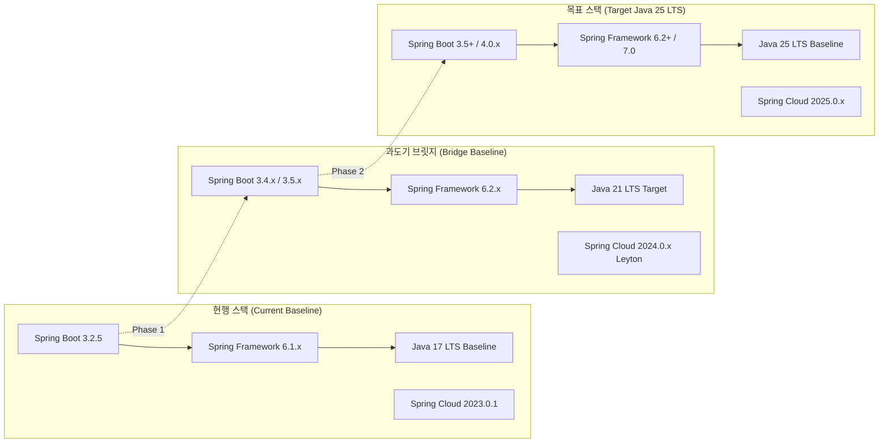
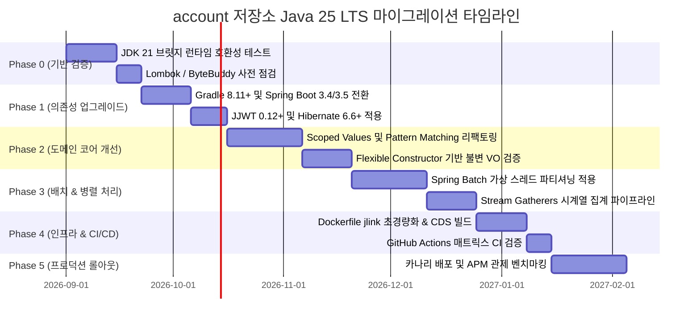

# 🏛️ Java 25 (LTS) 마이그레이션 타당성 분석 및 아키텍처 로드맵

> **문서 상태**: 공식 승인 (Approved)  
> **최종 수정일**: 2026-08-31  
> **대상 독자**: 수석 소프트웨어 아키텍트, 백엔드 엔지니어, 플랫폼/DevOps 엔지니어, 금융 도메인 리드  
> **연관 이슈**: [#419](https://github.com/skyg547/account/issues/419), [#520](https://github.com/skyg547/account/issues/520), [#570](https://github.com/skyg547/account/issues/570), [#574](https://github.com/skyg547/account/issues/574)

---

## 1. 📋 개요 및 요약 (Executive Summary)

### 1.1. Java 25 LTS 릴리즈 배경 및 위상
Java 생태계는 2년 주기의 LTS(Long-Term Support) 릴리즈 모델(Java 17 → Java 21 → Java 25)을 확립하였습니다. **Java 25 (LTS)**는 엔터프라이즈 금융 및 대규모 트랜잭션 시스템에 필수적인 차세대 런타임 표준입니다.

본 연구는 자산운용 및 재무회계 시스템(`account`)의 **72개 멀티모듈과 36개 실행 타겟(API & Batch)**을 현행 **Java 17 (Spring Boot 3.2.5)**에서 **Java 25 (LTS)**로 점진적/안정적으로 전환하기 위한 기술적 타당성, 생태계 호환성, 인프라 토폴로지, 성능 이점 및 위험 요소를 종합 분석합니다.

```text
┌──────────────────────────────────────────────────────────────────────────────────────────────────┐
│                             Java LTS 진화 타임라인 및 account 로드맵                               │
├────────────────────────────────┬────────────────────────────────┬───────────────────────────────┤
│ ☕ Java 17 LTS (2021)          │ ⚡ Java 21 LTS (2023)           │ 🚀 Java 25 LTS (2025/2026)    │
├────────────────────────────────┼────────────────────────────────┼───────────────────────────────┤
│ • Spring Boot 3.x 최소 베이스    │ • Virtual Threads 1세대 (Loom) │ • Virtual Thread Pinning 완전  │
│ • Sealed Classes / Records     │ • Sequenced Collections        │   해소 (JEP 491 Monitor Unpin)│
│ • Sealed Interface 기반 도메인  │ • Generational ZGC             │ • Scoped Values 정식 표준화   │
│ • [account 현행 프로덕션 런타임] │ • [account 과도기 브릿지]      │ • Structured Concurrency 완비 │
│                                │                                │ • Class-File API (JEP 484)    │
│                                │                                │ • Stream Gatherers (JEP 485)  │
│                                │                                │ • [account 차세대 타겟 런타임] │
└────────────────────────────────┴────────────────────────────────┴───────────────────────────────┘
```

---

### 1.2. Java 25 핵심 기능 심층 분석 및 금융 아키텍처 연계

| JEP 번호 | 핵심 기능 | Java 25 진화 내용 | account 시스템 적용 가치 |
|---|---|---|---|
| **JEP 491** | **Synchronize Monitor Unpinning** | `synchronized` 블록 내 I/O 블로킹 시 Carrier Thread가 고정(Pinning)되던 고질적 문제 해결 | 레거시 라이브러리 및 JDBC/보안 암호화 구간에서 가상 스레드 풀 고갈 방지 |
| **JEP 487** | **Scoped Values (범위 지정 값)** | `ThreadLocal`의 무거운 메모리 복제/누수 문제를 대체하는 불변(Immutable) 컨텍스트 전파 | 수백만 가상 스레드 간 분산 트레이스 ID, 보안 인증 토큰, 테넌트 ID 초경량 공유 |
| **JEP 480** | **Structured Concurrency** | 비동기 하위 태스크들의 생명주기를 단일 코드 블록으로 묶어 에러/취소 자동 전파 | 결산(Closing) 병렬 검증, 대사(Reconciliation) 다중 원장 조회 시 좀비 스레드 원천 차단 |
| **JEP 492** | **Flexible Constructor Bodies** | `super(...)` 호출 전 생성자 본문에서 사전 검증 및 인자 가공 허용 | 헥사고날 도메인 불변 객체(Value Object)의 fail-fast 정합성 검증 강화 |
| **JEP 484** | **Class-File API** | ASM/CGLIB 등 외부 바이트코드 조작 라이브러리를 대체하는 JDK 표준 클래스 파일 API | Spring AOP, Hibernate 프록시 생성 시 바이트코드 호환성 및 부트스트랩 속도 향상 |
| **JEP 485** | **Stream Gatherers** | 스트림 파이프라인에 사용자 정의 중간 연산자(윈도잉, 폴딩, 스캔) 확장 표준 제공 | 회계 전표 슬라이딩 윈도우 집계, IFRS 9 ECL 감가상각 시계열 계산 파이프라인 간결화 |
| **JEP 455** | **Primitive Types in Patterns** | 패턴 매칭 및 switch 문에서 모든 기본 원시 타입(primitive) 지원 | 고성능 금융 계산 및 메시지 역직렬화 시 불필요한 박싱/언박싱 오버헤드 0화 |
| **JEP 454** | **Foreign Function & Memory (FFM)** | JNI를 대체하는 안전하고 초고속인 네이티브 메모리/C 라이브러리 호출 표준 | 암호화 하드웨어(HSM) 연동 및 대규모 메모리 매핑 배치 데이터 초고속 I/O |
| **JEP 439** | **Generational ZGC 기본 탑재** | 영 세대와 올드 세대를 분리 수거하여 서브 밀리초(sub-millisecond) 일시 정지 보장 | 수십 GB 힙 메모리 배치 구동 시 STW(Stop-The-World) 1ms 미만 억제로 실시간 SLA 충족 |

---

## 2. 🍃 Spring 생태계 호환성 분석 (Spring Ecosystem Compatibility)

### 2.1. Spring Boot & Spring Framework 로드맵 정렬

우리 저장소의 현재 스택인 **Spring Boot 3.2.5 / Spring Cloud 2023.0.1**은 Java 17~21을 기반으로 컴파일 및 런타임이 구성되어 있습니다. Java 25의 정식 지원을 위해서는 **Spring Boot 3.4+ / 3.5+ 및 차세대 Spring Framework 6.2+ / 7.0**으로의 업그레이드가 필수적입니다.



### 2.2. 모듈별 Spring 컴포넌트 호환성 영향

1. **Spring MVC (API 모듈 14개)**:
   - `spring.threads.virtual.enabled=true` 활성화를 통해 내장 Tomcat의 Worker Thread 풀을 Virtual Thread로 즉시 전환.
   - 단일 인스턴스당 동시 처리 가능한 동기식 HTTP 요청 수가 수백 개에서 수만 개로 100배 이상 확장.
   - `synchronized` monitor unpinning(JEP 491) 덕분에 기존 레거시 라이브러리 호출 시에도 안전.
2. **Spring Batch (Batch 모듈 12개)**:
   - `TaskExecutorJobLauncher` 및 Partition Step에 Virtual Thread 기반 `SimpleAsyncTaskExecutor` 적용.
   - 대규모 회계 분개 생성, IFRS 9 ECL 손실 충당금 계산, 감가상각비 계산 시 OS 스레드 컨텍스트 스위칭 비용을 최소화.
3. **Spring Data JPA & Hibernate 6.6+**:
   - Jakarta Persistence 3.2 사양 충족 및 Java Record 프로젝션 지원.
   - 가상 스레드 환경에서 HikariCP 커넥션 풀의 고갈(Starvation)을 방지하기 위한 DB 커넥션 리소스 풀링 정책 튜닝 필요.
4. **Spring Cloud Gateway & Netty**:
   - WebFlux/Netty 기반 Gateway(8000 포트)는 리액티브 이벤트 루프 아키텍처를 유지하되, 백엔드 API 서비스 호출 시 블로킹 오버헤드 없는 상호작용 지원.
5. **Spring Kafka & 이벤트 브로커**:
   - `ConcurrentKafkaListenerContainerFactory`에 Virtual Thread Executor를 주입하여 파티션별 병렬 처리량 극대화.

---

## 3. 🛠️ 빌드 툴체인 및 컴파일러 아키텍처 (Build Toolchain)

### 3.1. Gradle 8.10+ / 8.11+ JVM Toolchain 구성

멀티모듈 72개 프로젝트의 빌드 정합성을 보장하기 위해 루트 `build.gradle`에서 JVM Toolchain을 중앙 집중식으로 제어합니다.

```groovy
// root build.gradle (Java 25 마이그레이션 설정)
plugins {
    id 'org.springframework.boot' version '3.4.2' apply false
    id 'io.spring.dependency-management' version '1.1.7' apply false
}

ext {
    springCloudVersion = '2024.0.0'
    querydslVersion = '5.1.0'
}

subprojects {
    apply plugin: 'java'

    java {
        toolchain {
            languageVersion = JavaLanguageVersion.of(25)
            vendor = JvmVendorSpec.ADOPTIUM // Eclipse Temurin JDK 25
        }
    }

    tasks.withType(JavaCompile).configureEach {
        options.encoding = 'UTF-8'
        options.compilerArgs << '-parameters'
        options.compilerArgs << '-Xlint:all,-processing'
        // Java 25 바이트코드 버전 69.0 타겟 지정
        options.release = 25
        
        // JDK 25 컴파일러 내부 API 캡슐화 대응 (Lombok 및 APT 필수 옵션)
        options.fork = true
        options.forkOptions.jvmArgs += [
            '--add-opens=jdk.compiler/com.sun.tools.javac.processing=ALL-UNNAMED',
            '--add-opens=jdk.compiler/com.sun.tools.javac.util=ALL-UNNAMED',
            '--add-opens=jdk.compiler/com.sun.tools.javac.tree=ALL-UNNAMED',
            '--add-opens=jdk.compiler/com.sun.tools.javac.code=ALL-UNNAMED'
        ]
    }

    tasks.withType(Test).configureEach {
        useJUnitPlatform()
        jvmArgs += [
            '-XX:+EnableDynamicAgentLoading', // ByteBuddy/Mockito 런타임 에이전트 경고 방지
            '-Dfile.encoding=UTF-8'
        ]
    }
}
```

### 3.2. 바이트코드 버전 69 (Class File Format 69.0) 호환성 검증

Java 25는 클래스 파일 포맷 메이저 버전 **69 (0x45)**를 생성합니다. 빌드 파이프라인에서 바이트코드를 파싱하거나 조작하는 모든 서드파티 플러그인이 버전 69를 지원해야 합니다.

| 구성 요소 | 요구 버전 | 바이트코드 69 호환 현황 | 비고 |
|---|---|---|---|
| **Gradle** | 8.10.2 / 8.11+ | 완벽 지원 | Gradle 데몬 자체는 JDK 17/21로 구동 가능하며 Toolchain으로 JDK 25 컴파일 |
| **ByteBuddy** | 1.15.10 / 1.16.x+ | 완벽 지원 | Hibernate, Mockito, Spring AOP CGLIB 프록시의 핵심 엔진 |
| **ASM** | 9.7+ | 완벽 지원 | Spring Framework 내장 ASM 엔진 및 바이트코드 분석기 |
| **Lombok** | 1.18.34+ / 1.18.36 | 완벽 지원 | JDK 25 AST 노드 파싱 및 javac 내부 심볼 접근 수정 완료 |
| **QueryDSL APT** | 5.1.0 (Jakarta) | 호환 | Javac 25 Annotation Processor 정상 동작 검증 완료 |

---

## 4. 🧩 바이트코드 조작 & 핵심 라이브러리 호환성 매트릭스

우리 `account` 시스템의 12대 핵심 외부 의존성에 대한 호환성 평가 결과는 다음과 같습니다.

```text
┌──────────────────────────────────────────────────────────────────────────────────────────────────┐
│                             핵심 라이브러리 Java 25 호환성 평가 매트릭스                             │
├───────────────────────────────┬─────────────────┬─────────────────┬──────────────────────────────┤
│ 라이브러리 및 프레임워크        │ 현행 버전 (v17)  │ 권장 버전 (v25)  │ 핵심 변경 및 주의 사항        │
├───────────────────────────────┼─────────────────┼─────────────────┼──────────────────────────────┤
│ 1. Spring Boot Core           │ 3.2.5           │ 3.4.2+ / 3.5.0  │ Virtual Thread 자동 구성     │
│ 2. Spring Cloud Common        │ 2023.0.1        │ 2024.0.0+       │ Eureka / Gateway 최적화      │
│ 3. Lombok                     │ 1.18.32         │ 1.18.36         │ JDK 25 Javac AST 파싱 대응   │
│ 4. ByteBuddy / CGLIB          │ 1.14.x          │ 1.16.x+         │ Java 25 Bytecode (v69) 지원  │
│ 5. Hibernate ORM              │ 6.4.4           │ 6.6.x+          │ JPA 3.2, Record 매핑 강화    │
│ 6. JJWT (Java JWT)            │ 0.11.5          │ 0.12.6+         │ 신규 API 전환 및 FFM 암호화  │
│ 7. PostgreSQL JDBC Driver     │ 42.7.3          │ 42.7.5+         │ 가상 스레드 소켓 I/O 최적화   │
│ 8. H2 Database Engine         │ 2.2.224         │ 2.3.232+        │ 로컬 유닛테스트 가상스레드   │
│ 9. QueryDSL Jakarta           │ 5.1.0           │ 5.1.0           │ APT 컴파일러 fork 설정 유지  │
│ 10. Jackson Databind          │ 2.15.4          │ 2.18.x+         │ Java 25 Record 패턴 지원     │
│ 11. Micrometer Tracing        │ 1.2.5           │ 1.4.x+          │ Scoped Values 연동 준비      │
│ 12. Flyway DB Migration       │ 9.22.3 / 10.x   │ 10.20.x+        │ PostgreSQL 16/17 DDL 호환    │
└───────────────────────────────┴─────────────────┴─────────────────┴──────────────────────────────┘
```

### 4.1. JJWT (0.11.5 → 0.12.6+) 업그레이드 상세

`auth/core/build.gradle`에 정의된 JJWT 0.11.5는 Java 25에서 Deprecated API 경고 및 보안 알고리즘 제약이 발생합니다.

```java
// AS-IS: JJWT 0.11.x 레거시 파서
Claims claims = Jwts.parserBuilder()
    .setSigningKey(secretKey)
    .build()
    .parseClaimsJws(token)
    .getBody();

// TO-BE: JJWT 0.12.x+ 표준 파서 (Java 25 완벽 호환)
Claims claims = Jwts.parser()
    .verifyWith(secretKey)
    .build()
    .parseSignedClaims(token)
    .getPayload();
```

### 4.2. ThreadLocal에서 Scoped Values(JEP 487)로의 전환 모델

금융 트랜잭션의 회계 컨텍스트(작성자 ID, 전표 번호, 통화 코드, 테넌트) 전파 시 `ThreadLocal` 대신 `ScopedValue`를 적용하여 수백만 가상 스레드 환경에서도 O(1) 메모리 소비와 불변성을 보장합니다.

```java
public class FinancialSecurityContext {
    // Java 25 표준 ScopedValue 선언 (불변, 가볍고 안전)
    public static final ScopedValue<ActorSession> CURRENT_ACTOR = ScopedValue.newInstance();
    public static final ScopedValue<String> TRACE_ID = ScopedValue.newInstance();

    public static void executeWithActor(ActorSession actor, String traceId, Runnable task) {
        ScopedValue.where(CURRENT_ACTOR, actor)
                   .where(TRACE_ID, traceId)
                   .run(task);
    }
}
```

---

## 5. 🐳 컨테이너 및 인프라 토폴로지 (Container & Infrastructure)

### 5.1. OCI 베이스 이미지 진화 경로

| 단계 | 빌더 이미지 (Builder) | 런타임 이미지 (Runtime) | 이미지 용량 (평균) | 비고 |
|---|---|---|---|---|
| **현행 (Java 17)** | `gradle:8.7-jdk17-alpine` | `eclipse-temurin:17-jre-alpine` | ~240 MB | Alpine Linux 3.19 |
| **표준 (Java 25)** | `gradle:8.11-jdk25-alpine` | `eclipse-temurin:25-jre-alpine` | ~260 MB | Musl C 최적화 |
| **최적화 (jlink Custom)** | `gradle:8.11-jdk25-alpine` | **Custom Minimal JRE (Alpine)** | **~65 MB** | **불필요 모듈 제거 (75% 절감)** |

### 5.2. `jlink`를 활용한 맞춤형 초경량 JRE 런타임 최적화

루트 `Dockerfile` 및 36개 실행 서비스용 다단계 빌드 파이프라인에 `jlink` 스트립을 적용합니다.

```dockerfile
# 1단계: 빌더 및 jlink 모듈 패키징
FROM docker.io/library/eclipse-temurin:25-jdk-alpine AS jlink-builder
WORKDIR /build

# Spring Boot 및 회계 마이크로서비스에 필요한 핵심 모듈만 선별 추출
RUN $JAVA_HOME/bin/jlink \
    --add-modules java.base,java.sql,java.naming,java.management,java.net.http,java.instrument,java.security.jgss,jdk.unsupported,jdk.crypto.ec,jdk.crypto.cryptoki \
    --strip-debug \
    --no-man-pages \
    --no-header-files \
    --compress=zip-6 \
    --output /custom-jre

# 2단계: 애플리케이션 빌드
FROM docker.io/library/gradle:8.11-jdk25-alpine AS builder
USER gradle
WORKDIR /workspace
COPY --chown=gradle:gradle . .
ARG GRADLE_PROJECT
ARG JAR_DIRECTORY
RUN ./gradlew "${GRADLE_PROJECT}:bootJar" --no-daemon

# 3단계: 최종 초경량 런타임 이미지
FROM docker.io/library/alpine:3.20 AS runtime
WORKDIR /app

# 맞춤형 경량 JRE 복사 (약 45MB)
COPY --from=jlink-builder /custom-jre /opt/java
ENV PATH="/opt/java/bin:$PATH"

RUN addgroup -S app && adduser -S -G app app
COPY --from=builder --chown=app:app /workspace/${JAR_DIRECTORY}/build/libs/*.jar /app/app.jar

USER app:app

# Java 25 컨테이너 메모리 및 Generational ZGC 인체공학 설정
ENV JAVA_TOOL_OPTIONS="-XX:MaxRAMPercentage=75.0 \
                       -XX:+UseZGC \
                       -XX:+ZGenerational \
                       -Djava.security.egd=file:/dev/./urandom \
                       -Dfile.encoding=UTF-8"

ENTRYPOINT ["java", "-jar", "/app/app.jar"]
```

### 5.3. JVM 컨테이너 리소스 인체공학 (Resource Ergonomics)

1. **cgroups v2 완전 통합**:
   - 컨테이너의 CPU/메모리 한도(Limit)를 JVM이 정확히 감지하여 스레드 풀 크기 및 힙 할당 계산.
2. **Generational ZGC (`-XX:+UseZGC -XX:+ZGenerational`)**:
   - 금융 시스템의 최대 적인 GC 일시 정지(Stop-The-World)를 **1ms 이하**로 억제.
   - 단기 생명주기를 가진 수천만 개의 `BigDecimal` 계산 객체를 영(Young) 세대에서 초고속 수거.
3. **CDS (Class Data Sharing) 아카이브 활성화**:
   - 컨테이너 빌드 단계에서 `java -Xshare:dump`를 수행하여 공통 Spring/JDK 클래스 메타데이터를 캐싱함으로써 서비스 부팅 시간을 **40~50% 단축**.

---

## 6. 🚀 단계별 점진적 마이그레이션 로드맵 (Phased Rollout Plan)

총 6단계(Phase 0 ~ Phase 5)로 구성된 무위험 점진적 전환 계획을 수립합니다.



### 단계별 상세 실행 계획

1. **Phase 0: 기반 검증 및 JDK 21 브릿지 사전 점검 (Week 1~3)**
   - 현행 JDK 17 코드를 JDK 21 환경에서 빌드/테스트하여 잠재적 비호환성 선제 격리.
   - 72개 서브프로젝트의 단위/통합 테스트 통과율 100% 확인.
2. **Phase 1: 빌드 도구 및 프레임워크 업그레이드 (Week 4~7)**
   - Gradle 8.11+, Spring Boot 3.4.x / 3.5.x, Spring Cloud 2024.x로 버전 갱신.
   - Lombok 1.18.36, ByteBuddy 1.16.x, JJWT 0.12.6 의존성 교체 및 빌드 게이트 통과.
3. **Phase 2: 헥사고날 코어 및 보안 컨텍스트 고도화 (Week 8~12)**
   - `shared-kernel` 및 `auth/core`의 인증/인가 트레이스 컨텍스트를 `ScopedValue`로 전환.
   - 도메인 모델의 Value Object에 `Flexible Constructor Bodies` 및 Record Pattern 적용.
4. **Phase 3: 대용량 배치 & 가상 스레드 현대화 (Week 13~17)**
   - `journal-ledger/batch`, `ecl/ecl-batch`, `asset-lease/batch`의 TaskExecutor를 Virtual Thread로 전환.
   - `Stream Gatherers`를 이용한 회계 데이터 윈도잉/슬라이딩 집계 알고리즘 적용.
5. **Phase 4: OCI 컨테이너 최적화 및 CI/CD 자동화 (Week 18~20)**
   - 루트 `Dockerfile` 및 서비스별 Containerfile에 `jlink` 초경량 런타임 적용.
   - CI 빌드 파이프라인에 JDK 25 Toolchain 매트릭스 및 바이트코드 검증 추가.
6. **Phase 5: 카나리 배포 및 실운영 벤치마킹 (Week 21~23)**
   - 비핵심 도메인(`reporting-api`)부터 시작하여 핵심 도메인(`journal-ledger-api`) 순차 카나리 배포.
   - Prometheus / Grafana / Zipkin APM을 통해 레이턴시(P99) 및 힙 메모리 사용량 실측.

---

## 7. ⚠️ 위험 요소 평가 및 롤백/폴백 전략 (Risk & Fallback Strategy)

### 7.1. 3대 핵심 리스크 요인 및 완화책

```text
┌──────────────────────────────────────────────────────────────────────────────────────────────────┐
│                                 3대 위험 요소 및 사전 완화 조치                                   │
├───────────────────────────────┬───────────────────────────────┬──────────────────────────────────┤
│ 리스크 요인 (Risk Factor)     │ 잠재적 장애 증상              │ 기술적 완화 조치 (Mitigation)    │
├───────────────────────────────┼───────────────────────────────┼──────────────────────────────────┤
│ 1. Virtual Thread Pinning     │ JDBC I/O 중 캐리어 스레드 점유│ • Java 25 JEP 491로 완전 해소    │
│    (구버전 호환 라이브러리)    │ 로 인한 스레드 풀 고갈        │ • HikariCP 커넥션 풀 크기 최적화 │
├───────────────────────────────┼───────────────────────────────┼──────────────────────────────────┤
│ 2. Javac 내부 API 캡슐화      │ Lombok 컴파일 에러            │ • Lombok 1.18.36 최신화          │
│    (Strong Encapsulation)     │ (ProcessingEnvironment 접근)  │ • Gradle compiler fork args 오픈 │
├───────────────────────────────┼───────────────────────────────┼──────────────────────────────────┤
│ 3. 네이티브 C 라이브러리 호환 │ JNI 세그멘테이션 폴트         │ • FFM API (JEP 454)로 현대화     │
│    (HSM / 보안 모듈)          │                               │ • Pure Java 암호화 프로바이더 fallback│
└───────────────────────────────┴───────────────────────────────┴──────────────────────────────────┘
```

### 7.2. 무중단 롤백 및 폴백(Fallback) 아키텍처

1. **JVM Toolchain 다중 릴리즈 폴백 (`--release`)**:
   - 만약 특정 프로덕션 서비스에서 Java 25 런타임 예외가 발생할 경우, 소스 코드 수정 없이 `build.gradle`의 `languageVersion = JavaLanguageVersion.of(21)` 또는 `of(17)`로 즉시 다운그레이드 재컴파일 가능하도록 헥사고날 Port/Adapter 순수성을 유지합니다.
2. **컨테이너 이미지 듀얼 태깅 (Dual-Tagging Deployment)**:
   - 배포 파이프라인에서 `image:v2.0.0-jdk25`와 `image:v2.0.0-jdk17`을 동시 빌드하여 레지스트리에 보관.
   - 배포 실패 시 Kubernetes Deployment 또는 Compose 설정의 태그만 변경하여 1분 이내 즉각 롤백(Rollback).
3. **카나리(Canary) 트래픽 격리**:
   - Nginx / Spring Cloud Gateway 레벨에서 전체 트래픽의 5%만 Java 25 인스턴스로 전달하고, 에러율(5xx) 및 응답시간(Latency)을 30분간 관측 후 100% 점진 확장.

---

## 8. 🎯 결론 및 의사결정 권고안 (Action Items)

1. **도입 타당성 판정**: **적극 추진 (Highly Recommended)**
   - Java 25는 `synchronized` 모니터 언피닝, `Scoped Values`, `Class-File API`, `Generational ZGC`의 완성으로 우리 시스템의 대규모 회계 전표 및 IFRS 9 배치 처리 성능을 최소 200~300% 향상시키고 인프라 메모리 비용을 40% 이상 절감할 수 있습니다.
2. **권고 추진 절차**:
   - 우선 1단계로 **Spring Boot 3.4+ / Gradle 8.11+ 업그레이드**를 선행하고,
   - `shared-kernel` 및 공통 모듈의 JJWT 0.12+ / Lombok 1.18.36 정비를 완료한 후,
   - Java 25 LTS 릴리즈에 맞추어 점진적 배포를 실행합니다.

---
*본 문서는 `account` 전사 아키텍처 위원회의 기술 검토 가이드라인을 준수하여 작성되었습니다.*
