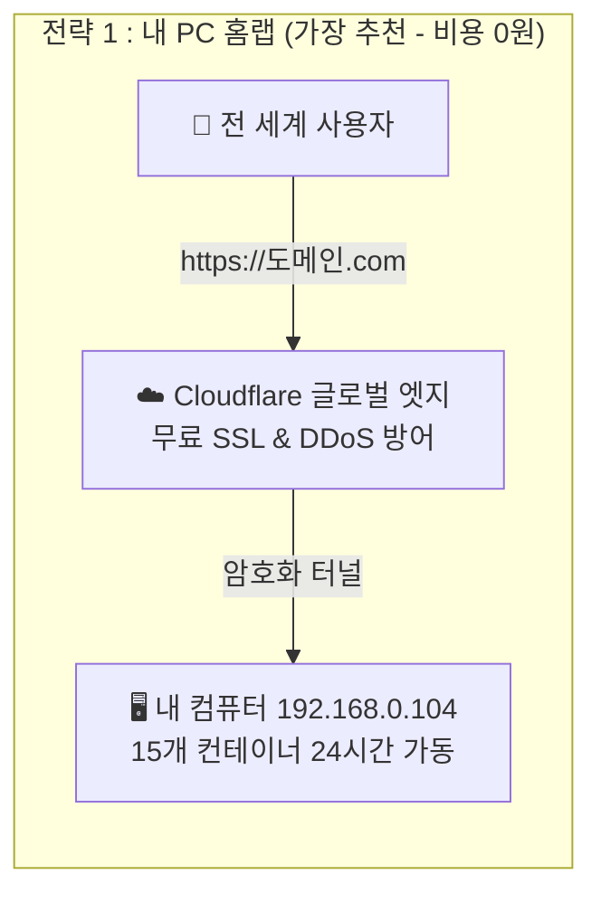

# 🏛️ 차세대 클라우드 네이티브 아키텍처 로드맵 및 운영 가이드
> **문서 상태**: 공식 승인 (Approved)  
> **최종 수정일**: 2026-08-29  
> **대상 독자**: 소프트웨어 아키텍트, 백엔드/인프라 엔지니어, DevOps 담당자, 시스템 운영자  
> **연관 이슈**: [#570](https://github.com/skyg547/account/issues/570), [#571](https://github.com/skyg547/account/issues/571), [#574](https://github.com/skyg547/account/issues/574), [#575](https://github.com/skyg547/account/issues/575), [#577](https://github.com/skyg547/account/issues/577)

---

## 1. 🌟 아키텍처 비전 및 핵심 철학

본 문서는 자산운용 및 재무회계 시스템을 모듈형 MSA(Microservices Architecture)로 구축하고, 로컬 개발서버(2세대)에서 최신 클라우드 네이티브(3세대)로 점진적 확장하기 위한 **공식 아키텍처 표준 로드맵**을 정의합니다.

### 🎯 3대 핵심 엔지니어링 원칙
1. **금융 정밀성 및 엄격한 격리 (Financial Precision & Isolation)**:
   - 모든 금액 계산은 `BigDecimal`을 사용하고, 헥사고날(Hexagonal) Port/Adapter 경계를 엄격히 준수하여 비즈니스 도메인을 기술 인프라로부터 독립시킵니다.
2. **무중단 고가용성 및 복원력 (Zero-Downtime High Availability)**:
   - 단일 장애점(SPOF)을 제거하고, 2-Tier 게이트웨이 및 서킷 브레이커를 통해 특정 서비스 장애 시에도 전체 시스템이 마비되지 않도록 보호합니다.
3. **비용 효율적인 하이브리드 인프라 (Cost-Effective Pragmatism)**:
   - 개발 단계에서는 가벼운 OCI 컨테이너(Podman/Docker Compose)로 4코어 12GB 환경에서 자원 낭비 없이 개발하고, 운영 단계에서는 쿠버네티스(K8s)와 글로벌 엣지(Edge)로 무중단 확장합니다.

---

## 2. 🗺️ 클라우드 인프라 세대별 진화 매트릭스

인프라와 마이크로서비스 기술은 크게 3세대를 거쳐 진화해 왔습니다.

```text
┌─────────────────────────────────────────────────────────────┐
│ 🏛️ 1세대 (구형 레거시 / ~2015)                                │
│  • 모놀리식 통짜 구조 + 온프레미스 물리서버 + Jenkins 수동 배포 │
└─────────────────────────────────────────────────────────────┘
                             ⬇️
┌─────────────────────────────────────────────────────────────┐
│ 🏢 2세대 (Spring Cloud 과도기 / 현재 개발서버 환경)          │
│  • Podman/Docker Compose + Spring Cloud Gateway + Eureka    │
│  • Java 애플리케이션 라이브러리 레벨에서 MSA 오케스트레이션   │
└─────────────────────────────────────────────────────────────┘
                             ⬇️
┌─────────────────────────────────────────────────────────────┐
│ 🚀 3세대 (2025~2026 최신 글로벌 모던 표준 / Cloud Native)   │
│  • Kubernetes + Envoy Proxy + Istio + eBPF/Cilium + ArgoCD  │
│  • 코드 수정 0줄! 인프라 네트워크 계층이 100% 무인 자동화   │
└─────────────────────────────────────────────────────────────┘
```

### 📊 세대별 기술 상세 비교표

| 영역 | 🏛️ 1세대 (구형 레거시) | 🏢 2세대 (Spring Cloud 생태계) | 🚀 3세대 (2026 모던 글로벌 표준) |
|---|---|---|---|
| **컨테이너 오케스트레이션** | 물리 서버 직접 설치 | **Podman / Docker Compose** | **Kubernetes (K8s / EKS / GKE)** |
| **서비스 디스커버리 (주소록)**| 고정 IP / L4 하드코딩 | **Netflix Eureka Discovery** | **K8s CoreDNS & Service** |
| **API 게이트웨이 & 프록시** | Apache HTTPD / 수동 Nginx | **Spring Cloud Gateway + Nginx** | **Envoy Proxy & K8s Gateway API** |
| **장애 격리 & 트레이싱** | 수동 로그 검색 | **Resilience4j + OpenZipkin** | **Istio Ambient Mesh (eBPF 기반)** |
| **배포 자동화 (CI/CD)** | **Jenkins (젠킨스 전용 서버)** | **GitHub Actions / GitLab CI** | **GitHub Actions + ArgoCD (GitOps)** |
| **비밀값(Secret) 관리** | 설정 파일 평문 / 환경변수 | **Spring Cloud Config** | **HashiCorp Vault + K8s Secrets** |

---

## 3. 🛡️ 다단계 트래픽 분산 & 게이트웨이 아키텍처 (2-Tier Gateway)

대규모 트래픽이 몰려도 시스템이 안전하게 동작하도록 **역할을 분담하는 2단계(2-Tier) 게이트웨이 구조**를 적용합니다.

```mermaid
graph TD
    User[👥 외부 클라이언트 요청] --> L4[⚡ 1. L4 로드밸런서 <br/> IP/Port 기반 초고속 분산 (AWS NLB)]
    
    subgraph "Tier 1 : 엣지 웹 프록시 (Nginx / Envoy)"
        L4 --> N1[🌐 Nginx 1호기 <br/> SSL 종단 / 정적 리소스 90% 캐싱]
        L4 --> N2[🌐 Nginx 2호기 <br/> SSL 종단 / 정적 리소스 90% 캐싱]
    end
    
    subgraph "Tier 2 : 비즈니스 API 게이트웨이"
        N1 --> SCG[🛡️ Spring Cloud Gateway :8000 <br/> JWT 토큰 위변조 검증 및 비즈니스 인가]
        N2 --> SCG
    end
    
    subgraph "비즈니스 마이크로서비스 (account-network)"
        SCG --> Auth[🔑 auth-service :8084]
        SCG --> Master[📦 master-data-service :8082]
        SCG --> Domain[☕ 기타 13개 비즈니스 도메인 서비스]
    end
```

### 🔍 2-Tier 분업의 핵심 이점
1. **Tier 1 (Nginx/Envoy)**: C/C++ 기반 초고속 엔진이 무거운 SSL 복호화, 정적 파일(CSS/JS/이미지) 초고속 캐싱 반환, 악성 DDoS를 1차 차단하여 백엔드 부하를 90% 제거합니다.
2. **Tier 2 (Spring Cloud Gateway)**: 깨끗하게 정제된 요청만 받아 순수 비즈니스 보안(JWT 서명 검증, 권한 인가, Eureka 로드밸런싱)만 전담합니다.

---

## 4. 🕸️ 서비스 메시(Service Mesh) & 무인 GitOps 자동화 표준

### 4.1. Spring Cloud vs Istio의 철학적 관계
* **본질**: `OpenZipkin(트레이싱)` + `Spring Cloud Gateway(라우팅)` + `Resilience4j(서킷브레이커)` + `Eureka(주소록)`를 **인프라 레벨에서 통째로 묶어 언어와 무관하게(Java/Python/Go) 자동화한 도구가 바로 Istio**입니다.
* **개발서버 적용**: 쿠버네티스가 없는 현재 개발서버에서는 `Spring Cloud` 내장 스택으로 100% 동일한 기능을 가볍게 수행합니다.

### 4.2. GitOps 무인 배포 (Human-Intervention Zero)
개발자가 서버에 원격 접속해서 수동 명령어를 치는 행위를 금지하고, Git Commit을 기점으로 배포를 100% 자동화합니다.


---

## 5. 🧮 엔터프라이즈 메모리 용량 산정 공식 (Capacity Planning)

### 5.1. 마이크로서비스 1개당 메모리 소비 분해 공식
Java 17/21 및 Spring Boot 3 기반 마이크로서비스 1개의 표준 메모리 요구량은 다음과 같이 계산됩니다:

$$\text{컨테이너 실제 점유 RAM (RSS)} = \text{Heap} + \text{Metaspace} + \text{Thread Stack} + \text{Native/GC Buffer}$$

```text
┌─────────────────────────────────────────────────────────────┐
│ ☕ Spring Boot 마이크로서비스 1개 표준 사이징 (총 500MB)       │
├─────────────────────────────────────────────────────────────┤
│ 1. JVM 힙 메모리 (-Xms128m -Xmx256m~384m)  :  256 ~ 384 MB │ ➔ 실시간 DTO/엔티티 처리용
│ 2. 메타스페이스 (-XX:MaxMetaspaceSize=128m) :  100 ~ 128 MB │ ➔ 스프링 프레임워크 클래스 적재
│ 3. 스레드 스택 메모리 (50개 풀 × 1MB)      :   40 ~  50 MB │ ➔ 동시 서블릿 요청 통로
│ 4. JVM 네이티브 엔진 & GC 버퍼             :   50 ~  70 MB │ ➔ C++ JVM 엔진 및 Netty 버퍼
├─────────────────────────────────────────────────────────────┤
│ 📊 실제 필요 메모리 : 약 450 ~ 500 MB                        │
│ 🛡️ 컨테이너 자원 상한선 (Limit) : 512MB ~ 768MB              │
└─────────────────────────────────────────────────────────────┘
```

### 5.2. 전체 20개 MSA 풀스택 동시 구동 시 필요 자원 산정
* **기본 OS + GUI + IDE**: 약 2.5 GB
* **공통 인프라 9종** (Postgres, Redis, ELK, Prometheus, Grafana 등): 약 3.0 GB
* **코어 플랫폼 6종** (Gateway, Auth, Master-Data, Config, Discovery, Frontend): 약 3.0 GB
* **13개 비즈니스 도메인 API 모듈**: 약 5.2 GB (13개 × 400MB)
* **Apache Kafka 이벤트 브로커**: 약 0.8 GB
* **Gradle 빌드 피크 버퍼 & 안전 마진**: 약 2.0 GB
* ─────────────────────────────────────────────────────────────
* 📊 **전체 풀스택 동시 구동 시 총 필요 메모리**: **`약 16.5 GB ~ 18.0 GB`** (물리 20GB~28GB 장착 시 광활한 여유 확보)

---

## 6. 💰 비용 0원(Free-Tier & 홈랩) 글로벌 배포 전략

클라우드 비용을 단 1원도 들이지 않고 전 세계 인터넷에 실제 운영 서비스를 공개하는 3대 전략입니다.



1. **[전략 1] 내 PC + Cloudflare Tunnel (비용 0원 - 즉시 배포 가능)**:
   - 포트포워딩, 고정 IP 신청, 방화벽 개방 없이 Cloudflare 터널을 통해 무료 도메인/SSL로 24시간 서비스.
2. **[전략 2] 오라클 클라우드 평생 무료 인스턴스 (OCI Free Tier - 비용 0원)**:
   - `4코어 ARM CPU + 24GB RAM + 200GB SSD`를 평생 무료로 제공받아 K3s/Docker로 20개 서비스를 영구 구동.
3. **[전략 3] 물리 서버에서의 초경량 K3s 쿠버네티스 도입**:
   - `curl -sfL https://get.k3s.io | sh -` 단 1줄로 메모리 512MB만 사용하는 경량 쿠버네티스를 구축하여 실습 및 배포.

---

## 7. 📌 단계별 실행 마일스톤 (Action Plan)

1. **Phase 1 (현재 개발 단계)**:
   - Podman Compose 기반 2세대 아키텍처로 13개 업무 모듈 비즈니스 로직(회계/결산) 100% 완성.
   - Nginx 단일 진입점(8080/8443) 및 SSL 리버스 프록시 연동.
2. **Phase 2 (자원 및 배포 자동화)**:
   - Compose 파일별 `deploy.resources.limits` 자원 상한선(500M~768M) 적용 ([#575](https://github.com/skyg547/account/issues/575)).
   - GitHub Container Registry(`ghcr.io`) 및 Watchtower 기반 무인 자동 배포 구축.
3. **Phase 3 (클라우드 네이티브 3세대 확장)**:
   - K3s 또는 AWS EKS 환경으로 전환 시 `Kubernetes Gateway API` 및 `Istio Ambient Mesh` 템플릿 적용.
