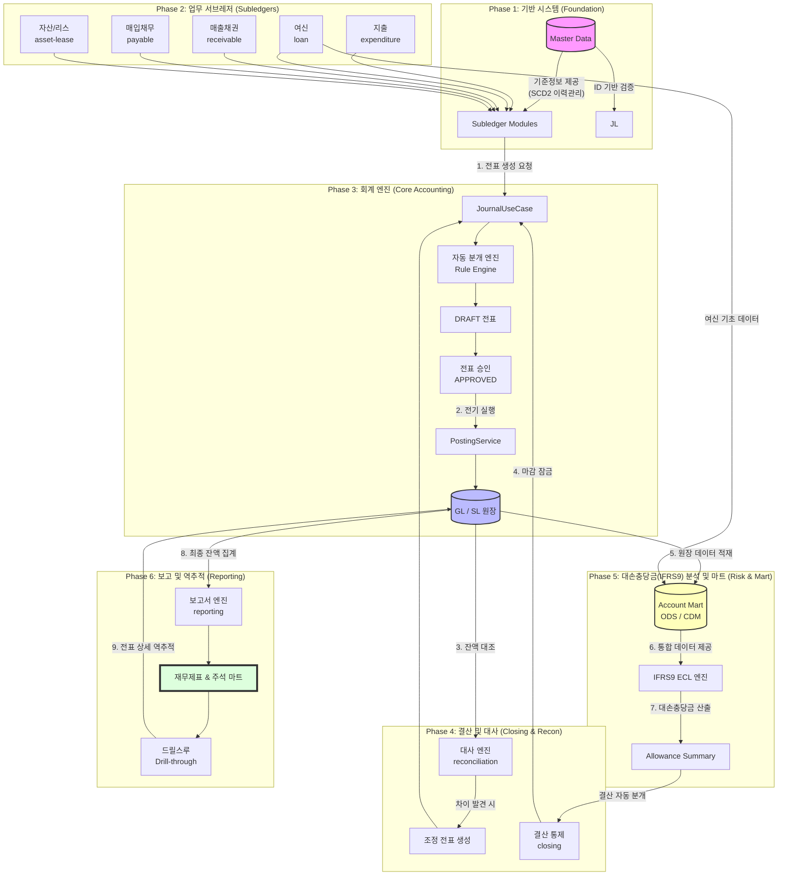
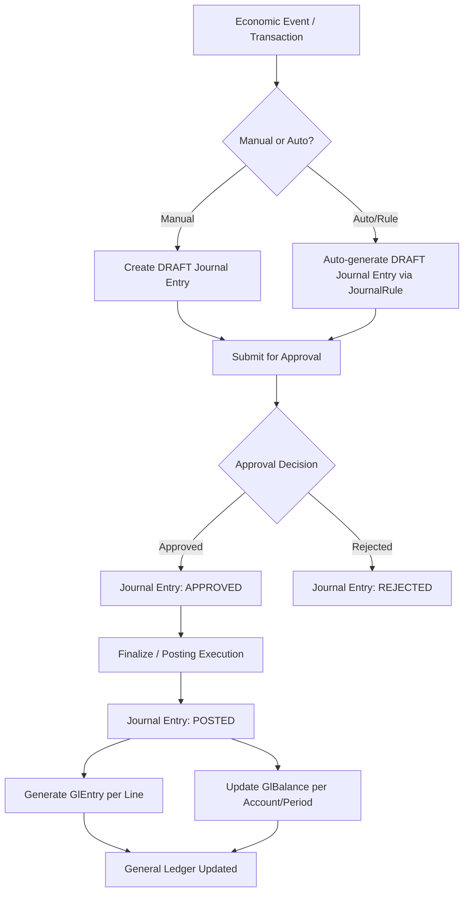
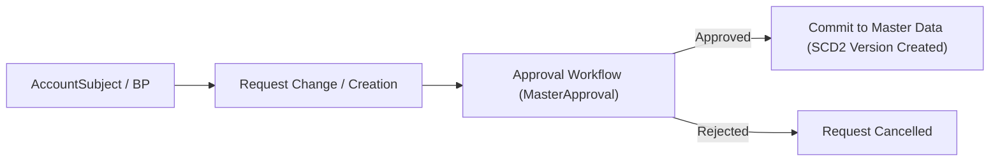
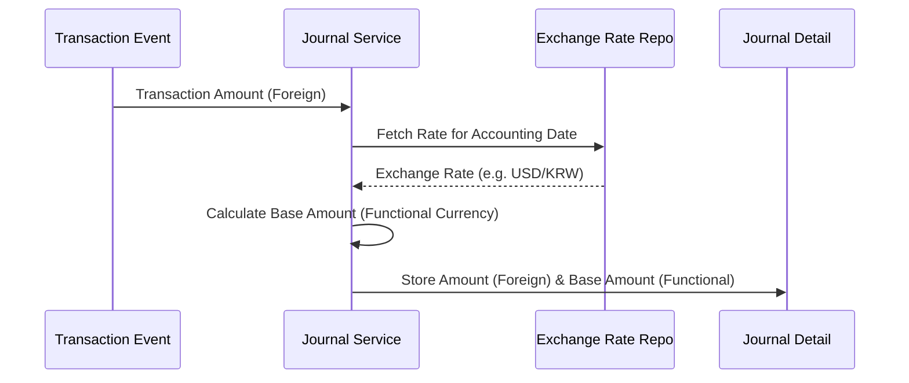

# 🏆 전사 통합 비즈니스 프로세스 및 워크플로우 (Business Workflow)

이 문서는 데이터 발생부터 최종 재무제표 산출, 그리고 대손충당금(IFRS9) 분석까지 이어지는 전사 통합 비즈니스 파이프라인과 주요 도메인별 상세 워크플로우를 정의합니다.

---

## 1. 전사 통합 업무 파이프라인 (E2E)

시스템 전체의 데이터 흐름을 한눈에 파악할 수 있는 파이프라인입니다.

---

## 2. 도메인별 핵심 워크플로우

### 2.1 전표 처리 및 전기 (Journal-to-Ledger)
모든 경제적 사건은 복식부기 원리에 따라 전표로 기록됩니다.

### 2.2 마스터 데이터 승인 및 이력 관리
기준정보의 변경은 엄격한 승인 절차와 SCD2 이력 관리를 따릅니다.

### 2.3 다통화 변환 프로세스
외화 거래 발생 시 회계 일자의 환율을 적용하여 장부 통화 금액을 자동 산출합니다.

---

## 3. 주요 비즈니스 시나리오 (BPMN)

### 3.1 P2P/AP (지출 및 지급)
- **과정**: 지출 결의 -> 인보이스 검증 -> 지급 승인 -> 지급 실행 -> 전표 생성
- **통제**: 예산 잔액 체크 및 이중 승인(Maker-Checker) 적용.

### 3.2 O2C/AR (매출 및 수금)
- **과정**: 매출 청구 -> 수금(가상계좌 등) -> 자동 매칭(Matching Engine) -> 반제 처리
- **통제**: 미매칭 건에 대한 별도 큐(Queue) 관리 및 수동 조정 프로세스.

### 3.3 대출 회계 (Loans & EIR)
- **과정**: 대출 실행 -> 부대비용 발생 -> EIR 기반 상각 스케줄 생성 -> 매월 이자 수익 및 비용 상각 배치
- **통제**: 중도 상환 시 상각 스케줄 재계산 및 멱등성 보장.

---

## 4. 운영 및 예외 정책

- **오류큐 (Error Queue)**: 자동 분개나 인터페이스 실패 건을 격리하여 운영자가 재처리할 수 있도록 지원합니다.
- **재처리 (Reprocessing)**: 원인 수정 후 동일 거래를 재수신하거나 수동 재실행할 때 중복 전표가 발생하지 않도록 멱등성을 보장합니다.
- **마감 잠금 (Closing Lock)**: 결산 완료 후 과거 일자로의 소급 기표를 원천적으로 차단합니다.

---
**최종 수정일**: 2026-05-29
